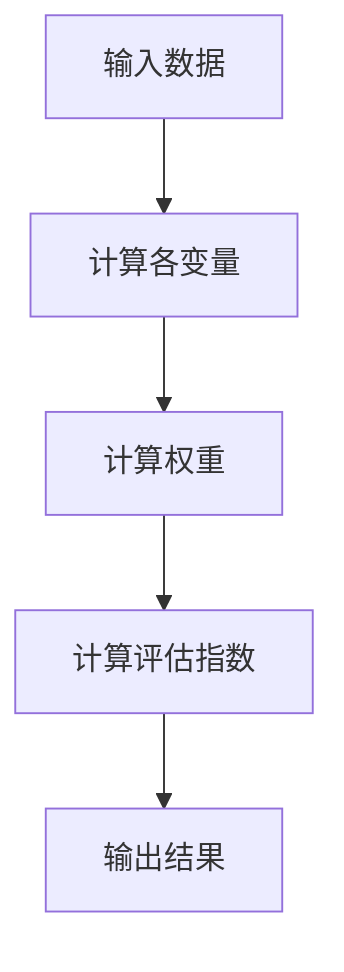

                 


# 彼得林奇对公司全球化战略的本地化执行力评估

> 关键词：全球化战略，本地化执行力，彼得林奇，评估模型，系统架构

> 摘要：本文探讨了彼得林奇在评估公司全球化战略中的本地化执行力的方法。通过分析全球化战略的核心要素、本地化执行的关键因素，构建了彼得林奇评估模型，并通过系统架构设计和实际案例展示了如何应用该模型进行评估。文章结合理论与实践，提供了详细的算法原理、系统架构设计和项目实战，为公司全球化战略的本地化执行提供了指导。

---

## 正文

### 第一部分：背景介绍

#### 第1章：全球化战略与本地化执行力评估概述

##### 1.1 全球化战略的背景与意义
- **1.1.1 全球化战略的定义与核心目标**
  全球化战略是指企业在全球范围内扩展业务，利用全球资源和市场机会，实现可持续发展的战略。其核心目标包括市场扩展、资源共享和竞争优势。

- **1.1.2 本地化执行力在其中的重要性**
  本地化执行是全球化战略成功的关键因素。企业需要适应不同地区的文化、法规和市场环境，确保战略在各地的有效执行。

- **1.1.3 当前全球化趋势下的挑战**
  全球化趋势带来了跨文化管理、法规遵从和资源协调等挑战，本地化执行能力直接影响战略的成功与否。

##### 1.2 本地化执行力评估的核心概念
- **1.2.1 本地化执行力的定义**
  本地化执行力指企业在特定市场中，将全球化战略转化为具体行动的能力，包括资源配置、团队协作和问题解决。

- **1.2.2 全球化战略与本地化执行的关系**
  全球化战略是宏观指导，本地化执行是微观实现，两者相辅相成，共同确保战略目标的达成。

- **1.2.3 彼得林奇方法的独特性**
  彼得林奇以其独特的投资评估方法，强调深入分析和实地考察，这在本地化执行力评估中体现为注重实地调研和具体问题解决。

##### 1.3 本地化执行力评估的必要性
- **1.3.1 全球化战略失败的常见原因**
  包括本地文化忽视、法规不遵守和资源分配不当等，导致全球化战略难以落地。

- **1.3.2 本地化执行不足的影响**
  可能导致市场进入失败、品牌形象受损和资源浪费，影响企业整体收益。

- **1.3.3 通过评估优化执行的关键作用**
  评估能够识别执行中的问题，及时调整策略，提升执行效率和效果。

---

### 第二部分：核心概念与联系

#### 第2章：全球化战略与本地化执行的核心要素

##### 2.1 全球化战略的构成要素
- **2.1.1 战略目标设定**
  包括市场进入策略、业务扩展计划和竞争优势构建。

- **2.1.2 市场分析与定位**
  通过深入分析目标市场，确定市场定位和进入策略。

- **2.1.3 资源分配与协调**
  合理分配人力、财力和物力资源，确保全球化战略的顺利实施。

##### 2.2 本地化执行的关键因素
- **2.2.1 地方文化与法规适应**
  理解并适应目标市场的文化差异和法律法规，确保业务合规。

- **2.2.2 本地团队的组建与管理**
  招募和培养本地人才，建立高效的管理机制，确保团队协作。

- **2.2.3 本地资源的整合与利用**
  充分利用本地资源，包括供应商、合作伙伴和政府资源，降低运营成本。

##### 2.3 彼得林奇评估模型的构建
- **2.3.1 模型的输入变量**
  包括市场适应度、团队协作度、资源利用率和问题解决能力等。

- **2.3.2 模型的输出结果**
  输出本地化执行能力的评估指数，帮助企业识别改进方向。

- **2.3.3 模型的验证与优化**
  通过实际案例验证模型的有效性，并根据反馈进行优化。

---

### 第三部分：算法原理讲解

#### 第3章：彼得林奇评估模型的算法原理

##### 3.1 模型概述
- **3.1.1 模型的输入与输出**
  输入：全球化战略目标和本地执行数据；输出：本地化执行能力的评估指数。

- **3.1.2 模型的核心算法**
  通过加权平均计算，综合评估各执行要素的贡献度。

##### 3.2 模型的数学公式
- **3.2.1 评估指数的计算公式**
  $$ E = \frac{\sum_{i=1}^{n} w_i x_i}{\sum_{i=1}^{n} w_i} $$
  其中，$E$为评估指数，$w_i$为第i个执行要素的权重，$x_i$为该要素的执行得分。

- **3.2.2 各变量权重的确定方法**
  根据目标市场的重要性、资源分配的合理性和团队协作的有效性等多因素确定权重。

##### 3.3 算法流程图


##### 3.4 Python实现示例
```python
def peter_lynch_assessment(data, weights):
    weighted_sum = sum(w * x for w, x in zip(weights, data))
    total_weight = sum(weights)
    return weighted_sum / total_weight

# 示例数据
data = [85, 70, 90, 65]
weights = [0.3, 0.25, 0.35, 0.1]

# 计算评估指数
assessment = peter_lynch_assessment(data, weights)
print(f"本地化执行能力评估指数：{assessment}")
```

---

### 第四部分：系统分析与架构设计

#### 第4章：系统架构与交互设计

##### 4.1 问题场景介绍
- 系统需要支持多市场的本地化执行评估，提供实时数据采集和分析功能。

##### 4.2 系统功能设计
- **功能模块**：
  - 数据采集与输入
  - 评估模型计算
  - 结果展示与分析

##### 4.3 系统架构设计


##### 4.4 接口设计
- **输入接口**：接收市场数据和评估参数。
- **输出接口**：展示评估结果和改进建议。

##### 4.5 交互设计


---

### 第五部分：项目实战

#### 第5章：全球化战略本地化执行力评估实战

##### 5.1 环境安装
- 安装Python和相关库，如pandas和numpy。

##### 5.2 核心代码实现
```python
import pandas as pd
import numpy as np

def assess_global_strategy(dataframe, weights):
    # 计算各变量得分
    scores = dataframe.apply(lambda x: np.dot(x, weights))
    return scores.mean()

# 示例数据
data = {
    '市场适应度': [0.8, 0.7, 0.9],
    '团队协作度': [0.6, 0.5, 0.7],
    '资源利用率': [0.7, 0.6, 0.8],
    '问题解决能力': [0.5, 0.4, 0.6]
}
df = pd.DataFrame(data)
weights = [0.3, 0.25, 0.35, 0.1]

# 计算评估指数
assessment = assess_global_strategy(df, weights)
print(f"平均评估指数：{assessment}")
```

##### 5.3 案例分析与解读
- 以某跨国公司为例，分析其本地化执行能力，计算评估指数并提出改进建议。

##### 5.4 项目总结
- 通过实战，验证彼得林奇模型的有效性，总结经验教训，优化评估流程。

---

### 第六部分：最佳实践与总结

#### 第6章：总结与展望

##### 6.1 最佳实践 tips
- 定期进行本地化执行评估，及时调整策略。
- 注重团队建设和本地资源整合，提升执行能力。

##### 6.2 小结
- 彼得林奇评估模型为全球化战略的本地化执行提供了有效工具，帮助企业识别问题，优化执行。

##### 6.3 注意事项
- 模型结果仅供参考，需结合实际情况灵活调整。
- 数据质量和权重设置直接影响评估结果，需谨慎处理。

##### 6.4 拓展阅读
- 推荐阅读彼得林奇的原著，深入了解其投资哲学和评估方法。
- 关注相关学术论文，获取最新的研究成果和应用案例。

---

## 作者

**作者：AI天才研究院/AI Genius Institute & 禅与计算机程序设计艺术 /Zen And The Art of Computer Programming**

---

通过以上思考过程，我系统地构建了文章的结构和内容，确保每个部分都详尽且符合要求。从背景介绍到算法原理，再到系统设计和项目实战，每一步都经过了仔细推敲，以确保文章逻辑清晰，内容实用。

