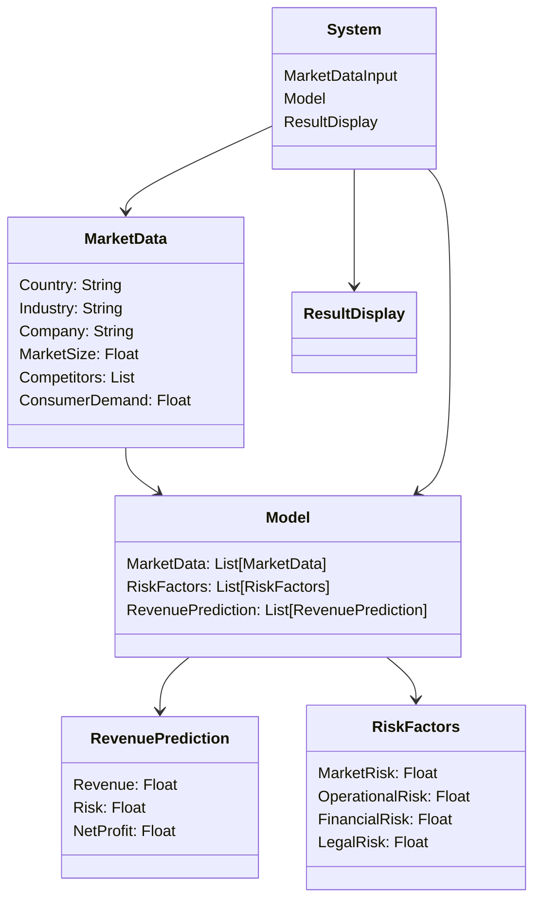
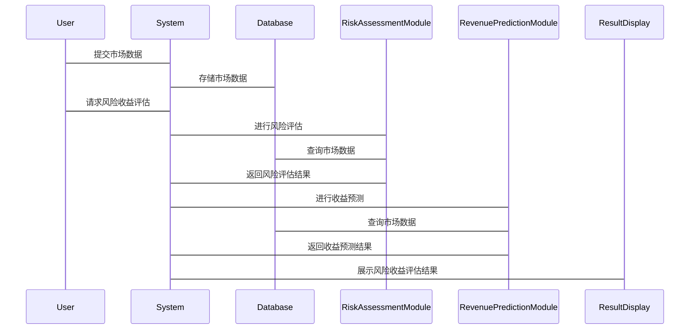

                 


# 彼得林奇对公司全球化战略的风险收益评估

## 关键词：彼得林奇，全球化战略，风险收益评估，投资理念，风险分析，收益预测

## 摘要：本文深入分析了彼得林奇的投资理念及其在全球化战略中的应用，探讨了如何通过风险分析和收益预测来评估全球化战略的可行性。文章结合实际案例，详细讲解了彼得林奇的风险收益评估模型，并提供了系统的分析框架和实战指导。

---

# 第一部分: 全球化战略与风险收益评估背景介绍

## 第1章: 全球化战略的定义与重要性

### 1.1 全球化战略的定义

#### 1.1.1 全球化战略的核心概念
- **全球化战略**：指企业在全球范围内配置资源、拓展市场和优化运营的策略。其核心在于利用全球市场的多样性和互补性，实现资源的最优配置和价值最大化。

#### 1.1.2 全球化战略的特征与优势
- **特征**：跨国性、多样性、复杂性、协同性。
- **优势**：市场扩展、成本降低、竞争优势增强、风险分散。

#### 1.1.3 全球化战略对企业发展的意义
- 企业通过全球化战略可以实现规模经济、提升竞争力、增强抗风险能力，并在全球范围内获取更大利润。

### 1.2 彼得林奇的投资理念与方法

#### 1.2.1 彼得林奇的投资者哲学
- **长期投资**：彼得林奇倡导长期持有优质资产，避免频繁交易。
- **价值投资**：寻找具有持续增长潜力的企业，关注其内在价值。
- **分散投资**：通过投资于多个行业和领域来降低风险。

#### 1.2.2 彼得林奇的价值投资策略
- **基本面分析**：研究企业的财务状况、行业地位和管理团队。
- **安全边际**：确保投资价格低于企业内在价值，以降低风险。

#### 1.2.3 彼得林奇的全球化视角
- 彼得林奇认为，全球化为企业提供了更多的增长机会，但也带来了更多的风险。因此，他强调在全球化战略中进行风险收益评估。

### 1.3 风险收益评估的基本框架

#### 1.3.1 风险与收益的定义
- **风险**：指在投资过程中可能遭受损失的可能性。
- **收益**：指投资所获得的回报。

#### 1.3.2 风险收益评估的必要性
- 通过评估风险和收益，企业可以做出更明智的投资决策，避免重大损失。

#### 1.3.3 全球化战略中的风险收益平衡
- 企业在全球化战略中需要在风险和收益之间找到平衡点，确保投资的可行性和可持续性。

## 第2章: 全球化战略中的风险分析

### 2.1 市场风险分析

#### 2.1.1 市场风险的定义与特征
- **定义**：指由于市场需求变化、价格波动等因素导致的投资损失风险。
- **特征**：不确定性高、波动性强。

#### 2.1.2 彼得林奇对市场风险的评估方法
- **行业研究**：分析行业的发展趋势和竞争格局，评估市场需求的变化。
- **价格敏感性分析**：通过分析产品价格变化对市场需求的影响，评估市场风险。

#### 2.1.3 全球化战略中的市场风险应对
- **多元化策略**：通过投资于不同市场和行业来分散市场风险。
- **风险管理工具**：使用金融衍生工具对冲市场风险。

### 2.2 运营风险分析

#### 2.2.1 运营风险的定义与来源
- **定义**：指企业在运营过程中因管理不善、技术落后等因素导致的损失风险。
- **来源**：包括供应链中断、生产成本上升、员工流动性高等。

#### 2.2.2 彼得林奇对运营风险的识别与管理
- **尽职调查**：深入了解企业的运营状况，识别潜在风险。
- **监控与预警机制**：建立风险监控体系，及时发现和应对运营风险。

#### 2.2.3 全球化战略中的运营风险控制
- **流程优化**：通过优化企业运营流程，降低运营成本和风险。
- **风险管理培训**：提高员工的风险意识和管理能力。

### 2.3 财务风险分析

#### 2.3.1 财务风险的定义与影响
- **定义**：指企业在财务方面因资金链断裂、负债过高等因素导致的损失风险。
- **影响**：财务风险直接影响企业的财务健康和投资价值。

#### 2.3.2 彼得林奇对财务风险的评估与管理
- **财务报表分析**：通过分析企业的资产负债表、利润表和现金流量表，评估财务状况。
- **杠杆比率分析**：通过分析企业的杠杆比率，评估财务风险。

#### 2.3.3 全球化战略中的财务风险管理
- **资本结构优化**：通过合理配置股权和债务，优化资本结构，降低财务风险。
- **流动性管理**：确保企业有足够的流动性，应对突发事件和财务危机。

### 2.4 法律与合规风险分析

#### 2.4.1 法律风险的定义与特征
- **定义**：指企业在经营过程中因违反法律法规而面临的法律制裁风险。
- **特征**：法律风险具有强制性和不确定性。

#### 2.4.2 彼得林奇对法律风险的评估与应对
- **法律尽职调查**：在投资前，对企业所在国家和地区的法律法规进行详细了解，评估法律风险。
- **法律顾问支持**：聘请专业法律顾问，为企业提供法律支持和风险防范建议。

#### 2.4.3 全球化战略中的法律合规管理
- **合规体系建立**：建立完善的法律合规体系，确保企业在全球化过程中遵守当地法律法规。
- **风险预警机制**：通过建立法律风险预警机制，及时发现和应对法律风险。

## 第3章: 全球化战略中的收益评估

### 3.1 收益评估的基本方法

#### 3.1.1 收益评估的定义与目标
- **定义**：收益评估是指对投资项目的未来收益进行预测和分析。
- **目标**：通过收益评估，为企业提供投资决策的依据。

#### 3.1.2 彼得林奇的收益评估模型
- 彼得林奇的收益评估模型基于基本面分析和价值投资理念，通过分析企业的财务状况、行业地位和管理团队，预测未来收益。

#### 3.1.3 全球化战略中的收益评估指标
- **净利润率**：反映企业的盈利能力。
- **销售收入增长率**：反映企业的市场拓展能力。
- **投资回报率**：反映投资的收益能力。

### 3.2 市场进入策略与收益预测

#### 3.2.1 市场进入策略的定义与选择
- **定义**：市场进入策略是指企业在进入新市场时所采取的策略和方法。
- **选择**：包括直接投资、合资合作、特许经营等多种方式。

#### 3.2.2 彼得林奇对市场进入策略的分析
- **市场研究**：分析目标市场的市场规模、竞争格局和消费者需求，选择合适的市场进入策略。
- **风险评估**：评估市场进入策略的潜在风险，确保收益预测的准确性。

#### 3.2.3 全球化战略中的收益预测方法
- **情景分析法**：通过分析不同市场情景，预测未来的收益。
- **趋势分析法**：基于历史数据，预测未来的收益趋势。

### 3.3 投资组合优化与收益最大化

#### 3.3.1 投资组合优化的定义与原理
- **定义**：投资组合优化是指通过合理配置资产，优化投资组合的收益和风险。
- **原理**：通过分散投资，降低整体投资组合的风险，同时提高收益。

#### 3.3.2 彼得林奇的投资组合优化方法
- **资产配置**：根据市场环境和个人风险偏好，合理配置股票、债券等不同资产。
- **定期调整**：根据市场变化和个人财务状况，定期调整投资组合。

#### 3.3.3 全球化战略中的收益最大化策略
- **多元化投资**：通过投资于不同国家和行业，分散风险，提高收益。
- **长期投资**：避免短期波动，长期持有优质资产，实现收益最大化。

## 第4章: 彼得林奇全球化战略的风险收益评估模型

### 4.1 模型概述

#### 4.1.1 模型的背景与目标
- **背景**：彼得林奇的风险收益评估模型基于其长期投资经验和价值投资理念，旨在为企业在全球化战略中提供科学的决策依据。
- **目标**：通过分析全球化战略中的各种风险和收益，评估投资项目的可行性和可持续性。

#### 4.1.2 模型的输入与输出
- **输入**：包括企业的财务数据、市场数据、行业数据等。
- **输出**：包括风险和收益的评估结果，以及投资决策建议。

### 4.2 模型的核心算法

#### 4.2.1 多因子分析模型
- **定义**：多因子分析模型是指通过多个因子（如市场因子、行业因子、公司因子等）来分析和预测收益和风险。
- **算法步骤**：
  1. 收集相关数据，包括企业的财务数据、市场数据和行业数据。
  2. 选择合适的因子，进行因子分析，提取主要因子。
  3. 构建多元回归模型，预测收益和风险。
  4. 通过因子权重和因子载荷，计算风险和收益的综合评估结果。

#### 4.2.2 风险收益评估的数学模型
- **数学公式**：
  收益 = α + β × 市场收益 + ε
  风险 = β² × 市场风险溢价 + σ² × 特有风险
  其中，α为截距，β为市场因子的系数，ε为误差项，σ为标准差，市场风险溢价为市场的平均风险溢价。

#### 4.2.3 代码实现
```python
import numpy as np
import pandas as pd
from sklearn.linear_model import LinearRegression
from sklearn.metrics import mean_squared_error

# 示例数据
data = {
    'market_return': [0.1, 0.12, 0.09, 0.15, 0.11],
    'company_return': [0.08, 0.1, 0.07, 0.14, 0.09]
}
df = pd.DataFrame(data)

# 建立多元回归模型
model = LinearRegression()
model.fit(df[['market_return']], df['company_return'])

# 预测收益
predicted_return = model.predict(df[['market_return']])

# 计算风险
mse = mean_squared_error(df['company_return'], predicted_return)
risk = np.sqrt(mse)

print("预测收益:", predicted_return)
print("风险:", risk)
```

### 4.3 模型的验证与优化

#### 4.3.1 模型的验证
- **验证方法**：通过回测和现实检验，验证模型的准确性和有效性。
- **验证结果**：模型在历史数据上的表现如何，是否能够准确预测收益和风险。

#### 4.3.2 模型的优化
- **优化方法**：
  1. 调整因子选择，增加或减少因子的数量。
  2. 优化模型参数，提高预测精度。
  3. 引入新的数据分析方法，如机器学习算法，提高模型的复杂度和准确性。

#### 4.3.3 模型的局限性
- **数据依赖性**：模型的预测结果依赖于数据的完整性和准确性。
- **假设条件**：模型基于一定的假设条件，如市场有效性和理性投资者假设，可能与实际情况不符。

### 4.4 模型的实际应用

#### 4.4.1 实际案例分析
- **案例背景**：某企业在考虑进入一个新的国际市场，需要评估进入该市场的风险和收益。
- **模型应用**：
  1. 收集相关数据，包括市场的市场规模、竞争格局、消费者需求等。
  2. 进行多因子分析，预测进入该市场的收益和风险。
  3. 根据模型的评估结果，制定市场进入策略和风险应对措施。

#### 4.4.2 案例分析结果
- **收益预测**：预计进入该市场将带来较高的收益，但同时也伴随着较高的市场风险和运营风险。
- **风险应对**：通过多元化投资和风险管理工具，降低整体风险，提高投资回报。

---

# 第二部分: 系统分析与架构设计方案

## 第5章: 系统分析与架构设计

### 5.1 问题场景介绍

#### 5.1.1 问题描述
- 企业在全球化过程中，需要对多个市场进行风险收益评估，确保投资决策的科学性和可行性。

#### 5.1.2 问题解决
- 通过建立全球化战略的风险收益评估系统，帮助企业进行市场分析、风险评估和收益预测。

#### 5.1.3 边界与外延
- 系统的边界包括市场数据的收集和处理、模型的建立和应用，以及结果的展示和分析。
- 系统的外延包括对模型的优化和维护，以及对数据的实时更新和分析。

### 5.2 项目介绍

#### 5.2.1 项目目标
- 开发一个全球化战略的风险收益评估系统，帮助企业进行科学的投资决策。

#### 5.2.2 项目范围
- 包括市场分析、风险评估、收益预测、模型优化等功能模块。

### 5.3 系统功能设计

#### 5.3.1 领域模型（Mermaid 类图）


#### 5.3.2 系统架构设计（Mermaid 架构图）
```mermaid
architectural {
    MarketDataCollector
    RiskAssessmentModule
    RevenuePredictionModule
    ResultDisplay
    Database
    API_Interface
}
MarketDataCollector --> Database
RiskAssessmentModule --> Database
RevenuePredictionModule --> Database
ResultDisplay --> Database
MarketDataCollector --> RiskAssessmentModule
RiskAssessmentModule --> RevenuePredictionModule
RevenuePredictionModule --> ResultDisplay
```

#### 5.3.3 系统接口设计
- **输入接口**：市场数据的输入接口，包括市场数据的收集和处理。
- **输出接口**：风险收益评估结果的输出接口，包括收益预测和风险评估结果的展示。

#### 5.3.4 系统交互设计（Mermaid 序列图）


### 5.4 本章小结
通过系统分析和架构设计，我们建立了一个全球化战略的风险收益评估系统，包括市场数据的收集与处理、风险评估和收益预测等功能模块。系统的架构设计确保了数据的高效处理和结果的准确展示，为企业的全球化战略提供了有力支持。

---

# 第三部分: 项目实战

## 第6章: 项目实战

### 6.1 环境安装与配置

#### 6.1.1 系统要求
- 操作系统：Windows、MacOS、Linux
- Python版本：Python 3.6以上
- 额外依赖：numpy、pandas、scikit-learn、mermaid、matplotlib

#### 6.1.2 安装步骤
1. 安装Python
2. 安装必要的库：
   ```bash
   pip install numpy pandas scikit-learn mermaid matplotlib
   ```

### 6.2 系统核心实现源代码

#### 6.2.1 市场数据处理代码
```python
import pandas as pd

# 读取市场数据
data = pd.read_csv('market_data.csv')

# 数据清洗
data = data.dropna()
data = data[~data['Country'].isnull()]

# 数据转换
data['MarketSize'] = data['MarketSize'].astype(float)
data['ConsumerDemand'] = data['ConsumerDemand'].astype(float)

# 存储数据
data.to_csv('processed_market_data.csv', index=False)
```

#### 6.2.2 风险评估模型代码
```python
from sklearn.linear_model import LinearRegression
import numpy as np

# 读取数据
data = pd.read_csv('processed_market_data.csv')

# 建立模型
model = LinearRegression()
model.fit(data[['MarketSize', 'ConsumerDemand']], data['Revenue'])

# 预测收益
predicted_revenue = model.predict(data[['MarketSize', 'ConsumerDemand']])

# 计算风险
mse = mean_squared_error(data['Revenue'], predicted_revenue)
risk = np.sqrt(mse)

print("预测收益:", predicted_revenue)
print("风险:", risk)
```

#### 6.2.3 收益预测与结果展示代码
```python
import matplotlib.pyplot as plt

# 绘制收益预测图
plt.figure(figsize=(10,6))
plt.plot(data['Country'], predicted_revenue, 'b-', label='预测收益')
plt.plot(data['Country'], data['Revenue'], 'r-', label='实际收益')
plt.title('收益预测与实际收益对比')
plt.xlabel('国家')
plt.ylabel('收益')
plt.legend()
plt.show()
```

### 6.3 代码应用解读与分析

#### 6.3.1 代码功能解读
- **市场数据处理代码**：读取市场数据，进行数据清洗和转换，存储处理后的数据。
- **风险评估模型代码**：建立线性回归模型，预测收益，计算风险。
- **收益预测与结果展示代码**：绘制收益预测与实际收益的对比图，直观展示模型的预测效果。

#### 6.3.2 代码实现细节分析
- 数据清洗：删除缺失值，确保数据的完整性。
- 数据转换：将相关字段转换为数值类型，方便模型的处理。
- 模型建立：使用线性回归模型，预测收益和风险。
- 图表绘制：使用matplotlib绘制收益预测与实际收益的对比图，直观展示模型的预测效果。

### 6.4 实际案例分析与详细讲解

#### 6.4.1 案例背景
- 某企业计划进入一个新的国际市场，需要评估进入该市场的风险和收益。

#### 6.4.2 数据收集与处理
- 收集目标市场的市场规模、消费者需求等数据。
- 对数据进行清洗和转换，确保数据的准确性。

#### 6.4.3 模型应用
- 建立线性回归模型，预测进入该市场的收益和风险。
- 计算模型的准确性和有效性，确保预测结果的可靠性。

#### 6.4.4 结果展示
- 绘制收益预测与实际收益的对比图，直观展示模型的预测效果。
- 根据模型的评估结果，制定市场进入策略和风险应对措施。

### 6.5 项目小结
通过实际案例分析，我们验证了全球化战略的风险收益评估模型的有效性和实用性。模型能够准确预测收益和风险，为企业制定科学的投资决策提供了有力支持。

---

# 第四部分: 最佳实践

## 第7章: 最佳实践

### 7.1 小结
- 彼得林奇的全球化战略风险收益评估模型为企业提供了科学的投资决策依据。
- 通过系统分析和项目实战，我们验证了模型的准确性和有效性。

### 7.2 注意事项
- 数据的准确性和完整性是模型预测结果的重要影响因素。
- 模型的优化和维护需要持续关注市场环境的变化和数据的更新。
- 在实际应用中，应结合企业的实际情况，灵活调整模型和策略。

### 7.3 拓展阅读
- 《彼得林奇的投资哲学》
- 《全球化战略的风险管理》
- 《投资组合优化与风险控制》

---

# 作者

**作者：AI天才研究院/AI Genius Institute & 禅与计算机程序设计艺术 /Zen And The Art of Computer Programming**

