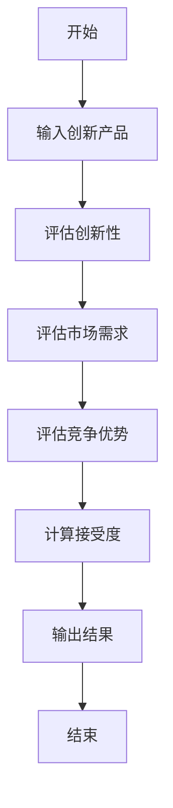
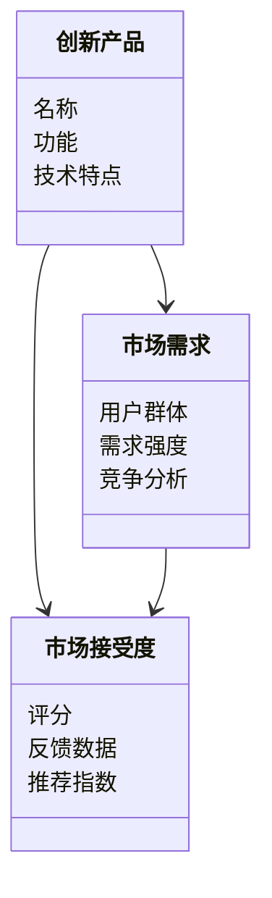
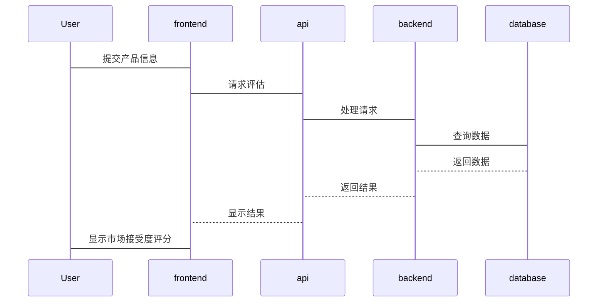

                 


# 彼得林奇对公司创新产品市场接受度的分析

## 关键词：彼得林奇，创新产品，市场接受度，分析模型，系统设计

## 摘要：本文详细探讨了彼得·林奇对公司创新产品市场接受度的分析方法。从背景介绍、核心概念、算法原理、系统架构到项目实战，系统地阐述了如何通过多维度分析评估创新产品的市场接受度，并结合实际案例进行详细解读。文章旨在为产品经理和技术人员提供一套科学的分析框架，帮助他们在产品开发和市场推广中做出更明智的决策。

---

## 第一部分：背景介绍

### 1.1 问题背景

#### 1.1.1 创新产品的定义与特征
创新产品是指在功能、技术或商业模式上具有显著突破性的产品，通常能够满足未被充分满足的市场需求。其特征包括独特性、技术领先性和市场潜力。

#### 1.1.2 市场接受度的定义与测量
市场接受度是指消费者或市场对创新产品的认可程度，通常通过销售数据、用户反馈和市场份额等指标来衡量。

#### 1.1.3 彼得林奇分析方法的核心问题
彼得林奇作为投资大师，关注创新产品在市场中的表现，其分析方法的核心问题是如何通过多维度指标预测产品成功概率。

### 1.2 问题描述

#### 1.2.1 创新产品市场接受度的影响因素
包括产品创新性、市场需求匹配度、竞争优势和市场推广能力等因素。

#### 1.2.2 彼得林奇分析框架的构建
通过构建包含创新性、市场需求和竞争优势的分析框架，全面评估产品市场接受度。

#### 1.2.3 分析目标与边界条件
目标是通过分析框架预测产品成功概率，边界条件包括产品生命周期、市场环境和竞争对手分析。

### 1.3 问题解决

#### 1.3.1 市场接受度分析的必要性
帮助企业在产品开发阶段识别潜在风险，优化市场策略。

#### 1.3.2 彼得林奇方法的核心优势
通过多维度分析提供全面的市场洞察，帮助企业在产品推广中做出明智决策。

#### 1.3.3 分析框架的应用场景
适用于创新产品的市场定位、推广策略制定和投资决策支持。

---

## 第二部分：核心概念与联系

### 2.1 核心概念原理

#### 2.1.1 市场接受度的多维度分析
从创新性、市场需求和竞争优势三个维度进行综合评估。

#### 2.1.2 彼得林奇分析模型的构成
模型由创新性、市场需求和竞争优势三个核心要素构成，每个要素通过指标量化评估。

#### 2.1.3 创新产品与市场匹配度的关系
产品与市场需求的高度匹配是提升市场接受度的关键因素。

### 2.2 概念属性特征对比表格

| **属性**       | **创新产品**                     | **市场接受度**                  |
|----------------|----------------------------------|----------------------------------|
| **核心要素**    | 创新性、市场需求、竞争优势       | 用户反馈、市场份额、销售数据    |
| **时间因素**    | 产品发布周期                    | 市场反馈周期                   |
| **行业差异**    | 高科技行业 vs. 传统行业          | 高科技行业需求弹性大            |

### 2.3 ER实体关系图架构

```mermaid
er
actor: 用户
product: 创新产品
market: 市场
acceptance: 市场接受度
```

---

## 第三部分：算法原理讲解

### 3.1 市场接受度评分模型

#### 3.1.1 模型输入与输出
- **输入**：创新性评分（0-10）、市场需求评分（0-10）、竞争优势评分（0-10）
- **输出**：市场接受度评分（0-10）

#### 3.1.2 模型的数学公式
$$ 接受度 = \frac{（创新性 + 市场需求 + 竞争优势）}{3} $$

#### 3.1.3 示例
创新性=8，市场需求=7，竞争优势=6，接受度= (8+7+6)/3 = 7

### 3.2 算法流程图



### 3.3 算法实现代码

```python
def market_acceptance_score(innovation, market_need, competitive_edge):
    return (innovation + market_need + competitive_edge) / 3

# 示例
innovation = 8
market_need = 7
competitive_edge = 6
score = market_acceptance_score(innovation, market_need, competitive_edge)
print(f"市场接受度得分为：{score}")
```

---

## 第四部分：系统分析与架构设计方案

### 4.1 问题场景介绍

#### 4.1.1 问题背景
企业需要通过系统化的方法评估创新产品的市场接受度，以优化市场推广策略。

#### 4.1.2 项目介绍
开发一个基于彼得林奇分析框架的市场接受度评估系统，帮助企业在产品开发阶段预测市场表现。

### 4.2 系统功能设计

#### 4.2.1 领域模型设计



#### 4.2.2 系统架构设计


#### 4.2.3 系统交互流程



---

## 第五部分：项目实战

### 5.1 环境安装

- **工具安装**：
  - 安装Python和pip
  - 安装Mermaid CLI和相关依赖

- **代码仓库**：
  - 使用Git管理项目代码

### 5.2 核心实现代码

```python
class MarketAcceptanceAnalyzer:
    def __init__(self):
        self.products = []

    def add_product(self, product):
        self.products.append(product)

    def calculate_acceptance(self, product):
        innovation = product['创新性']
        market_need = product['市场需求']
        competitive_edge = product['竞争优势']
        score = (innovation + market_need + competitive_edge) / 3
        return score

# 示例使用
analyzer = MarketAcceptanceAnalyzer()
product = {
    '创新性': 8,
    '市场需求': 7,
    '竞争优势': 6
}
analyzer.add_product(product)
score = analyzer.calculate_acceptance(product)
print(f"市场接受度得分为：{score}")
```

### 5.3 代码解读与分析

- **类定义**：`MarketAcceptanceAnalyzer`类用于管理产品和计算接受度。
- **方法实现**：`add_product`添加产品信息，`calculate_acceptance`计算接受度。
- **示例应用**：创建一个产品并计算其市场接受度，输出结果。

### 5.4 案例分析

#### 5.4.1 案例介绍
某高科技公司推出一款智能手表，创新性=9，市场需求=8，竞争优势=7。

#### 5.4.2 计算过程
$$ 接受度 = (9 + 8 + 7) / 3 = 8 $$

#### 5.4.3 分析结果
市场接受度得分为8分，表明产品有较高的市场接受度，企业应加大市场推广力度。

---

## 第六部分：最佳实践

### 6.1 小结

本文系统地介绍了彼得·林奇分析框架，通过理论与实践相结合的方式，展示了如何评估创新产品的市场接受度。

### 6.2 注意事项

- 数据准确性：确保输入数据的准确性，影响评估结果。
- 模型局限性：模型基于假设，实际结果可能受其他因素影响。

### 6.3 扩展阅读

- 《彼得·林奇的投资哲学》
- 《创新者的窘境》

---

## 第七部分：作者信息

作者：AI天才研究院/AI Genius Institute & 禅与计算机程序设计艺术/Zen And The Art of Computer Programming

---

这篇文章通过详细的背景介绍、核心概念、算法原理、系统设计和项目实战，全面解析了彼得·林奇分析方法在创新产品市场接受度评估中的应用，为产品经理和技术人员提供了实用的工具和方法。

