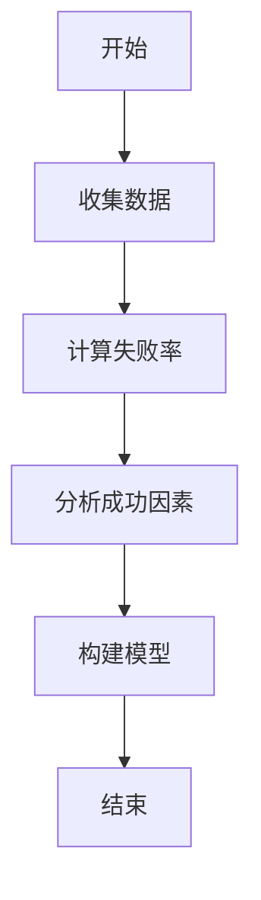
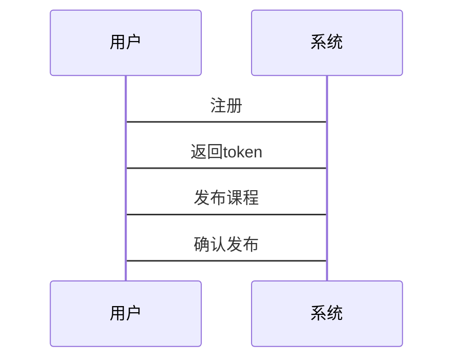

                 


# 彼得林奇对公司创新失败率与长期成功的关系研究

## 关键词：创新失败率，长期成功，彼得林奇，企业创新，创新管理

## 摘要：  
本文系统研究了公司创新失败率与长期成功的内在关系，从背景、核心概念、数学模型、系统架构、项目实战等多维度进行分析，探讨了创新失败的解决路径和长期成功的实现策略，提出了创新与成功之间的平衡策略。

---

## 第一部分: 公司创新失败率与长期成功的关系概述

### 第1章: 公司创新失败率与长期成功的关系背景

#### 1.1 问题背景
创新是企业保持竞争优势的核心驱动力。然而，创新失败率高，企业在创新过程中面临诸多挑战。长期成功需要企业在创新中找到平衡点。

#### 1.2 问题描述
创新失败的具体表现包括技术、市场和管理问题。长期成功需要持续创新和风险管理。

#### 1.3 问题解决
解决方案包括创新文化建设、风险管理、用户反馈机制和战略调整。

#### 1.4 边界与外延
创新失败受外部环境、企业资源和市场反馈影响。长期成功依赖于创新质量、市场需求和竞争环境。

### 第2章: 创新失败率的核心概念与联系

#### 2.1 核心概念原理
创新失败涉及技术、市场和管理因素。长期成功由创新质量和用户需求决定。

#### 2.2 概念属性特征对比
| 属性 | 创新失败 | 长期成功 |
|------|----------|----------|
| 技术 | 技术瓶颈 | 技术领先 |
| 市场 | 市场需求 | 市场份额 |

#### 2.3 ER实体关系图
```mermaid
er
  创新失败率
  长期成功
  创新失败率 --> 创新项目
  长期成功 --> 创新项目
```

### 第3章: 创新失败率与长期成功关系的数学模型

#### 3.1 数学模型
创新失败率公式：
$$P(\text{失败}) = \frac{\text{失败项目数}}{\text{总项目数}}$$

长期成功模型：
$$S(\text{成功}) = \sum_{i=1}^{n} P(\text{成功因素}_i)$$

#### 3.2 算法原理


---

## 第二部分: 系统分析与架构设计方案

### 第4章: 系统分析与架构设计

#### 4.1 项目介绍
以在线教育平台为例，分析创新失败和长期成功的动态关系。

#### 4.2 功能设计
- 用户管理：注册、登录、课程购买。
- 课程管理：课程发布、购买、评价。
- 支付管理：订单处理、支付状态更新。
- 统计分析：创新失败率、长期成功率统计。

#### 4.3 架构设计


#### 4.4 接口设计
- API接口：用户注册、登录、课程购买。
- 数据接口：课程数据存储、订单管理。

#### 4.5 交互设计


---

## 第三部分: 项目实战

### 第5章: 项目实战

#### 5.1 环境安装
安装Python、Django框架、数据库和前端工具。

#### 5.2 核心代码实现
核心代码示例：
```python
def calculate_failure_rate(projects):
    return len([p for p in projects if p['status'] == 'failed']) / len(projects)
```

#### 5.3 案例分析
分析在线教育平台的创新失败率和长期成功的关系，优化产品策略。

#### 5.4 项目小结
总结项目经验，提出改进措施。

---

## 第四部分: 最佳实践与总结

### 第6章: 最佳实践与总结

#### 6.1 最佳实践
- 创新文化：鼓励创新，容忍失败。
- 风险管理：建立风险管理机制。
- 用户反馈：及时收集和处理反馈。

#### 6.2 小结
创新失败率与长期成功密切相关，企业需平衡创新与风险。

### 第7章: 注意事项与拓展阅读

#### 7.1 注意事项
- 风险控制：避免过度追求创新。
- 资源分配：合理分配创新资源。

#### 7.2 拓展阅读
推荐书籍：《创新者的窘境》、《蓝海战略》。

---

## 作者：AI天才研究院  
（AI Genius Institute）  
（Zen And The Art of Computer Programming）

