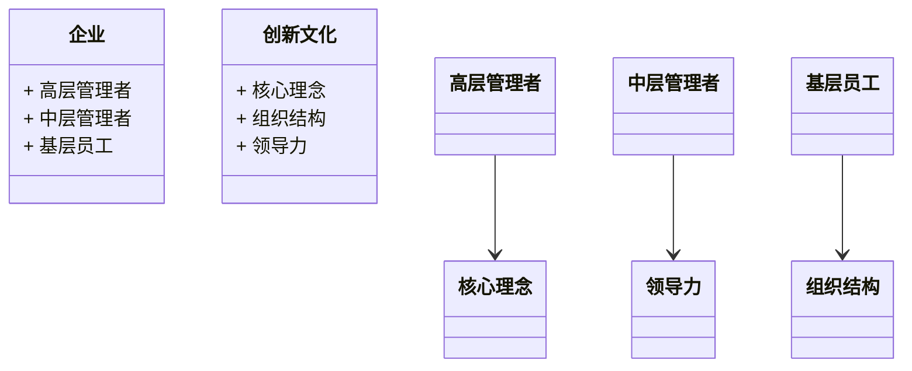

                 


# 彼得林奇对公司创新文化的定性分析

> 关键词：彼得林奇、创新文化、定性分析、企业绩效、领导力

> 摘要：本文深入探讨了彼得林奇对公司创新文化的定性分析方法，分析了创新文化的构成要素及其与企业绩效的关系，提供了系统的架构设计和实战案例，帮助读者理解如何通过定性分析提升企业创新文化。

---

# 第一部分: 创新文化的背景与重要性

## 第1章: 创新文化的定义与背景

### 1.1 创新文化的定义

#### 1.1.1 创新文化的内涵与外延

创新文化是指企业在追求创新的过程中所形成的一系列价值观、行为准则和组织结构。其内涵包括鼓励创新、容忍失败、注重学习和适应变化。外延则涉及企业内部的管理实践、员工行为以及外部市场环境。

#### 1.1.2 创新文化的核心要素

- **核心理念**：创新、合作、客户导向。
- **组织结构**：扁平化、矩阵式，促进跨部门协作。
- **领导力**：领导者应具备创新思维，支持员工创新。
- **员工激励**：奖励创新行为，营造开放的沟通氛围。
- **客户反馈**：及时收集客户意见，驱动产品和服务创新。

#### 1.1.3 创新文化与企业绩效的关系

创新文化是企业绩效的核心驱动力。创新能力强的企业通常能更快响应市场变化，提高产品竞争力和市场占有率。通过创新文化，企业能够吸引和留住优秀人才，提升员工满意度和忠诚度。

### 1.2 彼得林奇的背景与研究方法

#### 1.2.1 彼得林奇的投资哲学

彼得林奇是美国著名投资家，注重基本面分析和长期投资。他认为企业成功的关键在于其创新能力和管理层的质量。

#### 1.2.2 彼得林奇的定性分析方法

彼得林奇通过与管理层访谈、分析行业趋势和竞争对手情况，评估企业的创新文化。他注重企业的战略目标、组织结构和员工激励机制。

#### 1.2.3 彼得林奇对公司创新文化的独特视角

彼得林奇认为，创新文化是企业长期竞争优势的核心。他强调领导层的创新意识和员工的创新行为对企业绩效的影响。

## 第2章: 创新文化的核心构成要素

### 2.1 创新文化的核心理念

#### 2.1.1 核心理念的定义

创新文化的核心理念包括创新、合作和客户导向。这些理念指导企业的日常运营和战略决策。

#### 2.1.2 核心理念的特征

- **动态性**：随着市场变化不断调整。
- **渗透性**：深入企业各个层面。
- **可持续性**：长期驱动企业创新。

#### 2.1.3 核心理念与企业战略的关系

创新理念指导企业制定战略，确保战略目标与创新文化一致，提升企业竞争力。

### 2.2 创新文化的组织结构

#### 2.2.1 组织结构的层次化

企业通常分为高层、中层和基层。高层制定战略，中层执行，基层具体操作。

#### 2.2.2 组织结构与创新的关系

扁平化结构促进信息流通，矩阵式结构加强跨部门协作，有利于创新。

#### 2.2.3 组织结构的优化策略

- **扁平化**：减少层级，加快决策速度。
- **矩阵式**：跨部门协作，促进创新。

### 2.3 创新文化的领导力

#### 2.3.1 领导力在创新文化中的作用

领导者是创新文化的倡导者和推动者，影响员工的创新行为。

#### 2.3.2 领导力的风格与创新文化的关系

- **变革型领导**：激励员工创新。
- **交易型领导**：注重任务完成，可能抑制创新。

#### 2.3.3 领导力的培养与提升

- **培训**：提升领导者的创新意识。
- **实践**：鼓励领导者参与创新项目。

---

# 第二部分: 创新文化的定性分析方法

## 第3章: 创新文化的定性分析方法

### 3.1 定性研究的基本概念

#### 3.1.1 定性研究的定义

定性研究通过非数值数据（如文本、图像）分析现象，揭示其本质。

#### 3.1.2 定性研究的特点

- **整体性**：关注整体结构。
- **情境性**：研究发生在具体情境中。
- **解释性**：解释现象背后的原因。

#### 3.1.3 定性研究的应用范围

适用于文化、教育、心理等领域，尤其适合探索性研究。

### 3.2 彼得林奇的定性分析框架

#### 3.2.1 定性分析的步骤

1. **确定研究目标**：明确研究问题。
2. **数据收集**：通过访谈、观察等方式收集数据。
3. **数据分析**：识别主题，解释数据。
4. **结果呈现**：总结发现，提出建议。

#### 3.2.2 定性分析的工具与方法

- **访谈**：深入了解管理层的创新理念。
- **观察**：观察员工行为，评估创新氛围。
- **案例研究**：分析成功或失败的创新案例。

#### 3.2.3 定性分析的案例研究

通过具体案例，展示如何应用定性方法分析创新文化，如苹果公司的创新文化研究。

### 3.3 定性数据分析的实现

#### 3.3.1 数据收集的方法

- **访谈**：半结构化访谈，记录关键点。
- **观察**：记录员工行为和互动。
- **文档分析**：审查企业文件，如战略计划。

#### 3.3.2 数据分析的工具与方法

- **主题分析**：识别数据中的主题。
- **内容分析**：分析内容的结构和意义。
- **叙事分析**：通过故事理解现象。

---

# 第三部分: 创新文化的系统分析与架构设计

## 第4章: 创新文化的系统分析

### 4.1 系统功能设计

#### 4.1.1 领域模型

使用mermaid类图展示企业的各个部门和角色，以及它们在创新文化中的互动关系。



### 4.2 系统架构设计

#### 4.2.1 系统架构设计

使用mermaid架构图展示创新文化的系统架构，包括数据采集、分析和展示模块。


---

# 第四部分: 项目实战

## 第5章: 创新文化评估模型的实战实现

### 5.1 环境安装

安装必要的Python库，如pandas、numpy和scikit-learn。

### 5.2 核心代码实现

实现创新文化评估模型的代码，包括数据预处理、特征提取和模型训练。

```python
import pandas as pd
from sklearn.model_selection import train_test_split
from sklearn.tree import DecisionTreeClassifier
from sklearn.metrics import accuracy_score

# 加载数据
data = pd.read_csv('innovation_culture.csv')

# 数据预处理
X = data.drop('创新文化评分', axis=1)
y = data['创新文化评分']

# 划分训练集和测试集
X_train, X_test, y_train, y_test = train_test_split(X, y, test_size=0.2)

# 模型训练
model = DecisionTreeClassifier()
model.fit(X_train, y_train)

# 模型预测
y_pred = model.predict(X_test)

# 评估准确率
print('准确率:', accuracy_score(y_test, y_pred))
```

### 5.3 案例分析

通过具体案例分析，展示如何应用定性分析方法评估创新文化，并提出改进建议。

---

# 第五部分: 总结与展望

## 第6章: 创新文化的最佳实践与总结

### 6.1 最佳实践 tips

- 定期评估创新文化。
- 鼓励员工提出创新想法。
- 领导层积极参与创新活动。

### 6.2 小结

彼得林奇的定性分析方法为评估创新文化提供了有效工具，帮助企业识别和培养创新文化，提升竞争力。

### 6.3 注意事项

- 定性分析需要大量数据收集和分析，耗时较长。
- 分析结果可能受主观因素影响，需结合定量分析。

### 6.4 拓展阅读

推荐阅读彼得林奇的书籍，深入了解他的投资哲学和分析方法。

---

# 作者信息

作者：AI天才研究院/AI Genius Institute & 禅与计算机程序设计艺术 /Zen And The Art of Computer Programming

---

通过以上结构，文章系统地介绍了彼得林奇的创新文化定性分析方法，结合理论、方法和实战案例，帮助读者全面理解如何评估和提升企业创新文化。

