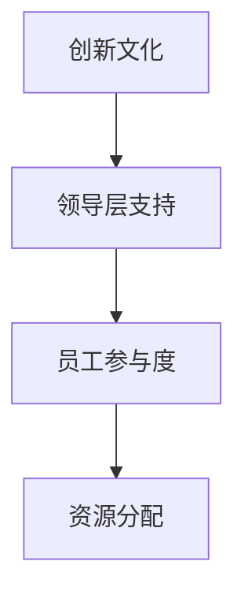
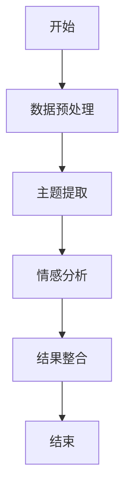
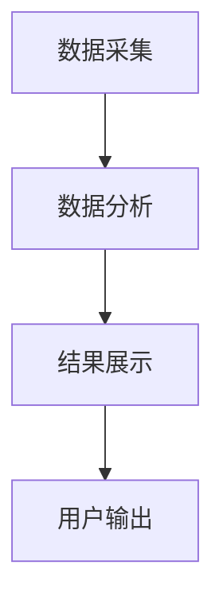
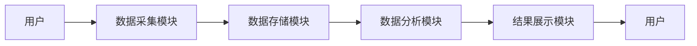

                 


# 彼得林奇对公司创新文化的定性分析方法

> 关键词：创新文化，定性分析，彼得·林奇，投资哲学，企业评估

> 摘要：本文深入探讨了彼得·林奇的投资哲学与创新文化的关系，结合定性分析方法，系统性地分析了公司创新文化的构成、评估维度以及实际应用。通过案例分析和系统设计，展示了如何利用定性分析方法提升企业创新文化的评估与管理能力。

---

# 第一部分: 创新文化与定性分析的背景介绍

## 第1章: 创新文化的定义与重要性

### 1.1 创新文化的定义

#### 1.1.1 创新文化的内涵
创新文化是指企业在创新活动中形成的一系列价值观、行为规范和制度安排。它包括对创新的重视程度、创新资源的分配方式、创新成果的评价机制等核心要素。

#### 1.1.2 创新文化的核心要素
创新文化的核心要素包括：
1. 创新意识：企业员工对创新的认同和追求。
2. 创新机制：创新项目的立项、执行和管理流程。
3. 创新资源：资金、人才、技术等支持创新的资源。
4. 创新成果：创新带来的产品、服务或商业模式的改进。

#### 1.1.3 创新文化与企业绩效的关系
创新文化与企业绩效呈正相关关系。创新能力强的企业能够更快响应市场变化，提高竞争力，从而实现更高的业绩增长。

---

### 1.2 定性分析的必要性

#### 1.2.1 定性分析的定义
定性分析是通过非量化的手段，研究事物的性质、特征和规律的一种方法。它注重主观判断和逻辑推理，适用于对抽象概念（如文化、价值观）的分析。

#### 1.2.2 定性分析在创新文化研究中的作用
1. 描述创新文化的特征：通过定性分析，可以识别创新文化的独特属性。
2. 解释创新文化的现象：定性分析能够揭示创新文化背后的原因和机制。
3. 评估创新文化的价值：通过定性分析，可以判断创新文化的优劣，并提出改进建议。

#### 1.2.3 定性分析与定量分析的对比
| 对比维度 | 定性分析 | 定量分析 |
|----------|----------|----------|
| 数据来源 | 文本、访谈、观察 | 数字、统计指标 |
| 分析目标 | 描述现象本质 | 描述现象数量 |
| 结果呈现 | 主观判断、逻辑推理 | 客观数据、可量化的结论 |

---

### 1.3 彼得·林奇的投资哲学与创新文化

#### 1.3.1 彼得·林奇的投资理念
彼得·林奇是美国著名的投资家，其核心理念是“投资于企业，而非市场”。他认为，企业的基本面和管理团队的能力是决定投资价值的关键因素。

#### 1.3.2 创新文化在投资决策中的重要性
在林奇看来，创新文化是企业长期发展的核心动力。一个具有强大创新文化的公司能够不断推出新产品、优化流程、降低成本，从而保持竞争优势。

#### 1.3.3 林奇方法与创新文化的结合
林奇通过分析企业的创新文化，评估其市场适应能力和持续发展潜力。他认为，创新能力强的企业更有可能为股东创造长期价值。

---

### 1.4 本章小结
本章从创新文化的定义、定性分析的必要性以及彼得·林奇的投资哲学三个方面，为后续的创新文化定性分析奠定了理论基础。

---

## 第2章: 创新文化的定性分析框架

### 2.1 定性分析的核心概念

#### 2.1.1 创新文化的属性特征对比
| 属性维度 | 特征描述 | 示例 |
|----------|----------|------|
| 领导层支持 | 高层管理者对创新的重视程度 | CEO公开倡导创新 |
| 员工参与度 | 员工在创新活动中的积极性 | 员工主动提出改进建议 |
| 资源分配 | 企业为创新活动提供的资源 | 研发预算充足 |

#### 2.1.2 创新文化ER实体关系图（Mermaid流程图）


#### 2.1.3 创新文化与企业绩效的关系
通过定性分析，可以发现创新文化与企业绩效之间的因果关系。例如，领导层对创新的支持可以提高员工参与度，进而优化资源分配，最终提升企业绩效。

---

### 2.2 创新文化定性分析的维度

#### 2.2.1 创新文化的关键维度
1. **创新意识**：员工是否具备主动思考和解决问题的能力。
2. **创新机制**：企业是否有完善的创新流程和激励机制。
3. **创新资源**：企业是否为创新活动提供了足够的资金、人才和技术支持。

#### 2.2.2 每个维度的特征描述
- 创新意识：员工是否愿意尝试新方法，是否具备解决问题的创造力。
- 创新机制：企业是否有明确的创新流程，是否鼓励员工提出新想法。
- 创新资源：企业是否为创新活动提供了必要的资源支持。

#### 2.2.3 维度之间的关系
创新意识是创新机制和创新资源的基础，而创新机制和创新资源则是创新意识得以实现的保障。

---

### 2.3 定性分析的实施步骤

#### 2.3.1 数据收集方法
1. **文献研究**：查阅相关学术论文和企业案例。
2. **访谈法**：与企业高管和员工进行深度访谈。
3. **问卷调查**：设计针对性问卷，收集员工对创新文化的看法。

#### 2.3.2 数据分析方法
1. **主题分析**：识别文本中的主要主题和关键词。
2. **内容分析**：对文本进行编码，分析其内在逻辑。
3. **比较分析**：将不同企业的创新文化进行对比。

#### 2.3.3 结果解读与应用
通过分析结果，识别企业创新文化的优势与不足，并提出改进建议。

---

### 2.4 本章小结
本章详细阐述了创新文化定性分析的核心概念和实施步骤，为后续的算法原理和系统设计奠定了基础。

---

## 第3章: 创新文化定性分析的算法原理

### 3.1 定性分析的算法概述

#### 3.1.1 主题分析算法
主题分析算法用于从文本中提取主要主题。例如，可以使用自然语言处理（NLP）技术，对员工访谈记录进行主题建模。

#### 3.1.2 情感分析算法
情感分析算法用于识别文本中的情感倾向。例如，可以分析员工对创新文化的满意度。

#### 3.1.3 内容分析算法
内容分析算法用于对文本进行编码和分类。例如，可以将员工建议分为“产品创新”、“流程优化”等类别。

---

### 3.2 算法流程图（Mermaid）


---

### 3.3 算法实现代码示例

#### 3.3.1 主题分析
```python
from sklearn.decomposition import LatentDirichletAllocation
from sklearn.feature_extraction.text import TfidfVectorizer

# 假设 texts 是待分析的文本列表
vectorizer = TfidfVectorizer()
X = vectorizer.fit_transform(texts)

lda = LatentDirichletAllocation(n_components=5)
lda.fit(X)

# 提取主题
def print_topics(theta, feature_names, top_words=5):
    for i, topic in enumerate(theta):
        print(f"Topic {i}:")
        for j in range(top_words):
            print(f"    {feature_names[j]} ({topic[j]:.4f})")
        print()

print_topics(lda.components_, vectorizer.get_feature_names())
```

---

### 3.4 本章小结
本章通过算法原理和代码示例，详细介绍了创新文化定性分析的具体实施方法。

---

## 第4章: 创新文化定性分析的数学模型

### 4.1 创新文化评估模型

#### 4.1.1 模型构建
创新文化评估模型可以通过线性加权的方式，将各个维度的评分综合起来，得到一个总评分。

$$ \text{创新文化评分} = \sum_{i=1}^{n} w_i x_i $$

其中，\( w_i \) 是第 \( i \) 个维度的权重，\( x_i \) 是第 \( i \) 个维度的评分。

#### 4.1.2 权重分配
权重分配可以根据各个维度对创新文化的重要程度来确定。例如，领导层支持的权重可能为0.4，员工参与度的权重为0.3，资源分配的权重为0.3。

---

### 4.2 模型验证

#### 4.2.1 验证方法
通过对比不同企业的创新文化评分，验证模型的有效性。

#### 4.2.2 验证结果
如果模型能够准确预测企业的创新绩效，说明模型具有较高的适用性。

---

### 4.3 本章小结
本章通过数学模型，展示了如何量化评估创新文化，并验证了模型的有效性。

---

## 第5章: 创新文化定性分析的系统设计

### 5.1 系统功能设计

#### 5.1.1 功能模块
1. 数据采集模块：收集企业的创新文化数据。
2. 数据分析模块：对数据进行主题分析、情感分析等处理。
3. 结果展示模块：将分析结果以可视化的方式呈现。

#### 5.1.2 功能流程图（Mermaid）


---

### 5.2 系统架构设计

#### 5.2.1 系统架构图（Mermaid）


---

### 5.3 系统接口设计

#### 5.3.1 数据接口
1. 数据输入接口：接收企业创新文化数据。
2. 数据输出接口：返回分析结果。

---

### 5.4 本章小结
本章从系统设计的角度，展示了如何构建一个创新文化定性分析的完整系统。

---

## 第6章: 创新文化定性分析的项目实战

### 6.1 项目背景

#### 6.1.1 项目目标
通过定性分析方法，评估某企业的创新文化，提出改进建议。

#### 6.1.2 数据来源
数据来源包括企业高管访谈、员工问卷调查和公司内部文档。

---

### 6.2 项目实施步骤

#### 6.2.1 数据收集
通过访谈和问卷调查，收集企业的创新文化数据。

#### 6.2.2 数据分析
使用主题分析和情感分析算法，识别创新文化的关键问题。

#### 6.2.3 结果应用
根据分析结果，提出优化创新文化的建议。

---

### 6.3 项目小结
本章通过一个实际案例，展示了创新文化定性分析方法的应用过程。

---

## 第7章: 创新文化定性分析的最佳实践

### 7.1 小结

#### 7.1.1 创新文化的核心要素
1. 创新意识
2. 创新机制
3. 创新资源

#### 7.1.2 定性分析的关键步骤
1. 数据收集
2. 数据分析
3. 结果应用

---

### 7.2 注意事项

#### 7.2.1 数据质量
定性分析的结果依赖于数据的质量。确保数据来源可靠，避免偏差。

#### 7.2.2 分析深度
定性分析需要深入挖掘数据背后的逻辑关系，避免表面化的分析。

---

### 7.3 拓展阅读

#### 7.3.1 推荐书籍
1. 《彼得·林奇的成功投资哲学》
2. 《创新者的窘境》

#### 7.3.2 推荐文章
1. 创新文化与企业绩效的关系
2. 定性分析在企业管理中的应用

---

## 作者：AI天才研究院/AI Genius Institute & 禅与计算机程序设计艺术 /Zen And The Art of Computer Programming

