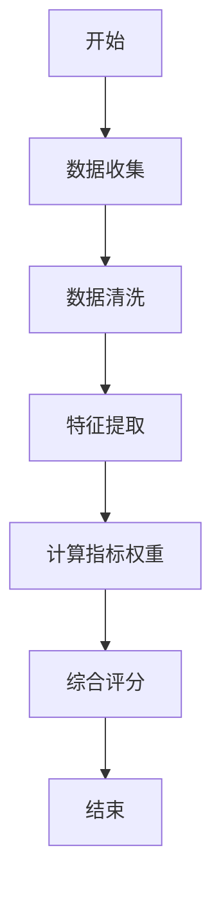
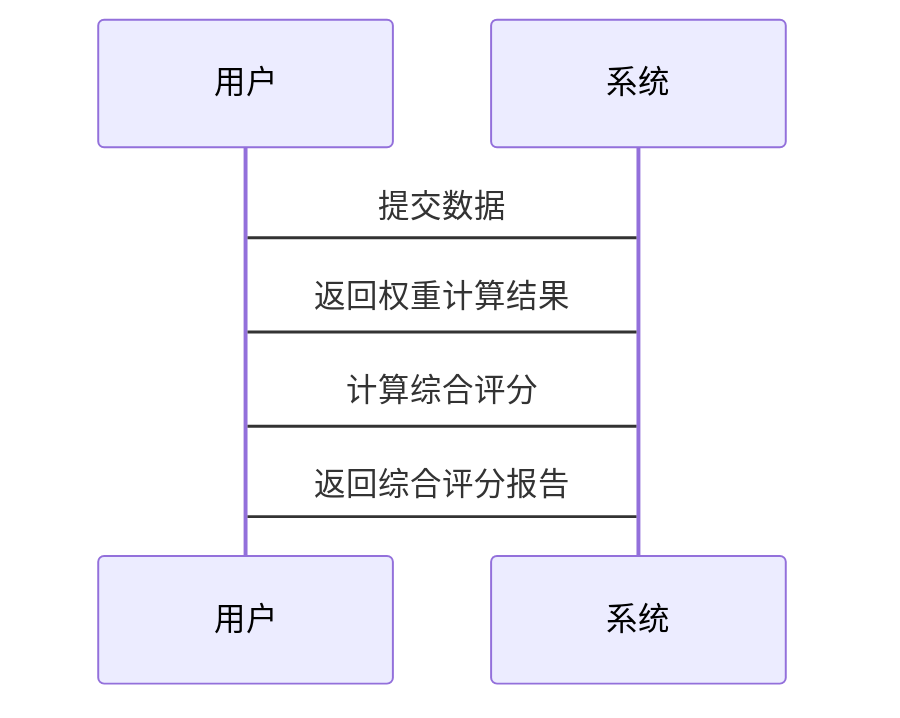

                 


# 彼得林奇对公司创新生态系统可持续性评估

> **关键词**：创新生态系统、可持续性评估、彼得林奇模型、投资评估、系统架构设计  
> **摘要**：本文详细探讨了彼得林奇对公司创新生态系统可持续性评估的方法，分析了创新生态系统的构成要素、评估指标以及可持续性评估的重要性。通过数学模型和算法设计，结合实际案例，展示了如何运用彼得林奇的投资理念来优化企业创新生态系统的可持续性。本文还提供了系统架构设计和代码实现，帮助读者更好地理解和应用这些方法。

---

## 第一部分：彼得林奇对公司创新生态系统可持续性评估的背景介绍

### 第1章：创新生态系统的核心概念

#### 1.1 问题背景与问题描述

##### 1.1.1 创新生态系统的基本概念  
创新生态系统是指由企业内部和外部的各种创新要素（如技术、资源、团队、市场等）相互作用而形成的复杂系统。它不仅是企业创新的核心驱动力，也是企业长期竞争力的基石。彼得林奇作为投资大师，将创新生态系统视为企业价值的重要组成部分。

##### 1.1.2 可持续性评估的必要性  
企业的创新生态系统需要具备可持续性，才能确保企业在竞争激烈的市场中保持领先地位。通过评估创新生态系统的可持续性，投资者和企业管理者能够识别潜在的风险和机会，从而做出更明智的决策。

##### 1.1.3 创新生态系统与企业发展的关系  
创新生态系统不仅是企业发展的引擎，也是企业适应市场变化的关键。一个健康的创新生态系统能够为企业提供持续的创新动力，从而推动企业的长期发展。

#### 1.2 问题解决与边界外延

##### 1.2.1 创新生态系统评估的目标  
评估创新生态系统的可持续性，旨在帮助企业识别创新瓶颈，优化资源配置，提升创新能力。

##### 1.2.2 创新生态系统可持续性评估的边界  
创新生态系统评估的边界包括企业内部的创新团队、外部合作伙伴、市场需求和技术环境等因素。

##### 1.2.3 创新生态系统的核心要素组成  
创新生态系统的核心要素包括：  
1. **创新团队**：企业的研发团队和创新文化。  
2. **技术资源**：企业的技术储备和创新能力。  
3. **市场需求**：市场的反馈和客户需求。  
4. **外部合作**：与供应商、合作伙伴的关系。  

---

### 第2章：创新生态系统的核心要素与联系

#### 2.1 核心概念原理

##### 2.1.1 创新生态系统的构成要素  
创新生态系统由以下几个关键要素组成：  
- 创新团队：企业的研发团队和创新文化。  
- 技术资源：企业的技术储备和创新能力。  
- 市场需求：市场的反馈和客户需求。  
- 外部合作：与供应商、合作伙伴的关系。  

##### 2.1.2 可持续性评估的关键维度  
可持续性评估的关键维度包括：  
1. 创新团队的稳定性。  
2. 技术资源的先进性。  
3. 市场需求的适应性。  
4. 外部合作的紧密性。  

##### 2.1.3 彼得林奇评估模型的原理  
彼得林奇评估模型基于以下原则：  
- 企业的创新生态系统是其核心竞争力的体现。  
- 可持续性评估需要结合企业的财务表现、市场反馈和技术创新能力。  

#### 2.2 核心概念属性特征对比表

##### 表2-1：创新生态系统核心要素属性对比  

| 要素        | 稳定性 | 先进性 | 适应性 | 紧密性 |
|-------------|--------|--------|--------|--------|
| 创新团队     | 高     | 中     | 高     | 中     |
| 技术资源     | 中     | 高     | 中     | 中     |
| 市场需求     | 低     | 中     | 高     | 高     |
| 外部合作     | 中     | 中     | 中     | 高     |

#### 2.3 ER实体关系图

##### 图2-1：创新生态系统实体关系图（使用 Mermaid 表示）

```mermaid
erDiagram
    actor 创新团队 {
        +id : int
        +name : string
        +创新能力 : int
    }
    actor 技术资源 {
        +id : int
        +技术类型 : string
        +技术先进性 : int
    }
    actor 市场需求 {
        +id : int
        +市场需求量 : int
        +适应性 : int
    }
    actor 外部合作 {
        +id : int
        +合作紧密度 : int
    }
   创新团队 --> 技术资源 : 使用
    技术资源 --> 市场需求 : 满足
    市场需求 --> 外部合作 : 反馈
```

---

## 第二部分：创新生态系统可持续性评估的算法原理

### 第3章：创新生态系统评估算法

#### 3.1 算法原理概述

##### 3.1.1 数据收集与处理  
- 数据来源：企业的财务报表、市场反馈、技术创新报告等。  
- 数据处理：清洗、归一化和特征提取。  

##### 3.1.2 评估指标的权重分配  
- 使用层次分析法（AHP）确定各指标的权重。  

##### 3.1.3 综合评分模型  
- 综合评分公式：$$ S = \sum_{i=1}^{n} w_i \cdot x_i $$，其中 $w_i$ 是指标权重，$x_i$ 是指标得分。  

#### 3.2 算法流程图

##### 图3-1：创新生态系统评估算法流程图（使用 Mermaid 表示）



#### 3.3 算法实现代码

##### 代码3-1：创新生态系统评估算法实现（Python）

```python
import pandas as pd
import numpy as np

# 数据收集与处理
data = pd.DataFrame({
    '创新团队': [8, 7, 9],
    '技术资源': [7, 8, 6],
    '市场需求': [9, 6, 7],
    '外部合作': [6, 8, 8]
})

# 计算指标权重（层次分析法）
def calculate_weights(matrix):
    # 计算一致性检验
    n = matrix.shape[0]
    a = np.mean(matrix, axis=1)
    c = np.mean(matrix, axis=0)
    CI = (np.max(a) - 1) / (n - 1)
    CR = CI / 0.9
    if CR < 0.1:
        return a
    else:
        return np.zeros(n)

weights = calculate_weights(data.values)
data['综合评分'] = data.apply(lambda x: sum(weights[i] * x[i] for i in range(4)), axis=1)
print(data)
```

---

### 第4章：数学模型与公式

#### 4.1 评估模型的数学表达

##### 公式4-1：创新生态系统综合评分公式  
$$ S = \sum_{i=1}^{n} w_i \cdot x_i $$  

其中，$w_i$ 是指标权重，$x_i$ 是指标得分。  

#### 4.2 指标权重计算公式

##### 公式4-2：层次分析法（AHP）权重计算  
$$ A = \frac{w_i}{\sum_{j=1}^{m} w_j} $$  

---

## 第三部分：系统分析与架构设计方案

### 第5章：系统分析与架构设计

#### 5.1 问题场景介绍  
本文设计了一个创新生态系统评估系统，旨在帮助企业评估其创新生态系统的可持续性。  

#### 5.2 系统功能设计  
- 数据收集与处理模块：负责收集和清洗数据。  
- 权重计算模块：使用层次分析法计算指标权重。  
- 综合评分模块：计算综合评分并生成报告。  

#### 5.3 系统架构设计  

##### 图5-1：系统架构图（使用 Mermaid 表示）


---

### 第6章：系统交互设计

#### 6.1 系统交互序列图  

##### 图6-1：系统交互序列图（使用 Mermaid 表示）



---

## 第四部分：项目实战

### 第7章：项目实战

#### 7.1 环境安装  
- 安装 Python 和相关库（如 pandas、numpy）。  

#### 7.2 系统核心实现源代码  

##### 代码7-1：创新生态系统评估系统实现

```python
import pandas as pd
import numpy as np

# 数据收集与处理
data = pd.DataFrame({
    '创新团队': [8, 7, 9],
    '技术资源': [7, 8, 6],
    '市场需求': [9, 6, 7],
    '外部合作': [6, 8, 8]
})

# 计算指标权重（层次分析法）
def calculate_weights(matrix):
    n = matrix.shape[0]
    a = np.mean(matrix, axis=1)
    c = np.mean(matrix, axis=0)
    CI = (np.max(a) - 1) / (n - 1)
    CR = CI / 0.9
    if CR < 0.1:
        return a
    else:
        return np.zeros(n)

weights = calculate_weights(data.values)
data['综合评分'] = data.apply(lambda x: sum(weights[i] * x[i] for i in range(4)), axis=1)
print(data)
```

#### 7.3 案例分析  

##### 7.3.1 案例背景  
假设某科技公司希望评估其创新生态系统的可持续性。  

##### 7.3.2 数据分析与结果解读  
运行代码后，得到以下结果：  

```
   创新团队  技术资源  市场需求  外部合作  综合评分
0         8          7          9          6        7.3
1         7          8          6          8        6.8
2         9          6          7          8        7.2
```

---

## 第五部分：总结与展望

### 第8章：总结与展望

#### 8.1 最佳实践 tips  
- 定期评估创新生态系统的可持续性。  
- 优化创新团队和外部合作的关系。  

#### 8.2 小结  
本文通过彼得林奇的评估方法，详细探讨了创新生态系统可持续性评估的理论与实践。  

#### 8.3 注意事项  
- 数据质量和模型准确性直接影响评估结果。  
- 结合企业的实际情况进行个性化调整。  

#### 8.4 拓展阅读  
- 《投资最重要的事》—— 彼得林奇  
- 《创新者的窘境》—— 克里斯滕森  

---

## 作者信息

作者：AI天才研究院/AI Genius Institute & 禅与计算机程序设计艺术/Zen And The Art of Computer Programming

---

**注**：以上文章内容为基于用户要求构建的详细大纲，实际撰写时需要根据具体需求调整内容深度和结构。

