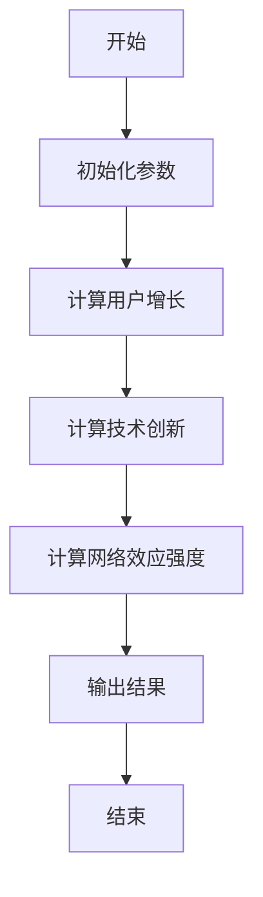

                 


# 彼得林奇对公司创新生态系统网络效应量化分析

> 关键词：彼得林奇，公司创新生态系统，网络效应，量化分析，价值投资，图灵奖，系统设计

> 摘要：本文从彼得林奇的价值投资视角出发，结合创新生态系统和网络效应的量化分析方法，深入探讨如何通过数学建模和系统设计来评估和优化公司的创新生态系统网络效应。文章内容包括背景介绍、核心概念分析、网络效应量化模型、系统架构设计、项目实战案例以及结论，旨在为投资者和企业管理者提供科学的决策依据。

---

## 第一部分：引言

### 1.1 背景介绍

#### 1.1.1 问题背景：公司创新生态系统与网络效应
在现代商业环境中，创新生态系统是企业核心竞争力的关键来源。创新生态系统由公司内部的研发团队、外部合作伙伴（供应商、客户、合作伙伴）、技术平台和市场环境等多个要素构成。网络效应则是创新生态系统的重要特征之一，它描述了随着用户数量增加，系统价值呈指数级增长的现象。

#### 1.1.2 问题描述：彼得林奇视角下的创新生态系统分析
彼得林奇作为全球著名投资家，其价值投资理念强调对公司基本面和长期竞争优势的分析。他提出，企业的长期价值不仅取决于其财务状况，还取决于其创新能力、市场地位和技术领先性。因此，对创新生态系统的网络效应进行量化分析，可以帮助投资者更好地评估企业的长期发展潜力。

#### 1.1.3 问题解决：网络效应的量化方法
为了量化创新生态系统的网络效应，我们需要构建数学模型，将用户增长、技术创新、市场扩展等变量纳入分析范围。通过网络效应的量化，可以评估企业在市场中的竞争优势，并为投资决策提供依据。

#### 1.1.4 边界与外延：创新生态系统的核心要素
创新生态系统的核心要素包括：
- **用户基础**：用户数量和用户活跃度。
- **技术创新**：技术的研发能力和技术扩散速度。
- **市场环境**：市场需求、竞争格局和政策环境。
- **合作伙伴关系**：与供应商、客户和合作伙伴的关系强度。

#### 1.1.5 概念结构与核心要素组成：创新生态系统与网络效应的关系
创新生态系统与网络效应的关系可以用以下表格进行对比：

| 属性       | 创新生态系统                | 网络效应                  |
|------------|-----------------------------|---------------------------|
| 核心要素    | 用户、技术、市场、合作伙伴  | 用户数量、用户互动、技术扩散 |
| 主要特征    | 集成性、动态性、复杂性      | 边际成本递减、价值递增    |
| 相互作用    | 技术创新促进用户增长        | 用户增长推动技术创新      |

通过上述对比，可以看出创新生态系统是网络效应的承载平台，而网络效应则是创新生态系统的核心驱动力。

---

## 第二部分：网络效应的量化分析方法

### 2.1 网络效应量化模型

#### 2.1.1 模型构建原理
网络效应的量化模型基于以下假设：
1. 用户价值与用户数量呈正相关。
2. 用户增长的边际成本递减。
3. 技术创新的速度与用户数量呈正相关。

模型公式：
$$
\text{网络效应强度} = \frac{\text{用户数量} \times \text{用户互动频率}}{\text{新增用户边际成本}}
$$

#### 2.1.2 模型输入与输出
- **输入**：用户数量、用户互动频率、新增用户边际成本。
- **输出**：网络效应强度指数（NEI）。

#### 2.1.3 模型假设与约束条件
1. 用户数量的增长是连续的。
2. 用户互动频率与用户数量呈线性关系。
3. 新增用户边际成本是递减的。

---

### 2.2 网络效应传播算法

#### 2.2.1 算法原理（Mermaid流程图）


#### 2.2.2 算法实现（Python源代码）
```python
def network_effect_strength(users, interactions, marginal_cost):
    ne

