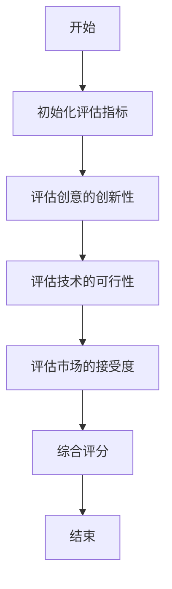
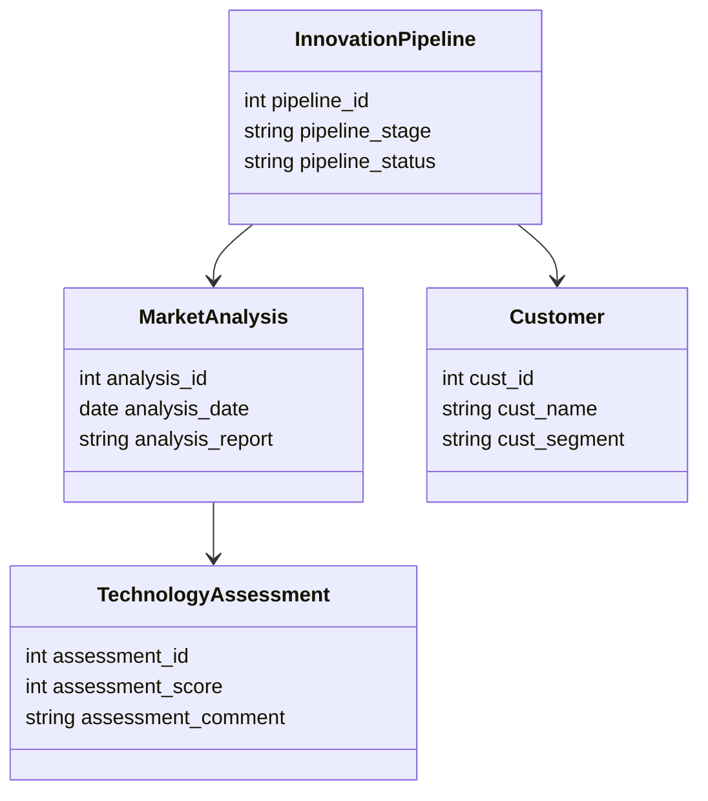
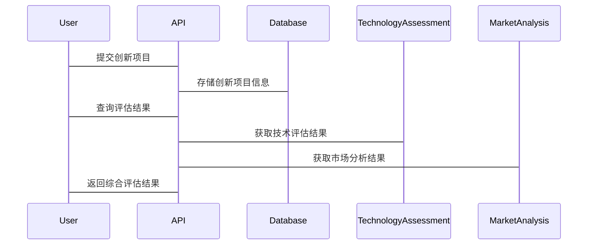

                 


# 彼得林奇对公司创新管道的质量评估

> **关键词**：创新管道、质量评估、彼得·林奇、企业创新、模型分析  
> **摘要**：本文深入探讨了彼得·林奇对公司创新管道的质量评估方法，分析了创新管道的核心概念、评估模型、方法论及实际应用，结合案例和工具，全面解析了如何通过质量评估优化企业创新管理。

---

## 目录大纲

### 第1章：创新管道的基本概念与重要性  
#### 1.1 创新管道的定义与背景  
#### 1.2 创新管道在企业中的作用  
#### 1.3 创新管道质量评估的必要性  

### 第2章：彼得·林奇的创新管道质量评估模型  
#### 2.1 模型概述  
#### 2.2 模型的构成要素  
#### 2.3 模型的评估维度  

### 第3章：创新管道质量评估的核心概念与联系  
#### 3.1 核心概念的原理  
#### 3.2 概念属性特征对比表  
#### 3.3 ER实体关系图  

### 第4章：创新管道质量评估的算法原理  
#### 4.1 算法概述  
#### 4.2 算法流程图  
#### 4.3 算法实现代码  

### 第5章：创新管道质量评估的系统分析与架构设计  
#### 5.1 问题场景介绍  
#### 5.2 系统功能设计  
#### 5.3 系统架构设计  
#### 5.4 系统接口设计  
#### 5.5 系统交互设计  

### 第6章：创新管道质量评估的项目实战  
#### 6.1 实际案例分析  
#### 6.2 项目实现与解读  
#### 6.3 项目小结  

### 第7章：总结与展望  
#### 7.1 全文总结  
#### 7.2 未来展望  
#### 7.3 注意事项与最佳实践  

---

## 第1章：创新管道的基本概念与重要性

### 1.1 创新管道的定义与背景

创新管道（Innovation Pipeline）是指企业内部从创意生成到产品商业化的一系列阶段和过程。它涵盖了从最初的想法提出、研发、测试到最终推向市场的整个生命周期。创新管道的质量直接关系到企业的创新能力和发展潜力。

**核心概念**：  
- 创意生成阶段：从市场调研、客户需求分析到初步创意的形成。  
- 技术研发阶段：技术可行性分析、原型开发、测试与优化。  
- 商业化阶段：市场推广、产品上市、客户反馈收集与改进。

**背景**：  
随着市场竞争的加剧，企业必须不断推出新的产品和服务以保持竞争力。创新管道的质量评估帮助企业识别高潜力的创新项目，优化资源配置，降低失败风险。

### 1.2 创新管道在企业中的作用

1. **驱动企业增长**：创新是企业增长的核心动力，创新管道的质量决定了企业的创新能力。  
2. **降低市场风险**：通过评估创新管道，企业可以在早期识别和淘汰低潜力项目，降低市场失败的风险。  
3. **优化资源配置**：高质量的创新管道评估可以帮助企业将资源集中在高潜力项目上，提高投资回报率。  
4. **推动战略实现**：创新管道的质量评估与企业战略目标密切相关，是实现长期发展目标的重要工具。

### 1.3 创新管道质量评估的必要性

1. **早期发现问题**：通过评估创新管道，企业可以在项目早期发现问题并及时调整，避免后期的重大损失。  
2. **提高创新效率**：高质量的创新管道评估可以帮助企业提高创新效率，减少无效创新的时间和成本。  
3. **支持决策制定**：创新管道质量评估为企业高层提供科学的决策依据，帮助企业在创新项目的选择和资源分配上做出最优决策。

---

## 第2章：彼得·林奇的创新管道质量评估模型

### 2.1 模型概述

彼得·林奇提出的创新管道质量评估模型是一种系统化的评估方法，旨在从创意生成到商业化的过程中，对创新项目的质量进行全面评估。该模型强调对创新项目的多维度分析，包括技术可行性、市场需求、团队能力和资源支持等。

**模型核心思想**：  
- 创新项目的质量评估需要从多个维度综合考虑，包括创意的创新性、技术的可行性、市场的接受度以及团队的能力等。  
- 通过系统的评估，企业可以识别高潜力的创新项目，优化资源配置，降低创新风险。

### 2.2 模型的构成要素

#### 2.2.1 创意生成阶段
- 创意来源：市场需求、客户反馈、技术趋势、内部员工建议等。  
- 创意筛选：对创意进行初步筛选，评估其创新性和可行性。  

#### 2.2.2 技术研发阶段
- 技术可行性分析：评估技术实现的可能性和难度。  
- 原型开发：根据创意和技术分析结果，开发原型并进行测试。  

#### 2.2.3 商业化阶段
- 市场需求评估：评估产品在市场上的潜在需求和竞争情况。  
- 产品上市计划：制定产品推广和营销策略。  

### 2.3 模型的评估维度

#### 2.3.1 创意的可行性
- 创意的创新性：与现有产品或技术相比，创意的创新程度。  
- 创意的实用性：创意是否能够解决实际问题或满足市场需求。  

#### 2.3.2 技术的成熟度
- 技术实现的可能性：技术是否能够在现有条件下实现。  
- 技术的风险评估：技术实现过程中可能遇到的风险及应对措施。  

#### 2.3.3 市场的需求度
- 市场容量：目标市场的规模和潜力。  
- 竞争分析：市场上现有产品的竞争情况及创新项目的差异化优势。  

---

## 第3章：创新管道质量评估的核心概念与联系

### 3.1 核心概念的原理

创新管道质量评估的核心概念包括创意生成、技术研发和商业化三个阶段。每个阶段都有其独特的评估指标和方法。

**创意生成阶段**：  
- 创意的来源和筛选是创新管道质量评估的第一步，确保创意的创新性和实用性。  

**技术研发阶段**：  
- 技术可行性分析是评估创新项目能否成功实现的关键。  

**商业化阶段**：  
- 市场需求评估和产品上市计划是确保创新项目能够成功推向市场的重要环节。

### 3.2 概念属性特征对比表

以下表格对比了创新管道质量评估中的核心概念及其属性特征：

| 概念       | 属性           | 特征                           |
|------------|----------------|--------------------------------|
| 创意生成   | 创新性         | 高                             |
|            | 实用性         | 高                             |
| 技术研发   | 可行性         | 高或中                         |
|            | 风险性         | 中或低                         |
| 商业化     | 市场需求       | 高或中                         |
|            | 竞争优势       | 高或中                         |

### 3.3 ER实体关系图

以下是创新管道质量评估的ER实体关系图：

```mermaid
erDiagram
    customer[客户] {
        cust_id : integer
        cust_name : string
        cust_segment : string
    }
    product[产品] {
        prod_id : integer
        prod_name : string
        prod_description : string
    }
    innovation_pipeline[创新管道] {
        pipeline_id : integer
        pipeline_stage : string
        pipeline_status : string
    }
    market_analysis[市场分析] {
        analysis_id : integer
        analysis_date : date
        analysis_report : string
    }
    technology_assessment[技术评估] {
        assessment_id : integer
        assessment_score : integer
        assessment_comment : string
    }
    relationship customer -->> market_analysis
    relationship market_analysis -->> innovation_pipeline
    relationship innovation_pipeline -->> technology_assessment
```

---

## 第4章：创新管道质量评估的算法原理

### 4.1 算法概述

彼得·林奇创新管道质量评估算法是一种基于多维度评估的系统方法。该算法通过综合评估创意的创新性、技术的可行性和市场的接受度，对创新项目的质量进行评分。

### 4.2 算法流程图

以下是算法的流程图：



### 4.3 算法实现代码

以下是一个简单的算法实现代码示例：

```python
def innovation_pipeline_assessment(idea):
    # 创意的创新性评分（1-10分）
    innovation_score = assess_innovation(idea)
    # 技术的可行性评分（1-10分）
    technology_score = assess_technology(idea)
    # 市场的接受度评分（1-10分）
    market_score = assess_market(idea)
    # 综合评分
    total_score = (innovation_score + technology_score + market_score) / 3
    return total_score

def assess_innovation(idea):
    # 创意的创新性评估逻辑
    pass

def assess_technology(idea):
    # 技术可行性评估逻辑
    pass

def assess_market(idea):
    # 市场接受度评估逻辑
    pass
```

---

## 第5章：创新管道质量评估的系统分析与架构设计

### 5.1 问题场景介绍

在企业创新管理中，创新管道的质量评估可以帮助企业识别高潜力的创新项目，优化资源配置，降低创新风险。本文通过彼得·林奇的模型，结合实际案例，分析创新管道质量评估的系统架构和实现方法。

### 5.2 系统功能设计

#### 领域模型（Mermaid类图）



### 5.3 系统架构设计

以下是创新管道质量评估系统的架构设计图：


### 5.4 系统接口设计

创新管道质量评估系统的接口设计包括以下几个部分：

1. **用户接口**：提供创新项目提交、评估结果查询等功能。  
2. **数据接口**：与企业的CRM、研发部门等系统进行数据交互。  
3. **评估接口**：提供创新项目评估的API，支持第三方评估工具的集成。

### 5.5 系统交互设计

以下是系统交互的序列图：



---

## 第6章：创新管道质量评估的项目实战

### 6.1 实际案例分析

以某科技公司为例，分析其创新管道质量评估的实际案例：

1. **创意生成阶段**：公司通过市场调研和客户需求分析，提出了多个创新项目创意。  
2. **技术评估阶段**：对每个创意进行技术可行性分析，筛选出高潜力项目。  
3. **市场评估阶段**：评估市场的接受度和竞争情况，制定产品上市计划。  

### 6.2 项目实现与解读

以下是项目实现的核心代码：

```python
def main():
    # 提交创新项目
    idea = {
        "name": "智能助手",
        "description": "基于AI的智能助手系统"
    }
    # 评估创新项目
    score = innovation_pipeline_assessment(idea)
    print(f"创新项目评估得分：{score}")
    # 保存评估结果
    save_assessment(idea, score)

def save_assessment(idea, score):
    # 保存评估结果到数据库
    pass

if __name__ == "__main__":
    main()
```

### 6.3 项目小结

通过实际案例分析和项目实现，我们可以看到彼得·林奇的创新管道质量评估模型在实际应用中的有效性和实用性。该模型可以帮助企业系统地评估创新项目的质量，优化资源配置，降低创新风险。

---

## 第7章：总结与展望

### 7.1 全文总结

本文深入探讨了彼得·林奇对公司创新管道的质量评估方法，从创新管道的基本概念到评估模型的构建，再到实际应用，全面分析了创新管道质量评估的重要性和实施方法。

### 7.2 未来展望

随着人工智能和大数据技术的不断发展，创新管道质量评估的方法和工具也将不断优化。未来的研究可以进一步结合数据科学和机器学习技术，提升评估的准确性和效率。

### 7.3 注意事项与最佳实践

1. **数据准确性**：创新管道质量评估依赖于准确的数据支持，企业需要建立完善的数据收集和分析机制。  
2. **团队协作**：创新管道的质量评估需要跨部门协作，企业应建立高效的沟通机制。  
3. **持续优化**：创新管道质量评估是一个动态过程，企业需要根据实际情况不断优化评估模型和方法。

---

## 作者

**作者**：AI天才研究院/AI Genius Institute & 禅与计算机程序设计艺术/Zen And The Art of Computer Programming

---

本文通过系统化的分析和详细的案例解读，全面解析了彼得·林奇的创新管道质量评估方法，为企业优化创新管理提供了重要的理论和实践指导。

