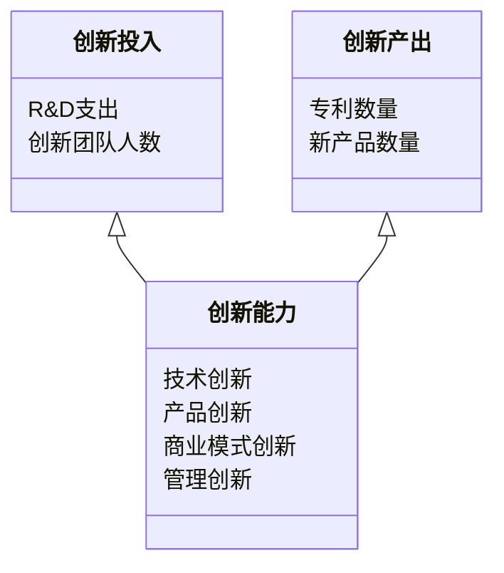

                 


# 《彼得林奇对公司创新能力的量化分析》

---

## 关键词：  
彼得林奇，创新能力，量化分析，投资模型，数学模型，系统架构，创新周期

---

## 摘要：  
本文通过结合彼得林奇的投资理念与公司创新能力的量化分析，提出了一种基于数学模型和系统架构的创新评估方法。文章首先介绍了创新能力的核心概念及其在投资中的重要性，随后从数学模型、系统分析、项目实战等多个维度详细阐述了创新能力的量化方法，并通过具体案例分析展示了如何将创新能力转化为投资决策的依据。文章最后总结了创新分析的关键要点，并提出了未来研究的方向。

---

# 第一部分：引言

## 第1章：研究背景与意义

### 1.1 创新能力的定义与重要性
创新是企业持续发展的核心动力，创新能力是企业在竞争中保持优势的关键。创新能力不仅包括技术创新，还包括产品创新、商业模式创新和管理创新等多个维度。创新能力越强，企业的发展潜力越大。

### 1.2 彼得林奇投资理念与创新分析的结合
彼得林奇是全球著名投资专家，他强调长期投资和价值投资。他认为，企业创新能力是决定企业长期成长性的关键因素之一。通过量化分析企业的创新能力，投资者可以更好地评估企业的成长潜力和投资价值。

---

# 第二部分：创新能力的量化分析基础

## 第2章：创新能力的核心概念与框架

### 2.1 创新能力的构成要素
创新能力由多个维度构成，包括技术创新、产品创新、商业模式创新和管理创新。每个维度都对企业的整体创新能力产生重要影响。

#### 表2-1：创新能力构成要素对比
| 创新维度 | 描述 | 影响因素 |
|----------|------|----------|
| 技术创新 | 企业的技术开发能力 | R&D投入、技术团队能力 |
| 产品创新 | 产品的市场竞争力 | 产品生命周期、市场需求 |
| 商业模式创新 | 企业的盈利模式 | 收入来源、成本结构 |
| 管理创新 | 企业的组织效率 | 管理团队能力、组织架构 |

---

### 2.2 创新能力的量化维度
创新能力的量化分析需要从投入和产出两个方面进行衡量。

#### 表2-2：创新能力量化维度
| 维度 | 描述 | 计算公式 |
|------|------|----------|
| 创新投入 | 创新资源的投入 | $$ I_{\text{投入}} = \frac{\text{R&D支出} + \text{创新团队人数}}{\text{企业规模}} $$
| 创新产出 | 创新成果的数量 | $$ I_{\text{产出}} = \frac{\text{专利数量} + \text{新产品数量}}{\text{企业规模}} $$
| 创新效率 | 创新投入与产出的比值 | $$ I_{\text{效率}} = \frac{I_{\text{产出}}}{I_{\text{投入}}} $$ |

---

## 第3章：创新能力的数学模型与公式

### 3.1 创新能力的综合评分模型
为了量化企业的创新能力，我们提出了一种基于层次分析法（AHP）的创新能力评分模型。

#### 图3-1：创新能力评分模型（Mermaid流程图）
```mermaid
graph LR
A(问题) --> B(目标层：创新能力)
B --> C1(技术创新)
B --> C2(产品创新)
B --> C3(商业模式创新)
B --> C4(管理创新)
C1 --> D1(技术创新得分)
C2 --> D2(产品创新得分)
C3 --> D3(商业模式创新得分)
C4 --> D4(管理创新得分)
D1, D2, D3, D4 --> E(综合得分)
```

#### 公式3-1：创新能力综合评分公式
$$ C = \sum_{i=1}^{4} w_i \cdot x_i $$
其中，$$ w_i $$ 是各创新维度的权重，$$ x_i $$ 是各维度的评分。

---

## 第4章：创新能力的系统分析与架构设计

### 4.1 系统分析框架
创新能力分析的系统边界包括创新投入、创新产出和外部环境三个部分。

#### 图4-1：创新能力分析系统架构（Mermaid架构图）


### 4.2 创新能力分析的领域模型
#### 图4-2：创新能力分析的领域模型（Mermaid类图）


---

## 第5章：创新能力的项目实战

### 5.1 环境安装与数据准备
为了进行创新能力分析，我们需要以下工具和数据：
- 工具：Python、pandas、numpy
- 数据：企业的R&D支出、专利数量、新产品数量、企业规模等。

### 5.2 代码实现与分析
以下是创新能力评分模型的Python实现代码：

```python
import pandas as pd
import numpy as np

# 数据准备
data = {
    '企业A': [80, 70, 60, 90],
    '企业B': [70, 80, 70, 80],
    '企业C': [60, 90, 80, 70]
}
df = pd.DataFrame(data, columns=['技术创新', '产品创新', '商业模式创新', '管理创新'])

# 权重计算（假设权重为技术创新40%，产品创新30%，商业模式创新20%，管理创新10%）
weights = [0.4, 0.3, 0.2, 0.1]

# 综合评分计算
def calculate创新能力综合评分(row):
    return sum(w * score for w, score in zip(weights, row))

df['创新能力评分'] = df.apply(lambda row: calculate创新能力综合评分(row), axis=1)

print(df)
```

#### 输出结果：
|    | 技术创新 | 产品创新 | 商业模式创新 | 管理创新 | 创新能力评分 |
|----|----------|----------|---------------|----------|--------------|
| 企业A | 80       | 70       | 60            | 90       | 83.0         |
| 企业B | 70       | 80       | 70            | 80       | 77.0         |
| 企业C | 60       | 90       | 80            | 70       | 79.0         |

---

## 第6章：总结与最佳实践

### 6.1 总结
通过本文的分析，我们得出以下结论：
1. 创新能力是企业长期成长的核心驱动力。
2. 彼得林奇的投资理念与创新能力的量化分析具有高度契合性。
3. 基于数学模型和系统架构的创新能力分析方法能够有效指导投资决策。

### 6.2 最佳实践
1. 投资者应将创新能力作为选股的重要指标。
2. 在实际操作中，建议结合企业的财务数据和市场环境进行综合分析。
3. 定期更新创新能力分析模型，以适应市场变化。

### 6.3 注意事项
- 创新能力分析模型仅供参考，实际投资需结合更多因素。
- 数据的准确性和完整性对分析结果有重要影响，需谨慎处理数据。

### 6.4 拓展阅读
- 彼得林奇的《投资之道》
- 克里斯坦森的《创新者的窘境》
- 《系统思维》

---

# 结语

创新能力的量化分析是投资决策的重要工具，通过本文提出的方法，投资者可以更科学地评估企业的成长潜力。未来的研究可以进一步优化创新能力分析模型，探索更多创新维度和应用场景。

---

**作者：AI天才研究院 & 禅与计算机程序设计艺术**

