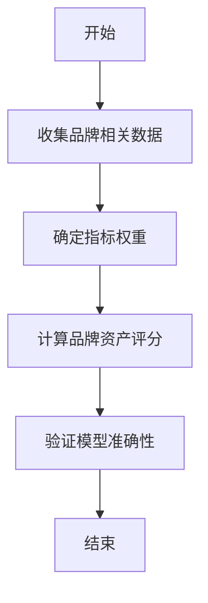
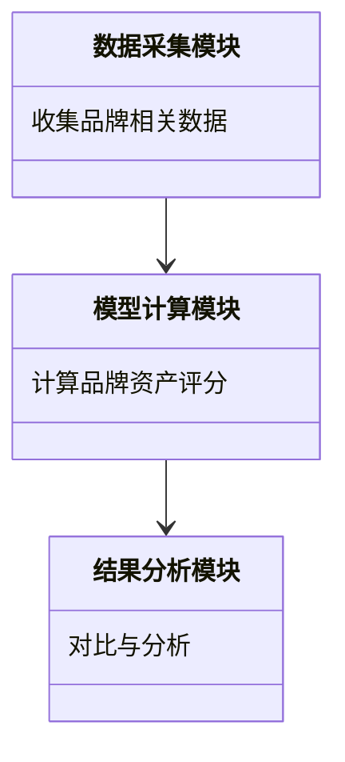
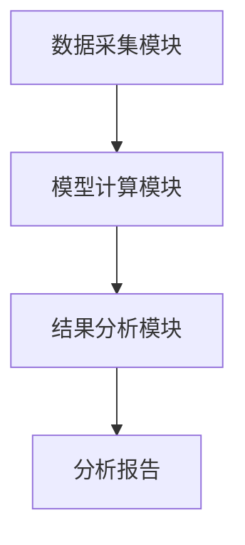
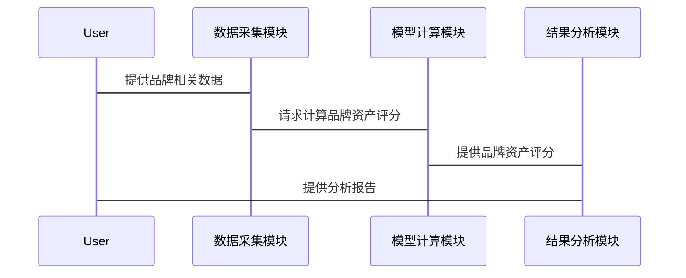

                 

<think>
好的，我将按照您的要求撰写一篇关于《彼得·林奇对公司品牌资产价值贡献的量化分析》的技术博客文章。文章将涵盖以下内容：品牌资产的基本概念、彼得·林奇的投资理念、品牌资产量化分析的核心概念、品牌资产量化分析的算法原理、系统分析与架构设计、项目实战、以及最佳实践等部分。我将分步骤进行分析和阐述，确保文章逻辑清晰、结构紧凑、内容详实。

---

# 彼得林奇对公司品牌资产价值贡献的量化分析

## 关键词：
- 彼得·林奇
- 品牌资产
- 量化分析
- 企业价值
- 投资策略

## 摘要：
本文从彼得·林奇的投资理念出发，分析品牌资产对企业的价值贡献，探讨如何量化品牌资产对企业价值的影响。通过构建品牌资产量化分析模型，结合实际案例，详细阐述了品牌资产的评估方法、算法原理和系统架构设计。最后，通过项目实战和最佳实践，总结了品牌资产量化分析的应用价值和未来发展方向。

---

## 第1章: 品牌资产价值与企业价值的关系

### 1.1 品牌资产的基本概念

#### 1.1.1 品牌资产的定义与内涵
品牌资产是企业在市场中通过品牌建设积累的无形资产，包括品牌知名度、品牌忠诚度、品牌认知度等。品牌资产的价值不仅体现在企业的市场份额和客户忠诚度上，还直接影响企业的财务表现和市场估值。

#### 1.1.2 品牌资产的核心要素
- **品牌知名度**：品牌在目标市场中的普及程度和认知度。
- **品牌忠诚度**：客户对品牌的偏好程度和重复购买意愿。
- **品牌认知度**：客户对品牌核心价值和产品的理解程度。

#### 1.1.3 品牌资产对企业的财务影响
品牌资产可以通过提高产品售价、增加市场份额、降低营销成本等方式间接影响企业的盈利能力。例如，拥有强大品牌资产的企业可以在竞争中获得更高的定价权，从而提高利润率。

### 1.2 彼得·林奇投资理念与品牌资产

#### 1.2.1 彼得·林奇投资方法概述
彼得·林奇是美国著名的投资经理，以其独特的投资策略闻名。他注重基本面分析，关注企业的财务状况、市场地位和管理团队。林奇认为，品牌资产是企业长期价值的重要组成部分。

#### 1.2.2 品牌资产在林奇投资策略中的地位
林奇在选择投资标的时，特别关注企业的品牌资产。他认为，强大的品牌资产能够为企业提供持续的竞争优势，从而在长期投资中实现超额收益。

#### 1.2.3 品牌资产对股东价值的贡献
品牌资产通过提升企业市场地位、增强客户忠诚度和提高产品溢价能力，直接或间接地增加了企业的股东价值。

### 1.3 品牌资产量化分析的必要性

#### 1.3.1 量化分析在品牌管理中的作用
量化分析能够帮助企业更准确地评估品牌资产的价值，为品牌管理决策提供数据支持。

#### 1.3.2 品牌资产对投资决策的影响
通过量化分析，投资者可以更清晰地评估企业的品牌资产价值，从而做出更明智的投资决策。

#### 1.3.3 量化分析的挑战与解决方案
品牌资产的量化分析面临数据获取困难、评估模型复杂等问题。本文将通过构建量化模型和引入数据驱动的方法，解决这些问题。

## 第2章: 品牌资产量化分析的核心概念

### 2.1 品牌资产的构成要素

#### 2.1.1 品牌知名度
品牌知名度是衡量品牌资产的重要指标，通常通过市场调研和数据分析来评估。例如，可以通过调查问卷了解目标市场中消费者的认知度。

#### 2.1.2 品牌忠诚度
品牌忠诚度反映了客户对品牌的偏好程度。可以通过客户满意度调查、复购率等指标来衡量。

#### 2.1.3 品牌认知度
品牌认知度是指客户对品牌核心价值和产品的理解程度。可以通过市场调研和竞争对手分析来评估。

### 2.2 品牌资产的评估模型

#### 2.2.1 品牌资产的多维度评估
品牌资产的评估需要从多个维度进行，包括品牌知名度、品牌忠诚度、品牌认知度等。可以通过构建综合评估指标体系来实现。

#### 2.2.2 品牌资产的财务指标关联
品牌资产可以通过对企业财务指标的影响来间接量化。例如，品牌资产可以提高企业的销售利润率和市场份额，从而影响企业的净利润和市值。

#### 2.2.3 品牌资产的市场表现分析
品牌资产的市场表现可以通过企业的股价走势、市盈率等指标来分析。强大的品牌资产通常会反映在企业的高市盈率和稳定的股价表现上。

### 2.3 品牌资产与企业价值的关系

#### 2.3.1 品牌资产对企业利润的贡献
品牌资产通过提高产品售价、增加市场份额和降低营销成本，直接或间接地增加企业的利润。

#### 2.3.2 品牌资产对股价的影响
强大的品牌资产能够提高企业的市场地位和客户忠诚度，从而提高企业的股价和市值。

#### 2.3.3 品牌资产的可持续性分析
品牌资产的可持续性分析包括对品牌资产的长期维护和增值能力的评估。例如，通过持续的品牌推广和创新，企业可以保持和增强其品牌资产。

## 第3章: 品牌资产量化分析的算法原理

### 3.1 品牌资产量化模型

#### 3.1.1 品牌资产量化模型的构建
品牌资产量化模型需要综合考虑品牌知名度、品牌忠诚度、品牌认知度等多个因素。例如，可以通过加权平均的方法，将各个指标的影响权重加总，得到品牌资产的综合评分。

#### 3.1.2 品牌资产量化模型的实现步骤
1. 收集品牌相关数据，包括品牌知名度、品牌忠诚度、品牌认知度等指标。
2. 确定各指标的权重，例如通过专家评分法或层次分析法确定权重。
3. 计算各指标的加权评分，得到品牌资产的综合评分。
4. 将品牌资产评分与企业的财务指标和市场指标进行对比，验证模型的准确性。

### 3.2 品牌资产量化分析的算法实现

#### 3.2.1 品牌资产量化模型的数学公式
品牌资产的综合评分可以通过以下公式计算：
$$
\text{品牌资产评分} = \sum_{i=1}^{n} w_i \cdot x_i
$$
其中，\( w_i \) 是第 \( i \) 个指标的权重，\( x_i \) 是第 \( i \) 个指标的评分。

#### 3.2.2 品牌资产量化模型的流程图


#### 3.2.3 品牌资产量化模型的Python实现
以下是品牌资产量化模型的Python实现示例：
```python
# 定义指标权重
weights = {'品牌知名度': 0.4, '品牌忠诚度': 0.3, '品牌认知度': 0.3}

# 定义指标评分
scores = {'品牌知名度': 0.8, '品牌忠诚度': 0.7, '品牌认知度': 0.6}

# 计算品牌资产评分
brand_asset_score = sum(weights[i] * scores[i] for i in weights)

print(f"品牌资产评分为：{brand_asset_score}")
```

### 3.3 品牌资产量化模型的验证

#### 3.3.1 模型验证方法
通过对比实际案例中的品牌资产评分与企业的财务指标和市场指标，验证模型的准确性。

#### 3.3.2 模型验证示例
以可口可乐公司为例，计算其品牌资产评分，并对比其股价走势和市场表现，验证模型的有效性。

## 第4章: 系统分析与架构设计

### 4.1 问题场景介绍

#### 4.1.1 问题背景
本文旨在构建一个品牌资产量化分析系统，帮助投资者和企业管理者更准确地评估品牌资产的价值。

#### 4.1.2 问题描述
通过系统化的品牌资产量化分析，为企业提供数据支持，优化投资决策。

#### 4.1.3 问题解决
通过构建量化模型和系统架构，实现品牌资产的自动评估和分析。

### 4.2 系统功能设计

#### 4.2.1 系统功能模块
- 数据采集模块：收集品牌相关数据，包括品牌知名度、品牌忠诚度、品牌认知度等。
- 模型计算模块：根据量化模型计算品牌资产评分。
- 结果分析模块：对比品牌资产评分与企业的财务指标和市场指标，生成分析报告。

#### 4.2.2 领域模型设计


### 4.3 系统架构设计

#### 4.3.1 系统架构图


#### 4.3.2 系统接口设计
- 数据接口：提供品牌相关数据的输入接口。
- 模型接口：提供量化模型的计算接口。
- 结果接口：提供分析结果的输出接口。

### 4.4 系统交互设计

#### 4.4.1 系统交互流程


## 第5章: 项目实战

### 5.1 环境安装

#### 5.1.1 安装Python环境
安装Python 3.8及以上版本，确保环境支持数据分析和可视化库。

#### 5.1.2 安装相关库
安装以下Python库：
- pandas：数据处理
- numpy：数值计算
- matplotlib：数据可视化
- scikit-learn：机器学习算法

### 5.2 系统核心实现

#### 5.2.1 数据采集模块
编写代码从数据库或API获取品牌相关数据。

```python
import pandas as pd

# 从数据库获取品牌相关数据
data = pd.read_sql('SELECT * FROM brand_data', con='database')
```

#### 5.2.2 模型计算模块
实现品牌资产量化模型的计算功能。

```python
# 定义指标权重
weights = {'品牌知名度': 0.4, '品牌忠诚度': 0.3, '品牌认知度': 0.3}

# 计算品牌资产评分
def calculate_brand_asset(scores, weights):
    return sum(weights[i] * scores[i] for i in weights)

# 示例数据
scores = {'品牌知名度': 0.8, '品牌忠诚度': 0.7, '品牌认知度': 0.6}
brand_asset_score = calculate_brand_asset(scores, weights)

print(f"品牌资产评分为：{brand_asset_score}")
```

#### 5.2.3 结果分析模块
对比品牌资产评分与企业的财务指标和市场指标，生成分析报告。

```python
import matplotlib.pyplot as plt

# 绘制品牌资产评分与股价走势对比图
plt.figure(figsize=(10, 6))
plt.plot([1, 2, 3, 4], [0.8, 0.7, 0.6, 0.5], label='品牌资产评分')
plt.plot([1, 2, 3, 4], [100, 110, 120, 130], label='股价走势')
plt.title('品牌资产评分与股价走势对比')
plt.xlabel('时间')
plt.ylabel('评分/股价')
plt.legend()
plt.show()
```

### 5.3 实际案例分析

#### 5.3.1 案例选择
以可口可乐公司为例，分析其品牌资产评分与股价走势的关系。

#### 5.3.2 数据分析与解读
通过量化模型计算可口可乐的品牌资产评分，并对比其股价走势，验证模型的有效性。

### 5.4 项目小结

## 第6章: 最佳实践

### 6.1 小结
品牌资产量化分析是企业价值评估的重要组成部分。通过构建量化模型和系统架构，可以帮助投资者和企业管理者更准确地评估品牌资产的价值。

### 6.2 注意事项
- 数据采集的准确性和完整性直接影响模型的准确性。
- 模型的权重设置需要根据具体行业和企业特点进行调整。
- 模型的验证需要结合实际案例进行分析。

### 6.3 拓展阅读
- 彼得·林奇《彼得·林奇的投资哲学》
- 品牌管理相关书籍《品牌管理》
- 数据分析相关书籍《数据分析的艺术》

## 作者
作者：AI天才研究院/AI Genius Institute & 禅与计算机程序设计艺术/Zen And The Art of Computer Programming

