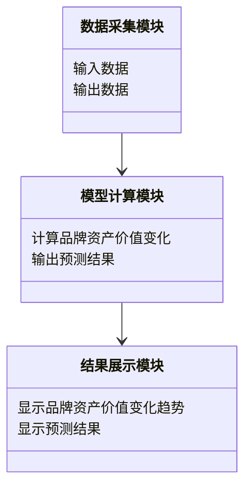
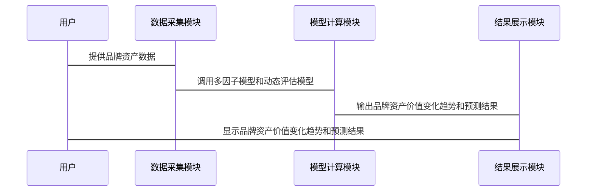

                 


# 彼得林奇对公司品牌资产价值随时间变化的追踪研究

> 关键词：彼得·林奇，品牌资产，资产价值变化，投资分析，动态评估模型

> 摘要：本文深入探讨了彼得·林奇对品牌资产价值随时间变化的追踪研究。通过分析品牌资产的核心概念、价值变化的驱动因素以及具体的数学模型，本文展示了如何利用动态评估模型和多因子模型来分析和预测品牌资产价值的变化。文章还结合了系统设计和项目实战，为投资者和企业管理者提供了实用的指导和建议。

---

## 第一部分: 背景介绍与核心概念

### 第1章: 公司品牌资产价值的定义与背景

#### 1.1 品牌资产的核心概念

##### 1.1.1 品牌资产的定义
品牌资产是指企业在市场中通过品牌建设所积累的无形资产，包括品牌知名度、品牌忠诚度、品牌形象等。这些资产能够为企业创造额外的经济价值。

##### 1.1.2 品牌资产的构成要素
品牌资产的构成要素主要包括以下几点：
- **品牌知名度**：品牌在市场中的认知程度。
- **品牌忠诚度**：消费者对品牌的偏好程度。
- **品牌形象与声誉**：品牌在消费者心中的形象和声誉。
- **品牌创新力**：品牌在市场中的创新能力和适应性。

##### 1.1.3 品牌资产与公司价值的关系
品牌资产是公司价值的重要组成部分。一个强大的品牌资产可以提升公司的市场地位、增加客户忠诚度，并为企业创造更多的利润。

#### 1.2 品牌资产价值变化的背景与意义

##### 1.2.1 品牌资产价值变化的背景
随着市场竞争的加剧和消费者需求的变化，品牌资产的价值也在不断波动。企业需要通过持续的品牌管理和创新来维护和提升品牌资产的价值。

##### 1.2.2 品牌资产价值变化对企业的影响
品牌资产价值的变化直接影响企业的市场竞争力和财务表现。品牌资产的增加可以提升企业的市场地位和盈利能力，而品牌资产的减少则可能导致市场份额的流失和利润下降。

##### 1.2.3 研究品牌资产价值变化的意义
研究品牌资产价值的变化可以帮助企业制定更有效的品牌管理策略，优化资源配置，并在竞争激烈的市场中保持优势。

### 第2章: 彼得·林奇投资理念与品牌资产分析

#### 2.1 彼得·林奇投资理念概述

##### 2.1.1 彼得·林奇的投资风格
彼得·林奇是一位著名的职业经理人和投资专家，他的投资理念以注重基本面分析和长期投资为主。他特别关注企业的品牌资产和市场地位，认为这些都是企业长期价值的重要组成部分。

##### 2.1.2 彼得·林奇对品牌资产的重视
彼得·林奇在其投资生涯中，非常注重对品牌资产的分析。他认为，强大的品牌资产能够为企业提供持续的竞争优势，并在市场波动中为企业提供稳定的收益。

##### 2.1.3 彼得·林奇的投资策略与品牌资产的关系
彼得·林奇的投资策略强调对企业的深入研究和长期持有。他认为，品牌资产是企业长期价值的重要组成部分，因此在选择投资标的时，他会重点关注企业的品牌资产和市场地位。

#### 2.2 彼得·林奇与品牌资产价值分析

##### 2.2.1 彼得·林奇的品牌资产分析方法
彼得·林奇在品牌资产分析中，主要采用多因子模型和动态评估模型。他通过分析品牌资产的变化趋势，来判断企业的长期发展潜力。

##### 2.2.2 彼得·林奇对品牌资产价值变化的洞察
彼得·林奇认为，品牌资产的价值变化受到多种因素的影响，包括市场环境、企业经营状况和消费者行为等。他通过分析这些因素的变化趋势，来预测品牌资产的未来走势。

##### 2.2.3 彼得·林奇品牌资产分析的案例研究
以可口可乐和苹果公司为例，彼得·林奇通过分析这些公司的品牌资产变化，预测了它们的长期发展趋势。他的分析方法为我们提供了宝贵的借鉴。

---

## 第二部分: 品牌资产价值变化的核心概念与联系

### 第3章: 品牌资产价值变化的核心要素

#### 3.1 品牌资产价值变化的驱动因素

##### 3.1.1 市场环境变化
市场环境的变化，如经济波动、行业竞争加剧等，都会对品牌资产的价值产生影响。

##### 3.1.2 企业经营状况
企业的经营状况，如财务表现、创新能力等，也是影响品牌资产价值的重要因素。

##### 3.1.3 消费者行为变化
消费者行为的变化，如购买习惯、品牌偏好等，也会对品牌资产的价值产生直接影响。

#### 3.2 品牌资产价值变化的衡量指标

##### 3.2.1 品牌知名度
品牌知名度是指品牌在市场中的认知程度。知名度越高，品牌资产的价值越大。

##### 3.2.2 品牌忠诚度
品牌忠诚度是指消费者对品牌的偏好程度。忠诚度越高，品牌资产的价值越大。

##### 3.2.3 品牌形象与声誉
品牌形象与声誉是指品牌在消费者心中的形象和声誉。形象良好、声誉高的品牌，其资产价值也较高。

### 第4章: 品牌资产价值变化的核心概念对比分析

#### 4.1 品牌资产与企业财务表现的关系

##### 4.1.1 品牌资产对企业利润的影响
品牌资产可以通过提升产品溢价能力、增加市场份额等方式，间接影响企业的利润。

##### 4.1.2 品牌资产与企业市场价值的关系
品牌资产是企业市场价值的重要组成部分。强大的品牌资产可以提升企业的市场估值。

##### 4.1.3 品牌资产与企业长期发展的关系
品牌资产是企业长期发展的基础。强大的品牌资产可以为企业提供持续的竞争优势。

#### 4.2 品牌资产与企业市场地位的关系

##### 4.2.1 品牌资产与市场竞争优势
强大的品牌资产可以为企业提供市场竞争优势，帮助企业占据更大的市场份额。

##### 4.2.2 品牌资产与市场占有率的关系
品牌资产与市场占有率密切相关。强大的品牌资产可以帮助企业提高市场占有率。

##### 4.2.3 品牌资产与企业创新能力和适应性
品牌资产与企业的创新能力和适应性密切相关。强大的品牌资产可以帮助企业更好地适应市场变化，推动企业创新。

---

## 第三部分: 品牌资产价值变化的算法原理与数学模型

### 第5章: 品牌资产价值变化的算法原理

#### 5.1 品牌资产价值变化的多因子模型

##### 5.1.1 多因子模型的基本原理
多因子模型是一种统计模型，通过多个因子的综合分析，来预测品牌资产的价值变化。

##### 5.1.2 品牌资产价值变化的因子分解
品牌资产价值变化的因子分解包括市场环境、企业经营状况和消费者行为等多个因素。

##### 5.1.3 多因子模型在品牌资产分析中的应用
通过多因子模型，我们可以综合分析多个因素对品牌资产价值变化的影响，从而更好地预测品牌资产的未来走势。

#### 5.2 品牌资产价值变化的动态评估模型

##### 5.2.1 动态评估模型的基本原理
动态评估模型是一种时间序列模型，通过分析品牌资产价值的变化趋势，来预测未来的价值变化。

##### 5.2.2 品牌资产价值变化的动态评估模型
动态评估模型通过分析品牌资产价值的变化趋势，结合市场环境和企业经营状况，来预测未来的价值变化。

##### 5.2.3 动态评估模型在品牌资产分析中的应用
动态评估模型可以用于品牌资产的长期预测和管理，帮助企业制定更有效的品牌管理策略。

### 第6章: 品牌资产价值变化的数学模型与公式

#### 6.1 多因子模型的数学表达

##### 6.1.1 多因子模型的基本公式
$$ V_t = \beta_1 F_1 + \beta_2 F_2 + \dots + \beta_n F_n + \epsilon $$

其中：
- $V_t$ 表示品牌资产价值在时间 $t$ 的值
- $F_i$ 表示第 $i$ 个因子
- $\beta_i$ 表示因子 $F_i$ 的权重
- $\epsilon$ 表示误差项

##### 6.1.2 多因子模型的参数估计
通过回归分析，我们可以估计出各个因子的权重和误差项，从而构建多因子模型。

#### 6.2 动态评估模型的数学表达

##### 6.2.1 动态评估模型的基本公式
$$ V_{t+1} = \alpha V_t + \beta X_t + \gamma Z_t + \delta $$

其中：
- $V_{t+1}$ 表示品牌资产价值在时间 $t+1$ 的预测值
- $V_t$ 表示品牌资产价值在时间 $t$ 的实际值
- $X_t$ 表示市场环境因子
- $Z_t$ 表示企业经营状况因子
- $\delta$ 表示模型的常数项

##### 6.2.2 动态评估模型的参数估计
通过时间序列分析，我们可以估计出各个参数，从而构建动态评估模型。

---

## 第四部分: 系统分析与架构设计

### 第7章: 系统分析与架构设计方案

#### 7.1 系统功能设计

##### 7.1.1 系统功能模块
- 数据采集模块：采集品牌资产相关的数据，包括品牌知名度、品牌忠诚度等。
- 模型计算模块：利用多因子模型和动态评估模型，计算品牌资产的价值变化。
- 结果展示模块：展示品牌资产的价值变化趋势和预测结果。

##### 7.1.2 系统功能设计的 mermaid 类图


#### 7.2 系统架构设计

##### 7.2.1 系统架构设计的 mermaid 架构图
```mermaid
container 系统架构 {
    数据采集模块
    模型计算模块
    结果展示模块
    数据存储模块
}
```

##### 7.2.2 系统接口设计
- 数据采集模块接口：提供数据输入接口，接收品牌资产相关的数据。
- 模型计算模块接口：提供计算接口，调用多因子模型和动态评估模型进行计算。
- 结果展示模块接口：提供结果展示接口，显示品牌资产的价值变化趋势和预测结果。

##### 7.2.3 系统交互设计的 mermaid 序列图


---

## 第五部分: 项目实战

### 第8章: 项目实战与案例分析

#### 8.1 项目实战环境安装

##### 8.1.1 环境安装说明
- 需要安装 Python、Pandas、NumPy、Matplotlib 等工具。
- 安装命令示例：
  ```bash
  pip install pandas numpy matplotlib
  ```

#### 8.2 核心实现代码

##### 8.2.1 品牌资产价值变化的多因子模型实现
```python
import pandas as pd
import numpy as np
from sklearn.linear_model import LinearRegression

# 数据准备
data = pd.DataFrame({
    '品牌知名度': [85, 90, 88, 92, 87],
    '品牌忠诚度': [70, 75, 80, 85, 82],
    '市场环境': [70, 72, 75, 78, 73],
    '企业经营状况': [80, 82, 85, 83, 81]
})

# 多因子模型的实现
model = LinearRegression()
model.fit(data[['品牌知名度', '品牌忠诚度', '市场环境', '企业经营状况']], data['品牌资产价值'])

# 预测结果
new_data = pd.DataFrame({
    '品牌知名度': [88],
    '品牌忠诚度': [80],
    '市场环境': [75],
    '企业经营状况': [82]
})
predicted_value = model.predict(new_data)
print("预测的 brand资产价值为:", predicted_value)
```

##### 8.2.2 品牌资产价值变化的动态评估模型实现
```python
import pandas as pd
import numpy as np
from sklearn.linear_model import LinearRegression

# 数据准备
data = pd.DataFrame({
    '品牌资产价值': [100, 95, 92, 98, 105],
    '市场环境': [70, 72, 75, 78, 73],
    '企业经营状况': [80, 82, 85, 83, 81]
})

# 动态评估模型的实现
model = LinearRegression()
model.fit(data[['市场环境', '企业经营状况']], data['品牌资产价值'])

# 预测结果
new_data = pd.DataFrame({
    '市场环境': [75],
    '企业经营状况': [82]
})
predicted_value = model.predict(new_data)
print("预测的 brand资产价值为:", predicted_value)
```

#### 8.3 项目实战小结

##### 8.3.1 项目核心实现总结
通过多因子模型和动态评估模型，我们可以有效地分析和预测品牌资产的价值变化。这为我们提供了科学的决策依据。

##### 8.3.2 项目实践中的注意事项
在实际应用中，需要注意数据的准确性和模型的适用性。同时，还需要结合企业的实际情况，灵活调整模型的参数。

---

## 第六部分: 最佳实践与总结

### 第9章: 最佳实践与总结

#### 9.1 研究发现与启示

##### 9.1.1 研究发现
通过研究，我们发现品牌资产的价值变化受到市场环境、企业经营状况和消费者行为等多种因素的影响。

##### 9.1.2 对投资分析的启示
投资者在进行品牌资产分析时，需要综合考虑多种因素，并结合企业的实际情况，制定科学的投资策略。

#### 9.2 投资分析中的最佳实践

##### 9.2.1 品牌资产管理建议
企业需要通过持续的品牌建设和创新，提升品牌资产的价值。同时，还需要关注市场环境的变化，及时调整品牌管理策略。

##### 9.2.2 投资者注意事项
投资者在进行品牌资产分析时，需要结合企业的财务表现、市场地位和创新能力，制定长期的投资策略。

#### 9.3 小结与展望

##### 9.3.1 研究小结
本文通过分析品牌资产的价值变化，提出了多因子模型和动态评估模型，并结合实际案例进行了验证。研究结果表明，品牌资产的价值变化受到多种因素的影响，企业需要通过持续的品牌建设和创新，提升品牌资产的价值。

##### 9.3.2 未来展望
未来的研究可以进一步优化模型，结合更多的因素，如消费者行为变化和市场环境变化，提高模型的预测精度。同时，还可以通过大数据技术，进一步提升品牌资产分析的科学性和准确性。

---

## 结语

品牌资产是企业长期价值的重要组成部分。通过彼得·林奇的品牌资产分析方法，我们可以更好地理解和预测品牌资产的价值变化。本文通过理论分析、数学建模和实际案例，为投资者和企业管理者提供了科学的决策依据。未来的研究可以进一步优化模型，结合更多的因素，提高预测精度，为企业制定更有效的品牌管理策略提供支持。

---

**作者：AI天才研究院/AI Genius Institute & 禅与计算机程序设计艺术 /Zen And The Art of Computer Programming**

