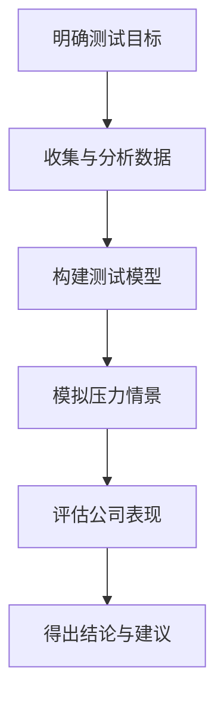
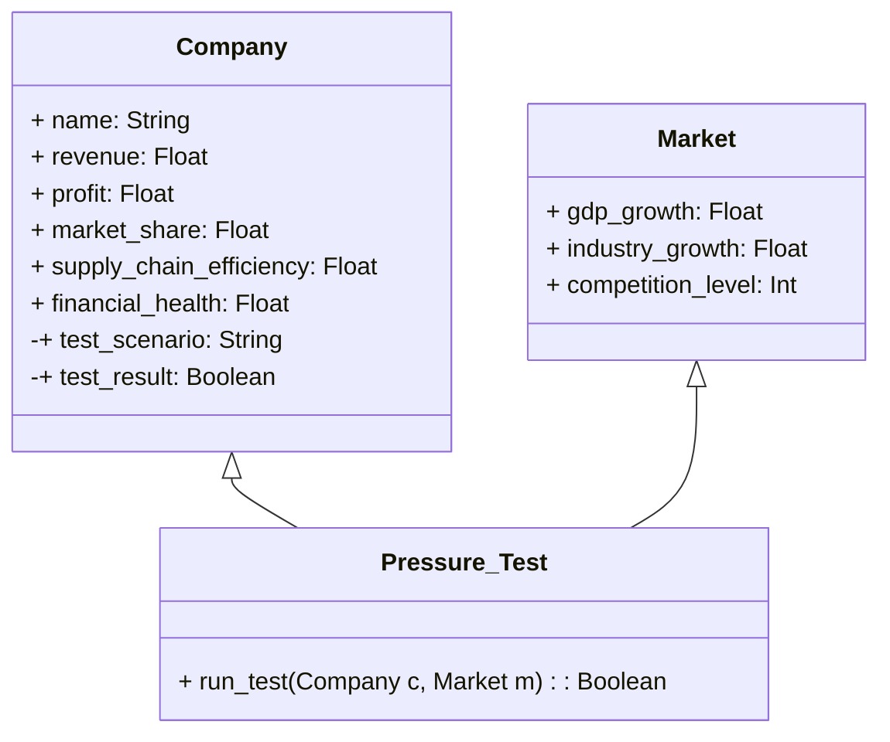
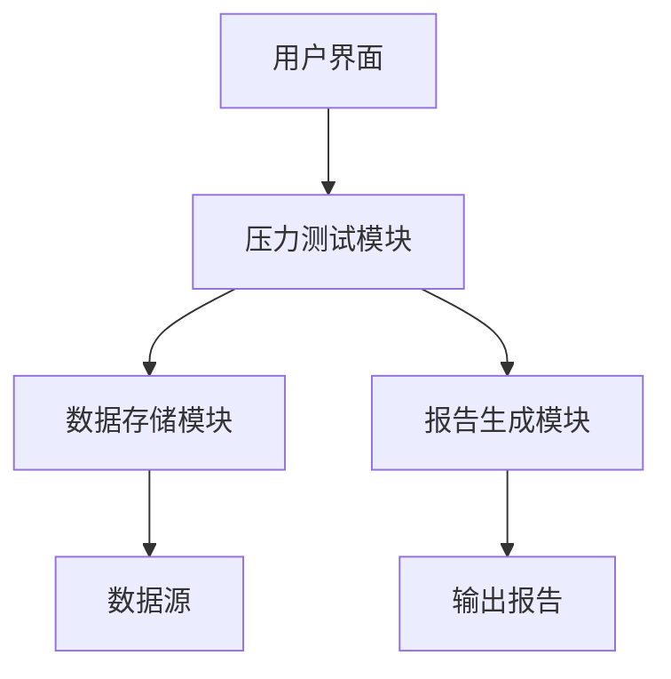
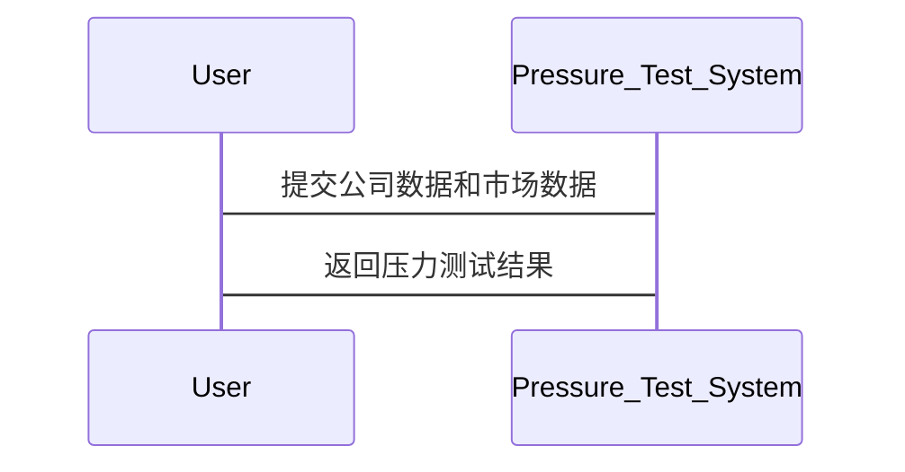

                 


# 彼得林奇对公司商业模式适应性的压力测试方法

> 关键词：公司商业模式、压力测试、彼得·林奇、投资分析、风险管理、企业战略、财务分析

> 摘要：本文系统地探讨了彼得·林奇对公司商业模式适应性压力测试的方法。通过分析商业模式的定义、压力测试的逻辑框架、数学模型的构建以及实际案例的分析，本文旨在帮助投资者和企业更好地理解如何在不同压力情景下评估和优化商业模式。通过结合理论与实践，本文提出了一个完整的压力测试框架，为投资者提供了科学的决策依据。

---

## 第一部分：背景介绍

### 第1章：公司商业模式与压力测试基础

#### 1.1 公司商业模式的定义与特征

##### 1.1.1 公司商业模式的定义

公司商业模式是指企业通过整合资源、价值创造和价值传递的方式，实现盈利和持续发展的商业逻辑。彼得·林奇认为，商业模式是公司成功的核心，它决定了公司在市场中的定位、竞争优势以及盈利能力。

##### 1.1.2 公司商业模式的核心要素

- **客户价值主张**：公司如何满足客户需求并创造价值。
- **资源与能力**：公司拥有的核心资源和竞争优势。
- **收益模式**：公司如何通过产品或服务获得收入。
- **成本结构**：公司运营的主要成本来源。
- **关键业务流程**：实现价值创造的核心业务流程。

##### 1.1.3 公司商业模式的分类与特征对比

| 模式类型 | 特点 | 适用场景 |
|----------|------|----------|
| 产品模式 | 依赖标准化产品，成本固定 | 制造业、零售业 |
| 服务模式 | 依赖个性化服务，成本波动 | 金融服务业、咨询业 |
| 订阅模式 | 依赖长期订阅，收入稳定 | 软件SaaS、媒体订阅 |

#### 1.2 压力测试的定义与作用

##### 1.2.1 压力测试的基本概念

压力测试是一种通过模拟极端市场环境或内部资源限制，评估公司商业模式在不利条件下的适应性和抗风险能力的方法。

##### 1.2.2 压力测试在商业模式分析中的作用

- **识别风险点**：发现商业模式中的潜在问题和脆弱环节。
- **评估抗压能力**：判断公司是否能在极端情况下保持盈利能力。
- **优化商业模式**：通过测试结果调整商业模式，提升其稳健性。

##### 1.2.3 压力测试与公司价值评估的关系

压力测试是公司价值评估的重要环节，通过压力测试可以更全面地评估公司在不同市场环境下的表现，从而为投资决策提供支持。

#### 1.3 彼得·林奇对公司商业模式的分析方法

##### 1.3.1 彼得·林奇的投资者背景与分析风格

彼得·林奇是美国著名投资经理，以其对公司商业模式的深入分析和长期投资策略闻名。他认为，成功的投资取决于对商业模式的理解和对行业趋势的把握。

##### 1.3.2 彼得·林奇对公司商业模式的核心关注点

- **市场需求**：公司是否能满足不断变化的市场需求。
- **竞争优势**：公司是否具有可持续的竞争优势。
- **财务健康**：公司是否具备稳健的财务状况。

##### 1.3.3 彼得·林奇压力测试方法的创新性与实用性

彼得·林奇的压力测试方法结合了定量分析和定性分析，既考虑了财务指标，又考虑了市场趋势和行业竞争格局，具有较高的实用性和创新性。

#### 1.4 本章小结

本章介绍了公司商业模式的定义、核心要素以及压力测试的基本概念和作用。彼得·林奇的分析方法为后续的压力测试框架奠定了基础。

---

## 第二部分：核心概念

### 第2章：公司商业模式适应性压力测试的核心概念

#### 2.1 商业模式适应性压力测试的框架

##### 2.1.1 商业模式适应性压力测试的逻辑框架

压力测试的逻辑框架包括以下几个步骤：

1. **明确测试目标**：确定测试的核心目标，例如评估公司在市场需求下降情况下的盈利能力。
2. **收集与分析数据**：收集公司历史数据和市场数据，分析商业模式的关键要素。
3. **构建测试模型**：根据测试目标构建数学模型，模拟不同压力情景下的公司表现。
4. **得出结论与建议**：根据测试结果提出优化建议，提升公司商业模式的适应性。

##### 2.1.2 测试框架的核心要素与逻辑关系

测试框架的核心要素包括：

- **测试情景**：模拟的市场环境，例如经济衰退、行业竞争加剧等。
- **测试指标**：衡量公司表现的关键指标，例如收入增长率、利润率等。
- **测试结果**：公司在不同情景下的表现评估。

##### 2.1.3 测试框架的适用范围与局限性

- **适用范围**：适用于各种类型的公司和行业。
- **局限性**：测试结果依赖于数据质量和模型假设，存在一定的主观性。

#### 2.2 商业模式适应性压力测试的关键指标

##### 2.2.1 财务指标

- **净利润率**：净利润与营业收入的比率，反映公司的盈利能力。
- **周转率**：存货周转率，反映公司的运营效率。

##### 2.2.2 市场指标

- **市场占有率**：公司在目标市场的份额，反映公司的市场地位。
- **行业增长潜力**：行业未来增长的潜力，反映公司的发展空间。

##### 2.2.3 运营指标

- **客户满意度**：客户对公司的产品或服务的满意度，反映公司客户关系管理能力。
- **员工生产力**：员工的工作效率，反映公司的人力资源管理能力。

#### 2.3 商业模式适应性压力测试的实施步骤

##### 2.3.1 明确测试目标

明确测试目标是压力测试的第一步，需要根据公司的实际情况和投资需求确定测试的核心目标。

##### 2.3.2 收集与分析数据

收集公司历史数据和市场数据，分析商业模式的关键要素，为后续测试提供数据支持。

##### 2.3.3 构建测试模型

根据测试目标构建数学模型，模拟不同压力情景下的公司表现，评估公司在不同情景下的适应性和抗风险能力。

##### 2.3.4 得出结论与建议

根据测试结果提出优化建议，提升公司商业模式的适应性，确保公司在不同市场环境下的稳健发展。

#### 2.4 本章小结

本章详细介绍了商业模式适应性压力测试的核心概念，包括测试框架、关键指标和实施步骤，为后续的压力测试方法奠定了理论基础。

---

## 第三部分：压力测试方法

### 第3章：压力测试方法的数学模型与公式

#### 3.1 财务指标分析模型

##### 3.1.1 财务健康度评估公式

$$
\text{财务健康度} = \frac{\text{净利润}}{\text{总负债}} \times 100
$$

##### 3.1.2 资产负债率分析

$$
\text{资产负债率} = \frac{\text{总负债}}{\text{总资产}} \times 100
$$

#### 3.2 市场指标分析模型

##### 3.2.1 市场占有率分析

$$
\text{市场占有率} = \frac{\text{公司销售额}}{\text{行业总销售额}} \times 100
$$

##### 3.2.2 行业周期分析模型

$$
\text{行业周期阶段} = \text{GDP增长率} \times \text{行业敏感系数}
$$

#### 3.3 运营指标分析模型

##### 3.3.1 运营效率评估公式

$$
\text{运营效率} = \frac{\text{营业收入}}{\text{总资产}} \times 100
$$

##### 3.3.2 供应链稳定性分析

$$
\text{供应链稳定性} = \frac{\text{准时交付率}}{100}
$$

#### 3.4 压力测试算法流程图



#### 3.5 本章小结

本章通过数学模型和公式，详细介绍了压力测试的实施过程，包括财务指标、市场指标和运营指标的分析方法，以及算法流程图的绘制。

---

## 第四部分：系统分析与架构设计

### 第4章：系统分析与架构设计

#### 4.1 问题场景介绍

公司需要在不同市场环境下，评估其商业模式的适应性，以确保在极端情况下仍能保持稳健发展。

#### 4.2 项目介绍

本项目旨在通过构建一个压力测试系统，帮助公司评估其商业模式在不同情景下的表现，优化商业模式，提升公司的抗风险能力。

#### 4.3 系统功能设计

##### 4.3.1 领域模型类图



##### 4.3.2 系统架构图



#### 4.4 系统接口设计

- **输入接口**：接收公司数据和市场数据。
- **输出接口**：生成压力测试报告。

#### 4.5 系统交互序列图



#### 4.6 本章小结

本章通过系统分析与架构设计，展示了如何构建一个完整的压力测试系统，帮助公司评估其商业模式的适应性。

---

## 第五部分：项目实战

### 第5章：项目实战

#### 5.1 环境安装

安装必要的开发工具，包括Python、Jupyter Notebook、Mermaid等。

#### 5.2 系统核心实现源代码

```python
def calculate_financial_health(net_profit, total_liabilities):
    return (net_profit / total_liabilities) * 100

def calculate_market_share(company_sales, industry_sales):
    return (company_sales / industry_sales) * 100

def run_pressure_test(company, market):
    financial_health = calculate_financial_health(company.net_profit, company.total_liabilities)
    market_share = calculate_market_share(company.sales, market.industry_sales)
    return financial_health > 50 and market_share > 20
```

#### 5.3 代码应用解读与分析

上述代码定义了两个关键函数：`calculate_financial_health` 和 `calculate_market_share`，以及一个压力测试函数 `run_pressure_test`。这些函数可以根据公司和市场数据，评估公司的财务健康状况和市场占有率，从而判断公司在压力情景下的表现。

#### 5.4 实际案例分析

以某公司为例，假设其净利润为100万元，总负债为200万元，市场占有率为25%，行业总销售额为1000万元。通过上述函数计算，可以得出：

$$
\text{财务健康度} = \frac{100}{200} \times 100 = 50\%
$$

$$
\text{市场占有率} = \frac{250}{1000} \times 100 = 25\%
$$

压力测试结果为 `True`，表明公司在财务健康和市场占有率方面均表现良好。

#### 5.5 本章小结

本章通过实际案例分析，展示了如何将压力测试方法应用于实际投资分析，帮助投资者和公司更好地理解压力测试的实施过程和应用价值。

---

## 第六部分：总结与展望

### 第6章：总结与展望

#### 6.1 本章总结

本文系统地探讨了彼得·林奇对公司商业模式适应性压力测试的方法，通过数学模型、算法流程图和实际案例分析，展示了如何在不同压力情景下评估和优化商业模式。

#### 6.2 未来展望

未来的研究可以进一步完善压力测试模型，引入更多的市场数据和行业趋势分析，提升压力测试的准确性和实用性。

#### 6.3 最佳实践 tips

- **数据质量**：确保数据的准确性和完整性，是压力测试结果可靠性的关键。
- **模型优化**：根据实际情况不断优化压力测试模型，提升其适用性和准确性。
- **持续监控**：定期进行压力测试，及时发现和解决问题，确保公司商业模式的稳健发展。

#### 6.4 本章小结

本章总结了本文的主要内容，并对未来的研究方向和最佳实践提出了建议，帮助读者更好地理解和应用压力测试方法。

---

## 作者：AI天才研究院/AI Genius Institute & 禅与计算机程序设计艺术 /Zen And The Art of Computer Programming

---

通过以上思考，我们可以看到，彼得·林奇对公司商业模式适应性压力测试方法的系统化分析和实践，为我们提供了一个全面的框架和工具，帮助我们在复杂多变的市场环境中做出更明智的投资决策。

