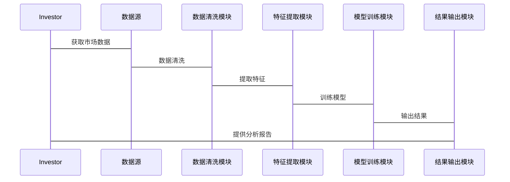

                 


# 彼得林奇对公司商业模式适应性的长期跟踪研究

> 关键词：商业模式、适应性分析、长期跟踪研究、投资策略、彼得林奇方法论

> 摘要：本文探讨了彼得林奇对公司商业模式适应性的长期跟踪研究方法。通过分析商业模式的核心要素、适应性指标、长期跟踪策略以及具体案例，详细阐述了如何通过持续的跟踪研究来评估和优化公司的商业模式。文章结合理论与实践，提供了系统的分析框架和实际操作指南，为投资者和企业管理者提供了有益的参考。

---

# 第一部分: 公司商业模式适应性研究的背景与核心概念

## 第1章: 公司商业模式概述

### 1.1 商业模式的基本定义

#### 1.1.1 商业模式的定义与核心要素

商业模式是企业创造和传递价值的方式，主要包括以下核心要素：

- **价值主张**：企业提供的产品或服务能否满足客户需求。
- **客户关系**：企业如何与客户建立关系并保持客户忠诚度。
- **渠道**：产品或服务通过哪些渠道到达客户。
- **成本结构**：企业运营所需的资源和成本。
- **收入来源**：企业如何获取收入。

#### 1.1.2 商业模式的类型与分类

商业模式的类型多种多样，常见的包括：

- **产品模式**：以产品为核心，通过销售产品获取收入。
- **服务模式**：以服务为核心，通过提供服务获取收入。
- **订阅模式**：通过订阅制获取持续收入。
- **平台模式**：通过搭建平台，连接供需双方，抽取佣金或服务费。

#### 1.1.3 商业模式与公司价值的关系

商业模式直接影响公司的收入来源、成本结构和盈利能力。成功的商业模式能够为企业创造持续的价值，从而提升公司价值。

---

### 1.2 商业模式适应性的定义与重要性

#### 1.2.1 适应性的定义

商业模式的适应性是指企业在不断变化的市场环境中，能够灵活调整其商业模式以应对挑战和抓住机遇的能力。

#### 1.2.2 适应性对企业发展的影响

- **增强企业竞争力**：适应性强的企业能够更好地应对市场变化，抓住新兴机会。
- **降低经营风险**：通过灵活调整商业模式，企业可以减少因市场变化带来的损失。
- **提升盈利能力**：适应性强的企业能够更快地优化收入来源和成本结构。

#### 1.2.3 彼得林奇对商业模式适应性的关注点

彼得林奇在其投资生涯中，非常注重企业商业模式的适应性。他认为，一个优秀的商业模式不仅能够在当前市场环境中生存，还能够在未来可能发生的变化中持续创造价值。

---

## 第2章: 彼得林奇的投资方法论

### 2.1 彼得林奇的投资理念

#### 2.1.1 长期价值投资的核心思想

彼得林奇主张长期价值投资，即通过深入研究企业的商业模式、财务状况和市场环境，选择具有持续增长潜力的企业进行投资。

#### 2.1.2 买入并持有策略

彼得林奇认为，频繁买卖股票会增加交易成本，并分散投资精力。因此，他更倾向于买入优质股票并长期持有。

#### 2.1.3 对公司基本面的深入分析

彼得林奇非常注重对公司基本面的分析，包括收入来源、成本结构、市场地位、竞争优势等。

---

### 2.2 彼得林奇的商业模式分析框架

#### 2.2.1 收入来源与成本结构分析

- **收入来源分析**：研究企业的主要收入来源是否稳定且具有增长潜力。
- **成本结构分析**：评估企业的成本结构是否合理，是否存在可以通过优化降低成本的空间。

#### 2.2.2 市场定位与竞争优势分析

- **市场定位分析**：研究企业在市场中的定位是否清晰，是否能够满足目标客户的需求。
- **竞争优势分析**：评估企业是否具有独特的竞争优势，例如技术优势、品牌优势等。

#### 2.2.3 财务健康状况评估

- **财务健康状况评估**：通过分析企业的财务报表，评估企业的盈利能力、资产负债情况和现金流状况。

---

### 2.3 彼得林奇的长期跟踪研究方法

#### 2.3.1 定量分析与定性分析的结合

- **定量分析**：通过财务指标（如ROE、毛利率、净利率等）进行量化评估。
- **定性分析**：通过研究企业的商业模式、市场环境和管理团队等因素进行非量化评估。

#### 2.3.2 关键指标的持续跟踪

- **收入增长率**：衡量企业的收入增长能力。
- **利润率**：衡量企业的盈利能力。
- **资产负债率**：衡量企业的财务健康状况。

#### 2.3.3 行业趋势与公司战略的匹配度

- **行业趋势分析**：研究行业的发展趋势，评估企业是否能够适应行业变化。
- **公司战略分析**：评估企业的战略规划是否与行业趋势相匹配。

---

## 第3章: 长期跟踪研究的意义与挑战

### 3.1 长期跟踪研究的核心价值

- **识别商业模式的可持续性**：通过长期跟踪，评估企业的商业模式是否具有可持续性。
- **发现潜在风险与机会**：通过长期跟踪，发现企业在经营过程中可能面临的风险和潜在的市场机会。
- **优化投资组合的结构**：通过长期跟踪，优化投资组合的结构，降低投资风险。

### 3.2 长期跟踪研究的挑战

- **数据收集的难度**：需要持续收集企业的财务数据、市场数据和行业数据，数据来源多样且复杂。
- **市场环境的不确定性**：市场环境的变化可能会影响企业的商业模式和经营业绩。
- **企业战略的变化**：企业的战略可能会随着市场变化而调整，增加了长期跟踪的难度。

---

# 第二部分: 彼得林奇长期跟踪研究的系统架构与技术实现

## 第4章: 系统架构与技术实现

### 4.1 系统功能设计

#### 4.1.1 领域模型（Mermaid 类图）

```mermaid
classDiagram
    class Company {
        +name: String
        +revenue: Float
        +cost: Float
        +profit: Float
        +market_share: Float
        +growth_rate: Float
    }
    class Market {
        +size: Float
        +trend: String
        +competition: List(String)
    }
    class Investor {
        +name: String
        +portfolio: List(Company)
        +analysis_report: Report
    }
    Company o Market
    Investor --> Company
```

---

#### 4.1.2 系统架构设计（Mermaid 架构图）

```mermaid
server
    [数据源] --> [数据清洗模块]
    [数据清洗模块] --> [特征提取模块]
    [特征提取模块] --> [模型训练模块]
    [模型训练模块] --> [结果输出模块]
```

---

#### 4.1.3 系统交互设计（Mermaid 序列图）



---

### 4.2 技术实现

#### 4.2.1 数据清洗与特征提取

```python
import pandas as pd

# 数据清洗
data = pd.read_csv('market_data.csv')
data = data.dropna()
data = data[~data['revenue'].isin([0])]

# 特征提取
features = data[['revenue', 'cost', 'profit', 'market_share']]
```

#### 4.2.2 模型训练与评估

```python
from sklearn.ensemble import RandomForestRegressor
from sklearn.metrics import mean_absolute_error

model = RandomForestRegressor(n_estimators=100, random_state=42)
model.fit(features, data['growth_rate'])
```

---

## 第5章: 项目实战与案例分析

### 5.1 项目实战

#### 5.1.1 环境安装

```bash
pip install pandas scikit-learn mermaid
```

---

#### 5.1.2 核心代码实现

```python
import pandas as pd
from sklearn.ensemble import RandomForestRegressor
from sklearn.metrics import mean_absolute_error

# 数据加载与清洗
data = pd.read_csv('market_data.csv')
data = data.dropna()
data = data[~data['revenue'].isin([0])]

# 特征提取
features = data[['revenue', 'cost', 'profit', 'market_share']]
target = data['growth_rate']

# 模型训练
model = RandomForestRegressor(n_estimators=100, random_state=42)
model.fit(features, target)

# 模型评估
预测值 = model.predict(features)
误差 = mean_absolute_error(预测值, target)
print(f"预测误差：{误差}")
```

---

#### 5.1.3 案例分析

以亚马逊为例，分析其商业模式的适应性：

1. **价值主张**：亚马逊通过提供广泛的产品选择和高效的物流服务，满足消费者的需求。
2. **客户关系**：通过会员制（如Prime会员）增强客户忠诚度。
3. **渠道**：亚马逊通过自有网站和第三方卖家平台进行销售。
4. **成本结构**：亚马逊通过规模效应和自动化技术降低运营成本。
5. **收入来源**：亚马逊的主要收入来源包括商品销售、订阅服务和云服务（AWS）。

---

## 第6章: 总结与展望

### 6.1 总结

通过彼得林奇的长期跟踪研究方法，我们可以更好地理解企业商业模式的适应性，为投资决策提供有力支持。

### 6.2 最佳实践 tips

- **持续学习**：保持对市场变化的敏感性，及时调整分析框架。
- **数据驱动**：利用数据分析工具和技术，提高研究的效率和准确性。
- **案例研究**：通过实际案例分析，不断优化分析方法和策略。

### 6.3 注意事项

- **数据质量**：确保数据的准确性和完整性。
- **模型选择**：根据具体问题选择合适的模型和算法。
- **风险控制**：在实际操作中，注意控制投资风险。

### 6.4 拓展阅读

- 彼得林奇的《彼得林奇的成功投资》
- 《商业模式画布》

---

# 作者：AI天才研究院/AI Genius Institute & 禅与计算机程序设计艺术 /Zen And The Art of Computer Programming

---

通过以上内容，我们系统地介绍了彼得林奇对公司商业模式适应性的长期跟踪研究方法，并通过实际案例分析和系统设计，展示了如何将理论应用于实践。希望这篇文章能够为投资者和企业管理者提供有价值的参考。

