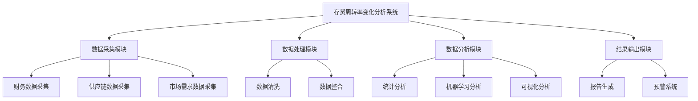

                 


```markdown
# 彼得林奇对公司存货周转率变化的深度分析

> 关键词：存货周转率、彼得林奇、投资分析、财务指标、企业绩效、供应链管理

> 摘要：本文深入分析了彼得·林奇对公司存货周转率变化的洞察，探讨了存货周转率对企业财务健康和投资决策的影响。通过理论分析、算法原理、系统设计和实际案例，本文揭示了存货周转率变化的核心要素及其对企业绩效的多维度影响。

---

## 第一部分: 背景介绍与核心概念

### 第1章: 存货周转率的定义与重要性

#### 1.1 存货周转率的定义
- **1.1.1 存货周转率的基本定义**
  存货周转率是衡量企业存货管理效率的重要指标，反映了企业在一定时期内存货的周转速度。公式为：  
  $$\text{存货周转率} = \frac{\text{营业成本}}{\text{平均存货}}$$  
  存货周转率越高，说明存货管理效率越高，资金占用越少。

- **1.1.2 存货周转率的计算公式**
  存货周转率的计算需要结合企业的财务报表数据，具体包括营业成本（COGS）和存货数据。通过计算存货周转率，可以评估企业的库存管理效率和资金使用效率。

- **1.1.3 存货周转率的行业差异**
  不同行业的存货周转率存在显著差异。例如，零售行业通常存货周转率较高，而制造业存货周转率可能较低。行业基准是分析存货周转率的重要参考。

#### 1.2 存货周转率的重要性
- **1.2.1 存货周转率对企业财务健康的影响**
  存货周转率高表明企业库存管理高效，资金占用少，财务健康状况良好。反之，存货周转率低可能导致资金链紧张，财务风险增加。

- **1.2.2 存货周转率与企业绩效的关系**
  存货周转率与企业绩效密切相关。高存货周转率通常意味着企业运营效率高，管理能力强，从而提升企业绩效。

- **1.2.3 存货周转率对投资决策的意义**
  投资者通过分析存货周转率，可以评估企业的库存管理能力和运营效率，从而做出更明智的投资决策。

### 第2章: 存货周转率变化的背景与问题描述

#### 2.1 存货周转率变化的背景
- **2.1.1 经济周期对存货周转率的影响**
  经济周期波动会影响市场需求和企业库存管理。在经济衰退期间，企业可能减少库存，降低存货周转率；而在经济繁荣时期，企业可能增加库存，提高存货周转率。

- **2.1.2 行业特点对存货周转率的影响**
  不同行业的存货周转率差异显著。例如，快消品行业通常存货周转率较高，而重工业存货周转率可能较低。行业特点直接影响存货周转率的变化。

- **2.1.3 企业经营策略对存货周转率的影响**
  企业的经营策略，如以销定产或以产定销，会直接影响存货周转率。高效的经营策略可以显著提升存货周转率。

#### 2.2 存货周转率变化的问题描述
- **2.2.1 存货周转率过低的潜在问题**
  存货周转率过低可能导致库存积压、资金占用过多、运营效率低下等问题。企业需要通过优化库存管理和供应链管理来解决这些问题。

- **2.2.2 存货周转率过高的潜在问题**
  存货周转率过高可能导致库存不足、无法满足市场需求、客户满意度下降等问题。企业需要通过合理预测需求和优化供应链来平衡存货周转率。

- **2.2.3 存货周转率波动对企业的影响**
  存货周转率的波动反映了企业库存管理的不稳定性和不确定性。企业需要通过数据分析和预测模型来减少存货周转率的波动。

### 第3章: 存货周转率变化的边界与外延

#### 3.1 存货周转率变化的边界
- **3.1.1 行业基准的边界**
  存货周转率的行业基准是分析存货周转率的重要参考。企业需要结合行业基准来评估自身的存货周转率水平。

- **3.1.2 企业规模的边界**
  企业规模影响存货周转率的变化。大型企业通常存货周转率较低，而小型企业存货周转率可能较高。企业规模是分析存货周转率的重要因素。

- **3.1.3 经济环境的边界**
  经济环境的变化直接影响市场需求和企业库存管理。企业需要根据经济环境的变化调整存货周转率目标。

#### 3.2 存货周转率变化的外延
- **3.2.1 相关财务指标的联动效应**
  存货周转率与其他财务指标，如营业利润率、净利率等密切相关。分析存货周转率的变化需要结合其他财务指标进行综合评估。

- **3.2.2 供应链管理的影响**
  供应链管理是影响存货周转率的重要因素。优化供应链管理可以显著提升存货周转率，降低库存成本。

- **3.2.3 市场需求变化的影响**
  市场需求变化直接影响存货周转率。企业需要根据市场需求变化调整库存策略，优化存货周转率。

---

## 第二部分: 核心概念与联系

### 第4章: 存货周转率变化的核心要素

#### 4.1 存货周转率的核心要素
- **4.1.1 存货的构成与分类**
  存货包括原材料、在制品和产成品。不同类型的存货对存货周转率的影响不同，企业需要根据不同类型的存货进行分类管理。

- **4.1.2 销售与采购的动态平衡**
  销售与采购是影响存货周转率的关键因素。企业需要通过销售预测和采购计划，实现销售与采购的动态平衡，优化存货周转率。

- **4.1.3 仓储与物流的效率**
  仓储与物流效率直接影响存货周转率。企业需要通过优化仓储管理和物流配送，提升存货周转率。

#### 4.2 存货周转率变化的关键驱动因素
- **4.2.1 市场需求变化**
  市场需求变化直接影响存货周转率。企业需要根据市场需求变化调整库存策略，优化存货周转率。

- **4.2.2 供应链管理效率**
  供应链管理效率是影响存货周转率的重要因素。企业需要通过优化供应链管理，提升存货周转率。

- **4.2.3 企业内部管理**
  企业内部管理，如库存管理、采购管理、销售管理等，直接影响存货周转率。企业需要通过优化内部管理，提升存货周转率。

---

## 第三部分: 算法原理与系统分析

### 第5章: 存货周转率变化的算法原理

#### 5.1 存货周转率变化的算法原理
- **5.1.1 存货周转率的计算模型**
  存货周转率的计算模型包括营业成本和平均存货。企业需要通过财务报表数据计算存货周转率，并结合行业基准进行评估。

- **5.1.2 存货周转率变化的预测模型**
  通过时间序列分析、回归分析等方法，企业可以预测存货周转率的变化趋势，制定相应的库存管理策略。

- **5.1.3 存货周转率变化的影响因素分析**
  通过因子分析等方法，企业可以识别影响存货周转率变化的关键因素，优化库存管理策略。

#### 5.2 存货周转率变化的系统架构



---

## 第四部分: 项目实战与总结

### 第6章: 存货周转率变化的项目实战

#### 6.1 项目背景与目标
- **6.1.1 项目背景**
  本文以某零售企业为例，分析存货周转率变化的影响因素，优化库存管理策略。

- **6.1.2 项目目标**
  通过分析存货周转率变化，优化库存管理策略，提升企业运营效率。

#### 6.2 项目实施步骤
- **6.2.1 数据采集**
  收集企业的财务数据、供应链数据和市场需求数据。

- **6.2.2 数据处理**
  对数据进行清洗和整合，确保数据质量。

- **6.2.3 数据分析**
  使用统计分析和机器学习方法，分析存货周转率变化的影响因素。

- **6.2.4 结果解读**
  根据分析结果，优化库存管理策略，提升存货周转率。

#### 6.3 项目小结
- **6.3.1 核心发现**
  存货周转率变化的关键因素包括市场需求变化、供应链管理效率和企业内部管理。

- **6.3.2 投资建议**
  投资者应关注企业的存货周转率变化，选择存货周转率稳定的优质企业进行投资。

---

## 第五部分: 总结与展望

### 第7章: 总结与展望

#### 7.1 总结
- 存货周转率是衡量企业存货管理效率的重要指标，直接影响企业的财务健康和投资价值。

- 通过分析存货周转率变化，企业可以优化库存管理策略，提升运营效率。

- 投资者应关注存货周转率变化，选择存货周转率稳定的优质企业进行投资。

#### 7.2 展望
- 随着大数据和人工智能技术的发展，存货周转率分析将更加精准和高效。

- 未来，企业可以通过智能化的库存管理系统，实时监控存货周转率，优化库存管理策略。

---

## 作者：AI天才研究院 & 禅与计算机程序设计艺术

---

通过本文的分析，我们深入探讨了彼得·林奇对公司存货周转率变化的洞察，揭示了存货周转率对企业财务健康和投资决策的重要影响。希望本文能为投资者和企业管理者提供有价值的参考和启示。
```

