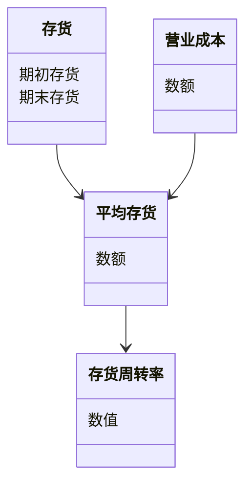
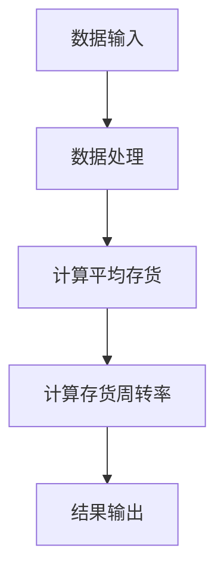

                 


# 彼得林奇对公司存货周转率的分析

## 关键词：彼得林奇，存货周转率，投资分析，财务指标，企业运营

## 摘要：  
本文深入探讨了彼得林奇如何分析公司存货周转率，并将其作为投资决策的重要依据。通过分析存货周转率的定义、计算方法、行业差异及其与企业财务状况的关系，本文揭示了彼得林奇如何利用这一指标来评估公司的运营效率和投资价值。结合实际案例和数学模型，本文详细解读了存货周转率在投资分析中的应用，为投资者提供了实用的分析框架和投资建议。

---

# 第一部分: 背景介绍

## 第1章: 核心概念与问题背景

### 1.1 存货周转率的基本概念

#### 1.1.1 存货周转率的定义
存货周转率是衡量公司存货管理效率的重要指标，反映了公司在一定时期内存货的周转速度。简单来说，存货周转率越高，说明公司存货管理效率越高，资金利用效率也越高。

#### 1.1.2 存货周转率的计算公式
存货周转率的计算公式如下：
$$ \text{存货周转率} = \frac{\text{营业成本}}{\text{平均存货}} $$

其中，营业成本是公司在一定时期内销售产品的成本，平均存货是公司存货在一定时期内的平均值。

#### 1.1.3 存货周转率的行业差异
不同行业的存货周转率存在显著差异。例如，零售业和制造业的存货周转率通常较高，而一些周期性较强的行业（如房地产行业）存货周转率可能较低。

### 1.2 存货周转率与企业运营的关系

#### 1.2.1 存货周转率对企业财务状况的影响
存货周转率直接影响企业的财务状况。高存货周转率意味着企业能够快速将存货转化为销售，从而减少库存积压和资金占用，提高资金使用效率。

#### 1.2.2 存货周转率与企业供应链管理的关系
存货周转率还与企业的供应链管理密切相关。高效的供应链管理能够降低存货周转时间，提高存货周转率，从而优化企业的运营效率。

#### 1.2.3 存货周转率与企业盈利能力的关联
存货周转率与企业的盈利能力密切相关。高存货周转率通常意味着企业能够快速销售产品，从而提高利润率和净利润。

---

## 第2章: 彼得林奇的投资理念与分析框架

### 2.1 彼得林奇的投资哲学

#### 2.1.1 价值投资的核心理念
彼得林奇是价值投资的代表人物之一，他主张以低于内在价值的价格买入优质股票，并长期持有。他认为，投资的核心在于找到那些具有持续竞争优势和良好管理团队的企业。

#### 2.1.2 彼得林奇的投资策略
彼得林奇的投资策略主要包括以下几点：
1. **长期投资**：避免频繁交易，降低交易成本。
2. **分散投资**：通过分散投资降低风险。
3. **基本面分析**：通过分析企业的财务状况、行业地位和管理团队来评估其投资价值。

#### 2.1.3 彼得林奇的选股标准
彼得林奇选股的核心标准包括：
1. 企业的财务状况健康。
2. 企业的盈利能力稳定且持续。
3. 企业的管理团队优秀且稳定。

### 2.2 彼得林奇存货周转率分析框架

#### 2.2.1 存货周转率在彼得林奇分析体系中的地位
存货周转率是彼得林奇分析企业财务状况的重要指标之一。他认为，存货周转率能够反映企业的运营效率和管理能力，从而影响企业的盈利能力。

#### 2.2.2 彼得林奇存货周转率分析的理论基础
彼得林奇认为，存货周转率的高低取决于企业的供应链管理能力、市场需求和行业特点。他强调，投资者需要结合企业的行业特点和市场环境来分析存货周转率。

#### 2.2.3 彼得林奇存货周转率分析的实践案例
彼得林奇在分析某公司时，首先计算其存货周转率：
$$ \text{存货周转率} = \frac{\text{营业成本}}{\text{平均存货}} $$

假设某公司某年的营业成本为 $1000 万元，平均存货为 $500 万元，则其存货周转率为：
$$ \text{存货周转率} = \frac{1000}{500} = 2 $$

这意味着该公司在该年度内将存货周转了两次，显示出较高的存货管理效率。

---

# 第二部分: 核心概念与联系

## 第3章: 存货周转率的数学模型与公式

### 3.1 存货周转率的计算公式

#### 3.1.1 存货周转率的定义公式
存货周转率的定义公式为：
$$ \text{存货周转率} = \frac{\text{营业成本}}{\text{平均存货}} $$

#### 3.1.2 存货周转率的其他变体公式
存货周转率还可以表示为：
$$ \text{存货周转率} = \frac{\text{销售成本}}{\text{平均存货}} $$

---

## 第4章: 彼得林奇存货周转率分析的数学模型

### 4.1 存货周转率与企业利润的关系

#### 4.1.1 净利润公式
净利润的计算公式为：
$$ \text{净利润} = \text{营业收入} - \text{营业成本} - \text{其他费用} $$

彼得林奇认为，存货周转率的高低直接影响营业成本，从而影响净利润。因此，存货周转率是评估企业盈利能力的重要指标。

### 4.2 存货周转率与企业现金流的关系

#### 4.2.1 现金流公式
现金流的计算公式为：
$$ \text{现金流} = \text{营业收入} - \text{存货增加} - \text{应收账款增加} $$

彼得林奇认为，存货周转率的提高能够减少存货积压，从而增加现金流，改善企业的财务状况。

---

## 第5章: 存货周转率的算法原理

### 5.1 存货周转率的计算步骤

#### 5.1.1 数据收集
需要收集企业的营业成本和存货数据。

#### 5.1.2 数据处理
计算企业的平均存货：
$$ \text{平均存货} = \frac{\text{期初存货} + \text{期末存货}}{2} $$

#### 5.1.3 数据计算
计算存货周转率：
$$ \text{存货周转率} = \frac{\text{营业成本}}{\text{平均存货}} $$

#### 5.1.4 结果分析
根据存货周转率的数值，分析企业的存货管理效率。

---

## 第6章: 彼得林奇存货周转率分析的算法流程

### 6.1 数据收集
收集企业的财务报表数据，包括营业成本和存货。

### 6.2 计算平均存货
$$ \text{平均存货} = \frac{\text{期初存货} + \text{期末存货}}{2} $$

### 6.3 计算存货周转率
$$ \text{存货周转率} = \frac{\text{营业成本}}{\text{平均存货}} $$

### 6.4 分析结果
根据存货周转率的数值，评估企业的存货管理效率和投资价值。

---

## 第7章: 彼得林奇存货周转率分析的Python实现

### 7.1 环境安装
需要安装Python和相关库（如pandas、numpy）。

### 7.2 核心代码实现

```python
import pandas as pd

# 示例数据
data = {
    '营业收入': [1000, 1200, 1500],
    '营业成本': [600, 700, 800],
    '期初存货': [500, 600, 700],
    '期末存货': [600, 700, 800]
}

df = pd.DataFrame(data)

# 计算平均存货
df['平均存货'] = (df['期初存货'] + df['期末存货']) / 2

# 计算存货周转率
df['存货周转率'] = df['营业成本'] / df['平均存货']

print(df)
```

### 7.3 代码解读与分析
上述代码通过Python程序计算了存货周转率，并展示了如何通过编程实现这一分析过程。程序首先读取数据，计算平均存货，然后计算存货周转率，最后输出结果。

---

## 第8章: 彼得林奇存货周转率分析的系统架构设计

### 8.1 领域模型


### 8.2 系统架构


---

## 第9章: 项目实战

### 9.1 案例分析
假设我们分析一家公司的存货周转率：
- 营业成本：$1000 万元
- 期初存货：$500 万元
- 期末存货：$600 万元

计算平均存货：
$$ \text{平均存货} = \frac{500 + 600}{2} = 550 \text{万元} $$

计算存货周转率：
$$ \text{存货周转率} = \frac{1000}{550} \approx 1.818 $$

---

## 第10章: 总结与展望

### 10.1 总结
本文深入分析了彼得林奇如何利用存货周转率进行投资分析，并展示了如何通过数学模型和编程实现这一过程。存货周转率是评估企业存货管理效率和投资价值的重要指标。

### 10.2 投资建议
投资者在进行投资决策时，应综合考虑存货周转率、企业盈利能力、行业特点和市场环境等因素，以做出科学的投资决策。

### 10.3 注意事项
- 存货周转率的分析需要结合企业的行业特点和市场环境。
- 投资者应避免单独依赖存货周转率进行投资决策。

### 10.4 拓展阅读
建议读者进一步阅读彼得林奇的《彼得林奇选股法则》和《彼得林奇投资二十-five律》等书籍，以深入理解其投资理念和分析方法。

---

## 作者：AI天才研究院/AI Genius Institute & 禅与计算机程序设计艺术 /Zen And The Art of Computer Programming

---

以上是完整的文章大纲和内容，希望对您有所帮助！

