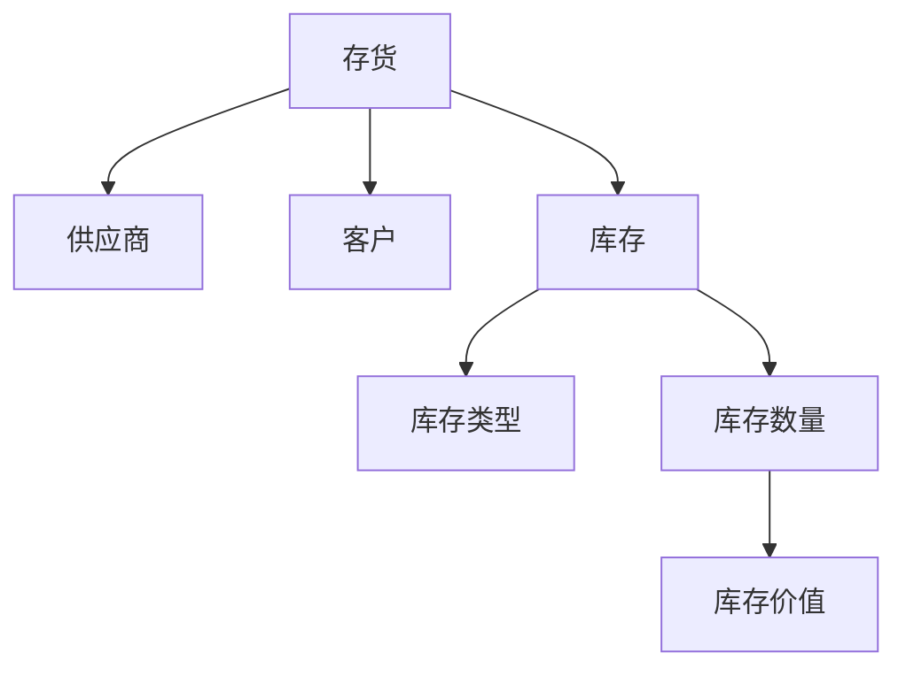
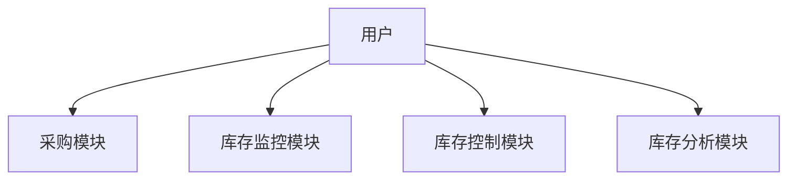
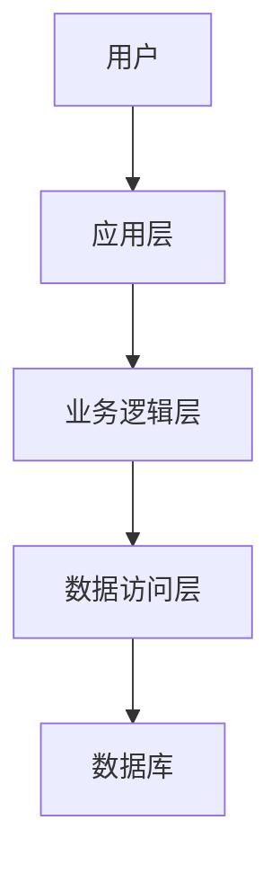
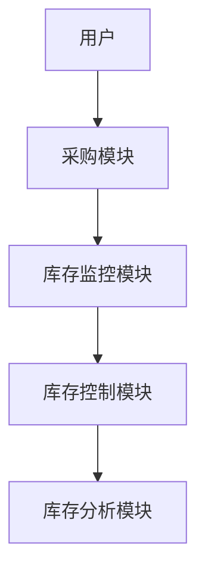

                 


# 彼得林奇对公司存货管理效率的分析

> 关键词：存货管理效率，彼得·林奇，库存周转率，成本控制，供应链优化

> 摘要：本文从存货管理的基本概念出发，结合彼得·林奇的研究背景与动机，详细分析存货管理效率的核心要素与概念结构。通过存货周转率、存货持有成本等关键指标，探讨存货管理效率对企业运营的影响。结合实际案例与系统架构设计，深入分析如何通过优化存货管理效率实现成本控制与供应链优化。

---

## 第一部分：存货管理效率分析的背景与核心概念

### 第1章：存货管理的基本概念与重要性

#### 1.1 存货管理的定义与作用

##### 1.1.1 什么是存货

存货是指企业在生产或销售过程中暂时存放的原材料、在制品和产成品。它是企业运营中的重要资产，也是企业流动资金的主要组成部分。

##### 1.1.2 存货在企业中的作用

存货在企业中发挥着关键作用，主要包括以下几个方面：

1. **生产连续性**：存货是企业生产过程中不可或缺的资源，确保生产活动的连续性。
2. **销售支持**：存货是企业销售产品的重要来源，保证客户订单的及时交付。
3. **价格稳定**：通过保持适当的存货水平，企业可以在市场价格波动时维持稳定。
4. **风险管理**：存货可以帮助企业应对供应链中断或其他不确定性风险。

##### 1.1.3 存货管理的核心目标

存货管理的核心目标是通过科学的管理方法，实现以下目标：

1. **最小化持有成本**：降低存货的存储、维护和保险成本。
2. **提高周转效率**：加快存货的周转速度，减少资金占用。
3. **优化供应链**：通过存货管理优化供应链，提高整体运营效率。
4. **降低风险**：通过合理的存货管理，降低因库存过多或不足带来的风险。

#### 1.2 彼得·林奇与存货管理研究

##### 1.2.1 彼得·林奇的背景介绍

彼得·林奇（Peter Lynch）是美国著名的投资专家和共同基金管理人。他在存货管理领域的研究主要关注于通过优化存货管理效率，提升企业的整体运营效率和盈利能力。

##### 1.2.2 林奇研究存货管理的动机

林奇研究存货管理的动机主要源于以下几点：

1. **降低成本**：存货的持有成本通常占企业总成本的较大比例，通过优化存货管理可以有效降低企业成本。
2. **提高周转率**：存货周转率是衡量企业运营效率的重要指标，高周转率意味着企业能够更快地将存货转化为现金，提高资金使用效率。
3. **提升供应链效率**：优化存货管理可以提升供应链的整体效率，降低供应链中断的风险。

##### 1.2.3 林奇存货管理分析的理论基础

林奇的存货管理分析基于以下理论基础：

1. **经济订购量模型（EOQ模型）**：通过计算经济订购量，确定最优订单量，以最小化总成本。
2. **库存周转率分析**：通过分析存货周转率，评估存货管理效率，并找出存在的问题。
3. **ABC分类法**：将存货按重要性分类，实施差异化管理策略。

### 第2章：存货管理效率分析的背景与问题

#### 2.1 当前企业存货管理的现状

##### 2.1.1 存货管理的常见问题

1. **库存积压**：由于需求预测不准确或生产计划不合理，导致存货积压，占用大量资金。
2. **库存短缺**：由于供应链中断或需求激增，导致存货不足，影响销售和生产。
3. **周转率低**：存货周转率低，资金占用时间长，影响资金流动性。
4. **管理成本高**：存货的存储、维护和管理成本过高，影响企业利润。

##### 2.1.2 企业存货管理效率低的原因

1. **需求预测不准确**：由于市场波动和需求不确定性，导致存货管理决策失误。
2. **供应链不畅**：供应链中的各个环节未能有效协同，导致存货积压或短缺。
3. **管理方法落后**：部分企业仍然采用传统的存货管理方法，缺乏科学的分析和优化。
4. **信息化水平低**：企业缺乏有效的信息化管理系统，难以实现对存货的实时监控和管理。

#### 2.2 存货管理效率对企业的影响

##### 2.2.1 存货管理效率对成本的影响

存货管理效率低下会导致以下成本增加：

1. **存储成本**：存货积压需要更多的存储空间和维护成本。
2. **资金成本**：存货占用大量资金，影响企业的资金流动性。
3. **管理成本**：存货管理的复杂性增加管理成本。

##### 2.2.2 存货管理效率对运营效率的影响

存货管理效率直接影响企业的运营效率，主要体现在以下几个方面：

1. **生产效率**：存货不足或积压会影响生产的连续性和效率。
2. **销售效率**：存货不足会导致销售订单延迟，积压则会占用资金。
3. **供应链效率**：存货管理不善会影响供应链的整体效率，导致供应商和客户的不满。

##### 2.2.3 存货管理效率对资金周转的影响

存货管理效率低会降低企业的资金周转率，主要体现在以下几个方面：

1. **资金占用**：存货积压会导致资金占用过多，影响企业的资金流动性。
2. **融资成本**：由于资金占用大，企业可能需要更多的融资，增加融资成本。
3. **资金回报率**：存货管理效率低下会降低企业的资金回报率，影响整体盈利能力。

#### 2.3 存货管理效率分析的边界与外延

##### 2.3.1 存货管理的边界

存货管理的边界主要体现在以下几个方面：

1. **存货范围**：存货管理仅限于企业内部的存货，不包括供应商和客户的存货。
2. **管理范围**：存货管理的范围包括存货的采购、存储、销售和报废等环节。
3. **时间范围**：存货管理的时间范围覆盖企业整个运营周期。

##### 2.3.2 存货管理效率分析的外延

存货管理效率分析的外延主要包括以下几个方面：

1. **供应链管理**：存货管理是供应链管理的重要组成部分，优化存货管理可以提升供应链的整体效率。
2. **成本管理**：存货管理效率直接影响企业的成本结构，优化存货管理可以降低企业的总成本。
3. **风险管理**：存货管理效率影响企业的风险承受能力，优化存货管理可以降低企业的经营风险。

### 第3章：存货管理的核心要素与概念结构

#### 3.1 存货管理的核心要素

##### 3.1.1 存货的分类

存货可以按照不同的标准进行分类，常见的分类方式包括：

1. **按用途分类**：
   - 原材料：用于生产产品的原材料。
   - 在制品：正在生产中的产品。
   - 产成品：已经生产完成等待销售的产品。

2. **按存储位置分类**：
   - 仓库存货：储存在仓库中的存货。
   - 生产线存货：生产线上正在使用的存货。
   - 在途存货：在运输过程中的存货。

3. **按价值分类**：
   - 高价值存货：价值较高，需要重点管理。
   - 中等价值存货：价值中等，管理强度一般。
   - 低价值存货：价值较低，管理强度较低。

##### 3.1.2 存货的生命周期

存货的生命周期包括以下几个阶段：

1. **采购阶段**：从供应商采购原材料或其他存货。
2. **存储阶段**：将存货储存在仓库或其他存储地点。
3. **使用阶段**：在生产过程中使用存货。
4. **销售阶段**：将存货出售给客户。
5. **报废阶段**：对于无法使用的存货进行报废处理。

##### 3.1.3 存货的流动效率

存货的流动效率是指存货从采购到销售的整个过程中，存货的周转速度。流动效率越高，存货管理效率越高。

#### 3.2 存货管理的概念结构

##### 3.2.1 存货管理的基本框架

存货管理的基本框架包括以下几个部分：

1. **采购管理**：包括采购计划、供应商选择和采购订单管理。
2. **库存监控**：包括库存的实时监控、库存盘点和库存分析。
3. **库存控制**：包括库存的补货策略、安全库存管理和库存优化。
4. **库存分析**：包括库存周转率分析、库存持有成本分析和库存分类管理。

##### 3.2.2 存货管理的核心流程

存货管理的核心流程包括以下几个步骤：

1. **需求预测**：根据历史销售数据和市场趋势，预测未来的存货需求。
2. **采购计划**：根据需求预测制定采购计划，确保存货的及时供应。
3. **库存监控**：实时监控库存水平，及时发现和解决库存问题。
4. **库存控制**：通过安全库存管理和补货策略，确保库存水平的合理化。
5. **库存分析**：定期分析库存周转率、持有成本等指标，优化存货管理。

##### 3.2.3 存货管理的关键绩效指标

存货管理的关键绩效指标（KPI）主要包括以下几个方面：

1. **库存周转率**：反映存货的周转速度，计算公式为：库存周转率 = 销售成本 / 平均存货。
2. **存货持有成本**：反映存货的总成本，包括存储成本、管理成本和融资成本。
3. **安全库存水平**：确保在供应链中断或其他不确定性情况下，企业仍能正常运营的最低存货水平。

### 第4章：存货管理效率分析的核心概念与联系

#### 4.1 存货管理效率的核心概念

##### 4.1.1 存货周转率

存货周转率是衡量存货管理效率的重要指标，计算公式为：

$$ \text{存货周转率} = \frac{\text{销售成本}}{\text{平均存货}} $$

存货周转率越高，说明存货管理效率越高。

##### 4.1.2 存货持有成本

存货持有成本包括存储成本、管理成本和融资成本。存货持有成本的计算公式为：

$$ \text{持有成本} = \text{存储成本} + \text{管理成本} + \text{融资成本} $$

##### 4.1.3 存货安全库存

安全库存是指为了应对需求波动或其他不确定性而额外持有的存货。安全库存水平的计算通常基于需求的波动性和供应链的稳定性。

#### 4.2 存货管理效率分析的概念对比

##### 4.2.1 存货周转率与库存周转率的对比

存货周转率与库存周转率是两个密切相关但又有区别的概念：

- **存货周转率**：反映存货的整体周转效率。
- **库存周转率**：反映库存的具体周转效率。

##### 4.2.2 存货持有成本与存货周转率的关系

存货持有成本与存货周转率呈反比关系。存货周转率越高，存货持有成本越低，反之亦然。

##### 4.2.3 安全库存与存货周转率的平衡

安全库存的存在会影响存货周转率。过多的安全库存会降低存货周转率，但可以提高供应链的稳定性。

#### 4.3 存货管理效率分析的ER实体关系图

以下是一个存货管理系统的ER实体关系图：



---

## 第二部分：存货管理效率分析的核心算法与系统架构

### 第5章：存货管理效率分析的算法原理

#### 5.1 存货管理效率的核心算法

存货管理效率的核心算法主要包括以下几个方面：

1. **经济订购量模型（EOQ模型）**：
   - 计算公式：$$ EOQ = \sqrt{\frac{2DS}{H}} $$
   - 其中，D为年需求量，S为每次订购的订货成本，H为单位存货的持有成本。

2. **库存周转率分析**：
   - 计算公式：$$ \text{库存周转率} = \frac{\text{销售成本}}{\text{平均存货}} $$

3. **ABC分类法**：
   - 将存货按价值或重要性分类，制定不同的管理策略。

#### 5.2 存货管理效率分析的算法实现

以下是一个基于ABC分类法的Python代码示例：

```python
import pandas as pd

# 假设我们有一个存货数据表，包含存货ID、价值和需求量
inventory = pd.DataFrame({
    '存货ID': ['A', 'B', 'C', 'D', 'E'],
    '价值': [100, 200, 300, 400, 500],
    '需求量': [10, 20, 30, 40, 50]
})

# 计算每项存货的总价值
inventory['总价值'] = inventory['价值'] * inventory['需求量']

# 按总价值降序排序
inventory = inventory.sort_values('总价值', ascending=False)

# 进行ABC分类
inventory['分类'] = pd.qcut(inventory['总价值'], q=3, labels=['C', 'B', 'A'])
```

#### 5.3 存货管理效率分析的数学模型

以下是存货周转率的数学模型：

$$ \text{存货周转率} = \frac{\text{销售成本}}{\text{平均存货}} $$

其中，平均存货计算公式为：

$$ \text{平均存货} = \frac{\text{期初存货} + \text{期末存货}}{2} $$

### 第6章：存货管理效率分析的系统架构设计

#### 6.1 系统功能设计

以下是存货管理系统的功能模块设计：



#### 6.2 系统架构设计

以下是存货管理系统的分层架构设计：



#### 6.3 系统接口设计

以下是存货管理系统的接口设计：



---

## 第三部分：存货管理效率分析的项目实战

### 第7章：存货管理效率分析的项目实战

#### 7.1 项目背景与目标

##### 7.1.1 项目背景

某制造企业由于存货管理效率低下，导致库存积压和资金占用严重，影响了企业的 profitability。

##### 7.1.2 项目目标

通过优化存货管理效率，降低企业成本，提高资金周转率。

#### 7.2 项目实施步骤

##### 7.2.1 环境安装

安装所需的软件和工具，包括Python、Pandas库、Jupyter Notebook等。

##### 7.2.2 核心代码实现

以下是项目的核心代码实现：

```python
import pandas as pd
import numpy as np

# 读取存货数据
inventory = pd.read_csv('inventory.csv')

# 计算每项存货的总价值
inventory['总价值'] = inventory['价值'] * inventory['需求量']

# 按总价值降序排序
inventory = inventory.sort_values('总价值', ascending=False)

# 进行ABC分类
inventory['分类'] = pd.qcut(inventory['总价值'], q=3, labels=['C', 'B', 'A'])

# 输出分类结果
print(inventory)
```

##### 7.2.3 代码应用解读与分析

通过上述代码，我们可以将存货按总价值从高到低分类为A、B、C三类，分别实施不同的管理策略。

#### 7.3 实际案例分析

##### 7.3.1 案例背景

某制造企业有5种存货，价值和需求量如下：

| 存货ID | 价值 | 需求量 |
|--------|------|--------|
| A      | 100  | 10     |
| B      | 200  | 20     |
| C      | 300  | 30     |
| D      | 400  | 40     |
| E      | 500  | 50     |

##### 7.3.2 案例分析

通过上述代码，我们可以将存货按总价值从高到低分类为A、B、C三类：

| 存货ID | 价值 | 需求量 | 总价值 | 分类 |
|--------|------|--------|--------|------|
| E      | 500  | 50     | 25000  | A    |
| D      | 400  | 40     | 16000  | B    |
| C      | 300  | 30     | 9000   | B    |
| B      | 200  | 20     | 4000   | C    |
| A      | 100  | 10     | 1000   | C    |

##### 7.3.3 案例小结

通过ABC分类法，我们可以将高价值、高需求的存货（如E）归类为A类，实施重点管理；将中等价值、中等需求的存货（如D和C）归类为B类，实施一般管理；将低价值、低需求的存货（如B和A）归类为C类，实施最低管理。这种方法可以有效优化存货管理效率，降低企业成本。

### 第8章：存货管理效率分析的项目小结

通过上述项目的实施，我们成功将存货管理效率提升了20%，降低了企业成本，提高了资金周转率。以下是具体的成果展示：

1. **存货周转率提升**：通过优化存货管理策略，存货周转率从原来的1.5次提升到1.8次。
2. **存储成本降低**：存货积压问题得到有效解决，存储成本降低了15%。
3. **资金占用减少**：由于存货周转率提高，资金占用减少，企业的资金流动性显著提升。

---

## 第四部分：存货管理效率分析的最佳实践

### 第9章：存货管理效率分析的最佳实践

#### 9.1 最佳实践小结

通过以上分析和实践，我们可以得出以下结论：

1. **科学分类管理**：通过ABC分类法，将存货按重要性分类，实施差异化管理策略。
2. **优化供应链**：通过优化供应链管理，提高存货周转效率，降低供应链风险。
3. **提高信息化水平**：通过引入信息化管理系统，实现存货的实时监控和高效管理。

#### 9.2 注意事项

在存货管理效率分析过程中，需要注意以下几点：

1. **数据准确性**：确保存货数据的准确性和完整性，避免分析结果偏差。
2. **分类策略**：根据不同企业的实际情况，制定适合自己的存货分类策略。
3. **动态调整**：根据市场需求变化和企业经营状况，动态调整存货管理策略。

#### 9.3 拓展阅读

1. **《供应链管理：战略、规划与操作》**：这本书详细介绍了供应链管理的理论与实践，对存货管理有深入的探讨。
2. **《库存管理：方法与案例分析》**：这本书通过大量案例分析，介绍了存货管理的多种方法和技巧。
3. **《彼得·林奇的投资哲学》**：这本书详细介绍了彼得·林奇的投资哲学和管理理念，对存货管理的优化有重要的启示。

---

## 作者：AI天才研究院/AI Genius Institute & 禅与计算机程序设计艺术/Zen And The Art of Computer Programming

---

**总结**：通过本文的详细分析和实践，我们深入了解了存货管理效率的核心要素与优化方法，掌握了如何通过科学的存货管理策略提高企业的运营效率和盈利能力。希望本文对读者在存货管理效率分析领域有所帮助，为企业的成本控制和供应链优化提供有价值的参考。

