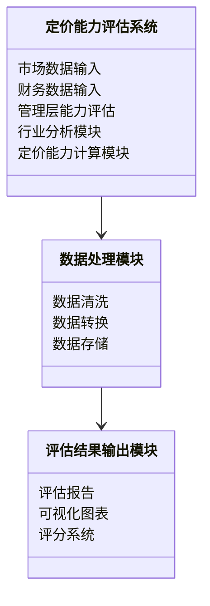
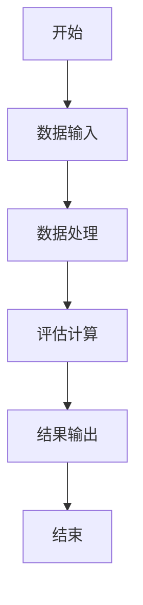

                 


# 彼得林奇对公司定价能力的评估标准

## 关键词：定价能力，彼得·林奇，投资评估，企业价值，系统架构

## 摘要：本文深入分析了彼得·林奇对公司定价能力的评估标准，从定价能力的核心概念、关键要素、定量与定性评估指标，到系统架构与算法实现，再到实战案例分析，全面阐述了如何通过定价能力评估来判断企业的投资价值。

---

# 第一部分: 定价能力评估的背景与重要性

## 第1章: 定价能力的核心概念

### 1.1 定价能力的定义与背景

#### 1.1.1 定价能力的定义

定价能力是指企业在市场中对其产品或服务制定合理价格，并通过价格策略实现利润最大化的能力。它不仅涉及成本控制、市场需求分析，还包括竞争对手的价格策略和市场定位。

#### 1.1.2 定价能力在企业中的重要性

定价能力是企业核心竞争力之一，直接影响企业的利润、市场份额和长期发展。通过有效的定价策略，企业可以在激烈的市场竞争中占据优势。

#### 1.1.3 定价能力与企业价值的关系

定价能力直接影响企业的收入和利润，进而影响企业的市场价值。通过合理定价，企业可以实现资产回报率（ROA）和股东权益收益率（ROE）的提升。

---

### 1.2 彼得·林奇的投资理念

#### 1.2.1 彼得·林奇的投资者视角

彼得·林奇是全球著名投资家，他强调基本面分析和长期投资。他认为，定价能力是判断企业投资价值的重要指标之一。

#### 1.2.2 林奇对定价能力的重视

林奇认为，定价能力强的企业能够通过合理的价格策略获取超额利润，从而为股东创造更大的价值。

#### 1.2.3 定价能力在投资决策中的作用

在投资决策中，定价能力是评估企业盈利能力的重要指标。通过分析企业的定价策略，投资者可以判断其在行业中的竞争力和长期发展潜力。

---

## 第2章: 定价能力的关键要素

### 2.1 定价能力的核心要素

#### 2.1.1 产品竞争力

产品竞争力是定价能力的基础。只有具有竞争力的产品，企业才能在市场中制定合理的高价策略。

#### 2.1.2 市场地位

市场地位决定了企业在市场中的定价话语权。行业领导者通常具有更强的定价能力。

#### 2.1.3 成本控制能力

成本控制是定价能力的重要支撑。通过有效的成本管理，企业可以在价格竞争中保持优势。

### 2.2 彼得·林奇的评估维度

#### 2.2.1 市场定价权

林奇认为，市场定价权是定价能力的核心。企业是否能够制定高于行业平均水平的价格，是判断其定价能力的重要标准。

#### 2.2.2 盈利能力稳定性

盈利能力稳定性反映了企业在不同市场环境下的定价能力。稳定的盈利能力表明企业能够通过定价策略应对市场波动。

#### 2.2.3 行业周期影响

林奇强调，行业周期对定价能力的影响不可忽视。企业在行业景气周期中的定价能力通常更强。

### 2.3 定价能力与企业竞争力的关系

#### 2.3.1 定价能力对企业利润的影响

定价能力直接影响企业的利润水平。通过合理定价，企业可以实现利润最大化。

#### 2.3.2 定价能力与市场份额的关系

定价能力强的企业通常能够占据更大的市场份额，从而巩固其市场地位。

#### 2.3.3 定价能力与企业抗风险能力

在市场波动中，定价能力强的企业能够更好地应对风险，保持稳定的盈利能力。

---

## 第3章: 定价能力的评估标准

### 3.1 定价能力的定量评估标准

#### 3.1.1 市盈率（P/E）

市盈率是衡量企业定价能力的重要指标。通过比较行业平均水平，可以判断企业的定价能力。

公式：$$ P/E = \frac{股票价格}{每股收益} $$

#### 3.1.2 市净率（P/B）

市净率反映了企业的资产定价能力。低于行业平均水平的企业通常具有更大的定价空间。

公式：$$ P/B = \frac{股票价格}{每股净资产} $$

#### 3.1.3 股息率

股息率反映了企业的盈利能力。高股息率通常意味着企业具有较强的定价能力。

公式：$$ 股息率 = \frac{每股股息}{股票价格} $$

### 3.2 定价能力的定性评估标准

#### 3.2.1 产品差异化能力

产品差异化能力是定价能力的重要支撑。独特的产品可以支撑更高的价格。

#### 3.2.2 市场领导地位

市场领导地位表明企业在行业中具有定价话语权。

#### 3.2.3 管理层能力

管理层的决策能力和战略眼光直接影响企业的定价能力。

### 3.3 林奇的特殊评估指标

#### 3.3.1 股东权益收益率（ROE）

ROE反映了企业的盈利能力。高于行业平均水平的企业通常具有更强的定价能力。

公式：$$ ROE = \frac{净利润}{股东权益} $$

#### 3.3.2 资产回报率（ROA）

ROA是衡量企业资产使用效率的重要指标。高ROA表明企业具有更强的定价能力。

公式：$$ ROA = \frac{净利润}{总资产} $$

#### 3.3.3 资本支出回报率（ROCE）

ROCE反映了企业的资本使用效率。高ROCE表明企业具有更强的定价能力。

公式：$$ ROCE = \frac{净利润}{资本支出} $$

---

## 第4章: 定价能力的系统分析与架构

### 4.1 系统分析框架

#### 4.1.1 问题场景介绍

本文将从企业定价能力的系统分析入手，构建一个完整的定价能力评估系统。

#### 4.1.2 系统功能设计（领域模型）



#### 4.1.3 系统架构设计


### 4.2 算法原理讲解

#### 4.2.1 定价能力评估算法流程



---

# 第二部分: 定价能力评估的实战应用

## 第5章: 定价能力评估的实战案例

### 5.1 案例背景介绍

以微软公司为例，分析其定价能力的评估过程。

### 5.2 数据采集与处理

#### 5.2.1 数据源

从微软的财务报表、市场数据等获取相关数据。

#### 5.2.2 数据清洗与转换

对数据进行清洗和转换，确保数据的准确性和一致性。

### 5.3 定价能力评估

#### 5.3.1 定量评估

计算微软的市盈率、市净率等指标。

#### 5.3.2 定性评估

分析微软的产品竞争力、市场地位等。

### 5.4 结果分析与解读

结合定量和定性评估结果，判断微软的定价能力。

### 5.5 案例总结

微软作为行业领导者，其定价能力较强，具有较高的投资价值。

---

## 第6章: 定价能力评估系统的实现

### 6.1 系统核心实现

#### 6.1.1 数据采集模块

实现市场数据和财务数据的采集功能。

#### 6.1.2 数据分析模块

实现定价能力的定量和定性评估。

#### 6.1.3 评估结果模块

生成评估报告和可视化图表。

### 6.2 代码实现

```python
import pandas as pd
import numpy as np

def calculate_roe(net_profit, shareholders_equity):
    return net_profit / shareholders_equity

data = pd.read_csv('company_data.csv')
data['ROE'] = calculate_roe(data['净利润'], data['股东权益'])
```

---

## 第7章: 总结与展望

### 7.1 总结

本文从定价能力的核心概念、评估标准、系统架构和实战案例等多个方面，全面分析了彼得·林奇的定价能力评估方法。

### 7.2 展望

未来，随着人工智能和大数据技术的发展，定价能力评估将更加精准和高效。

### 7.3 最佳实践 tips

- 投资者应结合定量和定性指标，全面评估企业的定价能力。
- 定期更新评估模型，以应对市场变化。

---

## 作者：AI天才研究院 & 禅与计算机程序设计艺术

---

本文通过系统化的分析和实战案例，深入探讨了彼得·林奇对公司定价能力的评估标准，为投资者和企业管理者提供了宝贵的参考。希望本文能帮助读者更好地理解定价能力的重要性，并在实际中灵活运用这些评估标准。

