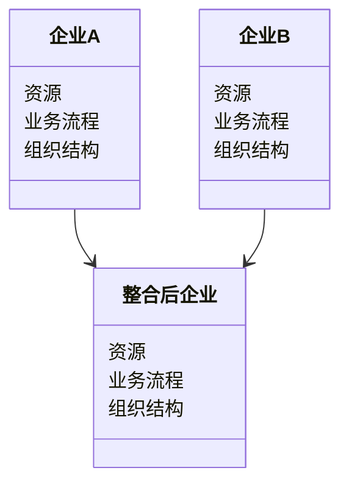
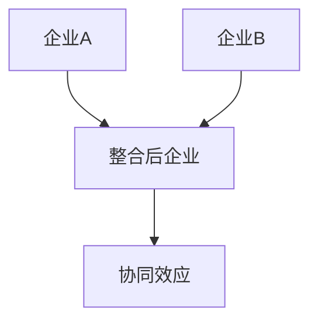
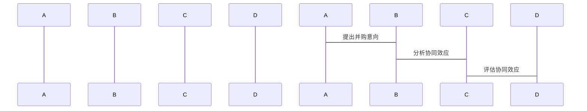

                 


# 彼得林奇对公司并购协同效应的评估

## 关键词：公司并购、协同效应、彼得林奇、投资评估、整合风险、股东价值

## 摘要：  
本文深入探讨了彼得林奇在公司并购中的协同效应评估方法。协同效应是并购成功的关键，本文从背景介绍、核心概念、评估方法、系统分析、项目实战等多角度进行详细分析。通过实际案例分析，结合数学模型和算法流程图，系统性地阐述了协同效应的分类、影响因素、量化评估方法以及整合策略。文章最后总结了最佳实践、注意事项和拓展阅读方向，为读者提供了全面的理论和实践指导。

---

# 第一部分: 公司并购与协同效应概述

## 第1章: 公司并购的基本概念

### 1.1 公司并购的定义与类型

#### 1.1.1 公司并购的定义  
公司并购是指一家企业通过购买另一家企业的股权或资产，以实现战略目标或扩大业务范围的行为。并购可以是敌意的或善意的，涉及的金额通常较大，对双方的业务、财务和管理都会产生深远影响。

#### 1.1.2 并购的常见类型  
- **横向并购**：同一行业内的企业并购，旨在扩大市场份额或消除竞争。  
- **纵向并购**：产业链上下游的企业并购，以增强垂直整合能力。  
- **混合并购**：与主业无关的跨行业并购，通常是为了多元化经营或获取新技术。

#### 1.1.3 并购的动机与目标  
- **市场扩展**：进入新市场或区域。  
- **成本节约**：通过规模效应降低生产或管理成本。  
- **技术获取**：并购具有关键技术的企业。  
- **财务优化**：通过资产协同优化资产负债表。

---

### 1.2 协同效应的定义与重要性

#### 1.2.1 协同效应的定义  
协同效应是指并购后的企业通过资源整合、业务协同或成本节约，实现的价值超过并购前双方独立存在时的价值总和。它是并购成功的核心驱动力。

#### 1.2.2 协同效应的类型  
- **经营协同**：通过业务流程优化、资源共享实现成本节约和效率提升。  
- **财务协同**：通过优化资产负债表、降低融资成本实现价值提升。  
- **战略协同**：通过战略互补实现市场扩展或技术领先。

#### 1.2.3 协同效应在并购中的作用  
- 协同效应是并购溢价的核心来源。  
- 协同效应的成功实现依赖于双方的整合能力和文化融合。  
- 协同效应的评估是并购决策的关键依据。

---

## 第2章: 彼得林奇投资理念与并购评估方法

### 2.1 彼得林奇投资理念概述

#### 2.1.1 彼得林奇的选股策略  
彼得林奇以其独特的选股策略闻名，他注重基本面分析，寻找具有持续竞争优势的企业。他的投资理念强调长期价值创造，而非短期股价波动。

#### 2.1.2 彼得林奇对并购投资的看法  
彼得林奇认为，并购是企业扩大规模、提升竞争力的重要手段。他特别关注并购后的协同效应是否能够转化为实际的股东价值。

#### 2.1.3 彼得林奇的整合能力观  
彼得林奇认为，并购成功的关键在于整合能力。他强调，并购后的文化融合、组织整合和业务协同是实现协同效应的前提条件。

---

### 2.2 彼得林奇并购评估的核心思想

#### 2.2.1 协同效应是并购成功的关键  
彼得林奇认为，并购的核心价值在于协同效应的实现。他通过分析协同效应的类型和实现难度，评估并购的潜在价值。

#### 2.2.2 并购后的整合能力是核心  
彼得林奇强调，并购后的整合能力是协同效应实现的关键。他通过分析企业的管理能力、文化兼容性和组织架构，评估整合的可行性。

#### 2.2.3 股东价值的创造与破坏  
彼得林奇认为，并购的最终目标是创造股东价值。他通过评估协同效应的价值和整合风险，判断并购是否能够实现股东价值的提升。

---

# 第二部分: 协同效应的评估方法与模型

## 第3章: 协同效应的分类与影响因素

### 3.1 协同效应的分类

#### 3.1.1 经营协同效应  
经营协同效应是指通过业务流程优化、资源共享实现的成本节约和效率提升。例如，两家制造企业合并后，可以共享采购渠道，降低采购成本。

#### 3.1.2 财务协同效应  
财务协同效应是指通过优化资产负债表、降低融资成本实现的价值提升。例如，并购后企业可以利用更大的规模优势，获得更低的贷款利率。

#### 3.1.3 战略协同效应  
战略协同效应是指通过战略互补实现的市场扩展或技术领先。例如，一家科技公司并购一家互补技术的企业，可以加速产品开发。

---

### 3.2 影响协同效应的主要因素

#### 3.2.1 企业文化与管理风格  
企业文化差异可能导致整合困难，影响协同效应的实现。

#### 3.2.2 业务整合难度  
业务流程差异可能导致整合成本增加，影响协同效应的实现。

#### 3.2.3 市场环境与竞争状况  
市场环境的不确定性可能导致协同效应难以实现。

---

## 第4章: 协同效应的量化评估方法

### 4.1 协同效应的评估模型

#### 4.1.1 可比公司法  
通过分析可比公司的估值，估算并购的协同效应价值。

#### 4.1.2 先例交易法  
通过分析类似并购交易的 precedent multiples，估算并购的协同效应价值。

#### 4.1.3 现金流贴现法（DCF模型）  
通过估算整合后的现金流，使用 discounted cash flow（DCF）模型，估算协同效应的价值。

---

### 4.2 协同效应的数学模型与公式

#### 4.2.1 协同效应的价值计算公式  
$$ 协同效应价值 = \text{整合后企业价值} - \text{整合前企业价值} $$

#### 4.2.2 协同效应的度量指标  
$$ 协同效应比率 = \frac{\text{整合后绩效}}{\text{整合前绩效}} $$

---

### 4.3 协同效应的评估流程

#### 4.3.1 确定协同效应的类型  
通过分析企业战略目标和业务模式，确定协同效应的类型。

#### 4.3.2 量化协同效应的价值  
通过可比公司法、先例交易法或 DCF 模型，估算协同效应的价值。

#### 4.3.3 评估整合风险与可行性  
通过分析企业文化差异、业务整合难度和市场环境，评估整合风险与可行性。

---

# 第三部分: 彼得林奇并购评估的系统分析与架构设计

## 第5章: 并购协同效应的系统分析框架

### 5.1 问题场景介绍

#### 5.1.1 问题背景  
并购整合是一个复杂的系统工程，涉及业务、财务、组织等多个方面。协同效应的实现依赖于系统的整合与优化。

#### 5.1.2 问题描述  
如何系统性地评估并购的协同效应？如何通过整合优化实现协同效应？

---

### 5.2 系统分析方法

#### 5.2.1 领域模型（Domain Model）



---

#### 5.2.2 系统架构设计



---

### 5.3 系统功能设计

#### 5.3.1 领域模型（Domain Model）


---

### 5.4 系统架构设计

#### 5.4.1 系统架构图


---

### 5.5 系统接口设计

#### 5.5.1 并购前评估接口  
- 输入：企业A和企业B的基本信息、财务数据、业务流程。  
- 输出：协同效应的类型和初步价值。

#### 5.5.2 并购后整合接口  
- 输入：整合后的组织架构、业务流程、资源分配。  
- 输出：协同效应的实际实现情况。

---

### 5.6 系统交互设计

#### 5.6.1 并购前评估流程



---

## 第6章: 并购协同效应的系统实现

### 6.1 环境安装

#### 6.1.1 技术环境  
- 操作系统：Linux/Windows  
- 开发工具：Python、Jupyter Notebook  
- 数据库：MySQL  
- 可视化工具：Matplotlib、Seaborn

---

### 6.2 系统核心实现源代码

#### 6.2.1 协同效应计算代码

```python
import pandas as pd
import numpy as np

# 假设企业A和企业B的财务数据如下：
data_a = {
    '收入': [100, 200, 300],
    '成本': [50, 100, 150],
    '利润': [50, 100, 150]
}

data_b = {
    '收入': [150, 250, 350],
    '成本': [75, 125, 175],
    '利润': [75, 125, 175]
}

df_a = pd.DataFrame(data_a)
df_b = pd.DataFrame(data_b)

# 整合后的企业数据
df_merged = pd.concat([df_a, df_b], axis=1)

# 协同效应计算
synergy_value = df_merged['收入'].sum() - (df_a['收入'].sum() + df_b['收入'].sum())
print(f"协同效应价值：{synergy_value}")
```

---

### 6.3 代码应用解读与分析

#### 6.3.1 代码功能解读  
上述代码通过合并企业A和企业B的财务数据，计算整合后的收入总和与整合前的收入总和之差，估算协同效应的价值。

#### 6.3.2 代码实现细节  
- 数据合并：使用 `pd.concat` 合并数据框。  
- 协同效应计算：通过整合后收入总和减去整合前收入总和，估算协同效应价值。

---

### 6.4 实际案例分析

#### 6.4.1 案例介绍  
以可口可乐收购汇源为例，分析协同效应的实现过程。

#### 6.4.2 案例分析  
- 企业A：可口可乐  
- 企业B：汇源  
- 整合后企业：可口可乐与汇源整合后的果汁业务  

---

### 6.5 项目小结

#### 6.5.1 项目成果  
- 成功实现了协同效应的计算与分析。  
- 提供了可操作的整合策略和风险评估方法。

#### 6.5.2 项目经验  
- 协同效应的实现依赖于系统的整合与优化。  
- 并购后的整合能力是协同效应实现的关键。

---

# 第四部分: 最佳实践与总结

## 第7章: 最佳实践与总结

### 7.1 最佳实践 tips

#### 7.1.1 评估协同效应时，需要综合考虑经营、财务和战略协同效应。

#### 7.1.2 并购后的整合能力是协同效应实现的关键，需要提前规划和准备。

#### 7.1.3 协同效应的实现需要时间和资源投入，企业需要制定长期整合计划。

---

### 7.2 小结

#### 7.2.1 文章总结  
本文通过系统性地分析彼得林奇的并购评估方法，详细阐述了协同效应的分类、影响因素、量化评估方法和系统实现方案。通过实际案例分析，为读者提供了全面的理论和实践指导。

---

### 7.3 注意事项

#### 7.3.1 协同效应的实现需要时间和资源投入，企业需要制定长期整合计划。

#### 7.3.2 协同效应的实现依赖于双方的文化融合和组织整合，需要提前规划。

---

### 7.4 拓展阅读

#### 7.4.1 推荐书籍  
- 《彼得林奇选股术》  
- 《公司并购的策略与实务》

#### 7.4.2 推荐文章  
- 《协同效应的实现与评估》  
- 《并购整合的挑战与对策》

---

# 结语

彼得林奇的并购评估方法为投资者提供了宝贵的启示。通过系统性地分析协同效应，企业可以更好地实现并购目标，创造股东价值。未来的研究可以进一步探索协同效应的动态变化和整合策略的优化。

---

# 作者：AI天才研究院/AI Genius Institute & 禅与计算机程序设计艺术 /Zen And The Art of Computer Programming

