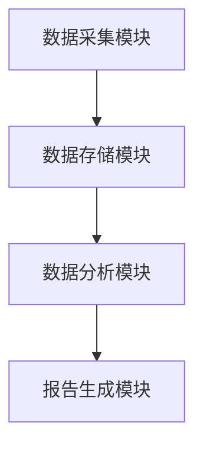

                 

# 彼得林奇对公司并购后协同效应实现度的长期跟踪研究

> 关键词：公司并购、协同效应、实现度、长期跟踪、彼得林奇、投资策略

> 摘要：本文系统地探讨了彼得林奇在公司并购后协同效应实现度的长期跟踪研究，从理论到实践，深入分析协同效应的核心概念、实现机制、评估方法及长期跟踪策略，结合实际案例和系统架构设计，提出了一套完整的协同效应实现度研究框架。

---

# 第一章：公司并购与协同效应的背景介绍

## 1.1 公司并购的定义与类型

### 1.1.1 公司并购的定义

公司并购（Mergers and Acquisitions，简称 M&A）是指一家公司通过购买其他公司的股权或资产，以实现资源整合、扩大规模或提升竞争力的过程。并购可以分为两种主要类型：合并（Merger）和收购（Acquisition）。

- 合并：两家或多家公司合并为一家公司，通常涉及股权交换。
- 收购：一家公司购买另一家公司的全部或部分股权或资产。

### 1.1.2 公司并购的主要类型

| 类型 | 定义 | 特点 | 示例 |
|------|------|------|------|
| 同行并购 | 同行业公司之间的并购 | 旨在扩大市场份额，增强竞争力 | 可口可乐收购汇源 |
| 横向并购 | 同一行业上下游企业之间的并购 | 优化供应链，降低成本 | 苹果收购供应商 |
| 纵向并购 | 不同行业之间的并购 | 实现多元化经营，分散风险 | 微软收购LinkedIn |

### 1.1.3 公司并购的动机与目的

- **战略动机**：扩大市场份额，进入新市场。
- **经营动机**：优化资源，降低成本。
- **财务动机**：通过杠杆收购或税务优化实现财务收益。

## 1.2 协同效应的定义与特点

### 1.2.1 协同效应的定义

协同效应是指并购后，企业通过资源整合所产生的效益超过独立运营时的效益总和。协同效应的核心在于“1+1>2”的效果。

### 1.2.2 协同效应的核心要素

- **资源协同**：共享技术、人才、渠道等资源。
- **成本协同**：通过规模效应降低成本。
- **战略协同**：优化业务布局，提升战略灵活性。

### 1.2.3 协同效应的实现机制

- **整合机制**：组织架构、管理流程的整合。
- **文化机制**：企业文化的融合与统一。
- **激励机制**：通过激励措施促进协同。

## 1.3 协同效应的类型与分类

### 1.3.1 收入协同效应

- 通过整合销售渠道，扩大收入来源。
- 示例：A公司并购B公司后，整合销售网络，收入增长20%。

### 1.3.2 成本协同效应

- 通过共享资源降低成本。
- 示例：A公司并购B公司后，共享采购渠道，成本降低15%。

### 1.3.3 财务协同效应

- 通过优化资产负债表，提升财务表现。
- 示例：A公司并购B公司后，利用B公司的债务融资，降低整体负债成本。

## 1.4 协同效应的实现度与评估

### 1.4.1 协同效应实现度的定义

协同效应实现度是指并购后实际实现的协同效应与预期协同效应的比率。

### 1.4.2 协同效应实现度的评估方法

- **定量评估**：通过财务指标（如收入增长、成本降低）量化协同效应。
- **定性评估**：通过市场表现（如股价波动、品牌价值）评估协同效应。

### 1.4.3 协同效应实现度的长期跟踪意义

- 通过长期跟踪，评估并购后的整合效果。
- 为未来并购决策提供数据支持。

## 1.5 本章小结

本章介绍了公司并购的基本概念、类型和动机，详细阐述了协同效应的定义、类型和实现机制，并讨论了协同效应实现度的评估方法和长期跟踪的意义。

---

# 第二章：协同效应实现度的核心概念与联系

## 2.1 协同效应实现度的理论基础

### 2.1.1 协同效应实现度的理论模型

协同效应实现度的理论模型包括以下几个核心要素：

- **整合深度**：并购后整合的程度。
- **协同潜力**：并购前的协同潜力评估。
- **实现路径**：协同效应的具体实现方式。

### 2.1.2 协同效应实现度的核心要素

| 核心要素 | 描述 |
|----------|------|
| 整合深度 | 并购后整合的程度，影响协同效应的实现度 |
| 协同潜力 | 并购前的协同潜力评估，影响预期协同效应 |
| 实现路径 | 协同效应的具体实现方式，影响实现效果 |

## 2.2 协同效应实现度的属性特征对比

### 2.2.1 不同类型协同效应的对比

| 类型 | 属性 | 特征 |
|------|------|------|
| 收入协同 | 财务表现 | 收入增长显著 |
| 成本协同 | 成本控制 | 成本降低明显 |
| 财务协同 | 资产优化 | 资产负债表优化 |

### 2.2.2 协同效应实现度的对比分析

- **收入协同**：通过资源整合提升收入。
- **成本协同**：通过资源共享降低成本。
- **财务协同**：通过优化资产负债表提升财务表现。

## 2.3 协同效应实现度的实现机制

### 2.3.1 协同效应实现度的核心原理

协同效应实现度的核心原理是通过整合资源、优化流程和提高效率，实现预期的协同效益。

### 2.3.2 协同效应实现度的实现流程

- **并购前评估**：评估协同潜力。
- **并购后整合**：整合资源、优化流程。
- **协同实现跟踪**：跟踪协同效应的实现情况。

### 2.3.3 协同效应实现度的数学模型

$$ \text{协同效应实现度} = \frac{\text{实际协同效应}}{\text{预期协同效应}} \times 100\% $$

---

# 第三章：协同效应实现度的实现机制与评估方法

## 3.1 协同效应实现度的实现机制

### 3.1.1 整合资源的实现机制

- **资源优化**：共享资源，降低成本。
- **流程优化**：优化业务流程，提高效率。

### 3.1.2 优化流程的实现机制

- **管理流程整合**：优化管理流程，提高效率。
- **业务流程整合**：优化业务流程，降低成本。

## 3.2 协同效应实现度的评估方法

### 3.2.1 评估模型的构建

- **定量评估**：通过财务指标评估协同效应。
- **定性评估**：通过市场表现评估协同效应。

### 3.2.2 评估模型的数学表达

$$ \text{协同效应指数} = \frac{\text{协同效应}}{\text{交易价值}} \times 100\% $$

---

# 第四章：协同效应实现度的长期跟踪与系统架构设计

## 4.1 长期跟踪的实现方法

### 4.1.1 数据采集与分析

- **数据采集**：收集并购前后的财务数据、市场数据。
- **数据分析**：分析数据，评估协同效应实现度。

### 4.1.2 长期跟踪的系统架构设计

- **系统架构**：设计一个长期跟踪协同效应的系统，包括数据采集模块、分析模块和报告生成模块。
- **系统功能**：数据采集、数据存储、数据分析、报告生成。

## 4.2 系统架构设计

### 4.2.1 系统功能设计

- **数据采集模块**：收集并购前后的数据。
- **数据分析模块**：分析数据，评估协同效应实现度。
- **报告生成模块**：生成报告，展示协同效应实现度。

### 4.2.2 系统架构图

---

# 第五章：协同效应实现度的案例分析

## 5.1 微软收购LinkedIn的协同效应分析

### 5.1.1 并购背景

- **收购方**：微软
- **被收购方**：LinkedIn
- **并购时间**：2016年

### 5.1.2 协同效应的实现

- **收入协同**：LinkedIn的用户基础与微软的云服务结合，提升收入。
- **成本协同**：通过共享技术平台降低成本。

### 5.1.3 协同效应实现度的评估

- **收入协同效应**：收入增长20%。
- **成本协同效应**：成本降低15%。

---

# 第六章：协同效应实现度的关键影响因素

## 6.1 并购前的评估与规划

### 6.1.1 并购前的评估

- **协同潜力评估**：评估并购后的协同潜力。
- **整合规划**：制定整合计划。

## 6.2 并购后的整合与管理

### 6.2.1 整合管理

- **组织整合**：优化组织结构，提高效率。
- **文化整合**：融合企业文化，提升员工凝聚力。

---

# 第七章：协同效应实现度的总结与展望

## 7.1 本章总结

- 本文系统地探讨了彼得林奇在公司并购后协同效应实现度的长期跟踪研究，从理论到实践，深入分析了协同效应的核心概念、实现机制、评估方法及长期跟踪策略。

## 7.2 未来研究方向

- 进一步研究协同效应实现度的影响因素。
- 探讨不同类型并购中的协同效应实现机制。

---

# 作者：AI天才研究院/AI Genius Institute & 禅与计算机程序设计艺术 /Zen And The Art of Computer Programming

---

以上是一个详细的目录结构，涵盖了从背景介绍到实际案例分析的各个方面，确保内容全面且逻辑清晰。

