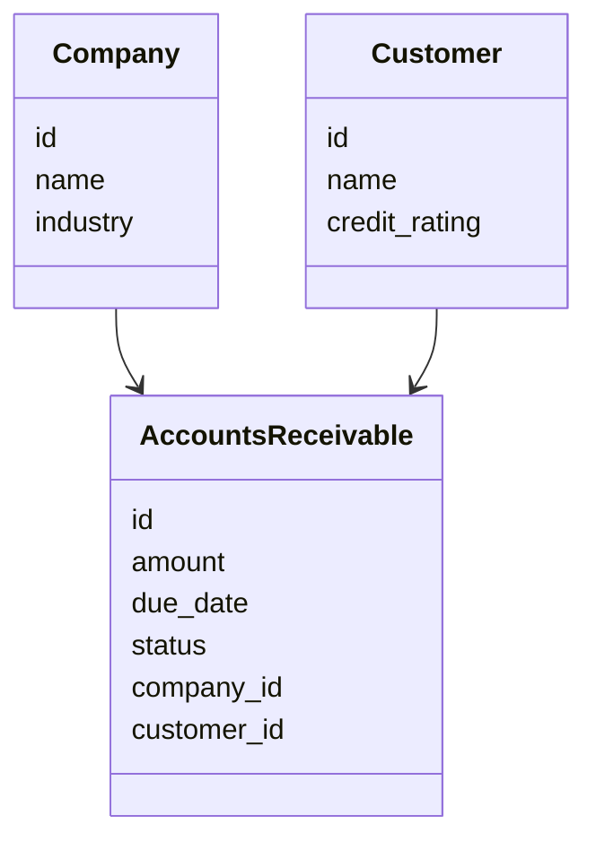

                 


# 彼得林奇对公司应收账款周转率变化的深入分析

> 关键词：彼得林奇，应收账款周转率，财务分析，企业风险管理，投资策略

> 摘要：本文深入探讨了彼得林奇对上市公司应收账款周转率变化的分析方法，从基本概念、核心原理、系统架构、项目实战等多个维度展开，结合实际案例，详细分析了应收账款周转率变化对企业财务健康和投资决策的影响，并提出了优化策略。

---

# 第一部分: 背景介绍

# 第1章: 应收账款周转率的基本概念与重要性

## 1.1 应收账款周转率的定义与计算方法

### 1.1.1 应收账款周转率的定义

应收账款周转率是衡量企业应收账款管理效率和资金流动性的关键财务指标，反映了企业在一定时期内应收账款的周转情况。其计算公式为：

$$ \text{应收账款周转率} = \frac{\text{营业收入}}{\text{应收账款平均余额}} $$

### 1.1.2 应收账款周转率的计算公式

应收账款周转率的计算需要结合企业一定时期内的营业收入和应收账款的平均余额。具体步骤如下：

1. 计算应收账款的平均余额：
   $$ \text{应收账款平均余额} = \frac{\text{期初应收账款} + \text{期末应收账款}}{2} $$
2. 计算应收账款周转率：
   $$ \text{应收账款周转率} = \frac{\text{营业收入}}{\text{应收账款平均余额}} $$

### 1.1.3 应收账款周转率与企业财务健康的关系

应收账款周转率高意味着企业应收账款回收能力强，资金流动性好；反之，则可能表明企业存在应收账款回收困难，资金链紧张。彼得林奇在投资分析中特别关注这一指标，因为它直接关系到企业的现金流健康和偿债能力。

## 1.2 应收账款周转率变化的背景与问题背景

### 1.2.1 应收账款周转率变化的背景分析

应收账款周转率的变化通常与企业的销售策略、客户信用政策、行业特点以及经济环境密切相关。例如，经济下行可能导致客户付款延迟，从而降低周转率。

### 1.2.2 彼得林奇对财务指标的关注点

彼得林奇在其投资分析中，特别关注企业的财务健康状况，认为应收账款周转率是评估企业运营效率和财务风险的重要指标。他强调，企业应收账款周转率的变化往往预示着潜在的财务问题或机会。

### 1.2.3 应收账款周转率变化对企业的影响

应收账款周转率的变化直接影响企业的现金流、负债能力和利润水平。周转率下降可能导致企业资金链紧张，影响正常的生产经营活动；而周转率上升则可能表明企业应收账款管理效率提高，财务状况改善。

## 1.3 应收账款周转率变化的核心问题

### 1.3.1 应收账款周转率变化的驱动因素

应收账款周转率的变化受多种因素驱动，包括企业的销售政策、客户信用管理、经济环境等。例如，延长信用期可能会增加销售额，但同时可能降低应收账款周转率。

### 1.3.2 应收账款周转率变化的财务影响

周转率的变化直接影响企业的流动资产周转效率和整体资金流动性。彼得林奇认为，低周转率可能隐藏着应收账款回收困难的风险，而高周转率则可能意味着企业存在潜在的财务优化空间。

### 1.3.3 应收账款周转率变化的边界与外延

应收账款周转率的变化需要结合企业的具体业务模式和行业特点进行分析。例如，零售业和制造业的应收账款周转率标准可能不同。此外，还需考虑企业所处的经济环境和行业周期。

## 1.4 应收账款周转率变化的核心要素组成

### 1.4.1 应收账款的核心要素

应收账款的核心要素包括账期、账款金额、客户信用状况等。这些要素直接关系到应收账款的回收能力和周转效率。

### 1.4.2 周转率变化的关键因素

周转率变化的关键因素包括企业信用政策、客户付款习惯、经济环境等。这些因素通过影响应收账款的回收速度，进而影响周转率。

### 1.4.3 应收账款周转率变化的综合分析

综合分析应收账款周转率的变化，需要结合企业的财务报表、行业特点和经营环境，从多个维度进行深入分析。这有助于全面评估企业应收账款管理的效率和风险。

---

# 第二部分: 核心概念与联系

# 第2章: 应收账款周转率变化的核心概念原理

## 2.1 应收账款周转率变化的原理分析

### 2.1.1 应收账款周转率变化的基本原理

应收账款周转率的变化反映了企业应收账款管理效率的波动。彼得林奇认为，周转率的变化是企业财务健康状况的重要指标，可以通过分析其变化趋势，预测企业的财务风险和投资价值。

### 2.1.2 彼得林奇的财务分析方法

彼得林奇在分析应收账款周转率时，通常结合其他财务指标（如流动比率、速动比率）进行综合评估。他强调，孤立地看待周转率变化可能无法全面反映企业的财务状况。

### 2.1.3 应收账款周转率变化的内在逻辑

应收账款周转率的变化与企业的销售策略、客户管理、资金运作密切相关。高周转率可能意味着企业应收账款管理严格，而低周转率可能意味着存在回收问题。

## 2.2 应收账款周转率变化的核心属性特征对比

### 2.2.1 应收账款周转率变化的属性特征

| 特性 | 高周转率 | 低周转率 |
|------|----------|----------|
| 回收能力 | 强        | 弱        |
| 资金流动性 | 高        | 低        |
| 财务风险 | 低        | 高        |

### 2.2.2 应收账款周转率变化与其他财务指标的对比

| 指标 | 流动比率 | 速动比率 | 存货周转率 |
|------|----------|----------|------------|
| 关系 | 正相关   | 正相关   | 负相关     |

### 2.2.3 应收账款周转率变化的特征表格对比

下表展示了不同应收账款周转率水平对企业财务状况的影响：

| 周转率水平 | 财务影响                     |
|------------|------------------------------|
| 高         | 资金流动性强，财务风险低       |
| 中         | 资金流动性一般，财务风险可控   |
| 低         | 资金流动性差，财务风险较高     |

## 2.3 应收账款周转率变化的ER实体关系图

以下是应收账款周转率变化的ER实体关系图：

```mermaid
erDiagram
    company {
        id
        name
        industry
    }
    customer {
        id
        name
        credit_rating
    }
    accounts_receivable {
        id
        amount
        due_date
        status
        company_id
        customer_id
    }
    company o- accounts_receivable
    customer o- accounts_receivable
```

---

# 第三部分: 算法原理讲解

# 第3章: 应收账款周转率变化的算法原理

## 3.1 应收账款周转率变化的算法流程

### 3.1.1 算法概述

计算应收账款周转率的算法流程如下：

1. 收集企业财务报表中的营业收入和应收账款数据。
2. 计算应收账款的平均余额：
   $$ \text{应收账款平均余额} = \frac{\text{期初应收账款} + \text{期末应收账款}}{2} $$
3. 计算应收账款周转率：
   $$ \text{应收账款周转率} = \frac{\text{营业收入}}{\text{应收账款平均余额}} $$

### 3.1.2 算法流程图

```mermaid
graph TD
    A[开始] -> B[收集数据]
    B -> C[计算应收账款平均余额]
    C -> D[计算应收账款周转率]
    D -> E[结束]
```

## 3.2 应收账款周转率变化的Python实现

### 3.2.1 核心代码实现

```python
def calculate_ar_turnover(revenue, ar_begin, ar_end):
    ar_average = (ar_begin + ar_end) / 2
    turnover = revenue / ar_average
    return turnover

# 示例数据
revenue = 1000000  # 营业收入（元）
ar_begin = 500000   # 期初应收账款（元）
ar_end = 600000      # 期末应收账款（元）

turnover = calculate_ar_turnover(revenue, ar_begin, ar_end)
print(f"应收账款周转率: {turnover:.2f}")
```

### 3.2.2 代码功能解读与分析

上述代码定义了一个计算应收账款周转率的函数 `calculate_ar_turnover`，并使用示例数据进行计算。函数首先计算应收账款的平均余额，然后用营业收入除以平均余额得到周转率。输出结果保留两位小数，便于分析。

### 3.2.3 算法原理的数学模型

应收账款周转率的计算公式可以表示为：

$$ \text{应收账款周转率} = \frac{\text{营业收入}}{\frac{\text{期初应收账款} + \text{期末应收账款}}{2}} $$

---

# 第四部分: 系统分析与架构设计方案

# 第4章: 应收账款周转率变化的系统分析

## 4.1 应收账款周转率变化的系统分析

### 4.1.1 问题场景介绍

应收账款周转率的变化通常与企业的销售策略、客户信用政策和经济环境密切相关。系统分析需要从企业内部管理和外部环境两个方面入手。

### 4.1.2 系统功能设计

#### 4.1.2.1 领域模型

以下是应收账款周转率变化的领域模型：



#### 4.1.2.2 系统架构设计

以下是应收账款周转率变化的系统架构设计：


---

# 第五部分: 项目实战

# 第5章: 应收账款周转率变化的项目实战

## 5.1 项目环境安装

### 5.1.1 工具安装

安装Python和相关库：

```bash
pip install numpy pandas matplotlib
```

### 5.1.2 数据准备

准备企业的财务报表数据，包括营业收入和应收账款数据。

## 5.2 系统核心实现

### 5.2.1 核心代码实现

以下是项目的核心代码实现：

```python
import pandas as pd

# 数据加载
df = pd.read_csv('financial_data.csv')

# 计算应收账款平均余额
ar_begin = df['ar_begin'][0]
ar_end = df['ar_end'][0]
ar_average = (ar_begin + ar_end) / 2

# 计算应收账款周转率
revenue = df['revenue'][0]
turnover = revenue / ar_average

print(f"应收账款周转率: {turnover:.2f}")
```

### 5.2.2 代码功能解读与分析

上述代码从CSV文件中加载财务数据，计算应收账款的平均余额，并根据营业收入和平均余额计算应收账款周转率。结果输出保留两位小数，便于分析和比较。

## 5.3 实际案例分析

### 5.3.1 案例背景

假设某制造企业2022年的营业收入为1000万元，期初应收账款为500万元，期末应收账款为600万元。

### 5.3.2 案例分析

计算应收账款周转率：

$$ \text{应收账款平均余额} = \frac{500 + 600}{2} = 550 \text{万元} $$
$$ \text{应收账款周转率} = \frac{1000}{550} \approx 1.82 $$

### 5.3.3 案例总结

该企业的应收账款周转率为1.82，属于中等水平。结合行业标准和企业实际情况，可能需要优化应收账款管理，提高周转率。

## 5.4 项目小结

通过实际案例分析，可以发现应收账款周转率的变化直接反映了企业的应收账款管理效率和资金流动性。优化应收账款周转率需要结合企业的具体业务特点和财务状况，制定合理的信用政策和管理策略。

---

# 第六部分: 最佳实践

# 第6章: 应收账款周转率变化的最佳实践

## 6.1 应收账款周转率变化的优化策略

### 6.1.1 优化信用政策

企业可以通过调整信用政策，缩短账期或优化客户信用评级，提高应收账款周转率。

### 6.1.2 加强应收账款管理

建立完善的应收账款管理制度，及时跟踪和催收逾期账款，降低应收账款余额。

### 6.1.3 监控周转率变化

定期监控应收账款周转率的变化，及时发现和解决潜在问题。

## 6.2 应收账款周转率变化的注意事项

### 6.2.1 行业差异

不同行业的应收账款周转率标准不同，需结合行业特点进行分析。

### 6.2.2 数据准确性

确保财务数据的准确性，避免因数据错误导致分析偏差。

### 6.2.3 综合分析

结合其他财务指标和企业实际情况，全面评估应收账款周转率的变化。

## 6.3 应收账款周转率变化的拓展阅读

### 6.3.1 相关书籍

1. 《彼得林奇的成功投资》
2. 《财务报表分析》

### 6.3.2 相关网站

1. 网站：[财务报表分析](https://www.example.com)

---

# 小结

本文从应收账款周转率的基本概念、核心原理、系统架构、项目实战等多个维度，深入分析了彼得林奇对上市公司应收账款周转率变化的分析方法。结合实际案例，详细探讨了应收账款周转率变化对企业财务健康和投资决策的影响，并提出了优化策略。

---

# 作者

作者：AI天才研究院/AI Genius Institute  
禅与计算机程序设计艺术/Zen And The Art of Computer Programming

