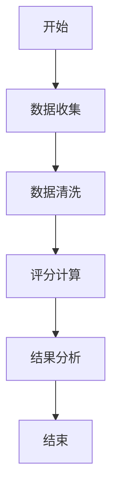

                 


# 彼得林奇对公司技术优势的评估方法

> 关键词：彼得林奇、技术优势、评估方法、投资哲学、企业竞争力

> 摘要：本文将详细介绍彼得林奇对公司技术优势的评估方法，从其投资哲学、核心概念、评估维度、算法原理、系统架构到实际案例，全面剖析技术优势在企业投资中的重要性。

---

# 第一部分：彼得林奇投资哲学与方法论

## 第1章：彼得林奇投资哲学概述

### 1.1 彼得林奇的生平与投资成就

彼得·林奇（Peter Lynch）是美国著名的投资经理，被誉为“股票投资的教父”。他在富达投资集团（Fidelity）的管理下，创造了令人瞩目的投资成绩。彼得林奇的投资哲学以“深入研究、长期持有”为核心，强调对企业基本面的分析和对管理层的信任。他的成功不仅在于其卓越的投资业绩，更在于他对企业内在价值的深刻理解。

### 1.2 技术优势评估的核心思想

彼得林奇在其投资生涯中，特别注重对企业技术优势的评估。他认为，技术优势是企业长期竞争优势的核心来源。技术优势不仅包括企业的技术创新能力，还包括其技术的市场应用潜力、技术的可持续发展能力以及技术对企业的整体竞争力的提升作用。

### 1.3 技术优势评估的背景与意义

在当前技术快速发展的背景下，企业技术优势的重要性日益凸显。技术优势不仅能够为企业带来竞争优势，还能在市场波动中为企业提供抗风险能力。通过技术优势评估，投资者可以更好地识别具有长期增长潜力的企业，从而做出更为明智的投资决策。

---

## 第2章：技术优势评估的核心概念与联系

### 2.1 技术优势的定义与内涵

技术优势是指企业在技术开发、应用和创新方面相对于竞争对手的领先地位。它不仅包括企业现有的技术储备，还包括其技术的未来发展方向和市场适应能力。技术优势是企业核心竞争力的重要组成部分，是企业在市场中保持竞争优势的关键因素。

### 2.2 技术优势评估的关键维度

技术优势评估可以从以下几个关键维度进行：

- **技术创新性**：企业的技术是否具有创新性，是否能够引领行业发展趋势。
- **技术领先性**：企业在技术上的领先地位，是否能够快速响应市场需求。
- **技术可持续性**：企业的技术是否具有长期发展潜力，是否能够持续创新。

### 2.3 技术优势与企业竞争力的关系

技术优势是企业竞争力的核心驱动力。通过技术优势，企业可以在市场上获得更高的市场份额，降低竞争压力，并提升企业的整体盈利能力。技术优势不仅能够增强企业的市场地位，还能够为企业带来长期的财务回报。

---

## 第3章：技术优势评估的算法原理与数学模型

### 3.1 技术优势评分模型

技术优势评分模型是彼得林奇评估方法的重要组成部分。该模型通过对企业技术优势的多个维度进行评分，综合计算出企业的技术优势评分。评分模型的公式如下：

$$ S = \sum_{i=1}^{n} w_i \cdot f_i $$

其中，$S$ 为技术优势评分，$w_i$ 为各维度权重，$f_i$ 为各维度评分。

### 3.2 技术优势评估的流程图



### 3.3 技术优势评估的数学模型

技术优势评估的数学模型可以通过以下步骤进行：

1. **数据收集**：收集企业的技术数据，包括技术创新性、技术领先性和技术可持续性等方面的数据。
2. **数据清洗**：对收集到的数据进行清洗，去除异常值和无效数据。
3. **评分计算**：根据各维度的权重和评分，计算出企业的技术优势评分。
4. **结果分析**：分析评分结果，识别企业的技术优势和劣势，制定相应的投资策略。

---

## 第4章：技术优势评估的系统分析与架构设计

### 4.1 问题场景介绍

在实际投资中，企业技术优势的评估需要考虑多个因素，包括企业的技术储备、市场地位、财务状况等。通过系统分析，投资者可以更好地理解企业的技术优势，并做出更为明智的投资决策。

### 4.2 系统功能设计

系统功能设计包括以下几个方面：

- **数据收集模块**：收集企业的技术数据，包括技术创新性、技术领先性和技术可持续性等方面的数据。
- **数据清洗模块**：对收集到的数据进行清洗，去除异常值和无效数据。
- **评分计算模块**：根据各维度的权重和评分，计算出企业的技术优势评分。
- **结果分析模块**：分析评分结果，识别企业的技术优势和劣势，制定相应的投资策略。

### 4.3 系统架构设计

系统架构设计可以通过以下步骤进行：

1. **系统功能模块设计**：设计系统的功能模块，包括数据收集、数据清洗、评分计算和结果分析等模块。
2. **系统交互设计**：设计系统各模块之间的交互流程，确保系统的高效运行。
3. **系统接口设计**：设计系统各模块之间的接口，确保数据的顺利传输和处理。

---

## 第5章：技术优势评估的项目实战

### 5.1 项目介绍

以某高科技企业为例，我们可以通过彼得林奇的技术优势评估方法，对企业进行技术优势评估。

### 5.2 核心代码实现

以下是技术优势评估的核心代码实现：

```python
def calculate_technical_advantage_score(enterprise_data):
    # 数据清洗
    cleaned_data = clean_data(enterprise_data)
    # 计算各维度评分
    innovation_score = calculate_innovation_score(cleaned_data)
    leading_score = calculate_leading_score(cleaned_data)
    sustainability_score = calculate_sustainability_score(cleaned_data)
    # 综合评分
    total_score = (0.4 * innovation_score) + (0.3 * leading_score) + (0.3 * sustainability_score)
    return total_score
```

### 5.3 代码应用解读与分析

通过上述代码，我们可以对企业技术优势进行评分。评分结果可以帮助投资者更好地理解企业的技术优势，并做出更为明智的投资决策。

---

## 第6章：最佳实践与小结

### 6.1 最佳实践

在实际应用中，投资者需要注意以下几点：

- **数据质量**：数据的质量直接影响评分结果，因此需要确保数据的准确性和完整性。
- **权重分配**：权重的分配需要根据企业的实际情况进行调整，以确保评分结果的合理性。
- **动态调整**：技术优势是动态变化的，投资者需要定期对企业技术优势进行评估和调整。

### 6.2 小结

彼得林奇的技术优势评估方法为企业技术优势的评估提供了重要的理论依据和实践指导。通过深入分析企业的技术优势，投资者可以更好地识别具有长期增长潜力的企业，并做出更为明智的投资决策。

---

## 第7章：注意事项与拓展阅读

### 7.1 注意事项

- 技术优势评估需要结合企业的实际情况进行，不能一概而论。
- 技术优势评估需要动态调整，以适应市场环境的变化。
- 技术优势评估需要结合其他因素进行综合分析，以确保评估结果的合理性。

### 7.2 拓展阅读

- 彼得林奇的《投资之道》（*The Investor's Guide to Growth Stocks*）：深入探讨彼得林奇的投资哲学和方法论。
- 技术优势评估的数学模型和算法：进一步了解技术优势评估的数学原理和实现方法。

---

# 作者：AI天才研究院/AI Genius Institute & 禅与计算机程序设计艺术 /Zen And The Art of Computer Programming

