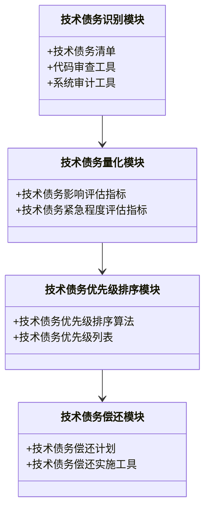

                 

# 彼得林奇对公司技术债务管理能力的评估

> 关键词：技术债务、技术债务管理能力、企业绩效、彼得·林奇、投资评估

> 摘要：本文从技术债务的定义、分类、影响以及评估方法入手，结合彼得·林奇的投资理念，构建了技术债务管理能力的评估模型，分析了技术债务对公司绩效的影响，并通过实例验证了模型的有效性，为企业的技术债务管理提供了理论依据和实践指导。

---

# 第1章: 技术债务的定义与重要性

## 1.1 技术债务的核心概念

### 1.1.1 技术债务的定义与来源
技术债务是指企业在追求短期目标的过程中，由于技术选择、架构设计或开发实践等方面的欠佳决策而产生的未来成本。这些成本可能表现为代码质量问题、系统维护成本增加、开发效率下降等问题。技术债务的来源主要包括以下几种：
1. **技术选择不当**：选择了过时的技术栈或不合适的工具。
2. **架构设计不合理**：系统架构缺乏扩展性或灵活性。
3. **开发实践不规范**：开发团队缺乏统一的标准和规范。
4. **快速迭代压力**：为了赶进度而忽视代码质量和架构优化。

### 1.1.2 技术债务的分类与特征
技术债务可以根据其产生原因、影响程度和偿还方式等维度进行分类。以下是常见的分类方式：

#### 1. 分类方式
- **按技术领域分类**：代码质量问题、系统架构问题、工具链问题等。
- **按影响程度分类**：高风险债务、中风险债务、低风险债务。
- **按偿还方式分类**：可计划性债务、不可计划性债务。

#### 2. 特征
- **隐性性**：技术债务通常不会在短期内显现，但长期积累会带来严重问题。
- **累积性**：技术债务会随着时间推移而积累，且难以彻底消除。
- **可转移性**：技术债务可以通过技术改造或架构优化转移到新产品或新系统中。

### 1.1.3 技术债务对公司的影响
技术债务对企业的财务状况、运营效率和市场竞争力都有显著影响：
1. **财务影响**：技术债务会导致维护成本增加、开发效率下降，从而增加企业的运营成本。
2. **运营影响**：技术债务会影响系统的稳定性和扩展性，降低企业的运营效率。
3. **市场竞争力**：技术债务会削弱企业的创新能力，影响其在市场中的竞争力。

## 1.2 技术债务管理能力的定义

### 1.2.1 技术债务管理能力的内涵
技术债务管理能力是指企业在识别、量化、优先级排序和偿还技术债务方面的能力。这种能力包括以下几个方面：
1. **识别能力**：能够准确识别技术债务的存在及其来源。
2. **量化能力**：能够量化技术债务的影响程度。
3. **优先级排序能力**：能够根据债务的影响程度和紧急程度进行排序。
4. **偿还能力**：能够制定合理的偿还计划并实施。

### 1.2.2 技术债务管理能力的外延
技术债务管理能力不仅包括技术层面的能力，还包括组织架构、流程管理和工具支持等方面的能力：
1. **组织架构**：企业需要有专门的团队或角色来负责技术债务的管理。
2. **流程管理**：企业需要建立技术债务管理的标准化流程。
3. **工具支持**：企业需要借助技术债务管理工具来提高效率。

### 1.2.3 技术债务管理能力与企业绩效的关系
技术债务管理能力与企业绩效密切相关。良好的技术债务管理能力可以降低企业的运营成本、提高开发效率、增强系统的稳定性和扩展性，从而提升企业的市场竞争力和盈利能力。

## 1.3 技术债务管理能力的评估背景

### 1.3.1 当前企业技术债务管理的现状
随着信息技术的快速发展，企业对技术的依赖程度越来越高。然而，许多企业在追求快速开发和迭代的过程中，忽视了技术债务的积累，导致系统质量和维护成本问题日益突出。

### 1.3.2 技术债务管理能力评估的必要性
技术债务管理能力评估的必要性主要体现在以下几个方面：
1. **降低运营成本**：通过评估技术债务管理能力，企业可以识别并优先偿还高风险债务，从而降低维护成本。
2. **提高开发效率**：良好的技术债务管理能力可以减少开发中的阻碍，提高开发效率。
3. **增强市场竞争力**：通过优化技术债务管理能力，企业可以提高系统的稳定性和扩展性，增强市场竞争力。

### 1.3.3 技术债务管理能力的边界与外延
技术债务管理能力的边界主要在于技术债务的识别和偿还，而其外延则涉及企业的组织架构、流程管理和工具支持等多个方面。

## 1.4 本章小结
本章从技术债务的定义、分类及其影响出发，详细阐述了技术债务管理能力的内涵和外延，并分析了其与企业绩效的关系。这些内容为后续的技术债务管理能力评估奠定了基础。

---

# 第2章: 技术债务管理能力的评估模型

## 2.1 技术债务管理能力评估模型的构建

### 2.1.1 模型构建的逻辑框架
技术债务管理能力评估模型的构建需要考虑以下几个方面：
1. **技术债务的识别与量化**：准确识别技术债务并量化其影响程度。
2. **技术债务的优先级排序**：根据债务的影响程度和紧急程度进行排序。
3. **技术债务的偿还策略**：制定合理的偿还计划并实施。

### 2.1.2 模型的核心要素与权重分配
技术债务管理能力评估模型的核心要素包括：
1. **技术债务的识别能力**：权重为20%。
2. **技术债务的量化能力**：权重为20%。
3. **技术债务的优先级排序能力**：权重为25%。
4. **技术债务的偿还能力**：权重为35%。

### 2.1.3 模型的适用范围与限制
技术债务管理能力评估模型适用于各种类型的企业，但其效果可能会受到数据质量和模型参数选择的影响。

## 2.2 技术债务管理能力评估的数学模型

### 2.2.1 技术债务管理能力指数公式
$$ C = \frac{\sum_{i=1}^{n} w_i \cdot S_i}{\sum_{i=1}^{n} w_i} $$
其中，$C$ 表示技术债务管理能力指数，$w_i$ 表示各评估维度的权重，$S_i$ 表示各维度的评分。

### 2.2.2 技术债务管理能力评估的权重分配表
| 评估维度         | 权重 |
|------------------|------|
| 技术债务的识别能力 | 20%  |
| 技术债务的量化能力 | 20%  |
| 技术债务的优先级排序能力 | 25% |
| 技术债务的偿还能力 | 35%  |

## 2.3 技术债务管理能力评估的流程

### 2.3.1 技术债务的识别与分类
1. **识别技术债务**：通过代码审查、系统审计等方式识别技术债务。
2. **分类技术债务**：根据技术债务的影响程度和紧急程度进行分类。

### 2.3.2 技术债务的量化与优先级排序
1. **量化技术债务**：通过评估技术债务的影响程度和紧急程度进行量化。
2. **优先级排序**：根据量化结果对技术债务进行优先级排序。

### 2.3.3 技术债务的偿还策略
1. **制定偿还计划**：根据优先级排序制定合理的偿还计划。
2. **实施偿还计划**：通过技术改造、架构优化等方式偿还技术债务。

## 2.4 本章小结
本章构建了技术债务管理能力评估模型，并详细阐述了模型的数学公式和权重分配。通过该模型，企业可以准确评估其技术债务管理能力，并制定合理的偿还策略。

---

# 第3章: 技术债务管理能力的系统分析与架构设计

## 3.1 技术债务管理能力的系统功能设计

### 3.1.1 系统功能模块
1. **技术债务识别模块**：通过代码审查、系统审计等方式识别技术债务。
2. **技术债务量化模块**：评估技术债务的影响程度和紧急程度。
3. **技术债务优先级排序模块**：根据量化结果对技术债务进行优先级排序。
4. **技术债务偿还模块**：制定并实施技术债务的偿还计划。

### 3.1.2 系统功能设计的领域模型

## 3.2 技术债务管理能力的系统架构设计

### 3.2.1 系统架构设计

### 3.2.2 系统架构设计说明
1. **客户端**：用户通过客户端访问系统功能模块。
2. **API Gateway**：作为系统入口，负责接收客户端请求并分发到相应的服务模块。
3. **服务模块**：包括技术债务识别模块、技术债务量化模块、技术债务优先级排序模块和

