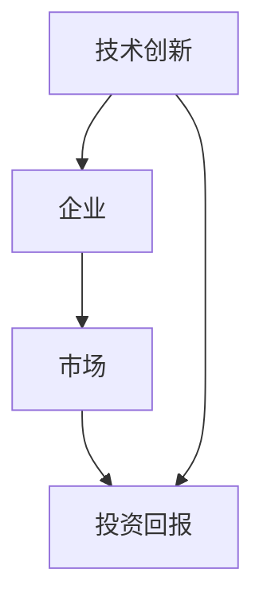
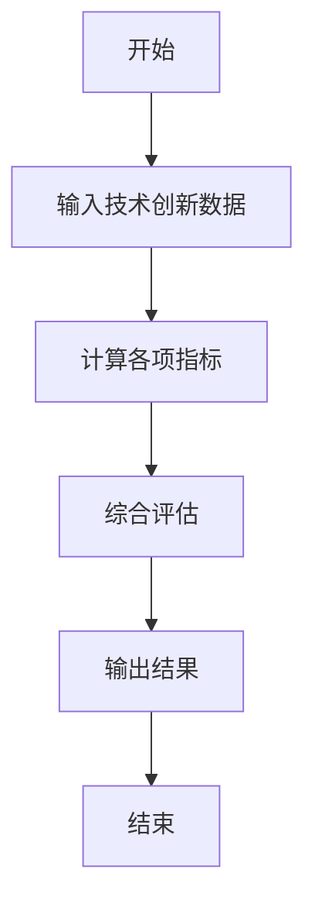
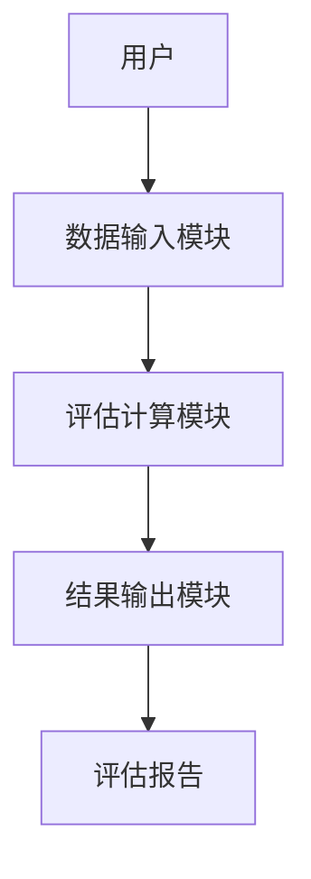

                 


# 彼得林奇对公司技术创新的评估标准

> 关键词：技术创新评估，彼得林奇，投资标准，技术指标，企业创新

> 摘要：本文详细探讨了彼得·林奇对公司技术创新的评估标准，从背景介绍、核心概念、算法原理到系统分析、项目实战，全面解析了如何通过技术创新评估提升企业竞争力。文章结合实际案例，深入分析了评估标准的数学模型、系统架构和应用场景，为企业制定技术创新策略提供了实用指导。

---

# 第一部分：技术创新的背景与重要性

## 第1章：技术创新的背景介绍

### 1.1 技术创新的定义与内涵

技术创新是指在现有技术基础上，通过引入新的技术、方法或工具，以实现更高效、更优质的目标。其内涵包括以下几个方面：

- **技术性**：依赖于具体的技术手段和方法。
- **创新性**：突破传统模式，提出新的解决方案。
- **实用性**：能够解决实际问题，创造经济价值。
- **动态性**：随着技术发展不断更新迭代。

技术创新不仅仅是技术的更新，更是一种思维方式的转变，强调在解决问题的过程中引入新的视角和方法。

---

### 1.2 彼得·林奇的背景与投资理念

彼得·林奇（Peter Lynch）是全球著名的投资专家，以其独特的投资哲学闻名。他强调：

> “投资最重要的事情是找到一家有持续增长潜力的公司。”

林奇的投资理念基于对公司基本面的深入分析，尤其是对技术创新能力的重视。他认为，技术创新是企业在市场竞争中保持优势的核心因素。

---

### 1.3 技术创新评估标准的核心框架

技术创新评估标准是衡量技术创新项目或企业在市场中的竞争力的依据。其核心框架包括以下几个要素：

1. **技术可行性**：技术方案是否可行，能否实现预期目标。
2. **市场需求**：技术创新是否符合市场需求，能否解决用户痛点。
3. **竞争优势**：技术创新是否为企业带来竞争优势。
4. **投资回报**：技术创新是否能够带来可预期的经济回报。

---

# 第二部分：技术创新评估标准的核心概念与联系

## 第2章：核心概念原理

### 2.1 技术创新的核心要素

技术创新的核心要素包括：

1. **技术基础**：技术创新需要依托现有的技术基础。
2. **创新能力**：企业是否具备将新技术转化为实际应用的能力。
3. **市场需求**：技术创新是否能够满足市场的需求。
4. **资源支持**：企业是否具备足够的资源支持技术创新。

---

### 2.2 技术创新与企业竞争力的关联

技术创新是企业竞争力的核心驱动力。通过技术创新，企业可以：

- 提高产品或服务的质量。
- 降低生产成本。
- 提升市场占有率。
- 增强品牌影响力。

---

### 2.3 ER实体关系图

下图展示了技术创新、企业、市场和投资回报之间的关系：



---

# 第三部分：技术创新评估标准的算法原理

## 第3章：算法原理概述

### 3.1 评估标准的数学模型

技术创新评估标准的数学模型可以表示为：

$$
\text{技术创新评估} = \sum_{i=1}^{n} w_i \cdot x_i
$$

其中：
- \( w_i \) 是第 \( i \) 个评估指标的权重。
- \( x_i \) 是第 \( i \) 个评估指标的得分。

---

### 3.2 算法流程图

下图展示了技术创新评估标准的算法流程：



---

## 第4章：系统分析与架构设计

### 4.1 系统功能设计

技术创新评估系统的功能设计包括以下几个方面：

1. **数据输入**：用户输入技术创新相关数据。
2. **指标计算**：系统根据输入数据计算各项指标。
3. **综合评估**：系统根据计算结果生成综合评估报告。
4. **结果输出**：系统输出评估结果。

---

### 4.2 系统架构设计

以下是技术创新评估系统的架构图：



---

## 第5章：项目实战

### 5.1 环境安装

为了实现技术创新评估系统，需要以下环境：

- 操作系统：Linux 或 macOS。
- 开发工具：Python 3.8+，Jupyter Notebook。
- 第三方库：numpy, pandas, scikit-learn。

---

### 5.2 核心实现代码

以下是技术创新评估的核心代码：

```python
import numpy as np
import pandas as pd

def assess_technological_innovation(technology_data, weights):
    # 计算加权得分
    scores = technology_data.dot(weights)
    # 确定评估结果
    results = pd.DataFrame({
        '技术创新得分': scores
    })
    return results

# 示例数据
technology_data = pd.DataFrame({
    '技术可行性': [0.8, 0.6, 0.9],
    '市场需求': [0.7, 0.8, 0.6],
    '竞争优势': [0.6, 0.7, 0.8]
})

weights = pd.Series([0.3, 0.4, 0.3])

# 调用函数
results = assess_technological_innovation(technology_data, weights)
print(results)
```

---

### 5.3 案例分析

假设某企业技术创新数据如下：

| 技术可行性 | 市场需求 | 竞争优势 |
|------------|----------|-----------|
| 0.8        | 0.7      | 0.6       |

权重为：技术可行性（0.3）、市场需求（0.4）、竞争优势（0.3）。

计算结果为：

$$
\text{技术创新得分} = 0.8 \times 0.3 + 0.7 \times 0.4 + 0.6 \times 0.3 = 0.24 + 0.28 + 0.18 = 0.70
$$

---

## 第6章：最佳实践与总结

### 6.1 最佳实践

- **数据准确性**：确保输入数据的准确性和完整性。
- **权重调整**：根据具体场景调整各指标的权重。
- **持续优化**：定期更新模型和数据，以适应技术发展。

---

### 6.2 小结

技术创新评估标准是企业在竞争中保持优势的重要工具。通过本文的分析，我们可以更好地理解技术创新的内涵，掌握评估标准的算法原理，并在实际项目中灵活应用。

---

## 第7章：注意事项与拓展阅读

### 7.1 注意事项

- 技术创新评估标准需要结合企业实际情况灵活应用。
- 在实际操作中，建议结合行业特点进行调整。

---

### 7.2 拓展阅读

- 《彼得·林奇的投资哲学》
- 《技术创新与企业战略》
- 《数据驱动的决策分析》

---

# 作者：AI天才研究院/AI Genius Institute & 禅与计算机程序设计艺术 /Zen And The Art of Computer Programming

