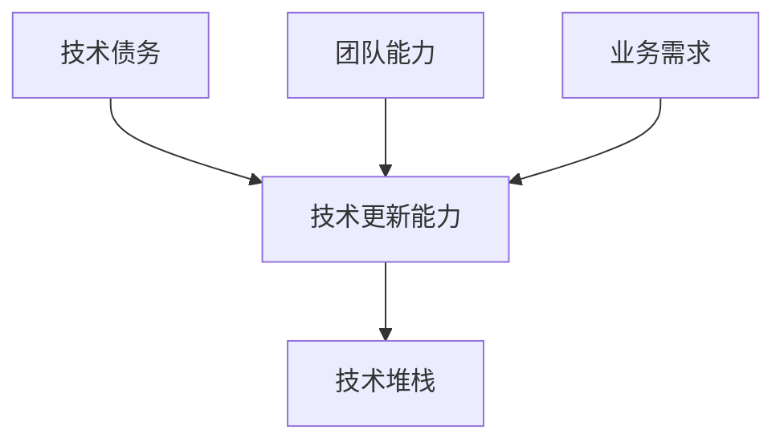
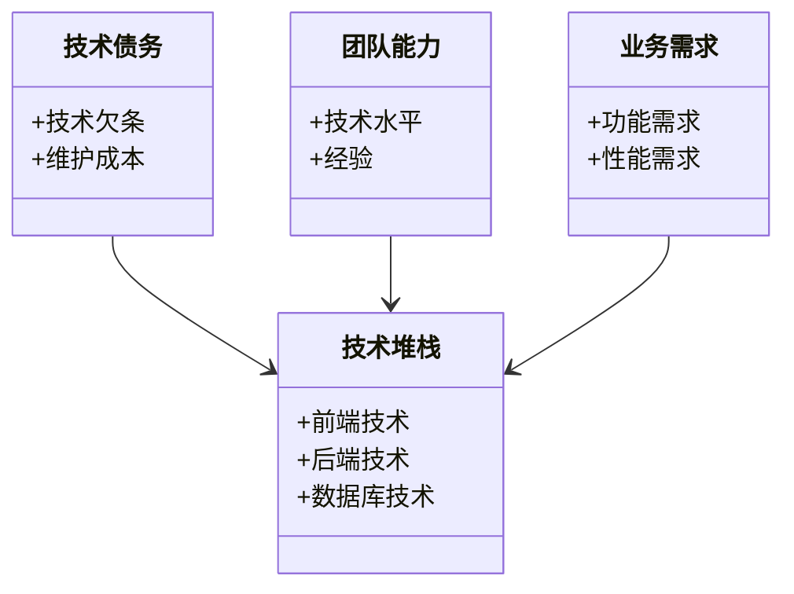
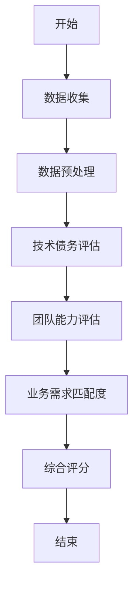
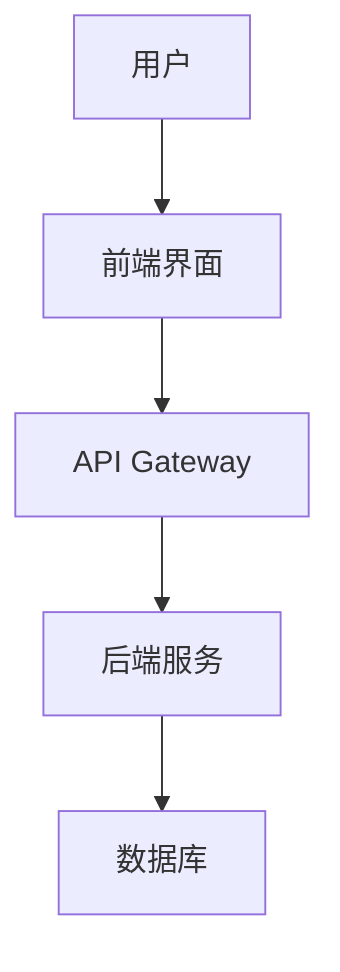
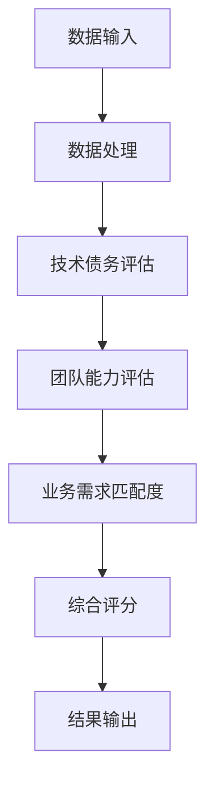
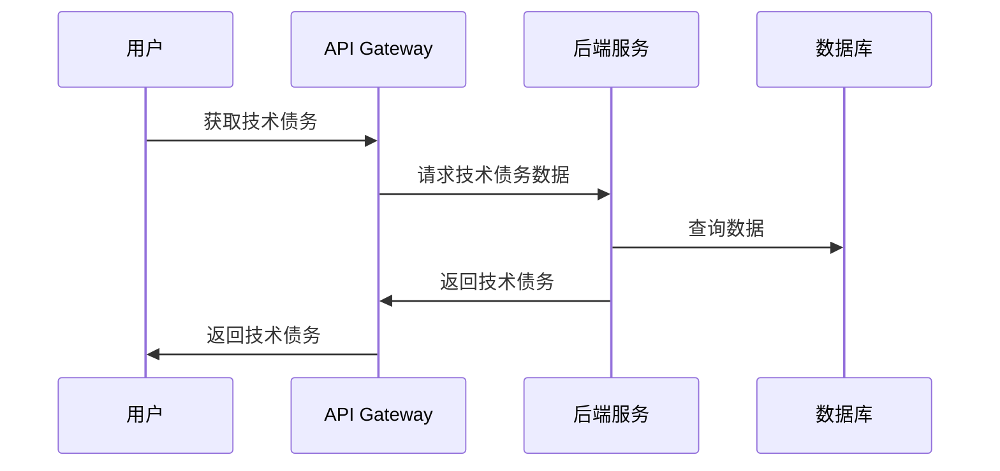

                 


# 彼得林奇对公司技术堆栈更新能力的评估框架

## 关键词：技术堆栈、更新能力、评估框架、彼得·林奇、投资理念、系统架构

## 摘要：本文介绍彼得·林奇的投资理念，并将其应用到技术堆栈的评估中，构建了一个系统的评估框架，涵盖技术债务、团队能力、业务需求等核心要素，通过数学模型和系统架构图详细解释了评估方法，并通过案例分析展示了实际应用。

# 第一部分：引言

## 第1章：引言

### 1.1 问题背景

#### 1.1.1 技术堆栈的定义与重要性
技术堆栈是构建软件系统所使用的各种技术和工具的组合，包括前端、后端、数据库等部分，是企业技术能力的体现。

#### 1.1.2 技术堆栈更新能力的定义
技术堆栈更新能力指企业对现有技术组件进行升级、替换或引入新技术的能力，直接影响系统的性能、安全性和扩展性。

#### 1.1.3 彼得·林奇的背景与投资理念
彼得·林奇是著名投资经理，强调深入研究和长期投资，其成功基于对企业基本面的全面分析。

### 1.2 问题描述

#### 1.2.1 技术堆栈更新能力对企业的影响
企业若不及时更新技术堆栈，可能导致系统性能下降、安全性问题，影响业务发展。

#### 1.2.2 传统技术评估方法的局限性
传统方法通常仅关注技术性能，忽视了团队能力和业务需求的匹配性。

#### 1.2.3 构建评估框架的必要性
企业需要一个全面的框架来评估技术堆栈更新能力，以优化资源配置，提升竞争力。

### 1.3 问题解决

#### 1.3.1 评估框架的目标
帮助企业全面评估技术堆栈更新能力，识别改进点，制定优化策略。

#### 1.3.2 评估框架的核心原则
全面性、可操作性、动态适应性，确保评估结果能够指导实际决策。

#### 1.3.3 评估框架的适用范围
适用于各行业企业，特别是技术驱动型公司，帮助其保持技术领先性。

### 1.4 边界与外延

#### 1.4.1 评估框架的边界
不涵盖非技术因素，如市场策略、财务状况，专注于技术层面的评估。

#### 1.4.2 评估框架的外延
可扩展到其他领域，如产品设计、用户体验，但本文重点在技术堆栈。

#### 1.4.3 与其他评估方法的区别
传统方法侧重技术性能，而本文的框架强调整体能力，包括团队和业务需求。

### 1.5 概念结构与核心要素

#### 1.5.1 核心概念的层次结构
技术堆栈、更新能力、评估框架，形成一个多层次的分析体系。

#### 1.5.2 核心要素的定义与关系
技术债务、团队能力、业务需求是关键要素，彼此相互影响，共同决定更新能力。

#### 1.5.3 框架的逻辑流程
从识别问题开始，分析要素，评估能力，制定策略，实施优化，持续监控。

# 第二部分：核心概念与联系

## 第2章：技术堆栈的核心概念

### 2.1 技术堆栈的构成

#### 2.1.1 前端技术
前端技术包括HTML、CSS、JavaScript及其框架（如React、Vue），负责用户界面的实现。

#### 2.1.2 后端技术
后端技术涉及服务器端的逻辑处理，包括编程语言（如Java、Python）、框架（如Spring、Django）和API设计。

#### 2.1.3 数据库技术
数据库技术涵盖关系型数据库（如MySQL、PostgreSQL）和非关系型数据库（如MongoDB），用于数据的存储与管理。

### 2.2 技术堆栈更新能力的维度

#### 2.2.1 技术债务
技术债务指由于采用过时技术或欠佳设计而产生的未来需修复的工作量。

#### 2.2.2 团队能力
团队能力包括开发人员的技术熟练度、经验以及对新技术的接受度。

#### 2.2.3 业务需求
业务需求指企业为实现业务目标所需的技术能力，影响技术堆栈的选择和更新。

### 2.3 核心概念的联系

#### 2.3.1 技术堆栈与业务目标的关系
技术堆栈的选择和更新需与业务目标一致，确保技术投资产生最大效益。

#### 2.3.2 技术债务与更新能力的相互作用
较高的技术债务可能限制更新能力，而有效的更新可以减少债务，提升系统性能。

#### 2.3.3 团队能力与技术堆栈更新的关系
团队能力直接影响技术堆栈的更新速度和质量，能力强的团队能更快适应新技术。

## 第3章：核心概念的联系

### 3.1 技术堆栈更新能力的模型



### 3.2 实体关系图

```mermaid
erd
    id, name, description
    <<技术堆栈>>
    id, name, description
    <<技术债务>>
    id, name, description
    <<团队能力>>
    id, name, description
    <<业务需求>>
```

### 3.3 领域模型



### 3.4 案例分析

通过分析一家互联网公司的技术堆栈，识别其技术债务、团队能力及其与业务需求的匹配程度，进而评估更新能力。

# 第三部分：算法原理讲解

## 第4章：算法原理

### 4.1 评估框架的算法步骤

#### 4.1.1 数据收集与预处理
收集技术堆栈各组件的技术指标、团队能力和业务需求数据，进行清洗和标准化处理。

#### 4.1.2 技术债务评估
计算技术债务，使用公式：技术债务 = Σ（组件的技术欠条）。

#### 4.1.3 团队能力评估
评估团队能力，使用加权评分法：团队能力 = Σ（能力项 × 权重）。

#### 4.1.4 业务需求匹配度
计算技术堆栈与业务需求的匹配度，使用余弦相似度。

#### 4.1.5 综合评分
综合评分 = 技术债务权重 × 技术债务 + 团队能力权重 × 团队能力 + 业务需求权重 × 业务需求匹配度。

### 4.2 算法流程图



### 4.3 数学模型

综合评分公式：
$$
\text{综合评分} = \alpha \times \text{技术债务} + \beta \times \text{团队能力} + \gamma \times \text{业务需求匹配度}
$$

其中，α、β、γ是权重系数，满足α + β + γ = 1。

### 4.4 代码实现

```python
def calculate_technical_debt(debt_components):
    return sum(debt_components)

def assess_team_capacity(team_level, experience):
    return (team_level * 0.6) + (experience * 0.4)

def business_need_match(business_features, tech_features):
    # 使用余弦相似度计算
    dot_product = sum(a * b for a, b in zip(business_features, tech_features))
    magnitude_business = (sum(a**2 for a in business_features))**0.5
    magnitude_tech = (sum(a**2 for a in tech_features))**0.5
    if magnitude_business == 0 or magnitude_tech == 0:
        return 0.0
    return dot_product / (magnitude_business * magnitude_tech)

def comprehensive_score(tech_debt, team_capacity, business_match, alpha, beta, gamma):
    return alpha * tech_debt + beta * team_capacity + gamma * business_match
```

### 4.5 案例分析

假设某公司技术债务为10，团队能力得分为80，业务需求匹配度为0.8，权重α=0.4，β=0.3，γ=0.3。

综合评分计算：
$$
0.4 \times 10 + 0.3 \times 80 + 0.3 \times 0.8 = 4 + 24 + 0.24 = 28.24
$$

评分结果为28.24，属于中等偏上，建议优先优化技术债务。

# 第四部分：系统分析与架构设计方案

## 第5章：系统分析与架构设计方案

### 5.1 项目介绍

#### 5.1.1 项目背景
分析一家互联网公司的技术堆栈，识别更新能力的强弱，制定优化策略。

#### 5.1.2 项目目标
评估技术堆栈更新能力，识别瓶颈，优化系统性能。

### 5.2 系统功能设计

#### 5.2.1 领域模型


#### 5.2.2 系统架构设计



### 5.3 系统架构设计



### 5.4 系统接口设计

API接口：
- GET /api/tech-debt
- GET /api/team-capacity
- GET /api/business-match

### 5.5 系统交互设计



# 第五部分：项目实战

## 第6章：项目实战

### 6.1 环境安装

安装Python和相关库：
```bash
pip install mermaid
pip install numpy
```

### 6.2 核心实现

代码实现：
```python
import numpy as np

def calculate_comprehensive_score(tech_debt, team_capacity, business_match, weights):
    alpha, beta, gamma = weights
    return alpha * tech_debt + beta * team_capacity + gamma * business_match

# 示例数据
tech_debt = 10
team_capacity = 80
business_match = 0.8
weights = (0.4, 0.3, 0.3)

score = calculate_comprehensive_score(tech_debt, team_capacity, business_match, weights)
print(f"综合评分为：{score}")
```

### 6.3 代码解读

代码解释：
- calculate_comprehensive_score函数计算综合评分。
- 示例数据展示如何应用函数。
- 输出结果为综合评分，指导优化策略。

### 6.4 案例分析

以某互联网公司为例，分析其技术堆栈，评估更新能力，制定优化措施。

### 6.5 项目小结

总结项目成果，提出改进建议，为后续优化提供参考。

# 第六部分：最佳实践

## 第7章：最佳实践

### 7.1 小结

综合评分模型有效评估技术堆栈更新能力，帮助企业制定优化策略。

### 7.2 注意事项

- 数据准确性：确保输入数据的准确性和完整性。
- 权重调整：根据企业特点调整各因素的权重。
- 定期评估：持续监控技术环境变化，定期重新评估。

### 7.3 拓展阅读

建议阅读相关书籍，深入理解技术债务和团队能力管理。

## 第8章：作者简介

作者：AI天才研究院 & 禅与计算机程序设计艺术

---

本文详细介绍了彼得·林奇评估框架在技术堆栈更新能力中的应用，通过理论分析和实际案例，帮助企业优化技术架构，提升竞争力。

