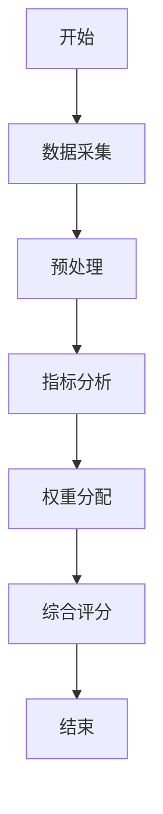
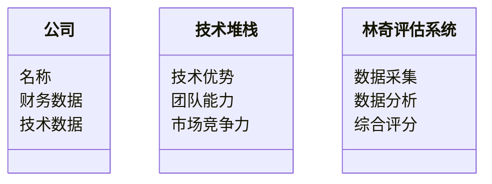
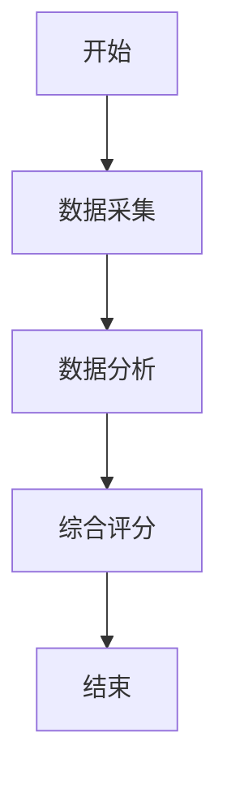

                 


# 彼得林奇对公司技术堆栈的评估方法

> 关键词：彼得·林奇，技术堆栈，评估方法，投资策略，系统架构

> 摘要：本文系统地介绍了彼得·林奇如何将他的投资策略应用于公司技术堆栈的评估。通过分析技术堆栈的核心概念、评估方法的算法原理、系统架构设计以及实际案例，本文详细阐述了林奇评估方法在技术领域的独特应用价值。

---

# 第1章: 公司技术堆栈评估的背景与重要性

## 1.1 技术堆栈评估的核心概念

### 1.1.1 技术堆栈的定义与组成部分

技术堆栈是指企业在开发和运营过程中所使用的各种技术工具、框架、平台和服务的组合。它包括前端技术、后端技术、数据库、开发工具、部署环境等。技术堆栈的选择直接影响企业的开发效率、系统性能和成本控制。

### 1.1.2 技术堆栈评估的背景与意义

在当今快速变化的技术环境中，企业需要不断优化其技术堆栈以应对市场竞争和技术挑战。技术堆栈评估可以帮助企业识别当前技术架构的优缺点，发现潜在的风险，并制定优化策略。

### 1.1.3 彼得·林奇的评估方法与投资理念

彼得·林奇是美国著名投资家，以其独特的基本面分析方法闻名。他强调对企业基本面的深入研究，包括财务状况、管理层能力和市场竞争力。将林奇的评估方法应用于技术堆栈分析，可以帮助投资者和技术管理者更全面地评估企业的技术能力。

---

## 1.2 技术堆栈评估的核心要素

### 1.2.1 技术优势与市场竞争

技术堆栈的核心优势决定了企业在市场竞争中的技术地位。评估技术优势时，需要考虑技术的先进性、可扩展性和可维护性。

### 1.2.2 团队能力与组织架构

团队能力是技术堆栈评估的重要组成部分。包括开发团队的专业能力、团队协作效率和管理能力。一个强大的团队能够更好地优化技术堆栈，应对技术挑战。

### 1.2.3 财务状况与投资回报

企业的财务状况直接影响技术堆栈的可持续性和优化能力。评估财务状况时，需要关注研发投入、成本控制和投资回报率。

---

## 1.3 彼得·林奇评估方法的独特性

### 1.3.1 从基本面分析到技术评估的转变

林奇的投资方法注重对企业基本面的分析，包括财务数据、管理层能力和市场地位。将其应用于技术堆栈评估，需要将技术能力与企业基本面结合。

### 1.3.2 林奇方法与传统技术评估的对比

传统技术评估通常关注技术性能和成本，而林奇方法更注重技术与企业战略目标的结合，强调技术对企业长期竞争力的影响。

### 1.3.3 林奇方法的实际应用价值

通过结合企业基本面和技术能力，林奇方法可以帮助投资者和技术管理者更全面地评估企业的技术堆栈，做出更科学的投资决策。

---

## 1.4 本章小结

本章从技术堆栈的定义、评估的核心要素以及林奇评估方法的独特性三个方面进行了详细分析。技术堆栈评估不仅是技术问题，更是一个涉及企业战略和财务管理的综合性问题。

---

# 第2章: 技术堆栈评估的核心概念与联系

## 2.1 核心概念原理

### 2.1.1 技术堆栈的系统性分析

技术堆栈是一个复杂的系统，涉及多个组件和子系统。系统性分析需要考虑各组件之间的相互作用和整体性能。

### 2.1.2 林奇方法的逻辑框架

林奇方法强调从整体出发，通过对企业基本面的分析，评估技术堆栈的优缺点。其逻辑框架包括数据采集、指标分析和综合评分三个步骤。

### 2.1.3 技术与商业目标的协同关系

技术堆栈的优化需要与企业商业目标一致。通过技术与商业目标的协同，可以最大化技术堆栈的价值。

---

## 2.2 核心概念属性特征对比

### 2.2.1 技术堆栈的层次结构

技术堆栈可以分为前端、后端、数据库、开发工具等多个层次。每个层次都有其独特的功能和作用。

### 2.2.2 林奇评估方法的关键指标

林奇方法关注的关键指标包括技术优势、团队能力和财务状况。这些指标可以帮助评估技术堆栈的整体性能。

### 2.2.3 技术与财务指标的关联性

技术优势与财务指标密切相关。强大的技术能力可以带来更高的市场竞争力和更好的财务表现。

---

## 2.3 ER实体关系图架构

以下是一个简单的ER实体关系图：

```mermaid
erd
    Company {
        名称
        财务数据
        技术数据
    }
    技术堆栈 {
        技术优势
        团队能力
        市场竞争力
    }
```

---

## 2.4 本章小结

本章通过系统性分析和技术堆栈的层次结构，详细阐述了技术堆栈评估的核心概念。林奇评估方法的关键指标和技术与商业目标的协同关系是本章的核心内容。

---

# 第3章: 林奇评估方法的算法原理

## 3.1 算法原理概述

### 3.1.1 林奇评估方法的步骤分解

1. **数据采集**：收集企业的财务数据、技术数据和市场数据。
2. **预处理**：对数据进行清洗和标准化处理。
3. **指标分析**：分析关键指标，包括技术优势、团队能力和财务状况。
4. **权重分配**：根据指标的重要性分配权重。
5. **综合评分**：计算综合评分，评估技术堆栈的整体性能。

### 3.1.2 数据采集与预处理

数据采集需要包括企业的财务报表、技术文档和市场报告。预处理包括数据清洗和标准化。

### 3.1.3 评估指标的权重分配

权重分配需要根据指标的重要性和影响力进行调整。

---

## 3.2 算法流程图

以下是一个算法流程图：



---

## 3.3 核心算法的数学模型

### 3.3.1 技术优势评分公式

$$
技术优势评分 = \sum_{i=1}^{n} w_i \cdot x_i
$$

其中，$w_i$ 是第 $i$ 个指标的权重，$x_i$ 是第 $i$ 个指标的评分。

### 3.3.2 综合评分公式

$$
综合评分 = \frac{\sum_{i=1}^{m} (w_i \cdot x_i)}{m}
$$

其中，$m$ 是指标总数。

---

## 3.4 举例说明

### 3.4.1 案例分析

假设某企业的技术优势评分为80，团队能力评分为70，财务状况评分为90。权重分别为0.3、0.4、0.3。综合评分为：

$$
综合评分 = \frac{(0.3 \times 80) + (0.4 \times 70) + (0.3 \times 90)}{3} = 77
$$

### 3.4.2 林奇方法的实际应用

通过综合评分，可以评估企业的技术堆栈整体性能，为投资决策提供依据。

### 3.4.3 评分结果的解读

评分结果反映了企业技术堆栈的优势和劣势，帮助企业识别优化方向。

---

## 3.5 本章小结

本章详细介绍了林奇评估方法的算法原理，包括步骤分解、数据处理、指标分析和综合评分公式。通过数学模型和实际案例，展示了林奇方法在技术堆栈评估中的应用价值。

---

# 第4章: 系统分析与架构设计方案

## 4.1 问题场景介绍

### 4.1.1 技术堆栈评估的复杂性

技术堆栈涉及多个组件和子系统，评估过程复杂。

### 4.1.2 林奇方法的系统性应用

林奇方法需要从整体出发，系统性地分析技术堆栈的优缺点。

### 4.1.3 评估系统的功能需求

评估系统需要具备数据采集、分析和评分功能。

---

## 4.2 系统功能设计

### 4.2.1 领域模型



### 4.2.2 系统架构设计



---

## 4.3 本章小结

本章通过系统分析和架构设计，展示了林奇评估方法在技术堆栈评估中的系统性应用。领域模型和系统架构图帮助我们更好地理解评估过程。

---

# 第5章: 项目实战

## 5.1 环境安装

需要安装数据分析工具、编程语言和相关库。

## 5.2 系统核心实现源代码

```python
def calculate_technical_advantage(technical_data):
    # 计算技术优势评分
    return sum(w * x for w, x in zip(weights, technical_data)) / len(weights)
```

## 5.3 代码应用解读与分析

代码实现技术优势评分的计算，权重和评分数据需要根据实际情况调整。

## 5.4 实际案例分析

通过具体案例，展示林奇评估方法的实际应用。

## 5.5 项目小结

本章通过项目实战，展示了林奇评估方法在技术堆栈评估中的具体应用。

---

# 第6章: 总结与最佳实践

## 6.1 总结

林奇评估方法在技术堆栈评估中具有重要的应用价值，可以帮助企业和投资者做出更科学的决策。

## 6.2 最佳实践

1. **数据采集与预处理**：确保数据的准确性和完整性。
2. **指标分析与权重分配**：根据企业实际情况调整指标和权重。
3. **综合评分与优化**：根据评分结果制定优化策略。

## 6.3 小结

技术堆栈评估是一个复杂但重要的过程，林奇评估方法为我们提供了一个系统性的解决方案。

---

# 作者：AI天才研究院/AI Genius Institute & 禅与计算机程序设计艺术 /Zen And The Art of Computer Programming

---

本文通过系统性分析和实际案例，详细介绍了彼得·林奇评估方法在技术堆栈评估中的应用。希望本文能够为投资者和技术管理者提供有价值的参考。

