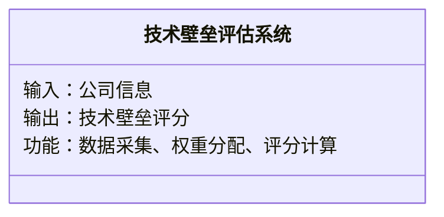
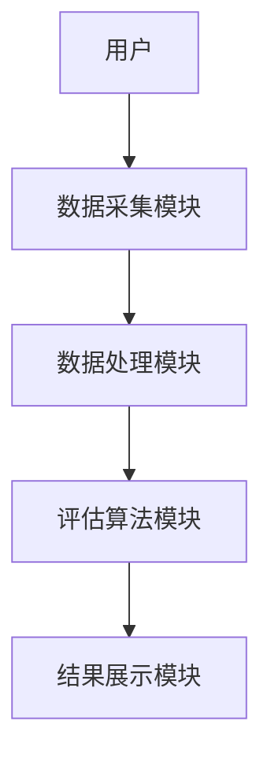
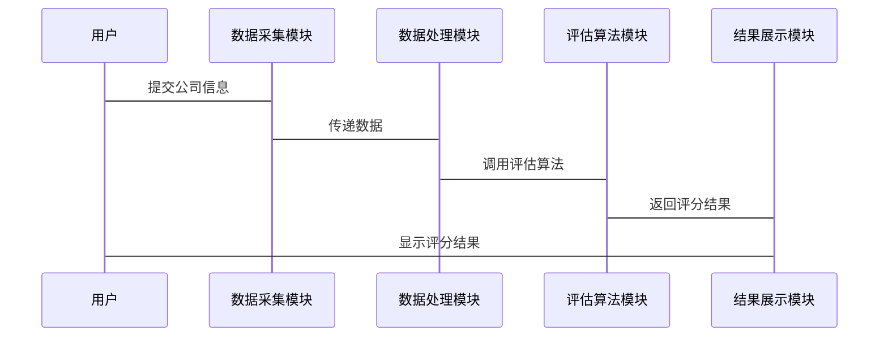

                 


# 彼得林奇对公司技术壁垒的评估方法

## 关键词：彼得·林奇、技术壁垒、投资评估、技术复杂性、竞争优势

## 摘要：本文深入探讨了彼得·林奇在其投资生涯中如何评估公司技术壁垒的方法。通过分析其核心概念、评估维度、算法模型以及系统设计，本文为读者提供了从理论到实践的详细指导。文章结合具体案例，展示了如何将彼得·林奇的评估方法应用于实际场景，帮助投资者和技术人员更好地理解和应用这一方法。

---

## 第1章: 彼得·林奇与技术壁垒评估的背景

### 1.1 彼得·林奇的投资者背景

#### 1.1.1 彼得·林奇的生平简介
彼得·林奇（Peter Lynch）是美国著名的投资专家，被誉为“最伟大的股票基金经理”之一。他从1970年代开始管理富达麦哲伦基金（Fidelity Magellan Fund），在任职期间取得了令人瞩目的成绩，年化回报率超过29%。林奇的投资风格以深入研究和价值发现为核心，注重公司基本面和技术优势的评估。

#### 1.1.2 彼得·林奇的投资理念
林奇的投资理念强调对公司基本面的深入分析，尤其是公司技术壁垒、竞争优势和市场地位的评估。他认为，技术壁垒是公司长期竞争优势的核心，能够为公司提供持续的市场竞争力和盈利能力。

#### 1.1.3 技术壁垒在投资中的重要性
技术壁垒是公司抵御竞争对手的核心能力，是衡量公司长期价值的重要指标。通过技术壁垒的评估，投资者可以更好地识别具有长期竞争优势的公司。

### 1.2 技术壁垒的定义与概念

#### 1.2.1 技术壁垒的定义
技术壁垒是指公司在技术层面的核心竞争力，包括技术创新、技术复杂性、技术独特性和技术可复制性等因素。这些因素共同构成了公司在市场上难以被竞争对手模仿或替代的核心优势。

#### 1.2.2 技术壁垒的核心要素
- **技术创新性**：公司是否拥有独特的技术或创新的解决方案。
- **技术复杂性**：技术的实现难度和复杂程度。
- **技术的可复制性**：竞争对手是否能够轻松复制该技术。
- **技术的市场适应性**：技术是否能够满足市场需求并实现商业化。

#### 1.2.3 技术壁垒与竞争优势的关系
技术壁垒是公司竞争优势的核心来源。强大的技术壁垒可以有效防止竞争对手的进入，提升公司的市场地位和盈利能力。

### 1.3 技术壁垒评估的背景与意义

#### 1.3.1 技术壁垒评估的背景
随着科技的快速发展，技术壁垒在公司竞争中的作用日益重要。尤其是在高科技行业，技术壁垒决定了公司的长期发展潜力。

#### 1.3.2 技术壁垒评估的意义
- **帮助投资者识别具有长期竞争优势的公司**。
- **为技术创新提供方向和动力**。
- **为公司制定竞争策略提供依据**。

#### 1.3.3 技术壁垒评估的现状与挑战
尽管技术壁垒评估的重要性日益凸显，但在实践中仍面临诸多挑战，如技术复杂性、评估标准的不统一以及动态变化的市场环境等。

### 1.4 本章小结
本章从彼得·林奇的背景出发，介绍了技术壁垒的定义、核心要素及其在投资中的重要性。通过分析技术壁垒评估的背景与意义，为后续的评估方法奠定了基础。

---

## 第2章: 技术壁垒评估的核心概念

### 2.1 技术壁垒评估的维度

#### 2.1.1 技术创新性
技术创新性是技术壁垒的核心要素之一。公司是否具备独特的技术创新能力，决定了其在市场中的竞争力。例如，苹果公司在智能手机领域的多项专利技术，构成了其强大的技术壁垒。

#### 2.1.2 技术复杂性
技术复杂性是指技术实现的难度和所需的专业知识。复杂的技术通常难以被竞争对手快速复制，从而形成技术壁垒。例如，人工智能算法的复杂性使得许多公司难以在短时间内实现技术突破。

#### 2.1.3 技术的可复制性
技术的可复制性是衡量技术壁垒的重要指标。如果技术易于复制，那么公司的竞争优势可能较弱。例如，某些开源技术虽然具有较高的技术复杂性，但由于其开源性质，竞争对手可以轻松获取并复制。

#### 2.1.4 技术的市场适应性
技术的市场适应性是指技术是否能够满足市场需求并实现商业化。市场适应性良好的技术更容易被市场接受，从而为公司带来竞争优势。

### 2.2 技术壁垒评估的模型

#### 2.2.1 技术壁垒评估模型的构建
技术壁垒评估模型通常包括多个维度，如技术创新性、技术复杂性、可复制性和市场适应性等。通过综合评估这些维度，可以得出公司的技术壁垒评分。

#### 2.2.2 模型的输入与输出
- **输入**：技术创新性评分、技术复杂性评分、可复制性评分、市场适应性评分。
- **输出**：综合技术壁垒评分。

#### 2.2.3 模型的适用性与局限性
- **适用性**：适用于高科技行业的公司评估。
- **局限性**：模型的准确性依赖于输入数据的准确性，且不同行业和技术领域的评估标准可能不同。

### 2.3 技术壁垒与企业竞争力的关系

#### 2.3.1 技术壁垒对企业竞争力的影响
技术壁垒是企业竞争力的核心来源。强大的技术壁垒可以有效防止竞争对手的进入，提升公司的市场地位和盈利能力。

#### 2.3.2 技术壁垒与企业市场地位的关系
技术壁垒越强，企业的市场地位越稳固。例如，微软在操作系统领域的技术壁垒使其在个人计算机市场中占据重要地位。

#### 2.3.3 技术壁垒与企业长期发展的关系
技术壁垒是企业长期发展的关键因素。通过持续的技术创新和壁垒构建，企业可以保持持续的竞争优势。

### 2.4 本章小结
本章从技术壁垒评估的维度出发，详细分析了技术创新性、技术复杂性、可复制性和市场适应性等核心要素。通过构建技术壁垒评估模型，为后续的评估方法奠定了基础。

---

## 第3章: 技术壁垒评估的算法与数学模型

### 3.1 技术壁垒评估的算法概述

#### 3.1.1 算法的基本原理
技术壁垒评估算法通常采用层次分析法（AHP）或线性组合模型。通过权重分配和综合评分，可以得出公司的技术壁垒评分。

#### 3.1.2 算法的输入与输出
- **输入**：技术创新性评分、技术复杂性评分、可复制性评分、市场适应性评分。
- **输出**：综合技术壁垒评分。

#### 3.1.3 算法的实现步骤
1. 确定评估维度及其权重。
2. 对每个维度进行评分。
3. 计算综合评分。

### 3.2 技术壁垒评估的数学模型

#### 3.2.1 数学模型的构建
综合评分公式为：
$$
\text{综合评分} = \sum_{i=1}^{n} w_i \times s_i
$$
其中，\( w_i \) 是第 \( i \) 个维度的权重，\( s_i \) 是第 \( i \) 个维度的评分。

#### 3.2.2 数学模型的公式推导
通过层次分析法（AHP），可以确定各维度的权重。假设技术创新性、技术复杂性、可复制性和市场适应性的权重分别为 \( w_1, w_2, w_3, w_4 \)，则综合评分公式为：
$$
\text{综合评分} = w_1 \times s_1 + w_2 \times s_2 + w_3 \times s_3 + w_4 \times s_4
$$

#### 3.2.3 数学模型的验证与优化
通过实际案例验证模型的准确性，并根据反馈进行优化。

### 3.3 技术壁垒评估的算法实现

#### 3.3.1 算法的Python实现
```python
def calculate_technical_barrier_score(weights, scores):
    return sum(w * s for w, s in zip(weights, scores))

# 示例
weights = [0.4, 0.3, 0.2, 0.1]
scores = [0.8, 0.7, 0.6, 0.9]
score = calculate_technical_barrier_score(weights, scores)
print("综合评分:", score)
```

#### 3.3.2 算法的代码解读
上述代码定义了一个计算技术壁垒评分的函数，输入参数为权重和评分，输出综合评分。通过调整权重和评分，可以实现对不同公司的技术壁垒评估。

#### 3.3.3 算法的运行结果与分析
以示例为例，综合评分为：
$$
0.4 \times 0.8 + 0.3 \times 0.7 + 0.2 \times 0.6 + 0.1 \times 0.9 = 0.32 + 0.21 + 0.12 + 0.09 = 0.74
$$
综合评分为0.74，表明该公司的技术壁垒较强。

### 3.4 本章小结
本章通过数学模型和算法实现，详细讲解了技术壁垒评估的方法。通过Python代码实现评估模型，为后续的系统设计奠定了基础。

---

## 第4章: 技术壁垒评估的系统分析与架构设计

### 4.1 系统分析的背景与目标

#### 4.1.1 系统分析的背景
随着科技的快速发展，技术壁垒评估的需求日益增加。通过系统化的方法，可以提高评估的准确性和效率。

#### 4.1.2 系统分析的目标
- **实现技术壁垒的自动化评估**。
- **提供可视化结果和报告**。

### 4.2 系统功能设计

#### 4.2.1 领域模型设计


#### 4.2.2 系统架构设计


#### 4.2.3 系统接口设计
- **输入接口**：公司信息输入。
- **输出接口**：技术壁垒评分输出。

#### 4.2.4 系统交互设计


### 4.3 本章小结
本章从系统分析的角度，详细设计了技术壁垒评估系统的功能、架构和接口。通过可视化工具（Mermaid）展示系统设计，为后续的实现提供了清晰的指导。

---

## 第5章: 技术壁垒评估的项目实战

### 5.1 环境安装

#### 5.1.1 系统要求
- 操作系统：Windows/Mac/Linux
- Python版本：3.6+

#### 5.1.2 安装依赖
```bash
pip install numpy pandas scikit-learn
```

### 5.2 系统核心实现源代码

#### 5.2.1 数据采集模块
```python
import pandas as pd

def collect_data(company_info):
    return pd.DataFrame(company_info)
```

#### 5.2.2 数据处理模块
```python
import numpy as np

def preprocess_data(data):
    # 数据预处理逻辑
    return data.dropna().fillna(0)
```

#### 5.2.3 评估算法模块
```python
from sklearn.metrics import mean_squared_error

def evaluate_technical_barrier(weights, scores):
    return np.dot(weights, scores)

def main():
    company_info = {"技术创新性": [0.8], "技术复杂性": [0.7], "可复制性": [0.6], "市场适应性": [0.9]}
    weights = [0.4, 0.3, 0.2, 0.1]
    data = collect_data(company_info)
    processed_data = preprocess_data(data)
    score = evaluate_technical_barrier(weights, processed_data.values.flatten())
    print("综合评分:", score)
    
if __name__ == "__main__":
    main()
```

#### 5.2.4 结果展示模块
```python
def display_result(score):
    print(f"技术壁垒综合评分: {score}")
```

### 5.3 代码应用解读与分析

#### 5.3.1 数据采集模块
通过`collect_data`函数，将公司信息转换为数据框，便于后续处理。

#### 5.3.2 数据处理模块
通过`preprocess_data`函数，对数据进行清洗和预处理，确保数据的完整性。

#### 5.3.3 评估算法模块
通过`evaluate_technical_barrier`函数，计算综合评分。主函数`main`整合了各个模块的功能。

### 5.4 实际案例分析

#### 5.4.1 案例背景
假设我们评估一家人工智能公司的技术壁垒。

#### 5.4.2 案例分析
输入数据：
```
公司信息：技术创新性=0.8，技术复杂性=0.7，可复制性=0.6，市场适应性=0.9
权重：技术创新性=0.4，技术复杂性=0.3，可复制性=0.2，市场适应性=0.1
```

计算结果：
$$
0.4 \times 0.8 + 0.3 \times 0.7 + 0.2 \times 0.6 + 0.1 \times 0.9 = 0.74
$$

综合评分为0.74，表明该公司的技术壁垒较强。

### 5.5 本章小结
本章通过实际案例展示了技术壁垒评估系统的实现过程。通过Python代码实现数据采集、处理和评估，为读者提供了从理论到实践的指导。

---

## 第6章: 总结与展望

### 6.1 总结

#### 6.1.1 核心观点回顾
- 技术壁垒是公司竞争优势的核心。
- 通过层次分析法和线性组合模型，可以实现技术壁垒的量化评估。
- 技术壁垒评估系统可以提高评估的准确性和效率。

#### 6.1.2 技术壁垒评估的关键点
- **技术创新性**：技术创新是技术壁垒的核心。
- **技术复杂性**：技术复杂性是技术壁垒的重要因素。
- **技术的可复制性**：技术的可复制性影响公司的竞争优势。
- **技术的市场适应性**：技术的市场适应性是技术壁垒的重要指标。

### 6.2 技术壁垒评估方法的优缺点

#### 6.2.1 优点
- **量化评估**：通过数学模型和算法，可以实现技术壁垒的量化评估。
- **系统化**：技术壁垒评估系统可以提高评估的效率和准确性。

#### 6.2.2 缺点
- **依赖数据**：评估结果依赖于输入数据的准确性和完整性。
- **动态变化**：技术壁垒会随着市场和技术的变化而变化，需要动态评估。

### 6.3 未来展望

#### 6.3.1 技术壁垒评估的优化方向
- **动态评估模型**：开发能够动态调整权重和评分的模型。
- **多维度评估**：引入更多的评估维度，如技术的经济性、可持续性等。

#### 6.3.2 人工智能与技术壁垒评估的结合
- **机器学习**：通过机器学习算法，提高技术壁垒评估的准确性和效率。
- **大数据分析**：利用大数据分析技术，挖掘更多潜在的技术壁垒因素。

#### 6.3.3 技术壁垒评估的全球化与本地化
- **全球化视角**：关注全球市场中的技术壁垒。
- **本地化应用**：根据不同地区的市场特点，调整评估方法。

### 6.4 最佳实践 Tips

#### 6.4.1 技术壁垒评估的实施建议
- **数据收集与清洗**：确保数据的准确性和完整性。
- **模型选择与优化**：根据实际情况选择合适的模型，并进行优化。
- **结果解读与应用**：根据评估结果，制定相应的竞争策略。

#### 6.4.2 技术壁垒评估的注意事项
- **避免过度依赖模型**：模型只是工具，需要结合实际情况进行调整。
- **关注动态变化**：技术壁垒会随着市场和技术的变化而变化，需要持续关注。

### 6.5 本章小结
本章总结了技术壁垒评估的核心观点，并展望了未来的发展方向。通过最佳实践 Tips，为读者提供了实施技术壁垒评估的建议。

---

## 作者：AI天才研究院/AI Genius Institute & 禅与计算机程序设计艺术/Zen And The Art of Computer Programming

