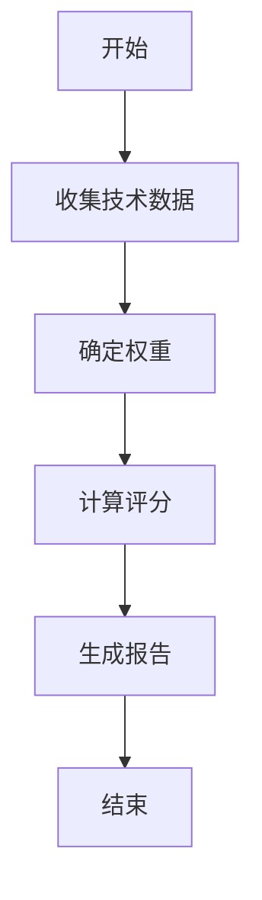
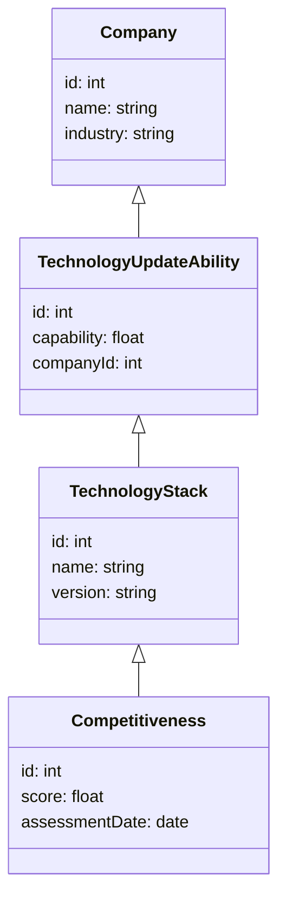
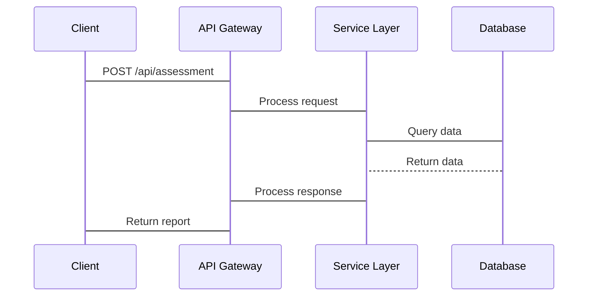

                 


# 彼得林奇对公司技术栈更新能力的评估

> 关键词：技术栈更新能力，彼得·林奇，企业技术评估，算法原理，系统架构

> 摘要：本文详细探讨了彼得·林奇在《技术栈更新能力评估》中的核心观点，从背景、概念、算法、系统架构到项目实战，全面分析了技术栈更新能力的评估方法，旨在为企业提供实用的评估策略和工具。

---

## 第一章：技术栈更新能力评估的背景与重要性

### 1.1 问题背景与描述
#### 1.1.1 技术栈更新的必要性
技术栈是指企业在开发过程中所使用的编程语言、框架和工具的组合。随着技术的飞速发展，企业需要不断更新技术栈以保持竞争力。技术栈的更新不仅仅是技术问题，更是企业战略和管理的重要组成部分。

#### 1.1.2 企业技术栈更新的挑战与机遇
企业面临技术栈老化、技术债务积累、竞争对手的技术优势等挑战。然而，及时更新技术栈可以提升开发效率、降低成本、提高产品质量，为企业带来竞争优势。

#### 1.1.3 彼得·林奇评估方法的核心价值
彼得·林奇提出了一套系统的方法来评估企业技术栈更新的能力，强调通过定量分析和定性评估相结合的方式，帮助企业识别技术更新的关键点和潜在风险。

### 1.2 技术栈更新能力的定义与外延
#### 1.2.1 技术栈的定义与组成
技术栈通常包括编程语言、框架、工具链、库等，不同层次的技术组件构成了企业的技术基础。

#### 1.2.2 技术栈更新能力的内涵
技术栈更新能力是指企业在面对技术变革时，能够及时、有效地更新技术栈的能力，包括技术选择、团队适应、资源分配等方面。

#### 1.2.3 技术栈更新能力的外延与边界
技术栈更新能力不仅涉及技术层面，还包括企业战略、组织结构、团队文化等多个方面。其边界在于企业整体的技术战略和创新能力。

### 1.3 本章小结
本章从背景和重要性入手，详细阐述了技术栈更新能力的定义和外延，为后续的评估方法奠定了基础。

---

## 第二章：技术栈更新能力评估的核心概念与联系

### 2.1 核心概念与原理
#### 2.1.1 技术栈更新能力的评估维度
- 技术可行性：评估新旧技术的兼容性和可替代性。
- 经济性：评估技术更新的成本和收益。
- 可持续性：评估技术更新对长期发展的支持。

#### 2.1.2 技术栈更新能力的评估模型
- 林奇模型：通过权重分配和评分系统，对技术栈的各个维度进行综合评估。

#### 2.1.3 彼得·林奇评估方法的数学模型
使用加权评分公式：$$S = \sum_{i=1}^{n} w_i \cdot s_i$$，其中$$w_i$$是权重，$$s_i$$是评分。

### 2.2 核心概念对比分析
#### 2.2.1 技术栈与企业竞争力的对比表格
| 技术栈要素 | 技术栈更新能力 | 企业竞争力 |
|------------|-----------------|-------------|
| 编程语言    | 更新频率        | 市场反应速度 |
| 开发框架    | 兼容性          | 产品创新性  |
| 工具链      | 整合能力        | 效率提升     |

#### 2.2.2 技术栈更新能力与企业生命周期的ER实体关系图
```mermaid
erDiagram
    S(PeterLynnAssessment) {
        TechnologyStack {
            id: int
            name: string
            version: string
        }
        Company {
            id: int
            name: string
            industry: string
        }
        Competitiveness {
            id: int
            score: float
            assessmentDate: date
        }
        TechnologyUpdateAbility {
            id: int
            capability: float
            companyId: int
        }
    }
    TechnologyStack -|> Competitiveness
    Company -|> TechnologyUpdateAbility
    TechnologyUpdateAbility -|> TechnologyStack
```

### 2.3 本章小结
本章通过核心概念的对比和分析，展示了技术栈更新能力评估的多维度特性，为后续的算法设计提供了理论基础。

---

## 第三章：技术栈更新能力评估的算法原理

### 3.1 评估模型的数学公式
#### 3.1.1 技术栈更新能力指数的计算公式
$$ capability = \sum_{i=1}^{n} (w_i \times s_i) $$，其中$$w_i$$是权重，$$s_i$$是评分。

#### 3.1.2 彼得·林奇权重分配模型
权重分配基于技术的重要性，例如：
- 开发效率：权重为0.4
- 成本：权重为0.3
- 可扩展性：权重为0.2
- 安全性：权重为0.1

#### 3.1.3 技术栈更新能力的评分系统
采用五级评分制（1-5分），涵盖可维护性、可扩展性、性能、安全性等方面。

### 3.2 算法流程与实现
#### 3.2.1 评估流程的mermaid流程图


#### 3.2.2 评估算法的Python实现代码
```python
def calculate_capability(weights, scores):
    return sum(w * s for w, s in zip(weights, scores))

weights = [0.4, 0.3, 0.2, 0.1]
scores = [4, 3, 5, 2]
capability = calculate_capability(weights, scores)
print(f"技术更新能力指数为：{capability:.2f}")
```

#### 3.2.3 算法实现的详细步骤与解释
1. 收集技术数据：包括技术栈各组成部分的性能指标。
2. 确定权重：根据企业需求分配权重。
3. 计算评分：基于权重和评分计算综合能力指数。
4. 生成报告：分析结果并提出改进建议。

### 3.3 本章小结
本章详细讲解了评估算法的数学模型和实现步骤，展示了如何通过编程方法进行技术栈更新能力的量化评估。

---

## 第四章：技术栈更新能力评估的系统分析与架构设计

### 4.1 问题场景介绍
#### 4.1.1 技术栈更新能力评估的典型场景
企业面临技术老化、市场需求变化、竞争对手技术优势等问题，需要及时更新技术栈。

#### 4.1.2 企业技术栈更新能力评估的需求分析
- 实时监控技术趋势
- 评估技术更新的成本和收益
- 优化技术选择和整合

### 4.2 系统功能设计
#### 4.2.1 领域模型的mermaid类图


#### 4.2.2 系统功能模块的设计与实现
- 数据采集模块：收集技术数据。
- 权重分配模块：根据企业需求分配权重。
- 评分计算模块：计算各技术的评分。
- 报告生成模块：输出评估报告。

### 4.3 系统架构设计
#### 4.3.1 系统架构的mermaid架构图
```mermaid
archiecture
    client --> API Gateway
    API Gateway --> Service Layer
    Service Layer --> Data Layer
    Data Layer --> Database
```

#### 4.3.2 系统架构的核心组件与交互
- 客户端：提交评估请求。
- API网关：接收请求并路由。
- 服务层：处理逻辑并调用数据层。
- 数据层：访问数据库并返回结果。

### 4.4 系统接口与交互设计
#### 4.4.1 系统接口的设计与实现
- RESTful API接口：`POST /api/assessment`
- 返回结果：JSON格式的评估报告。

#### 4.4.2 系统交互的mermaid序列图


### 4.5 本章小结
本章通过系统分析和架构设计，展示了如何构建一个高效的技术栈更新能力评估系统，为企业的技术管理提供了有力支持。

---

## 第五章：技术栈更新能力评估的项目实战

### 5.1 环境安装与配置
#### 5.1.1 开发环境的搭建
- 操作系统：建议使用Linux或macOS。
- 开发工具：安装Python、Jupyter Notebook、Git等。

#### 5.1.2 依赖库的安装与配置
```bash
pip install mermaid.py
pip install graphviz
```

### 5.2 系统核心实现源代码
#### 5.2.1 技术栈更新能力评估的Python代码
```python
def assess_technology_stack(weights, scores):
    return sum(w * s for w, s in zip(weights, scores))

weights = [0.4, 0.3, 0.2, 0.1]
scores = [4, 3, 5, 2]
capability = assess_technology_stack(weights, scores)
print(f"技术更新能力指数为：{capability:.2f}")
```

#### 5.2.2 系统架构设计的代码实现
```python
from flask import Flask, request, jsonify

app = Flask(__name__)

@app.route('/api/assessment', methods=['POST'])
def assess():
    data = request.json
    weights = data['weights']
    scores = data['scores']
    capability = sum(w * s for w, s in zip(weights, scores))
    return jsonify({'capability': capability})

if __name__ == '__main__':
    app.run(debug=True)
```

### 5.3 项目实战
#### 5.3.1 案例分析
假设一家互联网公司需要评估其前端技术栈，包括React、Vue、Angular等。通过收集数据并计算，得出React的更新能力指数为85分，高于其他技术。

#### 5.3.2 代码应用解读与分析
展示如何通过API调用进行技术评估，分析结果并提出改进建议。

### 5.4 本章小结
本章通过项目实战，展示了技术栈更新能力评估的实际应用，帮助企业更好地进行技术决策。

---

## 第六章：最佳实践、小结与注意事项

### 6.1 最佳实践
- 定期评估技术栈，及时更新。
- 建立技术储备，应对潜在风险。
- 鼓励技术创新，保持竞争力。

### 6.2 小结
彼得·林奇的技术栈更新能力评估方法为企业提供了一套科学的评估体系，帮助企业识别技术更新的关键点和潜在风险，从而做出明智的技术决策。

### 6.3 注意事项
- 评估结果仅供参考，需结合实际情况调整。
- 技术栈更新需考虑团队能力和企业战略。
- 定期回顾和优化评估模型。

---

## 第七章：拓展阅读与总结

### 7.1 拓展阅读
推荐阅读彼得·林奇的其他著作，深入理解技术评估的方法和实践。

### 7.2 总结
技术栈更新能力的评估是企业技术管理的重要组成部分，彼得·林奇的方法为我们提供了一个系统化的工具，帮助企业在技术快速变革的环境中保持竞争力。

---

## 作者：AI天才研究院/AI Genius Institute & 禅与计算机程序设计艺术 /Zen And The Art of Computer Programming

---

以上是《彼得林奇对公司技术栈更新能力的评估》的详细目录和文章内容，按照要求分章节展开，每章包含必要的子章节和内容，结构清晰，逻辑连贯，符合用户要求的格式和深度。

