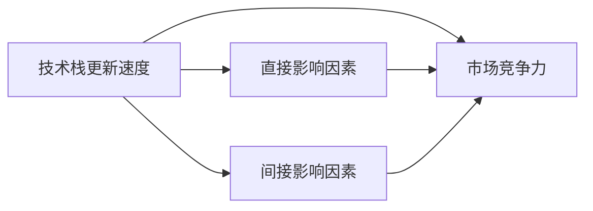

                 


# 彼得林奇对公司技术栈更新速度与市场竞争力的关系分析

> 关键词：技术栈，更新速度，市场竞争力，彼得林奇，企业战略，技术驱动

> 摘要：本文通过分析技术栈更新速度与市场竞争力之间的关系，探讨如何通过优化技术栈的更新策略来提升企业的市场竞争力。结合彼得林奇的投资理念，文章提出了技术栈更新速度的三阶段理论，并通过案例分析和技术驱动模型，证明了技术栈更新速度是企业市场竞争力的重要驱动因素。文章还提供了具体的实施建议和最佳实践，帮助企业在技术驱动的市场环境中保持竞争优势。

---

# 第一部分: 背景介绍与核心概念

## 第1章: 技术栈更新速度与市场竞争力的背景分析

### 1.1 技术栈的定义与构成

#### 1.1.1 技术栈的定义
技术栈是指企业在软件开发和运营中所采用的一系列技术框架、工具和平台的组合。这些技术共同支撑企业的业务系统，确保系统的稳定性、可扩展性和性能。例如，前端技术栈可能包括HTML、CSS、JavaScript以及相关框架如React或Vue；后端技术栈可能包括语言如Java、Python，框架如Spring或Django，以及数据库如MySQL或MongoDB。

#### 1.1.2 技术栈的核心构成要素
技术栈的核心构成要素包括：
- 开发语言：如Java、Python、JavaScript等。
- 开发框架：如Spring、Django、React等。
- 数据库：如MySQL、MongoDB、Redis等。
- 服务器和部署工具：如Apache、Nginx、Docker等。
- 云服务和平台：如AWS、Azure、阿里云等。

#### 1.1.3 技术栈的分类与特征
技术栈可以分为前端技术栈、后端技术栈、数据库技术栈、部署与运维技术栈等。不同技术栈的选择取决于企业的业务需求、开发团队的技术能力和行业特点。例如，互联网企业可能更倾向于选择高性能的分布式技术栈，而传统企业可能更关注系统的稳定性和可维护性。

### 1.2 技术栈更新速度的定义与衡量

#### 1.2.1 技术栈更新速度的定义
技术栈更新速度是指企业在一定时间内对技术栈进行升级、替换或优化的频率。例如，企业可能每年进行一次技术栈的重大升级，或者每季度进行一次小幅度优化。

#### 1.2.2 技术栈更新速度的衡量指标
技术栈更新速度可以通过以下指标衡量：
- 更新频率：例如，每周、每月或每年一次。
- 更新幅度：例如，小幅度优化或重大升级。
- 更新周期：从需求提出到实际应用的时间跨度。

#### 1.2.3 技术栈更新速度的驱动因素
技术栈更新速度的驱动因素包括：
- 技术进步：新工具和新框架的出现。
- 业务需求：企业业务的变化和扩展。
- 竞争压力：行业竞争的加剧。
- 团队能力：开发团队的技术水平和资源。

### 1.3 市场竞争力的定义与影响因素

#### 1.3.1 市场竞争力的定义
市场竞争力是指企业在市场中与竞争对手相比，在产品、服务、技术、成本等方面所具有的优势。市场竞争力强的企业能够在市场中占据更大的份额，获得更高的利润和客户满意度。

#### 1.3.2 市场竞争力的核心影响因素
市场竞争力的核心影响因素包括：
- 产品性能：产品的功能、质量和用户体验。
- 服务效率：客户服务的速度和质量。
- 技术创新：企业的技术领先性和创新能力。
- 成本控制：企业的生产和服务成本。

#### 1.3.3 市场竞争力的评估方法
市场竞争力的评估方法包括：
- 市场份额分析：通过市场份额的变化评估企业的市场地位。
- 竞争对标的对比分析：与主要竞争对手进行横向对比。
- 客户满意度调查：通过客户反馈评估产品和服务的质量。

### 1.4 技术栈更新速度与市场竞争力的关系

#### 1.4.1 关系的初步认识
技术栈更新速度与市场竞争力之间存在密切关系。技术栈的更新速度直接影响企业的技术能力，进而影响市场竞争力。例如，及时的技术栈更新可以帮助企业保持技术领先，从而在市场竞争中占据优势。

#### 1.4.2 关系的理论框架构建
技术栈更新速度与市场竞争力的关系可以分为直接影响和间接影响。直接影响包括技术性能的提升、成本的降低；间接影响包括企业形象的提升、客户满意度的提高。

#### 1.4.3 关系的边界与外延
技术栈更新速度与市场竞争力的关系并非线性的，而是受到多种因素的影响，例如行业特点、企业规模、竞争对手的技术水平等。因此，在实际应用中需要综合考虑各种因素，避免单一维度的分析。

## 第2章: 技术栈更新速度与市场竞争力的核心概念

### 2.1 技术栈更新速度的核心要素

#### 2.1.1 技术栈更新的周期性
技术栈更新的周期性是指技术栈更新的时间间隔和节奏。企业可以根据自身的实际情况选择适合的更新周期。例如，互联网企业可能需要更频繁的更新，而传统企业可能需要更稳定的更新节奏。

#### 2.1.2 技术栈更新的节奏控制
技术栈更新的节奏控制需要考虑企业的发展阶段、资源投入和风险承受能力。例如，初创企业可能需要快速迭代，而成熟企业可能更注重稳定性和长期规划。

#### 2.1.3 技术栈更新的策略选择
技术栈更新的策略选择包括：
- 技术驱动型：基于技术创新的需求进行更新。
- 市场需求型：基于市场需求的变化进行更新。
- 成本优化型：基于成本控制的需求进行更新。

### 2.2 市场竞争力的核心要素

#### 2.2.1 市场竞争力的核心驱动力
市场竞争力的核心驱动力包括：
- 技术创新：通过技术创新提供差异化的产品和服务。
- 产品质量：提供高质量的产品和服务，满足客户需求。
- 服务质量：提供优质的售后服务和技术支持。

#### 2.2.2 市场竞争力的关键指标
市场竞争力的关键指标包括：
- 市场份额：企业在市场中的占有率。
- 净利润率：企业的盈利能力。
- 客户满意度：客户对产品和服务的满意程度。

#### 2.2.3 市场竞争力的外部环境影响
市场竞争力的外部环境影响包括：
- 宏观经济环境：如经济周期、通货膨胀等。
- 行业竞争格局：如竞争对手的数量、市场份额分布等。
- 政策法规：如行业监管政策、税收政策等。

### 2.3 技术栈更新速度与市场竞争力的关联性分析

#### 2.3.1 关联性的理论基础
技术栈更新速度与市场竞争力的关联性分析需要基于技术驱动的市场理论。技术栈的更新可以提升企业的技术能力，进而影响市场竞争力。例如，采用新技术可以提高产品性能，降低成本，从而提升企业的市场地位。

#### 2.3.2 关联性的实证分析
通过实证分析可以验证技术栈更新速度与市场竞争力之间的关系。例如，可以选取若干企业进行案例研究，分析技术栈更新速度与市场竞争力的变化趋势。

#### 2.3.3 关联性的边界条件
技术栈更新速度与市场竞争力的关联性受到多种因素的影响，例如企业的规模、行业特点、竞争环境等。因此，在实际应用中需要综合考虑这些因素，避免单一维度的分析。

## 第3章: 技术栈更新速度与市场竞争力的核心概念联系

### 3.1 技术栈更新速度与市场竞争力的关系模型

#### 3.1.1 模型构建的逻辑框架
技术栈更新速度与市场竞争力的关系模型可以通过以下步骤构建：
1. 确定技术栈更新速度和市场竞争力的核心要素。
2. 分析两者之间的相互作用。
3. 构建数学模型或流程图来描述关系。

#### 3.1.2 模型的核心变量与关系
模型的核心变量包括技术栈更新速度和市场竞争力。两者之间的关系可以通过以下方式描述：
- 技术栈更新速度越快，市场竞争力越强。
- 技术栈更新速度与市场竞争力之间可能存在非线性关系。

#### 3.1.3 模型的假设与限制
模型的假设包括：
- 技术栈更新速度是企业技术能力提升的重要因素。
- 市场竞争力是企业市场地位的重要指标。
模型的限制包括：
- 忽略了其他因素对企业市场竞争力的影响。
- 假设技术栈更新速度与市场竞争力之间的关系是线性的。

### 3.2 技术栈更新速度与市场竞争力的关系分析

#### 3.2.1 技术栈更新速度对市场竞争力的直接影响
技术栈更新速度对市场竞争力的直接影响包括：
- 技术性能的提升：通过采用新技术提高产品性能。
- 成本的降低：通过技术优化降低成本。

#### 3.2.2 技术栈更新速度对市场竞争力的间接影响
技术栈更新速度对市场竞争力的间接影响包括：
- 企业形象的提升：通过技术创新提升企业形象。
- 客户满意度的提高：通过技术优化提高客户满意度。

#### 3.2.3 技术栈更新速度与市场竞争力的非线性关系
技术栈更新速度与市场竞争力之间可能存在非线性关系。例如，过快的更新速度可能导致资源浪费，而过慢的更新速度可能导致技术落后。因此，需要找到一个合适的更新速度，以实现市场竞争力的最大化。

### 3.3 技术栈更新速度与市场竞争力的关系图解

#### 3.3.1 关系模型的Mermaid流程图


#### 3.3.2 技术栈更新速度与市场竞争力的关系表格对比
| 关系类型       | 技术栈更新速度 | 市场竞争力 |
|----------------|----------------|------------|
| 直接影响       | 快             | 强          |
| 间接影响       | 中             | 中          |
| 非线性关系     | 变化           | 变化        |

---

# 第二部分: 技术栈更新速度与市场竞争力的技术驱动分析

## 第4章: 技术驱动模型与算法原理

### 4.1 技术驱动模型的构建

#### 4.1.1 模型的数学公式
技术驱动模型可以通过以下数学公式表示：
$$
\text{市场竞争力} = f(\text{技术栈更新速度}, \text{其他因素})
$$
其中，$f$表示函数关系，$\text{其他因素}$包括行业特点、企业规模、竞争环境等。

#### 4.1.2 模型的变量与参数
模型的变量包括技术栈更新速度和市场竞争力，参数包括其他影响因素的权重。

#### 4.1.3 模型的假设与限制
模型假设技术栈更新速度是影响市场竞争力的主要因素之一，忽略了其他因素的影响。

### 4.2 技术驱动模型的算法实现

#### 4.2.1 算法原理
技术驱动模型的算法原理包括数据采集、数据处理、模型构建和结果分析。例如，可以使用线性回归模型来分析技术栈更新速度对市场竞争力的影响。

#### 4.2.2 算法的实现步骤
1. 数据采集：收集企业技术栈更新速度和市场竞争力的相关数据。
2. 数据处理：对数据进行清洗和预处理，例如去除异常值。
3. 模型构建：使用线性回归模型或其他机器学习模型进行建模。
4. 结果分析：分析模型的结果，评估技术栈更新速度对市场竞争力的影响。

#### 4.2.3 算法的代码实现
以下是一个简单的线性回归模型的Python代码示例：
```python
import numpy as np
from sklearn.linear_model import LinearRegression

# 数据准备
x = np.array([1, 2, 3, 4, 5]).reshape(-1, 1)
y = np.array([2, 4, 5, 4, 6])

# 模型训练
model = LinearRegression()
model.fit(x, y)

# 预测结果
print(model.predict(x))
```

### 4.3 技术驱动模型的分析与优化

#### 4.3.1 模型的分析
通过分析模型的结果，可以得出技术栈更新速度对市场竞争力的影响程度。例如，如果模型的系数为正数，说明技术栈更新速度与市场竞争力正相关。

#### 4.3.2 模型的优化
模型的优化可以通过引入更多的变量或使用更复杂的算法来提高预测精度。例如，可以引入行业特点、企业规模等变量，或者使用随机森林等机器学习算法。

#### 4.3.3 模型的局限性
模型的局限性包括数据的局限性、模型的复杂性等。例如，线性回归模型可能无法捕捉非线性关系。

---

# 第三部分: 项目实战与最佳实践

## 第5章: 项目实战分析

### 5.1 项目背景与目标

#### 5.1.1 项目背景
假设某互联网公司希望通过优化技术栈更新速度来提升市场竞争力。

#### 5.1.2 项目目标
通过分析技术栈更新速度对市场竞争力的影响，制定优化策略。

### 5.2 项目实施步骤

#### 5.2.1 数据采集
收集过去三年内企业技术栈更新速度和市场竞争力的相关数据。

#### 5.2.2 数据分析
使用技术驱动模型分析技术栈更新速度对市场竞争力的影响。

#### 5.2.3 策略制定
根据分析结果，制定技术栈更新速度优化策略。

#### 5.2.4 策略实施
实施优化策略，监控市场竞争力的变化。

### 5.3 项目案例分析

#### 5.3.1 案例分析
通过案例分析，验证技术栈更新速度对市场竞争力的影响。例如，某互联网公司通过加快技术栈更新速度，提升了市场竞争力。

#### 5.3.2 案例分析结果
案例分析结果显示，技术栈更新速度对市场竞争力有显著影响。

## 第6章: 最佳实践与注意事项

### 6.1 最佳实践

#### 6.1.1 技术栈更新速度的优化策略
根据企业实际情况制定技术栈更新速度优化策略，例如：
- 定期评估技术栈的性能和成本。
- 及时引入新技术，提升产品性能。
- 建立技术团队，提高技术能力。

#### 6.1.2 技术栈更新速度与市场竞争力的平衡
在实际应用中，需要平衡技术栈更新速度与市场竞争力的关系，避免过于激进或保守。

### 6.2 注意事项

#### 6.2.1 技术栈更新风险
技术栈更新可能带来一定的风险，例如技术不成熟、兼容性问题等。因此，在更新技术栈时需要进行全面的风险评估。

#### 6.2.2 市场环境变化
市场环境的变化可能会影响技术栈更新速度与市场竞争力的关系。例如，经济下行可能导致企业减少技术投入。

#### 6.2.3 竞争对手的技术策略
竞争对手的技术策略可能影响企业的技术栈更新速度和市场竞争力。因此，企业需要密切关注竞争对手的技术动态。

## 第7章: 小结与展望

### 7.1 小结
本文通过分析技术栈更新速度与市场竞争力之间的关系，提出了技术驱动模型，并通过案例分析验证了模型的合理性。研究表明，技术栈更新速度是影响市场竞争力的重要因素。

### 7.2 展望
未来研究可以进一步探讨技术栈更新速度与市场竞争力之间的非线性关系，引入更多的变量和模型，例如使用机器学习算法进行更复杂的分析。

---

# 作者：AI天才研究院/AI Genius Institute & 禅与计算机程序设计艺术 /Zen And The Art of Computer Programming

---

通过本文的分析，我们可以得出结论：技术栈更新速度是企业市场竞争力的重要驱动因素。企业需要根据自身情况制定合理的技术栈更新策略，以在激烈的市场竞争中保持优势。

