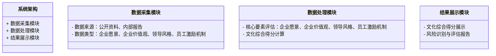
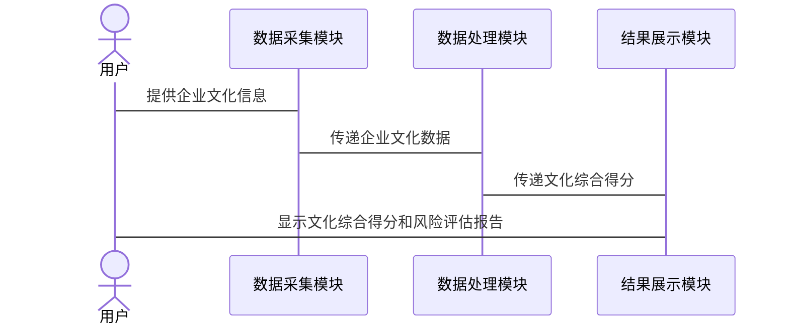

                 


# 彼得林奇对公司文化的重视

> 关键词：彼得·林奇，公司文化，投资策略，企业文化评估，领导力，企业风险

> 摘要：本文深入探讨了彼得·林奇对一家公司文化的重视程度，并分析了这种文化如何影响投资决策和企业长期发展。通过详细分析公司文化的核心要素、评估方法和影响机制，本文为投资者和企业管理者提供了宝贵的见解，帮助他们更好地理解公司文化在投资和管理中的重要性。

---

# 第一部分: 公司文化与投资策略概述

## 第1章: 公司文化的定义与重要性

### 1.1 公司文化的定义

#### 1.1.1 公司文化的内涵与外延

公司文化是企业在长期经营过程中形成的一套价值观、行为准则、管理风格和企业精神的总和。它不仅包括显性的制度和规范，还包括隐性的企业精神和员工共同认知的企业使命。

**公司文化的核心要素包括：**
- 企业愿景与使命
- 企业价值观
- 领导风格与管理哲学
- 员工激励机制
- 企业沟通与协作文化

**公司文化对外部的影响：**
- 影响客户对企业形象的认知
- 影响员工的工作积极性
- 影响合作伙伴的选择
- 影响企业的品牌价值

#### 1.1.2 公司文化的重要性

公司文化是企业成功的关键因素之一。它不仅决定了企业的决策风格，还影响着企业的长期发展方向和员工的工作态度。

**公司文化的重要性体现在以下几个方面：**
1. **塑造企业形象：** 公司文化是企业对外展示的核心价值观，直接影响客户和合作伙伴对企业的信任度。
2. **激发员工潜力：** 一个积极向上的企业文化能够激发员工的工作热情和创造力。
3. **增强企业凝聚力：** 公司文化能够将员工的价值观和企业目标统一起来，增强团队的凝聚力。

#### 1.1.3 彼得·林奇的背景与投资理念

彼得·林奇是全球最著名的投资经理之一，他管理的麦哲伦基金创造了令人瞩目的投资业绩。林奇的成功不仅得益于他对市场的深刻理解，还源于他对公司文化的独特见解。

**彼得·林奇的投资理念：**
1. **长期投资：** 林奇强调长期投资的重要性，他认为短期市场波动不应该影响长期的投资决策。
2. **基本面分析：** 林奇非常注重对企业基本面的分析，尤其是对企业的财务状况和管理团队的考察。
3. **公司文化的重要性：** 林奇认为，公司文化是企业成功的关键因素之一，他非常注重对企业文化的评估。

---

## 第2章: 彼得·林奇对公司文化的独特见解

### 2.1 彼得·林奇对公司文化的评价标准

#### 2.1.1 企业文化的核心要素

林奇认为，优秀的企业文化应该具备以下特点：
1. **清晰的价值观：** 企业文化应该明确企业的核心价值观，并且这些价值观能够得到员工的广泛认同。
2. **积极的领导风格：** 企业的领导者应该具备积极的领导风格，能够激励员工发挥潜力。
3. **高效的沟通机制：** 企业文化应该注重沟通和协作，建立高效的沟通机制，确保信息的透明流通。

#### 2.1.2 企业文化与企业长期发展的关系

林奇认为，企业文化是企业长期发展的基石。一个积极向上的企业文化不仅能够吸引优秀人才，还能够激发员工的工作热情，从而推动企业的持续发展。

**企业文化对企业长期发展的具体影响：**
1. **吸引优秀人才：** 优秀的企业文化能够吸引志同道合的人才，为企业的发展提供人才保障。
2. **提高员工满意度：** 积极的企业文化能够提高员工的满意度，从而降低员工的流动性。
3. **增强企业的创新力：** 优秀的企业文化能够激发员工的创新意识，推动企业的技术进步和产品创新。

#### 2.1.3 彼得·林奇的企业文化筛选标准

林奇在选择投资标的时，非常注重对企业文化的评估。他认为，一个优秀的企业文化应该具备以下特点：
1. **清晰的企业愿景：** 企业应该有明确的愿景和目标，能够让员工明确自己的工作方向。
2. **积极的价值观：** 企业文化应该具备积极向上的价值观，能够激励员工为实现企业目标而努力。
3. **高效的管理机制：** 企业应该具备高效的管理机制，能够确保企业的决策和执行高效有序。

---

## 第3章: 公司文化的核心要素与评估方法

### 3.1 公司文化的核心要素

#### 3.1.1 企业愿景与使命

企业愿景是企业存在的根本目的，它能够为企业的发展指明方向。企业使命则是企业为实现愿景而需要完成的具体目标。

**企业愿景与使命的对比：**
- **愿景：** 长期目标，具有战略意义。
- **使命：** 短期目标，具体可操作。

#### 3.1.2 企业价值观

企业价值观是企业在经营活动中所坚持的基本原则，它能够指导企业的行为，影响企业的决策。

**企业价值观的核心要素：**
1. **客户至上：** 以客户为中心，满足客户需求。
2. **创新：** 鼓励创新，追求技术进步。
3. **诚信：** 诚实守信，建立良好的企业信誉。

#### 3.1.3 领导风格与管理哲学

领导风格是企业文化的重要组成部分，它直接影响员工的工作态度和企业的管理效率。

**领导风格的分类：**
1. **变革型领导：** 鼓励创新，激发员工潜力。
2. **交易型领导：** 以任务为导向，注重工作效率。
3. **仆人型领导：** 关注员工需求，提供支持。

#### 3.1.4 员工激励机制

员工激励机制是企业文化的重要组成部分，它能够激发员工的工作热情，提高企业的整体效率。

**员工激励机制的核心要素：**
1. **绩效考核：** 以绩效为导向，明确员工的工作目标。
2. **奖励机制：** 对表现优秀的员工给予奖励，激励员工积极性。
3. **职业发展：** 提供清晰的职业发展路径，吸引优秀人才。

---

## 第4章: 公司文化对投资决策的影响

### 4.1 公司文化与企业风险

#### 4.1.1 公司文化对企业风险的缓冲作用

一个积极向上的企业文化能够有效降低企业面临的风险。例如，良好的企业沟通机制能够及时发现潜在问题，避免风险的扩大。

**公司文化对企业风险的具体影响：**
1. **降低管理风险：** 良好的企业文化能够提高管理效率，降低管理风险。
2. **降低市场风险：** 优秀的企业文化能够增强企业的市场竞争力，降低市场风险。
3. **降低运营风险：** 积极的企业文化能够提高企业的运营效率，降低运营风险。

#### 4.1.2 不良公司文化对企业风险的影响

不良的企业文化会增加企业面临的风险。例如，如果企业内部存在裙带关系，容易导致决策失误，增加企业的运营风险。

**不良公司文化的具体表现：**
1. **内部管理混乱：** 企业内部缺乏明确的管理机制，容易出现管理混乱。
2. **员工士气低落：** 员工缺乏工作热情，容易导致工作效率低下。
3. **企业创新不足：** 企业缺乏创新动力，容易被市场淘汰。

#### 4.1.3 公司文化风险的识别与评估

企业文化的评估是投资决策的重要环节。投资者需要通过对企业文化的评估，识别潜在的风险，并做出合理的投资决策。

**公司文化风险的识别与评估步骤：**
1. **收集企业文化信息：** 通过公开资料和内部渠道，收集企业的文化信息。
2. **评估企业文化的核心要素：** 对企业的愿景、价值观、领导风格和激励机制进行评估。
3. **识别潜在风险：** 根据企业文化的核心要素，识别潜在的企业风险。
4. **做出投资决策：** 根据企业文化评估结果，做出合理的投资决策。

---

## 第5章: 公司文化评估的数学模型与算法

### 5.1 公司文化评估的数学模型

为了量化公司文化对企业绩效的影响，我们可以构建一个数学模型。该模型将通过对企业文化核心要素的评估，计算出企业文化的综合得分。

**公司文化评估的数学模型：**
$$
\text{文化综合得分} = \sum (\text{各核心要素得分} \times \text{权重})
$$

其中，各核心要素包括企业愿景、企业价值观、领导风格和员工激励机制，权重分别为0.4、0.3、0.2和0.1。

---

## 第6章: 公司文化评估的系统架构设计

### 6.1 系统功能设计

为了实现对公司文化的全面评估，我们可以设计一个系统架构。该系统将包括数据采集、数据处理和结果展示三个模块。

**系统功能设计的类图：**


### 6.2 系统接口设计

系统接口设计需要考虑模块之间的数据传递和功能调用。

**系统接口设计的序列图：**


---

## 第7章: 项目实战

### 7.1 项目背景

本文将通过实际案例分析，展示如何利用彼得·林奇的文化评估模型对企业进行投资决策。

### 7.2 项目实现

#### 7.2.1 环境安装

需要安装Python和相关库：
```bash
pip install numpy pandas matplotlib
```

#### 7.2.2 核心代码实现

```python
import numpy as np
import pandas as pd

# 定义企业文化评估函数
def cultural_assessment(vision_score, values_score, leadership_score, incentives_score):
    # 定义权重
    weight_vision = 0.4
    weight_values = 0.3
    weight_leadership = 0.2
    weight_incentives = 0.1

    # 计算综合得分
    total_score = (
        vision_score * weight_vision +
        values_score * weight_values +
        leadership_score * weight_leadership +
        incentives_score * weight_incentives
    )
    return total_score

# 输入企业文化评估数据
vision_score = 90
values_score = 85
leadership_score = 80
incentives_score = 75

# 计算文化综合得分
cultural_score = cultural_assessment(vision_score, values_score, leadership_score, incentives_score)

# 显示结果
print(f"文化综合得分为：{cultural_score}")
```

---

## 第8章: 最佳实践与小结

### 8.1 最佳实践

1. **注重企业文化的核心要素：** 投资者在进行投资决策时，应该注重对企业文化核心要素的评估，尤其是企业愿景、企业价值观、领导风格和员工激励机制。
2. **结合定量与定性分析：** 在进行企业文化评估时，应该结合定量和定性分析，确保评估结果的全面性和准确性。
3. **持续关注企业文化的动态变化：** 企业文化的动态变化会影响企业的长期发展，投资者需要持续关注企业文化的动态变化，及时调整投资策略。

### 8.2 小结

本文通过详细分析彼得·林奇对公司文化的重视，探讨了公司文化对企业绩效和投资决策的影响。通过构建企业文化评估的数学模型和系统架构设计，为投资者和企业管理者提供了宝贵的理论依据和实践指导。

---

## 作者

作者：AI天才研究院/AI Genius Institute & 禅与计算机程序设计艺术 /Zen And The Art of Computer Programming

