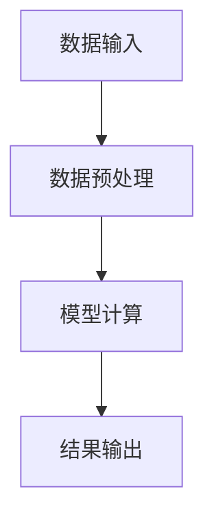
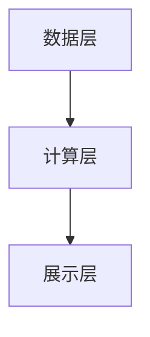

                 


# 彼得林奇对公司无形资产价值的量化分析方法

> 关键词：彼得林奇，无形资产，价值量化，投资分析，企业评估

> 摘要：本文深入探讨了彼得林奇对公司无形资产价值的量化分析方法，结合理论与实践，详细阐述了无形资产的定义、评估模型、算法实现及系统架构设计，通过实际案例分析和代码实现，为读者提供了一套完整的分析框架。

---

## 第一部分: 公司无形资产价值量化分析概述

### 第1章: 无形资产的定义与重要性

#### 1.1 无形资产的定义与特点
无形资产是指企业拥有或控制的没有实物形态的长期资产，主要包括专利权、商标权、商誉、特许经营权等。与有形资产相比，无形资产具有以下特点：
- **无形性**：无物理形态。
- **长期性**：价值持续时间较长。
- **依赖性**：依赖于企业运营和管理。
- **可变性**：价值容易受到市场环境影响。

#### 1.2 彼得林奇与无形资产价值分析
彼得林奇是美国著名的投资专家，以其独特的投资风格和对企业价值的深入分析闻名。他特别关注企业的无形资产，认为这些资产是企业长期竞争优势的核心。他的分析方法以基本面分析为基础，结合市场数据和企业财务指标，对企业无形资产进行量化评估。

### 第2章: 无形资产价值量化分析的核心概念

#### 2.1 核心概念与原理
无形资产的价值评估需要考虑以下几个核心要素：
1. **资产的未来现金流**：预测无形资产为企业带来的未来现金流。
2. **贴现率**：考虑资金的时间价值，选择适当的贴现率。
3. **市场对比**：通过市场交易案例进行对比分析。

彼得林奇模型的核心原理是基于现金流贴现法（DCF模型），通过预测未来现金流并贴现，计算无形资产的现值。

#### 2.2 彼得林奇无形资产价值分析模型
彼得林奇模型可以表示为：
$$ V = \sum_{t=1}^{n} \frac{CF_t}{(1 + r)^t} $$
其中：
- \( V \) 是无形资产的现值。
- \( CF_t \) 是第 \( t \) 年的现金流。
- \( r \) 是贴现率。
- \( n \) 是现金流预测的年数。

### 第3章: 彼得林奇无形资产价值分析的数学模型与公式

#### 3.1 数学模型概述
彼得林奇的无形资产价值分析模型基于以下假设：
1. 企业的现金流可以被准确预测。
2. 贴现率是稳定的。
3. 企业所在的行业具有可比性。

模型的实现步骤如下：
1. **预测未来现金流**：基于历史数据和行业趋势，预测未来每一年的现金流。
2. **计算现值**：使用贴现率将每一年的现金流贴现，求和得到无形资产的现值。

#### 3.2 模型的实现与应用
以下是模型的Python实现代码：

```python
def calculate_invisible_asset_value(cash_flows, discount_rate):
    present_value = 0
    for t, cf in enumerate(cash_flows, start=1):
        present_value += cf / (1 + discount_rate) ** t
    return present_value

# 示例数据
cash_flows = [100, 150, 200, 250, 300]
discount_rate = 0.1

value = calculate_invisible_asset_value(cash_flows, discount_rate)
print(f"无形资产现值为: {value:.2f}")
```

### 第4章: 彼得林奇无形资产价值分析的系统架构设计

#### 4.1 系统功能设计
系统功能模块划分如下：
1. **数据输入**：接收企业财务数据和市场数据。
2. **模型计算**：执行现金流预测和贴现计算。
3. **结果输出**：展示无形资产的评估结果。

系统功能流程图如下：


#### 4.2 系统架构设计
系统架构分为三层：
1. **数据层**：存储企业数据和市场数据。
2. **计算层**：执行现金流预测和贴现计算。
3. **展示层**：以图形化方式展示评估结果。

系统架构图如下：


### 第5章: 项目实战与案例分析

#### 5.1 项目环境安装与配置
需要安装以下依赖：
- Python 3.8+
- NumPy
- Pandas

#### 5.2 核心代码实现
以下是核心代码：
```python
import numpy as np
import pandas as pd

def calculate_invisible_asset_value(cash_flows, discount_rate):
    return np.npv(discount_rate, cash_flows)

# 示例数据
cash_flows = np.array([100, 150, 200, 250, 300])
discount_rate = 0.1

value = calculate_invisible_asset_value(cash_flows, discount_rate)
print(f"无形资产现值为: {value:.2f}")
```

### 第6章: 最佳实践与注意事项

#### 6.1 实践中的注意事项
1. 数据质量至关重要，确保输入数据的准确性和完整性。
2. 模型的贴现率选择应基于市场实际情况。
3. 模型结果需结合行业特点进行调整。

#### 6.2 未来发展趋势
1. 结合人工智能技术，提升预测精度。
2. 开发更多样化的评估模型，适应不同行业需求。

### 第7章: 小结与总结

#### 7.1 全书内容回顾
本文详细介绍了彼得林奇的无形资产价值量化分析方法，从理论到实践，为读者提供了一套完整的分析框架。

#### 7.2 读者思考与实践建议
读者可以通过实际案例练习模型的应用，并结合行业特点进行优化，以提高分析的准确性。

---

作者：AI天才研究院/AI Genius Institute & 禅与计算机程序设计艺术 /Zen And The Art of Computer Programming

