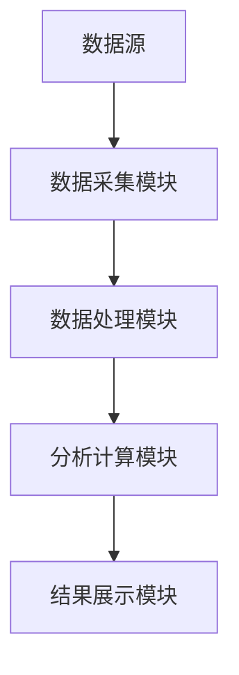

                 


# 彼得林奇对公司无形资产回报率的分析

> 关键词：彼得·林奇，无形资产，回报率分析，投资策略，企业价值，财务分析

> 摘要：本文深入分析了彼得·林奇对公司无形资产回报率的分析方法，探讨了无形资产在企业价值评估中的重要性，以及如何通过定量和定性分析相结合的方法，准确评估公司的无形资产回报率。文章结合理论与实践，详细介绍了分析模型、算法实现和实际案例，为投资者提供了科学的投资决策依据。

---

## 第一部分：背景介绍

### 第1章：无形资产的重要性

#### 1.1 无形资产的定义与分类
- **无形资产**是指企业长期使用且没有实物形态的资产，包括品牌价值、客户忠诚度、技术专利、商誉等。
- **分类**：可以分为可识别无形资产（如专利、商标）和不可识别无形资产（如商誉）。

#### 1.2 无形资产在企业中的重要性
- 无形资产是企业核心竞争力的体现。
- 在高科技行业，无形资产的价值甚至超过有形资产。
- 无形资产往往决定企业的市场地位和长期盈利能力。

#### 1.3 彼得·林奇的分析方法
- 林奇通过长期投资实践，总结出一套独特的无形资产分析方法。
- 强调将无形资产量化，纳入投资决策模型。

---

### 第2章：传统财务分析的局限性

#### 2.1 财务报表的局限性
- 传统财务报表主要关注有形资产和财务指标（如ROE、ROA）。
- 无形资产的价值难以准确计量，导致财务报表无法全面反映企业价值。

#### 2.2 无形资产的忽视带来的问题
- 投资者忽略无形资产可能导致误判企业价值。
- 高新技术企业中，无形资产占比高，传统分析方法失效。

---

## 第二部分：核心概念与联系

### 第3章：彼得·林奇的分析模型

#### 3.1 模型的核心要素
- **输入变量**：净利润、无形资产、研发投入等。
- **输出结果**：无形资产回报率（ROI）。
- **假设条件**：无形资产价值可量化，且对企业未来收益有显著影响。

#### 3.2 模型的数学表达
- **无形资产回报率公式**：
$$ ROI = \frac{净利润}{无形资产} $$

#### 3.3 模型的优缺点
| 优点 | 缺点 |
|------|------|
| 能量化无形资产的贡献 | 依赖准确的无形资产估值 |
| 适合高科技企业 | 忽略了无形资产的动态变化 |

---

## 第三部分：算法原理

### 第4章：算法实现

#### 4.1 算法流程
1. 数据采集：获取公司的财务报表，提取净利润和无形资产数据。
2. 计算ROI：使用公式计算无形资产回报率。
3. 分析结果：判断回报率是否合理，评估企业价值。

#### 4.2 Python代码实现
```python
def calculate__roi(net_profit, intangible_assets):
    return net_profit / intangible_assets

# 示例数据
net_profit = 10000000  # 净利润
intangible_assets = 50000000  # 无形资产
roi = calculate_roi(net_profit, intangible_assets)
print(f"无形资产回报率: {roi:.2f}%")
```

---

## 第四部分：系统分析与架构设计

### 第5章：系统架构

#### 5.1 系统功能模块
- **数据采集**：从财务报表中提取数据。
- **数据处理**：清洗和转换数据。
- **分析计算**：计算ROI并生成报告。

#### 5.2 系统架构图


---

## 第五部分：项目实战

### 第6章：案例分析

#### 6.1 案例背景
- 公司：某科技企业。
- 数据：净利润=1000万，无形资产=5000万。

#### 6.2 计算与分析
- ROI=1000/5000=20%。
- 该回报率表明无形资产贡献显著，企业价值被低估。

---

## 第六部分：总结与展望

### 第7章：总结

- 彼得·林奇的分析方法为投资者提供了新的视角。
- 无形资产回报率分析是评估企业价值的重要工具。
- 投资者应结合定量分析与定性判断，做出明智决策。

### 第8章：展望

- 进一步优化分析模型，考虑更多无形资产因素。
- 研究无形资产的动态变化对回报率的影响。
- 开发智能化分析工具，提高评估效率。

---

# 作者信息

作者：AI天才研究院/AI Genius Institute & 禅与计算机程序设计艺术 /Zen And The Art of Computer Programming

---

通过本文的系统分析与实践，读者可以深入了解彼得·林奇的无形资产回报率分析方法，并将其应用于实际投资决策中。希望这篇文章能为投资者提供有价值的参考，帮助他们在复杂多变的市场中做出更明智的投资选择。

