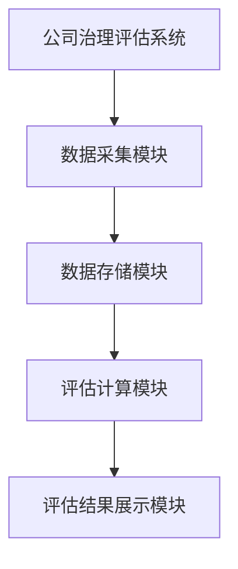
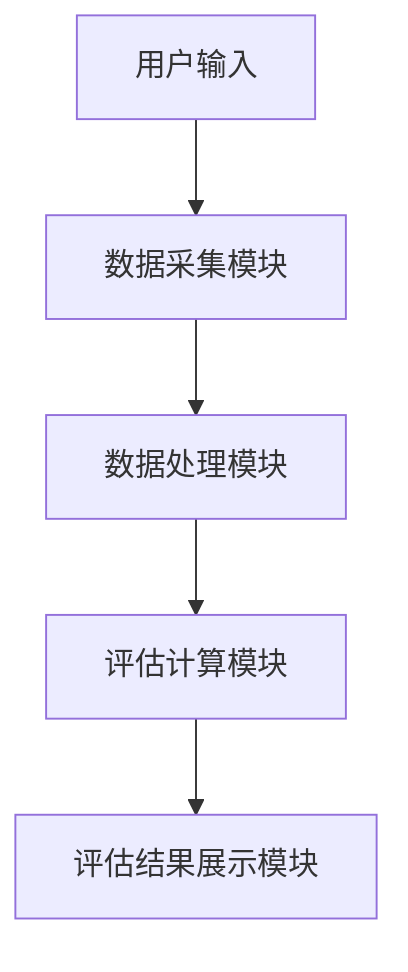
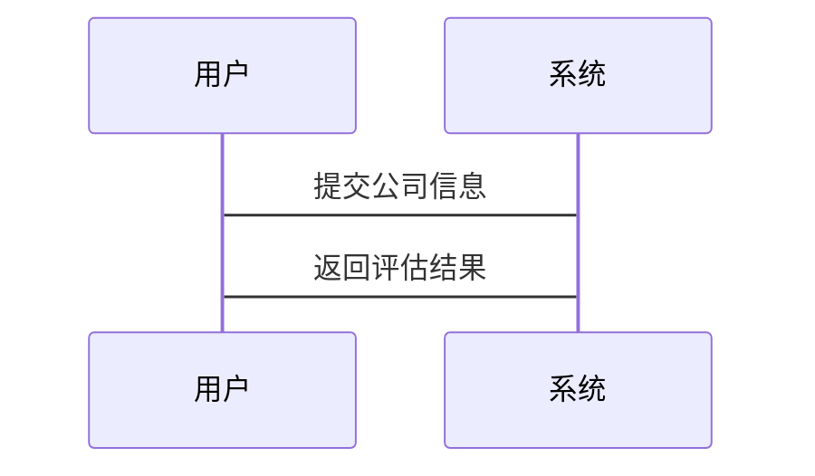

                 


# 彼得林奇对公司治理结构的评估标准

> 关键词：彼得·林奇，公司治理，评估标准，股东结构，董事会结构，高管激励

> 摘要：本文详细探讨了彼得·林奇对公司治理结构的评估标准，从股东结构、董事会结构到高管激励机制，分析了这些因素如何影响公司的长期表现。通过实际案例和系统设计，展示了如何将这些标准应用于实际的企业评估中。

---

# 第一部分: 公司治理结构评估的背景与核心概念

## 第1章: 公司治理结构的基本概念

### 1.1 公司治理的定义与内涵

#### 1.1.1 公司治理的定义
公司治理是确保公司有效运作和实现其战略目标的体系。它涉及董事会、管理层、股东和其他利益相关者之间的关系和责任。

#### 1.1.2 公司治理的核心要素
- 股东结构：股东的股权分布和控制权。
- 董事会结构：董事会的组成、职责和运作方式。
- 管理层激励：高管的薪酬和激励机制。
- 透明度与问责：公司信息披露的透明度和管理层的问责机制。

#### 1.1.3 公司治理的目标与意义
公司治理的目标是最大化公司价值，保护股东权益，同时兼顾其他利益相关者的利益。良好的公司治理可以提高公司的透明度、稳定性和长期竞争力。

### 1.2 彼得·林奇与投资分析

#### 1.2.1 彼得·林奇的背景与投资理念
彼得·林奇是美国著名的投资专家，以其基本面分析和选股能力闻名。他认为，公司治理是决定公司长期表现的关键因素之一。

#### 1.2.2 彼得·林奇对公司治理的关注
林奇认为，公司治理结构的优劣直接影响公司的稳定性和盈利能力。他特别关注董事会的独立性、管理层的激励机制以及股东的权益保护。

#### 1.2.3 彼得·林奇的投资者教育贡献
林奇通过书籍和演讲，向投资者传授了如何分析公司治理结构的方法，帮助投资者识别优质企业。

### 1.3 公司治理结构的外延与边界

#### 1.3.1 公司治理的边界与范围
公司治理的边界包括公司内部的组织结构、外部的监管环境以及与利益相关者的互动。

#### 1.3.2 公司治理与公司战略的关系
公司治理为公司战略的制定和执行提供框架和支持，良好的公司治理可以促进战略的有效实施。

#### 1.3.3 公司治理与利益相关者的关系
公司治理需要平衡股东、债权人、员工、客户和监管机构等利益相关者的利益。

---

# 第二部分: 彼得·林奇公司治理评估的核心标准

## 第2章: 股东结构与股权分布

### 2.1 股东结构的定义与分类

#### 2.1.1 控股股东与中小股东的定义
- 控股股东：持有公司超过50%股权的股东。
- 中小股东：持有公司5%以下股权的股东。

#### 2.1.2 股权分布的类型
- 集中型：控股股东持股比例高。
- 分散型：股权分散，无控股股东。

#### 2.1.3 股权分散与集中的优缺点
- 集中型：决策高效，但可能缺乏透明度。
- 分散型：决策透明，但可能效率较低。

### 2.2 彼得·林奇对股东结构的评估标准

#### 2.2.1 股东结构的稳定性分析
- 股权分散的公司治理结构更稳定，不容易被控股股东操纵。

#### 2.2.2 股东结构与公司控制权的关系
- 控股股东的控制权可能影响公司决策的独立性和透明度。

#### 2.2.3 股东结构对股价的影响
- 股权分散的公司通常更受投资者青睐，因为其治理结构更透明和稳定。

### 2.3 股东结构的案例分析

#### 2.3.1 美国公司股东结构案例
- 苹果公司：股权分散，无控股股东，董事会独立性强。

#### 2.3.2 国际公司股东结构比较
- 日本企业：通常由家族或机构控股股东控制。

#### 2.3.3 中小股东权益保护的实践
- 美国通过《萨班斯-奥克斯利法案》保护中小股东权益。

---

## 第3章: 董事会结构与职责

### 3.1 董事会的定义与功能

#### 3.1.1 董事会的基本职责
- 制定公司战略。
- 监督管理层的执行情况。
- 代表股东利益，确保公司合规运作。

### 3.2 彼得·林奇对董事会的评估标准

#### 3.2.1 董事会的独立性评估
- 董事会成员应独立于管理层，避免利益冲突。

#### 3.2.2 董事会成员的专业性要求
- 董事会成员应具备行业经验，能够对公司战略和风险有深刻理解。

#### 3.2.3 董事会的透明度与问责机制
- 董事会应定期向股东汇报公司治理情况，接受股东监督。

### 3.3 董事会结构的优化建议

#### 3.3.1 董事会结构的优化方向
- 增加独立董事比例，确保董事会的独立性和专业性。

#### 3.3.2 董事会成员的多元化策略
- 优化董事会成员的性别、年龄和专业背景结构。

#### 3.3.3 董事会运作效率的提升方法
- 建立高效的沟通机制，确保董事会决策的及时性和准确性。

---

## 第4章: 高级管理人员的激励机制

### 4.1 高级管理人员的激励方式

#### 4.1.1 股权激励的定义与类型
- 股权激励：公司通过给予高管股权，激励其与公司利益一致。

#### 4.1.2 薪酬激励的结构设计
- 薪酬结构包括基本工资、奖金和股票期权。

#### 4.1.3 激励机制的实施效果评估
- 通过公司绩效和股价表现评估激励机制的效果。

### 4.2 彼得·林奇对高管激励的评估标准

#### 4.2.1 激励机制与公司绩效的关系
- 股票期权等长期激励工具能够有效激励高管关注公司长期发展。

#### 4.2.2 激励机制的公平性与透明度
- 激励机制应公平透明，避免内部人控制和利益输送。

#### 4.2.3 激励机制对管理层行为的影响
- 合理的激励机制能够引导高管做出符合公司利益的决策。

### 4.3 激励机制的案例分析

#### 4.3.1 成功的激励机制案例
- 苹果公司：通过股票期权激励高管，推动公司持续创新。

#### 4.3.2 激励机制失败的教训
- 某些公司因激励机制设计不合理，导致高管短期行为，损害公司长期利益。

#### 4.3.3 激励机制的优化建议
- 结合公司发展阶段和行业特点，设计个性化的激励机制。

---

# 第三部分: 彼得·林奇公司治理评估的系统设计

## 第5章: 系统架构与功能设计

### 5.1 系统功能设计

#### 5.1.1 公司治理评估模块
- 评估公司股东结构、董事会结构和高管激励机制。

#### 5.1.2 数据采集模块
- 收集公司治理相关的数据，包括股权分布、董事会成员信息和高管薪酬。

#### 5.1.3 评估结果展示模块
- 生成评估报告，展示公司治理结构的优缺点和改进建议。

### 5.2 系统架构设计

#### 5.2.1 系统架构图


#### 5.2.2 数据流图


### 5.3 系统交互设计

#### 5.3.1 用户与系统交互流程


---

## 第6章: 项目实战与案例分析

### 6.1 环境安装与数据准备

#### 6.1.1 环境安装
- 安装Python和相关库（如pandas、numpy、matplotlib）。

#### 6.1.2 数据准备
- 收集目标公司的治理数据，包括股权分布、董事会成员信息和高管薪酬。

### 6.2 核心代码实现

#### 6.2.1 数据处理代码
```python
import pandas as pd

# 读取公司治理数据
data = pd.read_csv('governance.csv')

# 提取股东结构数据
 shareholders = data['股东结构'].unique()

# 分析股权分布
股权分布 = data.groupby('公司名称')['股权'].sum()

print(股权分布)
```

#### 6.2.2 评估计算代码
```python
import pandas as pd

# 读取公司治理数据
data = pd.read_csv('governance.csv')

# 计算董事会独立性得分
董事会独立性 = data['董事会独立性'].mean()

# 计算高管激励机制得分
高管激励得分 = data['高管激励'].mean()

print(f"董事会独立性得分：{董事会独立性}")
print(f"高管激励得分：{高管激励得分}")
```

### 6.3 案例分析与结果解读

#### 6.3.1 案例分析
- 以某科技公司为例，分析其治理结构的优缺点。

#### 6.3.2 结果解读
- 董事会独立性得分高，说明公司治理结构较为透明。
- 高管激励得分低，需要优化激励机制。

---

## 第7章: 总结与展望

### 7.1 总结

彼得·林奇对公司治理结构的评估标准提供了深刻的洞察，从股东结构、董事会结构到高管激励机制，这些因素共同决定了公司的长期表现。通过系统化的评估和优化，可以显著提升公司的治理水平和市场竞争力。

### 7.2 展望

未来，随着企业环境的不断变化，公司治理评估标准也需要不断创新和优化。结合人工智能和大数据技术，可以进一步提高评估的准确性和效率，为投资者和管理层提供更有力的支持。

---

作者：AI天才研究院/AI Genius Institute & 禅与计算机程序设计艺术 /Zen And The Art of Computer Programming

