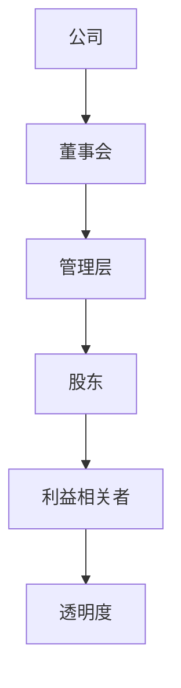
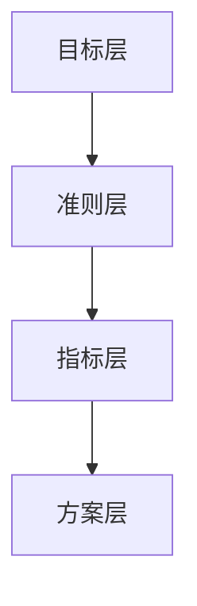
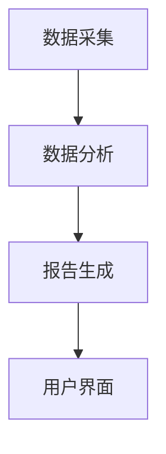

                 


# 彼得林奇对公司治理透明度的要求

## 关键词：公司治理、透明度、彼得·林奇、投资策略、企业价值、风险管理、治理结构

## 摘要：  
彼得·林奇作为一位世界级投资大师，强调了公司治理透明度在投资决策中的重要性。本文从透明度的核心概念、公司治理的结构、透明度与企业价值的关系等多方面展开分析，探讨透明度在公司治理中的具体体现，以及其在投资策略中的应用。通过详细讲解透明度评估的指标体系、算法原理、系统架构设计等，本文旨在为读者提供一个全面理解彼得·林奇对公司治理透明度要求的视角。

---

## 第一部分: 公司治理透明度的背景与重要性

### 第1章: 透明度在公司治理中的核心地位

#### 1.1 透明度的定义与重要性
- **1.1.1 透明度的定义**  
  透明度是指公司在信息传递、决策过程和经营行为上，向股东、利益相关者和社会公众公开、真实、及时地披露相关信息的程度。  
  透明度是公司治理的核心要素之一，它是建立信任、维护企业声誉和实现有效监督的基础。

- **1.1.2 透明度在公司治理中的重要性**  
  透明度直接影响公司治理的效率和效果。高透明度的公司能够更好地吸引投资者、降低融资成本、提升企业价值。同时，透明度也能够帮助利益相关者更准确地评估公司风险，做出更明智的决策。

- **1.1.3 透明度与企业价值的关系**  
  透明度与企业价值呈正相关关系。高透明度的公司更容易获得投资者的信任，从而在资本市场上获得更高的估值。透明度的提升能够降低信息不对称，优化资源配置。

#### 1.2 公司治理的基本概念
- **1.2.1 公司治理的定义**  
  公司治理是指公司内部和外部的利益相关者（如股东、董事会、管理层、债权人、政府等）通过一系列制度和机制，共同决定和监督管理公司的经营行为，以实现公司价值最大化的过程。

- **1.2.2 公司治理的结构与功能**  
  公司治理的结构通常包括董事会、管理层、股东代表大会等。其功能在于确保公司战略的制定与执行符合利益相关者的期望，同时通过有效的监督机制确保管理层的行为符合公司利益。

- **1.2.3 公司治理与利益相关者的关系**  
  公司治理的核心在于平衡不同利益相关者之间的利益冲突。透明度是实现这种平衡的重要手段，它能够确保各方利益相关者在公司决策中享有知情权和参与权。

#### 1.3 彼得·林奇与透明度
- **1.3.1 彼得·林奇的背景与投资理念**  
  彼得·林奇是美国著名的共同基金经理，以其卓越的投资业绩和严谨的投资风格闻名。他强调，成功的投资需要对公司进行深入的了解，而透明度是了解公司的重要途径。

- **1.3.2 透明度在林奇投资策略中的作用**  
  林奇认为，透明度高的公司更容易被投资者理解和信任。他倾向于投资那些财务透明、管理透明的公司，因为这些公司的经营行为更加规范，风险更低。

- **1.3.3 林奇对透明度的定义与解读**  
  林奇认为，透明度不仅仅是公司信息披露的多寡，更重要的是公司管理层是否愿意向股东和利益相关者公开真实的信息。他特别关注公司财务报表的真实性、管理层决策的透明性以及公司战略的清晰度。

### 第2章: 透明度在公司治理中的具体体现

#### 2.1 透明度的核心要素
- **2.1.1 财务透明度**  
  财务透明度是指公司财务报表的真实性、完整性和及时性。高财务透明度的公司能够为投资者提供准确的财务信息，从而帮助投资者做出更明智的投资决策。

- **2.1.2 经营透明度**  
  经营透明度是指公司在日常经营过程中，是否向利益相关者公开经营计划、管理决策和战略调整等信息。高经营透明度的公司更容易获得利益相关者的信任和支持。

- **2.1.3 决策透明度**  
  决策透明度是指公司管理层在做出重大决策时，是否向董事会和股东公开相关信息，并说明决策的依据和风险。高决策透明度的公司能够更好地协调董事会和管理层的关系，降低公司治理中的潜在风险。

#### 2.2 透明度与公司治理的关系
- **2.2.1 透明度如何影响公司治理**  
  透明度是公司治理的基石。高透明度的公司能够通过公开信息建立良好的公司声誉，吸引更多的投资者和合作伙伴，从而提升公司的整体竞争力。

- **2.2.2 公司治理中的透明度特征**  
  公司治理中的透明度具有真实性、完整性和及时性三个特征。真实性是指信息披露的内容真实可靠；完整性是指信息披露的内容全面；及时性是指信息披露的时间符合相关规定。

- **2.2.3 透明度与公司治理的相互作用**  
  透明度与公司治理是相互作用的关系。透明度高的公司治理能够促进公司内部的有效监督和外部利益相关者的信任；而有效的公司治理又能够提升透明度，形成良性循环。

#### 2.3 透明度的边界与外延
- **2.3.1 透明度的边界**  
  透明度并非无边界。公司需要在信息披露与保护商业机密之间找到平衡点。过高的透明度可能泄露公司的商业机密，损害公司的竞争力；而透明度不足则可能导致信息不对称，影响公司治理的效率。

- **2.3.2 透明度的外延**  
  透明度的外延包括公司治理的各个环节，如董事会治理、管理层决策、股东权益保护等。高透明度的公司治理不仅体现在财务和经营信息的公开，还体现在公司治理结构的优化和利益相关者的权益保护上。

- **2.3.3 透明度与其他治理原则的关系**  
  透明度是公司治理的核心原则之一，但它与其他治理原则（如公平性、效率性、合规性）密切相关。高透明度的公司治理能够更好地实现公平性、提高效率性，并确保合规性。

---

## 第二部分: 透明度的核心概念与联系

### 第3章: 透明度的核心概念原理

#### 3.1 透明度的属性特征对比
- **3.1.1 透明度的可测量性**  
  透明度可以通过多种指标进行测量，例如信息披露的完整性、信息更新的及时性等。这些指标能够帮助投资者和利益相关者量化公司的透明度水平。

- **3.1.2 透明度的可验证性**  
  透明度的可验证性是指公司信息披露的内容是否可以通过第三方验证。例如，财务报表的真实性可以通过审计师的独立审计来验证。

- **3.1.3 透明度的可比较性**  
  透明度的可比较性是指不同公司之间的透明度可以进行横向比较。通过比较，投资者可以更好地选择那些透明度高的公司进行投资。

#### 3.2 透明度与隐私的关系
- **3.2.1 透明度与隐私的定义对比**  
  透明度是指公司向外界公开信息的程度，而隐私是指保护个人或公司的敏感信息不被未经授权的访问。两者的目标不同，但有时会存在冲突。

- **3.2.2 透明度与隐私的冲突与协调**  
  在公司治理中，透明度与隐私的冲突主要体现在公司需要在信息公开与保护商业机密之间找到平衡点。例如，公司可能需要公开财务报表，但不需要公开尚未公开的商业计划。

- **3.2.3 透明度与隐私的平衡策略**  
  为了平衡透明度与隐私，公司需要建立一套完善的内部制度，明确信息披露的范围和方式，同时保护公司的商业机密和员工隐私。

#### 3.3 透明度的ER实体关系图


---

## 第三部分: 透明度的算法原理与数学模型

### 第4章: 透明度评估的算法原理

#### 4.1 透明度评估的指标体系
- **4.1.1 透明度评估的指标选择**  
  透明度评估需要选择能够反映公司透明度水平的关键指标。常见的指标包括信息披露的完整性、信息更新的及时性、信息披露的准确性等。

- **4.1.2 指标权重的确定方法**  
  指标权重的确定可以通过层次分析法（AHP）等方法进行。通过专家评分和数据分析，确定每个指标在整体透明度评估中的权重。

- **4.1.3 透明度评分的计算公式**  
  透明度评分可以通过加权平均的方法进行计算：
  $$透明度评分 = \sum_{i=1}^{n} w_i \cdot s_i$$  
  其中，$w_i$ 是第i个指标的权重，$s_i$ 是第i个指标的评分。

#### 4.2 透明度评估的层次分析法


#### 4.3 透明度评估的数学模型
$$透明度评分 = \sum_{i=1}^{n} w_i \cdot s_i$$

---

## 第四部分: 系统分析与架构设计

### 第5章: 透明度评估的系统架构设计

#### 5.1 问题场景介绍
- 透明度评估系统需要解决的问题包括：如何收集公司信息、如何评估透明度、如何提供透明度报告等。

#### 5.2 系统功能设计
- **数据采集模块**  
  数据采集模块负责从公司公开资料、财务报表等来源获取公司信息。

- **数据分析模块**  
  数据分析模块使用层次分析法等方法对透明度进行评估。

- **报告生成模块**  
  报告生成模块根据评估结果生成透明度报告，并提供改进建议。

#### 5.3 系统架构设计


---

## 第五部分: 项目实战

### 第6章: 透明度评估系统的实现

#### 6.1 环境安装
- 需要安装Python、Mermaid、Latex等工具。

#### 6.2 核心代码实现
```python
import numpy as np
from sklearn.metrics import pairwise_distances

# 示例数据：公司透明度评估指标
data = np.array([[0.8, 0.7],
                 [0.6, 0.5],
                 [0.9, 0.8]])

# 计算透明度评分
weights = np.array([0.5, 0.5])
scores = np.dot(data, weights)
print("透明度评分:", scores)
```

#### 6.3 代码解读与分析
- 上述代码通过加权平均的方法计算公司的透明度评分。通过调整权重，可以反映不同指标在透明度评估中的重要性。

---

## 第六部分: 总结与展望

### 第7章: 总结与展望

#### 7.1 最佳实践 tips
- 投资者在选择公司时，应优先考虑那些透明度高的公司。
- 公司应建立完善的内部制度，确保信息披露的透明性和准确性。

#### 7.2 小结
- 透明度是公司治理的核心要素之一。
- 彼得·林奇的透明度理念为我们提供了重要的启示：透明度高的公司更容易获得投资者的信任，从而实现更高的企业价值。

#### 7.3 注意事项
- 在实际操作中，需要综合考虑透明度与其他治理原则的关系。
- 公司在提升透明度的同时，也需要注意保护商业机密和员工隐私。

#### 7.4 拓展阅读
- 建议进一步阅读彼得·林奇的相关著作，深入了解他的投资理念和透明度的重要性。

---

## 作者：AI天才研究院/AI Genius Institute & 禅与计算机程序设计艺术 /Zen And The Art of Computer Programming

