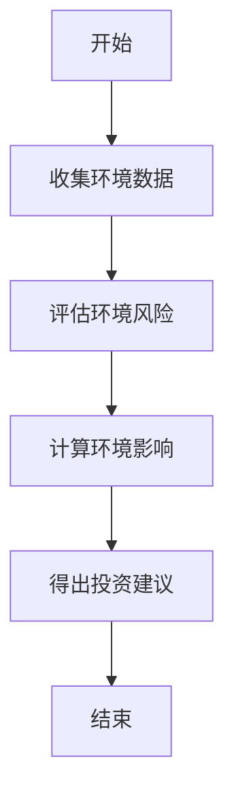
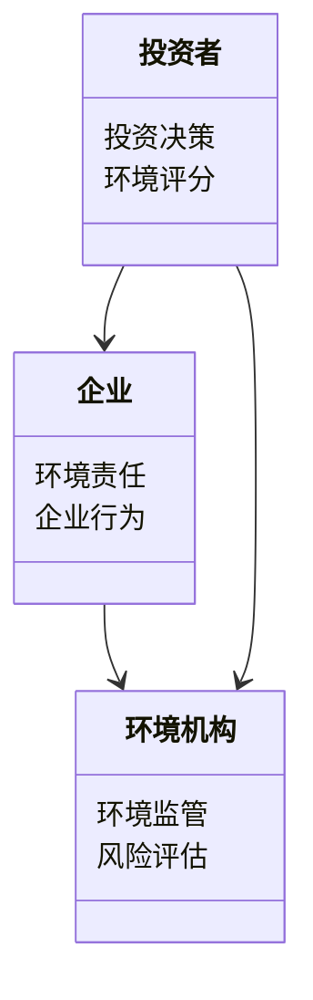
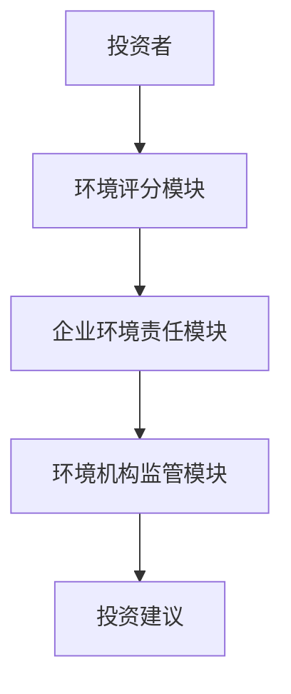
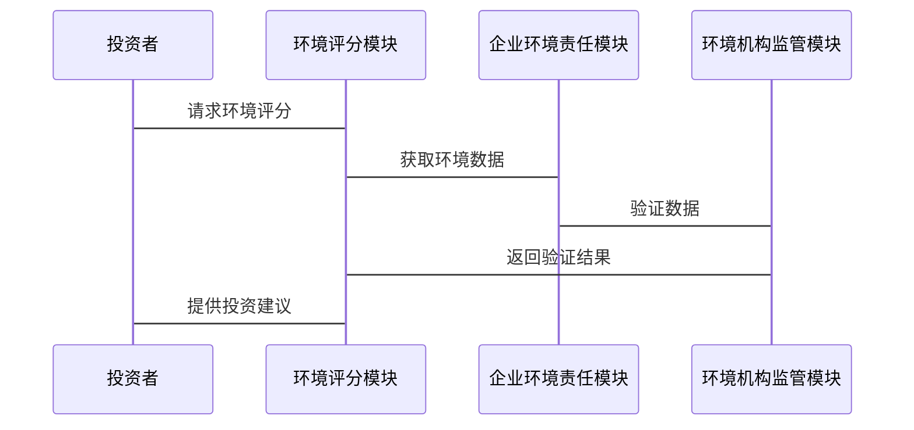

                 


# 彼得林奇对公司环境责任的看法

## 关键词  
彼得林奇，环境责任，投资策略，企业治理，可持续发展，长期价值

## 摘要  
本文深入分析了彼得林奇对环境责任的看法，从投资策略、企业治理和长期价值等多维度探讨了环境责任的重要性。通过详细阐述环境责任的核心概念、算法原理、系统架构和项目实战，结合实际案例分析，提出了在投资决策中考虑环境责任的具体方法。文章最后总结了最佳实践和未来趋势，为投资者和企业提供有价值的参考。

---

## 第一部分: 公司环境责任的背景与重要性

### 第1章: 环境责任的概念与背景

#### 1.1 环境责任的定义与内涵
- **环境责任的定义**：环境责任是指企业在经营过程中对环境造成的影响所承担的义务和责任，包括减少污染、节约资源、保护生态系统等方面。
- **环境责任的核心内涵**：环境责任不仅是企业社会责任的一部分，更是企业长期可持续发展的关键因素。它要求企业在追求经济效益的同时，关注环境影响，实现经济与环境的双赢。
- **环境责任与企业可持续发展的关系**：环境责任是企业可持续发展的基础。只有在环境保护方面表现出色的企业，才能在长期发展中获得竞争优势。

#### 1.2 环境责任的重要性
- **环境责任对企业形象的影响**：企业对环境负责有助于提升品牌形象，增强公众信任。
- **环境责任对社会责任的体现**：企业作为社会的一员，有责任减少对环境的负面影响，保护生态环境。
- **环境责任对长期投资价值的影响**：环境责任强的企业通常具有更强的抗风险能力和长期增长潜力，这使得它们成为投资者的优选目标。

#### 1.3 彼得林奇与环境责任的关联
- **彼得林奇的投资理念概述**：彼得林奇是著名的投资专家，他强调基本面分析和长期投资。他认为，企业的长期价值取决于其商业模式、管理团队和行业地位。
- **环境责任在彼得林奇投资策略中的地位**：虽然彼得林奇并未公开详细讨论环境责任，但可以推断，他在选择投资标的时，会考虑企业的社会责任和可持续发展能力。
- **彼得林奇对环境责任的评价与观点**：彼得林奇可能认为，环境责任是企业长期成功的重要因素。他可能会避免投资那些在环境保护方面表现不佳的企业，因为这些企业可能存在更高的风险和不确定性。

### 第2章: 环境责任的核心概念与联系

#### 2.1 核心概念原理
- **环境责任的核心要素**：包括环境影响评估、环境保护措施、环境信息披露等。
- **环境责任的实现机制**：企业通过制定环保政策、采用绿色技术、减少排放等方式来履行环境责任。
- **环境责任与企业治理的关系**：环境责任与企业治理密切相关。董事会和管理层在制定战略和决策时，需要考虑环境因素，并确保企业在环境保护方面的投入。

#### 2.2 概念属性特征对比表格
| 概念 | 特征 |
|------|------|
| 环境责任 | 社会性、长期性、系统性 |
| 企业责任 | 经济性、法律性、道德性 |
| 投资价值 | 可持续性、风险降低、长期收益 |

#### 2.3 ER实体关系图
```mermaid
er
  actor 投资者
  actor 企业
  actor 环境机构
  entity 环境责任
  entity 投资决策
  entity 企业行为
  relation "影响" --> 投资者 --> 投资决策
  relation "承担" --> 企业 --> 环境责任
  relation "监管" --> 环境机构 --> 企业行为
```

### 第3章: 环境责任的算法原理与数学模型

#### 3.1 环境责任对公司价值的影响
- **环境责任对投资价值的数学模型**：
$$ V = V_{\text{传统}} + V_{\text{环境}} $$
其中，$V_{\text{环境}}$ 是环境责任带来的额外价值。

#### 3.2 环境责任风险评估算法


#### 3.3 环境责任与投资回报的数学关系
$$ R = \alpha \times E + \beta \times F $$
其中，$E$ 是环境责任评分，$F$ 是财务表现，$\alpha$ 和 $\beta$ 是权重系数。

### 第4章: 系统分析与架构设计方案

#### 4.1 系统功能设计
- **领域模型**：


#### 4.2 系统架构设计


#### 4.3 系统交互设计


### 第5章: 项目实战

#### 5.1 环境责任投资的实施步骤
- **步骤1：数据收集与分析**：收集企业的环境数据，包括排放数据、资源消耗、环保投入等。
- **步骤2：环境评分计算**：根据环境数据，计算企业的环境评分。
- **步骤3：投资决策**：结合环境评分和财务数据，制定投资决策。

#### 5.2 环境责任投资的代码实现
```python
import pandas as pd

# 数据收集与分析
def collect_environmental_data(company_id):
    # 假设从数据库中获取环境数据
    data = pd.read_sql(f"SELECT * FROM environmental_data WHERE company_id = {company_id}", con)
    return data

# 环境评分计算
def calculate_environmental_score(data):
    score = data['emissions'] * 0.4 + data['resource_usage'] * 0.3 + data['green_investments'] * 0.3
    return score

# 投资决策
def investment_decision(score, financial_health):
    if score > 80 and financial_health > 85:
        return "推荐投资"
    elif score < 70 and financial_health < 70:
        return "不推荐投资"
    else:
        return "谨慎投资"

# 示例运行
company_id = 123
data = collect_environmental_data(company_id)
score = calculate_environmental_score(data)
financial_health = 80  # 假设财务健康评分为80
decision = investment_decision(score, financial_health)
print(f"投资决策：{decision}")
```

### 第6章: 总结与展望

#### 6.1 总结
- 环境责任是企业长期发展的重要因素。
- 投资者在选择投资标的时，应考虑环境责任因素。
- 环境责任与投资回报密切相关，强环境责任的企业通常具有更高的长期价值。

#### 6.2 投资建议
- **建议1**：投资者应优先选择在环境责任方面表现优异的企业。
- **建议2**：在投资决策中，结合环境评分和财务数据，制定全面的投资策略。
- **建议3**：关注企业的环境信息披露，确保数据的透明性和可靠性。

#### 6.3 未来展望
- 随着全球环保意识的增强，环境责任将成为企业竞争力的重要组成部分。
- 投资者对环境责任的关注将推动更多企业在环境保护方面加大投入。
- 环境责任投资将逐渐成为主流，成为长期价值实现的重要途径。

---

## 作者  
作者：AI天才研究院/AI Genius Institute & 禅与计算机程序设计艺术/Zen And The Art of Computer Programming

