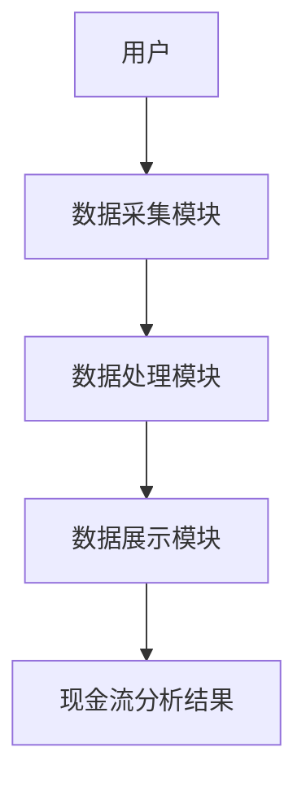

                 


# 彼得林奇对公司现金流的重要性分析

## 关键词：现金流，企业价值，投资决策，资本预算，现金流贴现模型（DCF模型）

## 摘要：现金流是企业财务健康的核心指标，彼得·林奇强调其在评估公司价值和投资决策中的重要性。本文详细分析现金流的计算方法、质量分析、在企业价值评估中的应用，以及现金流风险管理策略，帮助读者掌握现金流在投资分析中的关键作用。

---

## 第一部分：现金流的基础知识

### 第1章：现金流的基本概念

#### 1.1 现金流的定义与分类

**1.1.1 现金流的定义**
现金流是指企业在一定时期内，通过经营活动、投资活动和筹资活动所产生或消耗的现金及现金等价物的流入和流出。它是企业财务健康状况的直接反映。

**1.1.2 现金流的分类**
- **经营活动现金流**：企业日常运营中产生的现金流，包括销售商品、提供服务、支付工资等。
- **投资活动现金流**：企业投资于长期资产或剥离资产所产生的现金流。
- **筹资活动现金流**：企业通过发行股票、债券或借款等方式筹集资金的现金流。

**1.1.3 现金流的重要性**
现金流是企业生存和发展的基础。健康的现金流意味着企业能够偿还债务、投资扩张和应对突发事件。

#### 1.2 现金流与企业价值的关系

**1.2.1 现金流在企业价值评估中的作用**
现金流是评估企业内在价值的核心指标。通过现金流贴现模型（DCF模型），可以计算企业的公允价值。

**1.2.2 现金流与企业可持续发展的关系**
稳定的现金流表明企业具有持续的盈利能力，能够支撑长期发展。

**1.2.3 现金流与股东价值创造的联系**
现金流的生成能力直接影响股东价值。高现金流企业通常能为股东创造更多价值。

---

## 第二部分：现金流的计算与分析方法

### 第2章：现金流的计算方法

#### 2.1 现金流的直接计算法

**2.1.1 直接法的定义**
直接法是基于企业的利润表和资产负债表，直接调整非现金项目，计算经营活动现金流的方法。

**2.1.2 直接法的应用步骤**
1. 计算净利润。
2. 调整非现金项目，如折旧、摊销等。
3. 计算经营活动现金流。

**2.1.3 直接法的优缺点**
- 优点：计算简单，直观反映经营活动的现金流情况。
- 缺点：可能忽略部分非现金项目的影响。

#### 2.2 现金流的间接计算法

**2.2.1 间接法的定义**
间接法是通过调整净利润，减去非现金项目，计算经营活动现金流的方法。

**2.2.2 间接法的应用步骤**
1. 计算净利润。
2. 加回非现金支出。
3. 调整其他项目，计算经营活动现金流。

**2.2.3 间接法的优缺点**
- 优点：考虑了更多财务指标，分析更全面。
- 缺点：计算复杂，可能引入主观判断。

### 第3章：现金流的质量分析

#### 3.1 现金流质量的定义

**3.1.1 现金流质量的衡量标准**
- 现金流的稳定性：现金流是否稳定，能否持续支持企业发展。
- 现金流的来源：现金流主要来自经营活动还是其他活动。
- 现金流的结构：经营活动、投资活动和筹资活动的现金流比例。

**3.1.2 现金流质量与企业健康状况的关系**
高质量的现金流表明企业具备良好的盈利能力和偿债能力。

#### 3.2 现金流质量的分析指标

**3.2.1 现金流比率分析**
- 现金比率：衡量企业短期偿债能力。
- 现金流动周期：计算企业从购买原材料到销售产品所需的时间。

**3.2.2 现金流周期分析**
- 现金流周期越短，企业资金周转效率越高。

**3.2.3 现金流风险评估**
- 现金流波动性越大，企业面临的风险越高。

---

## 第三部分：现金流在企业价值评估中的应用

### 第4章：现金流与企业价值评估

#### 4.1 现金流在企业价值评估中的核心作用

**4.1.1 现金流与企业价值的关系**
现金流是企业未来收益的现值，直接决定企业的内在价值。

**4.1.2 现金流在企业价值评估中的应用**
- 使用现金流贴现模型（DCF模型）评估企业价值。
- 考虑未来现金流的现值，确定企业的合理估值。

#### 4.2 现金流的贴现模型

**4.2.1 贴现现金流模型（DCF模型）**
DCF模型是将企业未来现金流折现，计算其现值，作为企业估值的基础。

**4.2.2 现金流贴现率的确定**
贴现率通常采用加权平均资本成本（WACC）或行业平均收益率。

**4.2.3 现金流贴现模型的应用步骤**
1. 预测未来现金流。
2. 确定贴现率。
3. 计算未来现金流的现值。
4. 确定目标企业价值。

### 第5章：现金流与投资决策

#### 5.1 现金流在投资决策中的重要性

**5.1.1 投资决策中的现金流分析**
现金流分析是投资决策的核心，帮助投资者评估项目的可行性和盈利能力。

**5.1.2 现金流在资本预算中的应用**
资本预算是企业进行长期投资决策的重要工具，现金流分析是其核心内容。

#### 5.2 现金流与资本预算

**5.2.1 资本预算的定义**
资本预算是指企业在长期资产上的投资决策，如购置设备、建设厂房等。

**5.2.2 现金流在资本预算中的作用**
现金流分析用于评估投资项目是否能够创造正现金流，确保投资回报。

**5.2.3 现金流贴现模型在资本预算中的应用**
通过DCF模型评估投资项目未来现金流的现值，判断其是否具有投资价值。

---

## 第四部分：现金流风险管理

### 第6章：现金流风险管理

#### 6.1 现金流风险的定义

**6.1.1 现金流风险的来源**
- 市场风险：如销售下滑、成本上升等。
- 利率风险：如借款利率上升导致筹资成本增加。
- 汇率风险：如外币现金流波动。

**6.1.2 现金流风险的影响**
现金流风险可能影响企业的偿债能力、盈利能力和投资能力。

#### 6.2 现金流风险管理策略

**6.2.1 现金流风险管理的基本原则**
- 风险识别：识别潜在现金流风险。
- 风险评估：评估风险的严重程度。
- 风险控制：采取措施降低风险。

**6.2.2 现金流风险的具体管理策略**
- 建立应急储备：确保企业有足够的现金应对突发事件。
- 优化资本结构：合理安排债务和股权融资，降低财务风险。
- 多样化收入来源：通过多元化经营降低现金流波动风险。

#### 6.3 现金流套期保值

**6.3.1 现金流套期保值的定义**
套期保值是通过金融衍生工具，如远期合约、期权等，对冲现金流波动风险。

**6.3.2 现金流套期保值的实施步骤**
1. 确定套期保值目标。
2. 选择合适的金融工具。
3. 设定套期保值比例。
4. 实施套期保值操作。
5. 监控套期保值效果。

---

## 第五部分：现金流预测与预算管理

### 第7章：现金流预测

#### 7.1 现金流预测的定义

**7.1.1 现金流预测的必要性**
现金流预测是企业制定财务计划和预算的重要依据。

**7.1.2 现金流预测的方法**
- 定性预测：基于市场趋势、行业状况等非量化因素。
- 定量预测：基于历史数据和统计模型。

#### 7.2 现金流预测的步骤

**7.2.1 收集历史数据**
整理企业过去几年的现金流数据，分析其波动趋势。

**7.2.2 分析影响因素**
识别影响现金流的主要因素，如销售额、成本、税收等。

**7.2.3 建立预测模型**
采用时间序列分析、回归分析等方法，建立现金流预测模型。

**7.2.4 验证与调整**
根据实际情况验证模型准确性，必要时进行参数调整。

### 第8章：现金流预算管理

#### 8.1 现金流预算的定义

**8.1.1 现金流预算的作用**
现金流预算是企业财务管理的重要工具，帮助合理分配资金，确保企业运营顺畅。

**8.1.2 现金流预算的制定步骤**
1. 确定预算期间。
2. 预测各期间的现金流。
3. 分配资金，确保各项目资金需求。
4. 监控预算执行情况。

#### 8.2 现金流预算的监控与优化

**8.2.1 预算执行监控**
定期检查实际现金流与预算的差异，分析原因。

**8.2.2 预算优化策略**
根据监控结果，调整预算分配，优化资金使用效率。

---

## 第六部分：现金流分析的系统设计与实战

### 第9章：现金流分析的系统设计

#### 9.1 系统架构设计

**9.1.1 系统功能模块**
- 数据采集模块：收集企业财务数据。
- 数据处理模块：计算和分析现金流。
- 数据展示模块：以图表形式展示现金流分析结果。

**9.1.2 系统架构图**


#### 9.2 系统功能设计

**9.2.1 数据采集模块**
- 从财务报表中提取现金流数据。
- 支持多种数据格式导入。

**9.2.2 数据处理模块**
- 计算现金流。
- 分析现金流质量。
- 生成预测模型。

**9.2.3 数据展示模块**
- 以图表形式展示现金流趋势。
- 提供交互式分析工具。

### 第10章：现金流分析的项目实战

#### 10.1 环境安装

**10.1.1 安装Python环境**
- 安装Python 3.x。
- 安装必要的库，如Pandas、Matplotlib。

#### 10.2 核心实现源代码

**10.2.1 现金流计算代码**
```python
import pandas as pd

def calculate_cash_flow(income_statement, balance_sheet):
    # 计算净利润
    net_income = income_statement['Net Income']
    # 计算折旧和摊销
    depreciation = balance_sheet['Depreciation']
    amortization = balance_sheet['Amortization']
    # 计算经营活动现金流
    cash_flow_from_operations = net_income - (depreciation + amortization)
    return cash_flow_from_operations

# 示例数据
income_statement = {'Net Income': 100000}
balance_sheet = {'Depreciation': 20000, 'Amortization': 10000}
cf = calculate_cash_flow(income_statement, balance_sheet)
print(f"经营活动现金流: {cf}")
```

**10.2.2 现金流预测代码**
```python
from sklearn.linear_model import LinearRegression

# 示例数据
import pandas as pd
import numpy as np

# 创建数据集
data = pd.DataFrame({
    'Year': [2018, 2019, 2020, 2021, 2022],
    'Cash Flow': [100, 120, 150, 180, 200]
})

# 训练模型
model = LinearRegression()
X = data[['Year']]
y = data['Cash Flow']
model.fit(X, y)

# 预测2023年的现金流
X_pred = np.array([[2023]])
predicted_flow = model.predict(X_pred)
print(f"预测2023年的现金流: {predicted_flow[0]}")
```

#### 10.3 案例分析

**10.3.1 案例背景**
某制造企业过去五年的现金流数据，预测未来三年的现金流。

**10.3.2 分析过程**
- 使用历史数据建立现金流预测模型。
- 验证模型准确性。
- 制定现金流预算。

**10.3.3 结果展示**
- 预测未来三年的现金流趋势。
- 制定现金流预算计划。

---

## 第七部分：最佳实践与小结

### 第11章：最佳实践

#### 11.1 关键点总结

**11.1.1 现金流分析的核心**
现金流分析是企业价值评估和投资决策的基础。

**11.1.2 现金流管理的关键**
建立现金流预测和预算体系，加强风险管理。

#### 11.2 小结

现金流是企业财务健康的核心指标，彼得·林奇强调其在评估公司价值和投资决策中的重要性。通过现金流分析，投资者可以更好地评估企业的内在价值和投资风险，制定合理的财务策略。

---

## 结语

现金流分析是投资决策和企业价值评估的关键工具。通过深入理解现金流的计算方法、质量分析、预测和风险管理，投资者和企业管理者能够做出更明智的决策。希望本文能为读者在现金流分析领域提供有价值的指导。

---

## 作者：AI天才研究院/AI Genius Institute & 禅与计算机程序设计艺术 /Zen And The Art of Computer Programming

