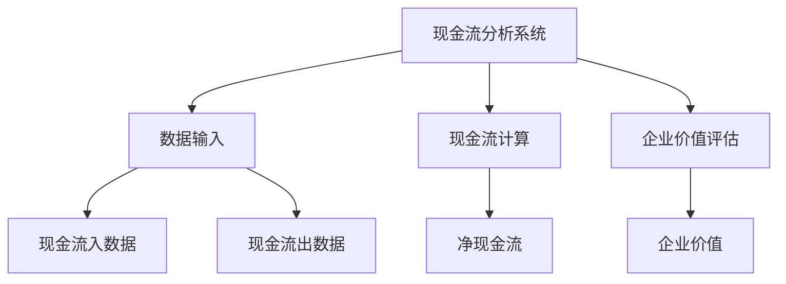
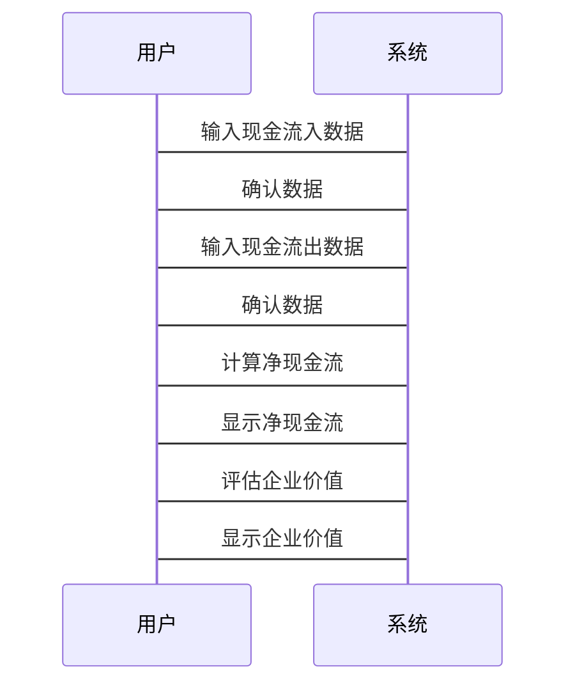

                 


# 彼得林奇对公司现金流的重视

## 关键词：彼得·林奇，现金流，企业估值，投资策略，财务分析

## 摘要：  
彼得·林奇作为全球顶级的价值投资者，他非常重视公司现金流的分析。现金流是企业财务健康的核心指标，反映了企业的盈利能力和偿债能力。本文将从现金流的基本概念、计算方法、分析方法，到彼得·林奇的具体投资策略，以及实际案例分析，全面解读现金流在企业估值和投资决策中的重要性。通过本文，读者可以深入了解现金流对企业价值的影响，掌握如何通过现金流分析来评估企业的投资价值。

---

# 第1章：彼得·林奇与现金流投资概述

## 1.1 彼得·林奇的背景与投资理念

### 1.1.1 彼得·林奇的生平简介  
彼得·林奇（Peter Lynch）是美国著名的职业基金经理人，曾担任波士顿基金（Fidelity Management，Inc.）的经理人，管理着麦哲伦基金（Magellan Fund），并取得了辉煌的投资业绩。他以“价值投资”闻名，强调通过深入分析企业的基本面，寻找被市场低估的投资机会。

### 1.1.2 价值投资的核心理念  
彼得·林奇的价值投资理念强调以下几点：  
1. **长期投资**：关注企业的长期价值，而非短期市场波动。  
2. **基本面分析**：通过对企业财务报表的分析，尤其是现金流的分析，评估企业的盈利能力和偿债能力。  
3. **低估投资机会**：寻找那些市场价格低于其内在价值的企业进行投资。  

### 1.1.3 现金流在投资中的重要性  
现金流是企业财务健康的核心指标，反映了企业的盈利能力和偿债能力。彼得·林奇认为，只有现金流为正的企业，才能持续发展并为股东创造价值。现金流的分析是评估企业投资价值的重要工具。

---

## 1.2 现金流的基本概念与重要性

### 1.2.1 现金流的定义与分类  
现金流（Cash Flow）是指企业在一定会计期间内，通过经营、投资和筹资活动所获得或支付的现金和现金等价物。现金流可以分为以下三类：  
1. **经营活动现金流（Operating Cash Flow）**：企业通过销售商品或服务所获得的现金流。  
2. **投资活动现金流（Investing Cash Flow）**：企业通过投资于长期资产或出售投资所获得的现金流。  
3. **筹资活动现金流（Financing Cash Flow）**：企业通过发行债券、股票或偿还债务所获得或支付的现金流。  

### 1.2.2 现金流在企业经营中的作用  
现金流在企业的经营中起着至关重要的作用：  
1. **支付能力**：现金流充足的公司能够偿还债务、支付股息、购买资产。  
2. **投资能力**：公司可以通过现金流进行扩张、并购或其他投资活动。  
3. **财务健康**：现金流是衡量企业财务健康的重要指标，健康的现金流意味着企业具有较强的盈利能力和偿债能力。  

### 1.2.3 现金流与企业价值的关系  
现金流与企业价值密切相关。企业的价值可以通过现金流的现值来评估。彼得·林奇认为，现金流的可持续性和稳定性是评估企业价值的重要因素。  

---

# 第2章：现金流的计算与分析方法

## 2.1 现金流的基本计算公式

### 2.1.1 现金流的定义公式  
现金流的计算公式为：  
$$ \text{现金流} = \text{现金流入} - \text{现金流出} $$  

### 2.1.2 现金流的计算步骤  
1. 确定企业的现金流入和现金流出。  
2. 将现金流入减去现金流出，得到净现金流。  
3. 将净现金流按时间顺序进行汇总，得到企业的现金流情况。  

### 2.1.3 现金流的正负号规则  
- 正数表示现金流入，负数表示现金流出。  

## 2.2 现金流的时间价值与贴现

### 2.2.1 现金流的时间价值概念  
资金的时间价值是指资金随着时间的推移而产生的价值变化。未来的现金流需要进行贴现，以计算其现值。

### 2.2.2 贴现率的计算方法  
贴现率（Discount Rate）通常基于无风险利率和风险溢价。公式为：  
$$ \text{贴现率} = \text{无风险利率} + \text{风险溢价} $$  

### 2.2.3 现金流的净现值计算公式  
净现值（Net Present Value，NPV）的计算公式为：  
$$ \text{NPV} = \sum_{t=1}^{n} \frac{\text{现金流}_t}{(1 + r)^t} $$  
其中，\( r \) 是贴现率，\( n \) 是时间的长度。  

## 2.3 现金流的类型与特点

### 2.3.1 经营活动现金流  
经营活动现金流是指企业通过销售商品或服务所获得的现金流。它是企业核心业务的直接体现。  

### 2.3.2 投资活动现金流  
投资活动现金流是指企业投资于长期资产或出售投资所获得的现金流。它反映了企业的扩张或收缩战略。  

### 2.3.3 筹资活动现金流  
筹资活动现金流是指企业通过发行债券、股票或偿还债务所获得或支付的现金流。它反映了企业的融资能力。  

---

# 第3章：现金流与企业价值的关系

## 3.1 现金流与企业估值的核心公式

### 3.1.1 企业价值公式  
企业价值（Enterprise Value）的计算公式为：  
$$ \text{企业价值} = \text{息税折旧及摊销前利润（EBITDA）} \times \text{市盈率} $$  

### 3.1.2 现金流与企业价值的关系  
现金流是企业价值的核心驱动因素。企业的价值可以通过现金流的现值来评估。  

### 3.1.3 现金流的可持续性分析  
彼得·林奇认为，只有现金流持续且稳定的公司，才具有长期的投资价值。  

## 3.2 现金流质量的评估标准

### 3.2.1 现金流的稳定性分析  
稳定的现金流表明企业的经营状况良好，能够持续为股东创造价值。  

### 3.2.2 现金流的波动性分析  
现金流波动较大的企业可能存在经营风险，需要进一步分析。  

### 3.2.3 现金流的来源分析  
现金流的来源反映了企业的核心业务和盈利模式。  

## 3.3 现金流与企业风险的关系

### 3.3.1 现金流的充足性与企业风险  
充足的现金流能够降低企业的财务风险，增强企业的偿债能力。  

### 3.3.2 现金流的结构对企业风险的影响  
现金流的结构反映了企业的业务模式和财务健康状况。  

### 3.3.3 现金流的预警信号分析  
现金流的异常变化可能是企业财务状况恶化的预警信号。  

---

# 第4章：彼得·林奇的现金流投资策略

## 4.1 现金流质量的评估标准

### 4.1.1 现金流的可持续性分析  
彼得·林奇认为，只有现金流持续且稳定的公司，才具有长期的投资价值。  

### 4.1.2 现金流的稳定性分析  
稳定的现金流表明企业的经营状况良好，能够持续为股东创造价值。  

### 4.1.3 现金流的结构分析  
现金流的结构反映了企业的业务模式和财务健康状况。  

## 4.2 现金流与企业盈利的关系

### 4.2.1 现金流与净利润的差异分析  
净利润是利润表的核心指标，而现金流是现金流量表的核心指标。净利润可能包括非现金项目，如折旧和摊销，而现金流更直接反映了企业的实际盈利能力。  

### 4.2.2 现金流与企业盈利质量的关系  
健康的现金流表明企业的盈利质量较高，能够将净利润转化为实际的现金流入。  

### 4.2.3 现金流对财务造假的预警作用  
现金流的异常变化可能是企业财务造假的预警信号。  

## 4.3 现金流与企业成长的关系

### 4.3.1 现金流与企业扩张能力  
充足的现金流能够支持企业的扩张和投资活动。  

### 4.3.2 现金流与企业创新能力  
现金流的稳定性是企业进行技术创新和产品升级的重要保障。  

### 4.3.3 现金流与企业市场地位  
健康的现金流能够增强企业的市场地位，吸引更多的客户和合作伙伴。  

---

# 第5章：现金流分析的实战应用

## 5.1 现金流预测与企业估值

### 5.1.1 现金流预测的方法  
1. **历史数据分析法**：基于历史现金流数据进行预测。  
2. **趋势分析法**：分析现金流的趋势，预测未来现金流的变化。  
3. **情景分析法**：根据不同的假设条件，预测现金流的变化。  

### 5.1.2 现金流预测的注意事项  
- 数据的准确性和完整性。  
- 模型的合理性和可操作性。  

## 5.2 现金流指标的计算与分析

### 5.2.1 净现金流（Net Cash Flow）  
净现金流 = 现金流入 - 现金流出  

### 5.2.2 现金流比率分析  
1. **现金比率**：现金和现金等价物与流动负债的比率。  
2. **经营活动现金流与净利润的比率**：经营活动现金流与净利润的比率，反映净利润的现金含量。  

## 5.3 现金流与企业估值的结合

### 5.3.1 现金流的现值计算  
企业价值可以通过现金流的现值来评估。  

### 5.3.2 现金流的折现率选择  
折现率的选择对企业的价值评估至关重要。  

---

# 第6章：系统分析与架构设计

## 6.1 现金流分析的系统模型

### 6.1.1 现金流分析的数据流图  


### 6.1.2 现金流分析的系统架构  


## 6.2 现金流分析的系统架构设计

### 6.2.1 系统功能模块  
1. 数据输入模块：接收现金流入和现金流出数据。  
2. 计算模块：计算净现金流和相关指标。  
3. 评估模块：评估企业价值。  

### 6.2.2 系统接口设计  
1. 数据输入接口：接收现金流入和现金流出数据。  
2. 计算接口：计算净现金流和相关指标。  
3. 评估接口：评估企业价值。  

## 6.3 现金流分析的系统交互

### 6.3.1 现金流分析的交互流程  


---

# 第7章：项目实战与经验总结

## 7.1 环境安装与配置

### 7.1.1 环境要求  
- 操作系统：Windows、macOS 或 Linux  
- 编程语言：Python 3.8 或更高版本  
- 第三方库：pandas、numpy、matplotlib  

### 7.1.2 安装步骤  
1. 安装Python。  
2. 安装pandas、numpy、matplotlib库。  
   ```bash
   pip install pandas numpy matplotlib
   ```

## 7.2 现金流分析的核心代码实现

### 7.2.1 现金流计算代码  
```python
import pandas as pd

# 输入数据
cash_inflows = [100, 200, 300]  # 现金流入
cash_outflows = [50, 100, 150]   # 现金流出

# 计算净现金流
net_cash_flow = [inflow - outflow for inflow, outflow in zip(cash_inflows, cash_outflows)]
print("净现金流：", net_cash_flow)

# 计算净现值
discount_rate = 0.05
npv = sum(cash_flow / (1 + discount_rate)**i for i, cash_flow in enumerate(net_cash_flow))
print("净现值：", npv)
```

### 7.2.2 现金流可视化代码  
```python
import matplotlib.pyplot as plt

# 现金流数据
cash_flows = [100, -50, 200, -150, 300]
labels = ["Year 1", "Year 2", "Year 3", "Year 4", "Year 5"]

# 绘制柱状图
plt.bar(labels, cash_flows)
plt.title("Cash Flows Over Time")
plt.xlabel("Year")
plt.ylabel("Cash Flow")
plt.show()
```

## 7.3 案例分析与解读

### 7.3.1 案例背景  
假设我们有一家制造企业，其未来五年的现金流如下：  

| 年份 | 现金流入 | 现金流出 | 净现金流 |
|------|----------|----------|----------|
| 1    | 100      | 50       | 50       |
| 2    | 200      | 100      | 100      |
| 3    | 300      | 150      | 150      |
| 4    | 400      | 200      | 200      |
| 5    | 500      | 250      | 250      |

### 7.3.2 现金流分析  
1. 净现金流逐年增加，表明企业的经营状况良好。  
2. 现金流的现值为：  
   $$ \text{NPV} = \frac{50}{(1+0.05)^1} + \frac{100}{(1+0.05)^2} + \frac{150}{(1+0.05)^3} + \frac{200}{(1+0.05)^4} + \frac{250}{(1+0.05)^5} $$  
   计算结果为：NPV ≈ 470.23  

### 7.3.3 投资决策  
由于NPV为正，表明该投资项目具有较高的投资价值。  

---

## 7.4 项目小结  

通过本项目，我们学会了如何利用现金流分析来评估企业的投资价值。现金流的计算和分析是投资决策的重要工具，能够帮助投资者识别具有长期发展潜力的企业。  

---

# 总结

现金流是企业财务健康的核心指标，也是彼得·林奇投资策略的重要组成部分。通过深入分析现金流的计算方法、企业价值的影响因素以及实际案例的分析，我们可以更好地理解现金流在投资决策中的重要性。希望本文能够帮助读者掌握现金流分析的技巧，并在实际投资中取得更好的成绩。

---

# 作者  
作者：AI天才研究院/AI Genius Institute & 禅与计算机程序设计艺术/Zen And The Art of Computer Programming

