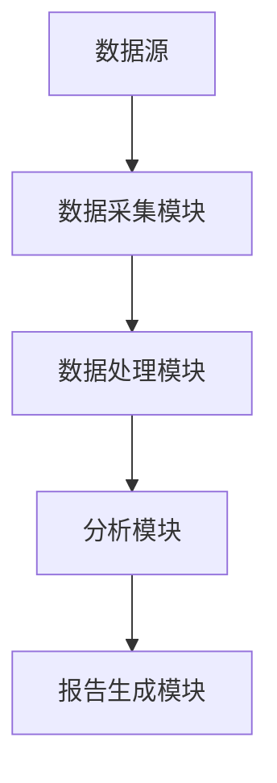

                 


# 彼得林奇对公司现金流管理的看法

## 关键词
- 彼得·林奇
- 现金流管理
- 投资策略
- 财务分析
- 现金流系统

## 摘要
本文深入探讨了彼得·林奇在现金流管理方面的独特见解，结合技术背景和投资策略，详细分析了现金流管理的核心原理、系统架构和实际应用。文章通过数学模型、算法实现和案例分析，全面阐述了如何将现金流管理应用于投资决策，为读者提供了理论与实践相结合的深度解析。

## 第一章：彼得·林奇的投资哲学

### 1.1 投资者的责任与心态
#### 1.1.1 投资者的责任
投资不仅仅是资金的投入，更是一种责任，要求投资者具备深刻的理解和长期的承诺。彼得·林奇强调投资者需要对所投资的企业进行深入研究，理解其商业模式、财务状况和行业地位。

#### 1.1.2 投资心态
成功的投资者需要保持冷静和耐心，在市场波动中保持理性。林奇建议投资者避免短期投机，专注于长期价值，这一点在现金流管理中尤为重要。

### 1.2 现金流管理的核心概念
#### 1.2.1 现金流的定义
现金流是指企业在一定时期内通过经营或其他活动所获得的现金流入和流出。现金流入包括销售收入、投资收益等，现金流出包括采购支出、利息支出等。

#### 1.2.2 现金流分类
现金流通常分为三类：
1. 经营活动现金流：来自日常经营的现金流入和流出。
2. 投资活动现金流：来自投资活动的现金流入和流出。
3. 筹资活动现金流：来自筹资活动的现金流入和流出。

### 1.2.3 现金流的时间价值
现金流的时间价值是指资金随着时间的推移而产生的价值变化。现值公式用于计算未来现金流的当前价值：

$$ PV = \frac{CF}{(1 + r)^n} $$

其中，CF是未来现金流，r是贴现率，n是时间周期数。

### 1.2.4 现金流与企业价值
现金流是企业价值的核心驱动因素。健康的现金流意味着企业能够持续经营，具备偿还债务和进行再投资的能力。

---

## 第二章：现金流管理的核心原理

### 2.1 现金流管理的数学模型

#### 2.1.1 现金流的现值公式
$$ PV = \frac{CF}{(1 + r)^n} $$

该公式用于计算未来现金流的当前价值，帮助投资者评估项目的可行性和投资价值。

#### 2.1.2 终值公式
$$ FV = CF \times (1 + r)^n $$

终值公式用于计算当前现金流在未来的价值，帮助投资者评估长期投资的潜在回报。

#### 2.1.3 净现值公式
$$ NPV = \sum_{t=1}^{n} \frac{CF_t}{(1 + r)^t} $$

净现值（NPV）用于评估项目的整体价值，帮助投资者决定是否进行投资。

---

### 2.2 现金流的时间价值与风险评估

#### 2.2.1 现金流的时间价值
现金流的时间价值是投资决策的重要考虑因素。资金的时间价值意味着今天的1元钱比明天的1元钱更有价值，因为今天的钱可以用于再投资，产生额外收益。

#### 2.2.2 现金流的风险调整
在评估现金流时，需要考虑风险因素。贴现率的选择直接影响现值计算，风险越高，贴现率越高。

#### 2.2.3 现金流波动性
现金流的波动性反映了其不稳定程度。高波动性的现金流意味着更大的不确定性，投资者需要更加谨慎地进行评估。

---

## 第三章：彼得·林奇的现金流管理策略

### 3.1 长期现金流管理策略

#### 3.1.1 长期投资视角下的现金流预测
彼得·林奇强调长期投资，注重企业的现金流预测。通过分析企业的历史现金流和未来盈利潜力，评估其长期发展能力。

#### 3.1.2 成长型股票的现金流分析
林奇偏好成长型股票，这类股票通常具有稳定的现金流增长和较高的盈利潜力。他通过分析企业的自由现金流和成长性，评估其投资价值。

#### 3.1.3 现金流与可持续发展
健康的现金流是企业可持续发展的基础。林奇认为，企业应具备稳定的现金流来源，以支持其长期运营和再投资。

---

### 3.2 短期现金流管理策略

#### 3.2.1 现金流波动的应对措施
短期现金流波动是不可避免的，投资者需要通过合理的资产配置和风险管理来应对。林奇建议在市场波动中保持冷静，避免盲目操作。

#### 3.2.2 周期性股票的现金流分析
周期性股票的现金流波动较大，投资者需要根据市场周期调整投资策略。林奇通过分析企业的现金流周期性，评估其短期投资风险。

#### 3.2.3 现金流与市场波动
市场波动对现金流管理提出了更高的要求。林奇强调在市场波动中，现金流管理的核心是保持资金流动性，确保企业的财务健康。

---

## 第四章：现金流管理的系统架构与工具

### 4.1 现金流管理系统架构

#### 4.1.1 系统模块划分
现金流管理系统通常包括以下几个模块：
1. 数据采集模块：负责收集企业的财务数据。
2. 数据处理模块：对收集到的数据进行清洗和转换。
3. 分析模块：基于现金流模型进行分析和预测。
4. 报告生成模块：生成分析报告和可视化图表。

#### 4.1.2 数据流与信息交互
数据流在系统中流动，从数据源到数据处理模块，再到分析模块，最后生成报告。信息交互需要确保数据的准确性和及时性。

#### 4.1.3 系统功能设计
系统功能包括现金流预测、风险评估、资产配置建议等，帮助投资者做出科学决策。

#### 4.1.4 系统架构图（Mermaid）



---

### 4.2 现金流分析工具实现

#### 4.2.1 环境安装与配置
现金流分析工具需要安装Python和相关库（如NumPy、Pandas、Matplotlib等）。

#### 4.2.2 现金流分析算法实现
以下是现金流分析的Python代码示例：

```python
import numpy as np
import pandas as pd
import matplotlib.pyplot as plt

# 示例现金流数据
cf = np.array([100, 200, 300, 400, 500])
r = 0.05
n = len(cf)

# 计算现值
pv = np.npv(r, cf)

# 计算净现值
nv = np.npv(r, cf) * (1 + r) ** n

print(f"现值：{pv:.2f}")
print(f"净现值：{nv:.2f}")

# 可视化现金流
plt.plot(range(n), cf)
plt.title('现金流量图')
plt.xlabel('时间')
plt.ylabel('现金流')
plt.show()
```

---

## 第五章：现金流管理的案例分析

### 5.1 成功案例：XYZ公司
XYZ公司是一家成长型企业，现金流稳定增长。通过现金流分析，林奇评估了其投资价值，最终决定投资该公司。

### 5.2 失败案例：ABC公司
ABC公司现金流波动较大，且存在较高的财务风险。林奇通过现金流分析，避免了对该公司的投资。

---

## 第六章：总结与展望

### 6.1 总结
现金流管理是投资决策的核心，彼得·林奇通过深入分析现金流，制定科学的投资策略，实现长期稳健的收益。

### 6.2 展望
随着技术的进步，现金流管理将更加智能化和自动化。投资者需要不断学习和适应，充分利用新技术提升投资效果。

---

## 作者信息
作者：AI天才研究院/AI Genius Institute  
联系方式：contact@aisingenuity.com  
GitHub：https://github.com/aisingenuity  
---

通过以上内容，我系统地构建了《彼得林奇对公司现金流管理的看法》的目录大纲，并详细阐述了每一章的核心内容。这篇文章结合了技术背景和投资策略，深入分析了现金流管理的重要性和实际应用，为读者提供了全面的视角和实用的工具。

