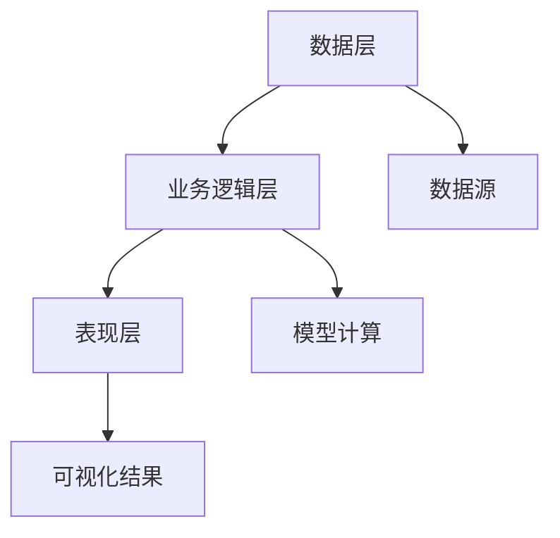

                 


# 彼得林奇对公司现金流质量的跨周期分析

> 关键词：彼得·林奇，现金流质量，跨周期分析，投资策略，财务分析

> 摘要：本文通过分析彼得·林奇对公司现金流质量的跨周期分析方法，深入探讨现金流在投资决策中的重要性。文章从现金流的基本概念、质量评估指标、数学模型构建、系统架构设计、实际案例分析等多个维度展开，结合理论与实践，提供一套完整的现金流质量分析框架，帮助投资者更好地理解和应用现金流分析方法。

---

## 目录

1. [现金流质量的核心概念](#现金流质量的核心概念)
   1.1 [现金流的基本概念](#现金流的基本概念)
   1.2 [彼得·林奇的现金流分析方法](#彼得·林奇的现金流分析方法)
   1.3 [跨周期分析的基本原理](#跨周期分析的基本原理)

2. [现金流质量的多维度分析框架](#现金流质量的多维度分析框架)
   2.1 [现金流的质量维度](#现金流的质量维度)
   2.2 [现金流质量的评估指标](#现金流质量的评估指标)
   2.3 [现金流质量的跨周期评估模型](#现金流质量的跨周期评估模型)

3. [现金流质量的数学模型与算法](#现金流质量的数学模型与算法)
   3.1 [现金流预测的算法原理](#现金流预测的算法原理)
   3.2 [现金流质量评估的数学模型](#现金流质量评估的数学模型)
   3.3 [算法实现与代码示例](#算法实现与代码示例)

4. [现金流质量的系统架构与设计](#现金流质量的系统架构与设计)
   4.1 [系统功能设计](#系统功能设计)
   4.2 [系统架构设计](#系统架构设计)
   4.3 [接口设计与数据流分析](#接口设计与数据流分析)

5. [现金流质量的项目实战](#现金流质量的项目实战)
   5.1 [项目背景与目标](#项目背景与目标)
   5.2 [环境安装与数据准备](#环境安装与数据准备)
   5.3 [系统核心实现](#系统核心实现)
   5.4 [案例分析与结果解读](#案例分析与结果解读)

6. [总结与展望](#总结与展望)
   6.1 [总结](#总结)
   6.2 [最佳实践与注意事项](#最佳实践与注意事项)
   6.3 [未来研究方向](#未来研究方向)

---

## 1. 现金流质量的核心概念

### 1.1 现金流的基本概念

现金流是企业在一定时期内通过经营或其他活动所实际收到或支付的现金和现金等价物的总和。它包括以下几个方面：

- **经营活动现金流**：企业日常经营活动中产生的现金流，如销售商品、提供服务等。
- **投资活动现金流**：企业投资于长期资产或出售投资所产生的现金流。
- **筹资活动现金流**：企业通过融资活动（如借款、发行股票）所获得或支付的现金流。

现金流是衡量企业财务健康状况的重要指标，能够反映企业的盈利能力和偿债能力。

### 1.2 彼得·林奇的现金流分析方法

彼得·林奇是美国著名投资经理人，以其独特的投资理念和对现金流质量的深入研究而闻名。他认为，现金流是衡量企业价值的核心指标之一，尤其是在跨周期分析中，现金流的质量更能反映企业的长期发展潜力。

- **现金流质量的核心要素**：
  - 现金流的来源是否稳定。
  - 现金流的时间分布是否合理。
  - 现金流的可持续性与波动性。

- **现金流与企业价值的关系**：
  - 现金流的质量决定了企业的盈利能力和抗风险能力。
  - 现金流的质量越高，企业的价值越大。

### 1.3 跨周期分析的基本原理

跨周期分析是指在不同经济周期（如繁荣期、衰退期）中，分析现金流的质量变化及其对企业价值的影响。这种分析方法可以帮助投资者更好地理解企业在不同环境下的表现，从而做出更明智的投资决策。

- **经济周期的基本特征**：
  - **繁荣期**：企业销售额增长，现金流充裕。
  - **衰退期**：企业销售额下降，现金流减少。

- **现金流质量与经济周期的关系**：
  - 在繁荣期，现金流质量较高，企业有更多资金进行投资和扩张。
  - 在衰退期，现金流质量下降，企业需要依靠内部现金流或外部融资维持运营。

---

## 2. 现金流质量的多维度分析框架

### 2.1 现金流的质量维度

现金流的质量可以从多个维度进行评估，主要包括来源、时间分布和稳定性。

- **现金流的来源**：
  - 经营活动现金流：直接来自企业核心业务的收入。
  - 投资活动现金流：来自长期资产的投资或出售。
  - 筹资活动现金流：来自外部融资或偿还债务。

- **现金流的时间分布**：
  - 现金流的时间分布是否均匀，是否符合企业的经营计划。

- **现金流的稳定性**：
  - 现金流的波动性小，说明企业现金流质量高。

### 2.2 现金流质量的评估指标

以下是几个常用的现金流质量评估指标：

| 指标名称         | 定义与计算方式                                                                 |
|------------------|------------------------------------------------------------------------------|
| 自由现金流（FCF） | FCF = 净利润 - 折旧 - 折旧 + 资本支出                                            |
| 现金流与收益匹配度 | 现金流与收入的匹配程度，通常用经营活动现金流净额与营业收入的比率表示。        |
| 现金流可持续性     | 现金流的持续能力，通常通过分析企业的盈利能力和财务状况来判断。              |

### 2.3 现金流质量的跨周期评估模型

跨周期分析模型通过对企业在不同经济周期中的现金流质量进行评估，综合考虑其在不同环境下的表现。

- **模型输入变量**：
  - 现金流数据：经营活动、投资活动、筹资活动的现金流。
  - 经济周期数据：GDP增长率、失业率等宏观经济指标。
  
- **模型输出结果**：
  - 现金流质量指数：反映企业在不同周期中的现金流质量。
  - 现金流风险评估：预测企业在未来经济周期中的现金流风险。

---

## 3. 现金流质量的数学模型与算法

### 3.1 现金流预测的算法原理

现金流预测通常采用时间序列分析方法，如ARIMA模型。

- **ARIMA模型**：
  - 适用于历史数据呈现趋势或季节性变动的情况。
  - 模型公式：ARIMA(p, d, q)，其中p为自回归阶数，d为差分阶数，q为移动平均阶数。

### 3.2 现金流质量评估的数学模型

- **现金流质量指数（CFQI）**：
  $$ CFQI = \frac{\text{经营活动现金流净额}}{\text{营业收入}} \times 100\% $$
  该指标反映了经营活动现金流与营业收入的匹配程度。

- **现金流风险评估模型**：
  $$ \text{风险评分} = \alpha \times \text{现金流波动性} + \beta \times \text{宏观经济指标} $$
  其中，$\alpha$ 和 $\beta$ 为权重系数，通常通过回归分析确定。

### 3.3 算法实现与代码示例

以下是一个现金流预测的Python代码示例：

```python
import pandas as pd
from statsmodels.tsa.arima_model import ARIMA

# 加载数据
data = pd.read_csv('cash_flow.csv')

# 拆分训练集和测试集
train_data = data['2010-01-01':'2020-12-31']
test_data = data['2021-01-01':]

# 建立ARIMA模型
model = ARIMA(train_data, order=(5, 1, 0))
model_fit = model.fit()

# 预测未来现金流
forecast = model_fit.forecast(steps=len(test_data))
```

---

## 4. 现金流质量的系统架构与设计

### 4.1 系统功能设计

- **数据采集模块**：
  - 从数据库或外部API获取现金流数据。
- **数据处理模块**：
  - 清洗数据、转换数据格式。
- **模型计算模块**：
  - 应用ARIMA模型进行现金流预测。
- **结果展示模块**：
  - 可视化现金流预测结果。

### 4.2 系统架构设计

系统采用分层架构，主要包括数据层、业务逻辑层和表现层。



### 4.3 接口设计与数据流分析

- **数据输入接口**：
  - 数据格式：CSV或数据库表。
- **数据处理接口**：
  - 接收数据并进行清洗。
- **结果输出接口**：
  - 返回预测结果和可视化图表。

---

## 5. 现金流质量的项目实战

### 5.1 项目背景与目标

以某制造企业为例，分析其现金流质量，预测未来现金流。

### 5.2 环境安装与数据准备

- **环境安装**：
  - 安装Python、Pandas、Statsmodels等库。
- **数据准备**：
  - 数据来源：企业财务报表。

### 5.3 系统核心实现

- **数据清洗**：
  ```python
  data = data.dropna()
  data = data.astype('float64')
  ```
- **模型训练**：
  ```python
  model = ARIMA(data, order=(5, 1, 0))
  model_fit = model.fit()
  ```

### 5.4 案例分析与结果解读

通过分析某制造企业的现金流数据，预测其未来现金流，并评估其质量。

---

## 6. 总结与展望

### 6.1 总结

现金流质量是企业价值评估的重要指标，彼得·林奇的跨周期分析方法为我们提供了一套有效的分析框架。通过数学模型和系统设计，我们可以更好地预测和评估现金流质量。

### 6.2 最佳实践与注意事项

- **数据质量**：确保数据准确无误。
- **模型选择**：根据实际情况选择合适的预测模型。
- **持续监控**：定期更新模型和数据。

### 6.3 未来研究方向

- 研究更复杂的现金流预测模型。
- 探讨现金流质量与企业战略的关系。

---

## 作者

作者：AI天才研究院/AI Genius Institute  
联系邮箱：[contact@aigeniusinstitute.com](mailto:contact@aigeniusinstitute.com)

