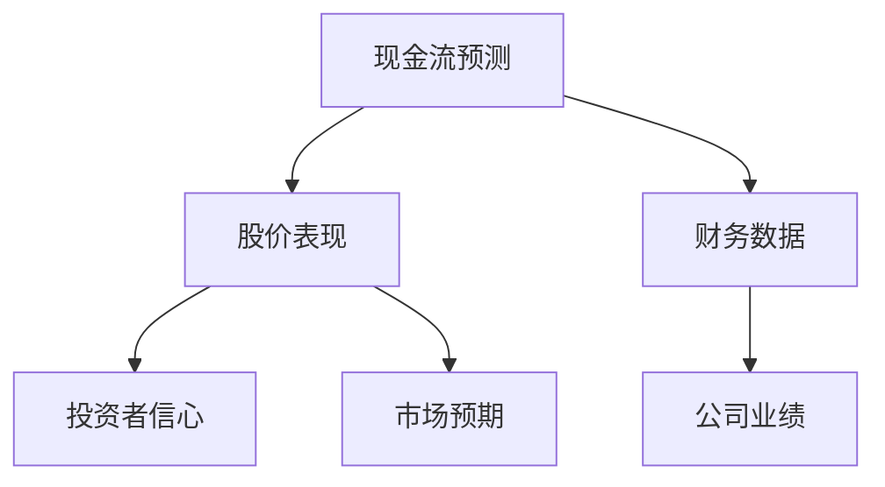
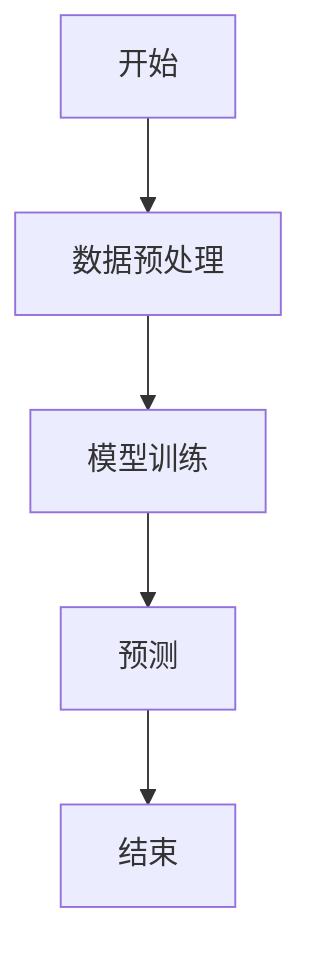
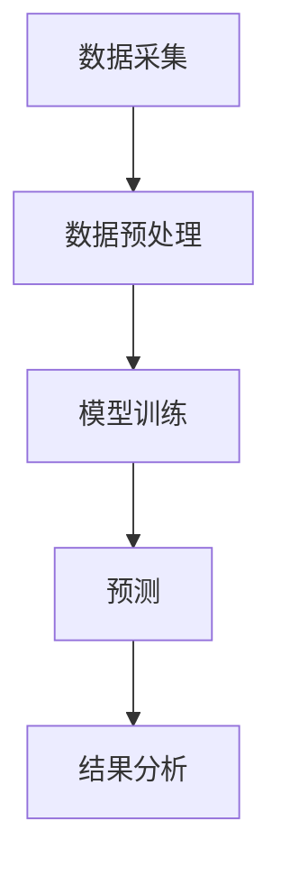
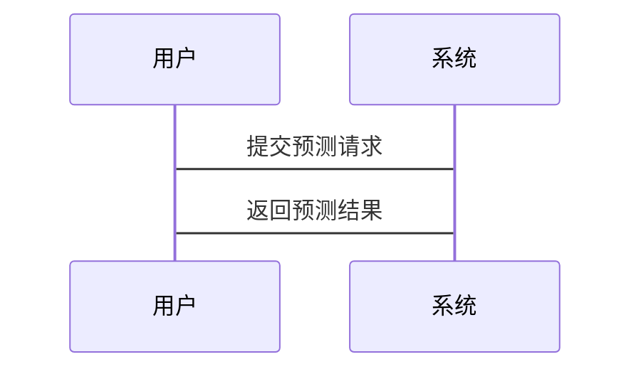

                 


# 彼得林奇对公司现金流预测准确性与股价表现关系的研究

**关键词**：现金流预测，股价表现，彼得·林奇，财务指标，投资决策，市场反应，现金流预测模型

**摘要**：  
现金流预测的准确性对股价表现有着深远的影响，尤其是在彼得·林奇等投资大师的实践中，现金流预测被证明是评估公司价值和投资决策的重要工具。本文将详细探讨现金流预测的原理、方法及其对股价表现的关联性，通过对比分析和实证研究，揭示现金流预测在投资决策中的核心作用。同时，本文将结合实际案例，分析现金流预测的准确性如何影响市场反应和股价波动。

---

## 第一部分: 背景介绍

### 第1章: 现金流预测准确性与股价表现的关系概述

#### 1.1 现金流预测的背景与意义

##### 1.1.1 现金流预测的定义与重要性
现金流预测是指对公司未来一定时期内的现金流进行估算和预测的过程。它是财务管理和投资决策中的核心工具之一，能够帮助投资者评估公司的盈利能力和财务健康状况。现金流预测的准确性直接影响到投资者对公司的估值和投资决策。

##### 1.1.2 现金流预测在投资决策中的作用
现金流预测是评估公司价值的重要依据。通过预测未来的现金流，投资者可以计算出合理的股价水平，并据此做出买入或卖出的决策。彼得·林奇在其投资实践中，特别强调现金流预测的准确性对投资决策的重要性。

##### 1.1.3 现金流预测的边界与外延
现金流预测的边界包括公司内部财务数据和市场环境的变化。外延则涉及市场反应、投资者心理和宏观经济因素。现金流预测的准确性受到多种内外部因素的影响，因此需要结合具体情况进行动态调整。

#### 1.2 股价表现的核心影响因素

##### 1.2.1 股价表现的定义与衡量标准
股价表现是指股票价格在市场中的波动情况，通常通过收益率、波动率和相关指标来衡量。股价表现的核心影响因素包括公司基本面、市场情绪和宏观经济环境。

##### 1.2.2 现金流预测对股价表现的影响路径
现金流预测通过影响市场对公司的估值和投资者信心，进而影响股价表现。准确的现金流预测能够增强投资者对公司的信心，从而推动股价上涨。反之，现金流预测的误差可能导致股价的波动。

##### 1.2.3 彼得·林奇的研究背景与方法论
彼得·林奇是美国著名基金经理，其投资策略以基本面分析和现金流预测为核心。他通过分析公司的现金流状况，预测其未来盈利能力和股价走势。本文将详细探讨其研究方法及其对现金流预测准确性的重视。

#### 1.3 本章小结
本章介绍了现金流预测的背景和意义，分析了其在投资决策中的作用，并提出了现金流预测准确性对股价表现的影响路径。彼得·林奇的研究为本文提供了重要的方法论基础。

---

## 第二部分: 核心概念与联系

### 第2章: 现金流预测的核心概念与原理

#### 2.1 现金流预测的原理与方法

##### 2.1.1 现金流预测的分类与特点
现金流预测可以分为短期预测和长期预测，分别适用于不同的投资策略。短期预测注重公司近期的财务状况，而长期预测则关注公司的可持续发展能力。

##### 2.1.2 现金流预测的主要方法
现金流预测的主要方法包括趋势分析法、回归分析法和机器学习模型。  
- **趋势分析法**：基于历史现金流数据，通过趋势外推预测未来现金流。  
- **回归分析法**：利用财务指标和市场变量建立回归模型，预测现金流。  
- **机器学习模型**：采用神经网络和随机森林等算法，结合多维数据进行预测。

##### 2.1.3 现金流预测的误差分析
现金流预测的误差来源于数据质量、模型假设和市场环境的变化。准确的现金流预测需要结合多种方法进行交叉验证。

#### 2.2 现金流预测与股价表现的关联性分析

##### 2.2.1 现金流预测准确性对股价的影响
准确的现金流预测能够增强投资者对公司的信心，推动股价上涨。反之，预测误差可能导致股价波动。

##### 2.2.2 彼得·林奇的现金流预测模型
彼得·林奇提出了一种基于现金流的估值模型，通过预测未来现金流的现值来评估股价的合理水平。

##### 2.2.3 现金流预测的误差对股价波动的影响
现金流预测的误差可能导致股价的过度波动，尤其是在市场环境不确定的情况下。

#### 2.3 核心概念对比分析

##### 2.3.1 现金流预测与财务报表分析的对比
现金流预测是财务报表分析的重要组成部分，但二者在侧重点上有所不同。财务报表分析注重历史数据，而现金流预测关注未来。

##### 2.3.2 现金流预测与股价预测的对比
现金流预测是股价预测的基础，但股价预测还受到市场情绪和宏观经济因素的影响。

##### 2.3.3 现金流预测与投资决策的对比
现金流预测是投资决策的重要依据，但投资决策还涉及风险评估和资产配置等因素。

#### 2.4 实体关系图（ER图）



#### 2.5 本章小结
本章详细介绍了现金流预测的核心概念和原理，并分析了其与股价表现的关联性。通过对比分析和ER图，进一步明确了现金流预测在投资决策中的重要性。

---

## 第三部分: 算法原理讲解

### 第3章: 现金流预测的算法原理

#### 3.1 现金流预测的主要算法

##### 3.1.1 时间序列分析法



##### 3.1.2 机器学习算法

```python
import pandas as pd
from sklearn.ensemble import RandomForestRegressor

# 数据预处理
data = pd.read_csv('cash_flow.csv')
features = data[['收入', '成本', '净利润']]
target = data['现金流']

# 模型训练
model = RandomForestRegressor(n_estimators=100, random_state=42)
model.fit(features, target)

# 预测
predictions = model.predict(features)
```

##### 3.1.3 统计回归分析法

```latex
$$ \text{现金流} = \beta_0 + \beta_1 \times \text{收入} + \beta_2 \times \text{成本} + \epsilon $$
```

#### 3.2 现金流预测的数学模型

##### 3.2.1 线性回归模型
$$ \hat{y} = \beta_0 + \beta_1 x_1 + \beta_2 x_2 + \ldots + \beta_n x_n $$
其中，$\hat{y}$为预测的现金流，$x_i$为自变量。

##### 3.2.2 时间序列模型
$$ \hat{y}_t = \alpha \hat{y}_{t-1} + (1-\alpha) \hat{y}_{t-2} $$

#### 3.3 算法实现与对比分析

##### 3.3.1 算法实现
```python
# 时间序列预测
from statsmodels.tsa.arima_model import ARIMA

data = pd.read_csv('cash_flow.csv')
model = ARIMA(data['现金流'], order=(1, 1, 1))
model_fit = model.fit()
predictions = model_fit.forecast(steps=10)
```

##### 3.3.2 算法对比
通过对比不同算法的预测准确性和计算效率，选择最适合当前场景的预测方法。

#### 3.4 本章小结
本章详细讲解了现金流预测的主要算法，包括时间序列分析法、机器学习算法和统计回归分析法，并通过数学模型和代码实现进行了对比分析。

---

## 第四部分: 系统分析与架构设计

### 第4章: 现金流预测系统的架构设计

#### 4.1 问题场景介绍

##### 4.1.1 系统目标
构建一个基于现金流预测的股价表现分析系统，帮助投资者进行决策支持。

##### 4.1.2 系统范围
系统将涵盖现金流预测、股价预测和市场反应分析等功能。

#### 4.2 系统功能设计

##### 4.2.1 领域模型


##### 4.2.2 系统架构



##### 4.2.3 接口设计
系统需要与财务数据源和市场数据源进行接口对接，确保数据的实时性和准确性。

##### 4.2.4 交互流程图



#### 4.3 本章小结
本章详细描述了现金流预测系统的架构设计，包括系统目标、功能模块和接口设计等内容。

---

## 第五部分: 项目实战

### 第5章: 现金流预测系统的实现与应用

#### 5.1 项目环境安装

##### 5.1.1 系统环境
Python 3.8及以上版本，安装numpy、pandas、scikit-learn等库。

#### 5.2 系统核心实现

##### 5.2.1 数据采集与预处理

```python
import pandas as pd
import requests

# 数据采集
url = 'https://www.example.com/api/financial_data'
response = requests.get(url)
data = pd.DataFrame(response.json())
```

##### 5.2.2 模型训练与预测

```python
from sklearn.linear_model import LinearRegression

# 模型训练
model = LinearRegression()
model.fit(X_train, y_train)

# 预测
y_pred = model.predict(X_test)
```

##### 5.2.3 结果分析

```python
import matplotlib.pyplot as plt

plt.plot(y_test, label='实际值')
plt.plot(y_pred, label='预测值')
plt.legend()
plt.show()
```

#### 5.3 项目小结
本章通过实际案例展示了现金流预测系统的实现过程，包括数据采集、模型训练和结果分析等步骤。

---

## 第六部分: 最佳实践

### 第6章: 现金流预测的实战技巧与注意事项

#### 6.1 小结
现金流预测的准确性对股价表现有着重要影响，投资者应注重数据质量和模型选择。

#### 6.2 注意事项
- 数据源的选择要确保真实性和完整性。
- 模型的验证和优化是提高预测准确性的关键。
- 结合市场环境和投资者心理进行综合判断。

#### 6.3 拓展阅读
推荐阅读彼得·林奇的相关著作，深入理解现金流预测在投资决策中的应用。

---

## 结语

现金流预测是投资决策中的重要工具，其准确性直接影响股价表现。通过本文的分析和实践，读者可以更好地理解现金流预测的原理和方法，并在实际投资中加以应用。

---

**作者：AI天才研究院/AI Genius Institute & 禅与计算机程序设计艺术 /Zen And The Art of Computer Programming**

