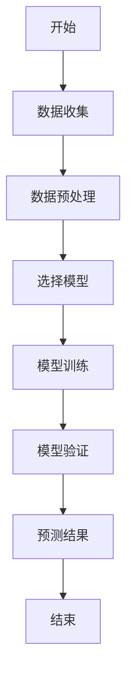

                 


# 彼得林奇对公司现金流预测准确性的分析

> **关键词**: 现金流预测, 彼得林奇, 投资决策, 统计模型, 机器学习

> **摘要**: 本文详细分析了彼得·林奇在现金流预测准确性方面的研究和方法。通过探讨现金流预测的重要性、核心概念、算法原理以及实际应用，本文旨在为投资者和数据科学家提供深刻的见解和实用的指导。

---

## 第一部分: 背景介绍

### 第1章: 现金流预测的重要性与彼得林奇的分析方法

#### 1.1 现金流预测的核心概念

##### 1.1.1 现金流预测的定义与作用
现金流预测是指通过分析历史数据和市场趋势，估算公司在未来一段时间内的现金流入和流出情况。它是企业财务管理和投资决策的重要工具。现金流预测能够帮助公司规划资金使用、评估投资项目、优化资本结构，并为投资者提供重要的决策依据。

##### 1.1.2 彼得林奇的现金流预测方法
彼得·林奇是著名的投资专家，他强调现金流预测在评估公司价值中的重要性。他认为，现金流是衡量公司健康状况的关键指标，能够揭示公司的盈利能力和财务稳定性。林奇通常通过分析公司的自由现金流（Free Cash Flow）来评估其投资价值。自由现金流是指公司在扣除运营成本和资本支出后的剩余现金流，能够用于股息支付、债务偿还或进一步投资。

##### 1.1.3 现金流预测的挑战与外延
现金流预测面临诸多挑战，包括数据的不完整性、市场波动性以及模型的准确性。此外，现金流预测的准确性还受到宏观经济环境、行业竞争状况和公司内部管理等因素的影响。因此，预测过程中需要结合定性和定量分析，综合考虑多种因素。

#### 1.2 彼得林奇的投资策略与现金流预测的联系

##### 1.2.1 彼得林奇的投资哲学
彼得·林奇主张长期投资，注重基本面分析。他认为，投资的最终目标是寻找那些具有持续盈利能力和良好管理的公司。现金流预测在他的投资策略中扮演着重要角色，因为它能够帮助评估公司的盈利质量和未来增长潜力。

##### 1.2.2 现金流预测在投资决策中的地位
现金流预测是投资决策的核心依据之一。通过预测未来的现金流，投资者可以评估公司的内在价值，判断其股票是否被低估或高估。此外，现金流预测还能够帮助投资者识别公司的财务风险，例如过度依赖短期融资或现金流不足以支撑业务扩展的情况。

##### 1.2.3 彼得林奇对现金流预测准确性的独特见解
林奇认为，现金流预测的准确性取决于数据的可靠性和模型的合理性。他强调，投资者应关注那些现金流稳定、增长可预期的公司。此外，他还认为，现金流预测不应仅依赖于历史数据，还应结合行业趋势和公司战略进行动态调整。

### 第2章: 现金流预测的挑战与解决方案

#### 2.1 现金流预测的主要挑战

##### 2.1.1 数据质量与完整性问题
现金流预测的准确性高度依赖于数据的质量和完整性。如果历史数据存在缺失或错误，将直接影响预测结果。此外，不同公司和行业的财务数据可能存在较大的差异，进一步增加了预测的难度。

##### 2.1.2 市场波动与不确定性
金融市场具有高度的不确定性和波动性，这使得现金流预测面临诸多挑战。例如，经济周期的波动、政策变化、行业竞争格局的调整等因素都可能影响公司的现金流状况。

##### 2.1.3 模型选择与参数优化
选择合适的预测模型和优化参数是现金流预测的关键。不同的模型适用于不同的场景，例如线性回归适用于简单的关系，而时间序列分析适用于具有趋势和周期性数据的情况。此外，模型的参数设置也需要根据具体情况调整，以提高预测的准确性。

#### 2.2 现金流预测的解决方案

##### 2.2.1 数据预处理与特征选择
在进行现金流预测之前，需要对数据进行预处理，包括数据清洗、缺失值处理和异常值剔除。此外，特征选择也是关键步骤，需要选取与现金流相关的显著变量，例如收入增长率、净利润率、资本支出等。

##### 2.2.2 统计模型与机器学习模型对比
统计模型（如线性回归、时间序列分析）和机器学习模型（如随机森林、神经网络）在现金流预测中各有优劣。统计模型具有解释性强、计算效率高的优点，而机器学习模型能够捕捉复杂的非线性关系，但解释性较差。

##### 2.2.3 多模型融合与优化策略
为了提高预测的准确性，可以采用多模型融合的方法。例如，结合线性回归和时间序列分析，利用各自的优势进行预测。此外，还可以通过交叉验证和网格搜索等方法优化模型参数，进一步提升预测效果。

---

## 第二部分: 核心概念与联系

### 第3章: 现金流预测的核心原理

#### 3.1 现金流预测的原理与流程

##### 3.1.1 现金流预测的基本原理
现金流预测基于财务数据和市场信息，通过统计或机器学习方法，预测未来现金流的流入和流出情况。预测结果可以用于评估公司的财务健康状况、投资价值和风险敞口。

##### 3.1.2 现金流预测的流程图（Mermaid）


#### 3.2 现金流预测的关键属性特征对比

##### 3.2.1 现金流预测的特征对比表格
| 特征属性       | 描述                                         |
|----------------|----------------------------------------------|
| 时间序列性     | 现金流数据通常具有时间依赖性               |
| 异常值          | 现金流数据中可能包含异常值，如突增或突减      |
| 趋势和周期性    | 现金流数据可能呈现长期趋势或季节性波动       |
| 多变量关系     | 现金流受多个变量影响，如收入、成本、投资等    |

##### 3.2.2 现金流预测与财务报表的关系
现金流预测通常基于公司的财务报表，特别是资产负债表和利润表。通过分析这些报表中的关键指标，可以提取与现金流相关的特征，例如经营活动现金流净额、投资活动现金流净额和筹资活动现金流净额。

#### 3.3 现金流预测的ER实体关系图（Mermaid）
```mermaid
erDiagram
    customer[CUSTOMER] {
        <attrs>
        id : integer
        name : string
        }
    } 
    transaction[TRANSACTION] {
        <attrs>
        id : integer
        amount : decimal
        date : date
        }
    } 
    account[ACCOUNT] {
        <attrs>
        id : integer
        balance : decimal
        }
    } 
    CUSTOMER --|> TRANSACTION : makes
    TRANSACTION --|> ACCOUNT : affects
```

### 第4章: 现金流预测的数学模型与公式

#### 4.1 现金流预测的数学模型

##### 4.1.1 时间序列分析模型
时间序列分析是一种常用的方法，适用于具有明显趋势和周期性特征的现金流数据。常用模型包括ARIMA（自回归积分滑动平均模型）和GARCH（广义自回归条件异方差模型）。

##### 4.1.2 多元回归分析模型
多元回归分析适用于多个自变量对因变量的影响关系。例如，可以将现金流作为因变量，收入、成本、投资等作为自变量，建立回归模型进行预测。

##### 4.1.3 随机过程模型
随机过程模型适用于具有不确定性和波动性的现金流预测。例如，可以使用布朗运动模型模拟现金流的随机波动。

#### 4.2 现金流预测的数学公式

##### 4.2.1 线性回归模型公式
$$ y = \beta_0 + \beta_1x + \epsilon $$

##### 4.2.2 时间序列模型公式
$$ R_t = \alpha + \beta R_{t-1} + \epsilon_t $$

##### 4.2.3 随机过程模型公式
$$ dS_t = \mu S_t dt + \sigma S_t dW_t $$

#### 4.3 现金流预测的举例说明

##### 4.3.1 简单线性回归案例
假设我们有以下历史数据：
| 年份 | 收入（x） | 现金流（y） |
|------|-----------|-------------|
| 2018 | 100       | 20          |
| 2019 | 150       | 30          |
| 2020 | 200       | 40          |

通过线性回归模型，我们可以预测2021年的现金流：
$$ y = 10 + 0.2x $$

##### 4.3.2 时间序列预测案例
假设我们有以下历史现金流数据：
| 时间 | 现金流（$） |
|------|-------------|
| 2019Q1 | 100         |
| 2019Q2 | 120         |
| 2019Q3 | 130         |
| 2019Q4 | 140         |

使用ARIMA模型进行预测，预测2020Q1的现金流为150。

##### 4.3.3 随机过程模拟案例
假设我们有一个现金流的随机过程模型：
$$ dS_t = 0.05 S_t dt + 0.2 S_t dW_t $$

通过蒙特卡罗模拟，我们可以预测未来现金流的可能分布。

---

## 第三部分: 算法原理讲解

### 第5章: 现金流预测的算法原理

#### 5.1 现金流预测的算法原理

##### 5.1.1 时间序列分析模型
时间序列分析模型通过分析数据的自相关性和偏自相关性，选择合适的模型进行预测。例如，ARIMA模型通过调整阶数参数，能够捕捉数据的趋势和周期性特征。

##### 5.1.2 多元回归分析模型
多元回归分析模型通过最小二乘法，估计自变量与因变量之间的关系。例如，可以将现金流作为因变量，收入、成本、投资等作为自变量，建立回归模型进行预测。

##### 5.1.3 机器学习模型
机器学习模型，如随机森林和神经网络，能够捕捉复杂的非线性关系。例如，可以使用随机森林模型，通过特征重要性分析，选择对现金流影响最大的变量进行预测。

#### 5.2 现金流预测的代码实现

##### 5.2.1 环境安装
需要安装以下Python库：
```bash
pip install numpy pandas scikit-learn matplotlib
```

##### 5.2.2 核心代码
以下是现金流预测的Python代码示例：

```python
import numpy as np
import pandas as pd
from sklearn.linear_model import LinearRegression
from sklearn.metrics import mean_squared_error
from statsmodels.tsa.arima_model import ARIMA

# 示例数据
data = {
    '日期': ['2018Q1', '2018Q2', '2018Q3', '2018Q4', '2019Q1'],
    '收入': [100, 120, 130, 140, 150],
    '现金流': [20, 25, 30, 35, 40]
}
df = pd.DataFrame(data)

# 线性回归模型
model_lr = LinearRegression()
model_lr.fit(df[['收入']], df['现金流'])
predicted_lr = model_lr.predict(df[['收入']])

# 时间序列模型
model_arima = ARIMA(df['现金流'], order=(1, 1, 0))
model_arima_fit = model_arima.fit()
predicted_arima = model_arima_fit.forecast(steps=1)[0]

# 输出结果
print("线性回归预测结果:", predicted_lr)
print("ARIMA预测结果:", predicted_arima)
print("均方根误差:", mean_squared_error(df['现金流'], predicted_lr))
```

#### 5.3 项目实战

##### 5.3.1 实际案例分析
假设我们有一个真实的现金流数据集，包含多个公司的历史现金流数据和相关财务指标。我们可以使用上述代码进行预测，并比较不同模型的预测结果。

##### 5.3.2 小结
通过实际案例分析，我们可以发现，不同的模型在不同场景下表现各异。因此，在实际应用中，需要根据具体情况进行模型选择和优化。

---

## 第四部分: 最佳实践与总结

### 第6章: 现金流预测的最佳实践

#### 6.1 最佳实践

##### 6.1.1 小结
现金流预测是投资决策和企业财务管理的重要工具。通过选择合适的模型和优化参数，可以提高预测的准确性。

##### 6.1.2 注意事项
- 数据预处理是关键，需要清洗和特征选择。
- 模型选择应根据数据特点和预测目标进行。
- 预测结果应结合实际情况进行调整和验证。

##### 6.1.3 拓展阅读
建议读者进一步阅读彼得·林奇的相关著作，以及时间序列分析和机器学习在金融领域的应用。

---

## 作者信息

作者：AI天才研究院/AI Genius Institute & 禅与计算机程序设计艺术 /Zen And The Art of Computer Programming

