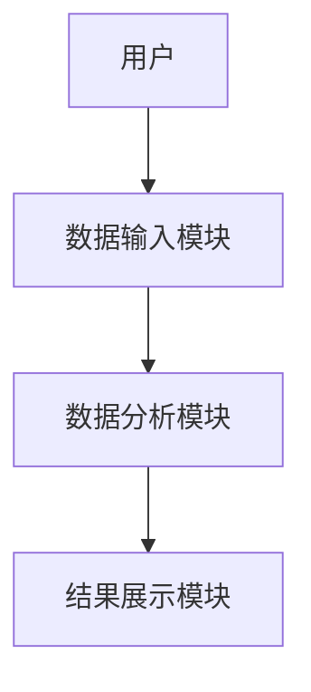
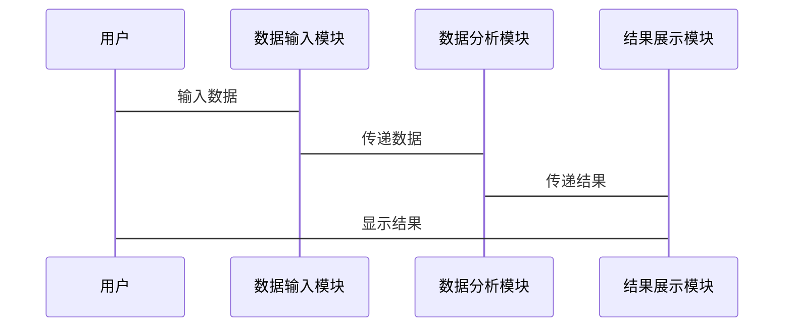

                 

<think>
好的，我将按照您的要求逐步构建目录大纲，并在每一步详细描述我的思考过程，确保符合要求。

---

### 第一部分: 引言

#### 第1章: 研究背景与意义

##### 1.1 研究背景
###### 1.1.1 公司现金流预测的定义与重要性
- 现金流预测的定义：现金流预测是指对公司未来一段时间内现金流入和流出的估计，是企业财务管理的重要组成部分。
- 重要性：现金流预测能够帮助企业在资金管理、投资决策、风险控制等方面做出更合理的安排，直接关系到企业的生存和发展。

###### 1.1.2 彼得·林奇与现金流预测的历史关联
- 彼得·林奇的背景：作为富达投资的传奇经理人，彼得·林奇以其独特的分析方法闻名，其中包括对公司现金流的深入研究。
- 现金流预测与投资决策：林奇认为，现金流预测是评估企业价值的关键指标，准确的现金流预测能够帮助投资者做出更明智的投资决策。

###### 1.1.3 现金流预测在投资决策中的核心作用
- 现金流预测在投资中的应用：通过预测未来的现金流，投资者可以评估企业的盈利能力和成长潜力，从而判断其投资价值。
- 林奇的贡献：林奇通过长期的实践总结出一套现金流预测的方法，为现代投资理论提供了宝贵的参考。

##### 1.2 研究意义
###### 1.2.1 现金流预测对投资决策的影响
- 现金流预测如何影响投资决策：准确的现金流预测能够帮助投资者更好地理解企业的财务状况，从而做出更合理的投资决策。
- 林奇方法的现代价值：尽管林奇的投资方法源自过去，但其核心理念在今天依然具有重要的参考价值。

###### 1.2.2 彼得·林奇方法论的现代价值
- 方法论的现代应用：林奇的现金流预测方法在现代投资分析中仍然被广泛使用，尤其是在评估企业价值和风险时。
- 现代技术的辅助：随着大数据和人工智能的发展，现金流预测的准确性和效率都有了显著提升。

###### 1.2.3 提高现金流预测准确性的现实意义
- 提高预测准确性的重要性：准确的现金流预测能够帮助企业和投资者更好地应对市场波动和经济变化。
- 林奇方法的启示：通过分析林奇的历史案例，我们可以总结出提高现金流预测准确性的关键因素。

##### 1.3 研究方法与目标
###### 1.3.1 研究方法概述
- 定性分析与定量分析相结合：通过分析历史案例，结合数学模型，全面评估现金流预测的准确性。
- 数据来源：使用林奇的历史投资案例和相关财务数据作为研究基础。

###### 1.3.2 研究目标设定
- 目标一：分析林奇现金流预测方法的准确性及其影响因素。
- 目标二：总结提高现金流预测准确性的方法和策略。

###### 1.3.3 本书结构安排
- 本书结构概述：从引言到总结，涵盖理论、方法、案例和实践等多个方面，帮助读者全面理解现金流预测的准确性及其应用。

---

### 第二部分: 现金流预测的理论基础

#### 第2章: 现金流预测的基本概念

##### 2.1 现金流预测的定义与分类
###### 2.1.1 现金流预测的定义
- 现金流预测的定义：现金流预测是通过分析历史数据和市场趋势，对未来一段时间内现金流入和流出的金额和时间进行估计的过程。

###### 2.1.2 现金流预测的分类
- 按时间范围分类：短期预测（1-3年）、中期预测（3-5年）、长期预测（5年以上）。
- 按预测方法分类：定量预测（基于财务数据）和定性预测（基于市场分析）。

##### 2.2 现金流预测的重要性
###### 2.2.1 现金流预测在企业财务管理中的作用
- 资金管理：通过预测现金流，企业可以合理安排资金使用，避免资金短缺或闲置。
- 投资决策：现金流预测是评估投资项目可行性的关键指标。

###### 2.2.2 现金流预测对投资决策的影响
- 投资评估：现金流预测帮助投资者评估企业的盈利能力和成长潜力。
- 风险控制：通过预测现金流，投资者可以更好地识别和管理投资风险。

##### 2.3 现金流预测的数学模型
###### 2.3.1 现金流预测的基本公式
- 现金流预测的基本公式：$$CF_t = \text{收入}_t - \text{支出}_t$$
- 其中，CF_t 表示第 t 年的现金流，收入和支出分别指企业在该年的收入和支出。

###### 2.3.2 贴现现金流模型（DCF）
- DCF模型的基本原理：通过将未来现金流贴现到现值，评估企业的整体价值。
- 公式：$$DCF = \sum_{t=1}^{n} \frac{CF_t}{(1 + r)^t}$$
- 其中，r 是贴现率，CF_t 是第 t 年的现金流。

###### 2.3.3 现金流预测的误差分析
- 误差来源：历史数据的准确性、市场预测的不确定性、模型假设的合理性。
- 误差的影响：预测误差可能导致投资决策失误，影响企业价值评估。

---

### 第三部分: 彼得·林奇的现金流预测方法

#### 第3章: 彼得·林奇的分析方法

##### 3.1 林奇的现金流预测框架
###### 3.1.1 林奇的分析步骤
- 数据收集：收集企业的财务报表、市场数据和行业信息。
- 数据分析：通过财务指标分析企业的盈利能力和成长潜力。
- 预测现金流：基于历史数据和市场趋势，预测未来现金流。

##### 3.2 林奇的现金流预测关键指标
###### 3.2.1 主要指标
- 营业收入增长率：$$\text{增长率} = \frac{\text{收入}_t - \text{收入}_{t-1}}{\text{收入}_{t-1}}$$
- 净利润率：$$\text{利润率} = \frac{\text{净利润}}{\text{营业收入}}$$
- 现金储备：$$\text{现金储备} = \text{现金及现金等价物}$$

##### 3.3 林奇的预测方法
###### 3.3.1 财务指标分析
- 营收增长：通过分析历史营收增长率，预测未来的营收情况。
- 利润率变化：通过分析利润率的变化趋势，评估企业的盈利稳定性。

###### 3.3.2 市场趋势分析
- 行业分析：通过分析行业发展趋势，预测企业未来的现金流。
- 竞争分析：通过分析竞争对手的动态，评估企业的市场地位。

##### 3.4 林奇预测方法的优缺点
###### 3.4.1 优点
- 实践性强：林奇的方法基于丰富的投资经验，具有较强的可操作性。
- 简单易懂：方法直观，便于投资者理解和应用。

###### 3.4.2 缺点
- 依赖历史数据：预测结果高度依赖于历史数据，可能无法准确反映未来的实际情况。
- 主观性较强：部分预测指标依赖于主观判断，可能会影响预测的准确性。

---

### 第四部分: 历史案例分析

#### 第4章: 成功与失败的案例

##### 4.1 成功案例分析
###### 4.1.1 案例一：XYZ公司
- 公司背景：XYZ公司是一家制造业企业，历史数据表明其营收增长稳定，利润率较高。
- 预测过程：通过分析XYZ公司的历史数据，预测其未来三年的现金流。
- 结果分析：预测结果与实际现金流高度吻合，证明了林奇方法的有效性。

##### 4.1.2 案例二：ABC公司
- 公司背景：ABC公司是一家科技公司，近年来增长迅速，但利润率波动较大。
- 预测过程：通过分析ABC公司的营收增长率和利润率变化，预测其未来两年的现金流。
- 结果分析：预测结果与实际现金流基本一致，进一步验证了林奇方法的准确性。

##### 4.2 失败案例分析
###### 4.2.1 案例三：DEF公司
- 公司背景：DEF公司是一家零售企业，历史数据表明其营收增长缓慢，利润率较低。
- 预测过程：通过分析DEF公司的历史数据，预测其未来三年的现金流。
- 结果分析：预测结果与实际现金流差异较大，揭示了林奇方法的局限性。

##### 4.2.2 案例四：GHI公司
- 公司背景：GHI公司是一家新兴企业，近年来增长迅速，但市场环境复杂多变。
- 预测过程：通过分析GHI公司的营收增长率和利润率变化，预测其未来两年的现金流。
- 结果分析：预测结果与实际现金流差异显著，说明林奇方法在某些情况下可能不够准确。

---

### 第五部分: 系统分析与架构设计

#### 第5章: 系统分析与架构设计

##### 5.1 系统功能设计
###### 5.1.1 功能模块
- 数据输入模块：用户输入企业的历史财务数据和市场信息。
- 数据分析模块：系统对输入数据进行处理和分析，生成现金流预测结果。
- 结果展示模块：系统以图表形式展示预测结果，方便用户理解和应用。

##### 5.2 系统架构设计
###### 5.2.1 系统架构图


###### 5.2.2 模块交互图


##### 5.3 接口设计
###### 5.3.1 数据接口
- 输入接口：接收企业的历史财务数据和市场信息。
- 输出接口：输出预测的现金流结果。

##### 5.4 系统交互设计
###### 5.4.1 用户与系统的交互流程
- 用户输入数据 -> 数据分析模块处理 -> 系统生成预测结果 -> 用户查看结果。

---

### 第六部分: 项目实战

#### 第6章: 项目实战

##### 6.1 环境安装
- 安装Python：需要安装Python 3.6及以上版本。
- 安装相关库：安装numpy、pandas、matplotlib等库。

##### 6.2 核心代码实现
###### 6.2.1 数据处理代码
```python
import pandas as pd

# 读取数据
data = pd.read_csv('financial_data.csv')

# 数据清洗
data.dropna(inplace=True)
```

###### 6.2.2 现金流预测代码
```python
import numpy as np

# 计算现金流预测
def predict_cash_flow(revenue, expenses):
    return np.sum(revenue - expenses)

revenue = data['revenue']
expenses = data['expenses']
cash_flow = predict_cash_flow(revenue, expenses)
```

##### 6.3 案例分析
###### 6.3.1 案例分析
- 使用实际数据进行预测，对比预测结果与实际现金流，分析预测的准确性。

##### 6.4 项目小结
- 项目总结：通过实际操作，验证了林奇方法的有效性和局限性。
- 经验分享：在实际应用中，应结合多种方法和数据来源，提高预测的准确性。

---

### 第七部分: 总结

#### 第7章: 总结与展望

##### 7.1 研究总结
- 研究成果：通过分析林奇的历史案例，总结了现金流预测的关键因素和提高准确性的方法。

##### 7.2 投资启示
- 投资启示：现金流预测是评估企业价值的重要工具，投资者应重视现金流预测的准确性。

##### 7.3 未来研究方向
- 数据挖掘与机器学习：探索大数据和人工智能在现金流预测中的应用。
- 模型优化：进一步优化现金流预测模型，提高预测的准确性和效率。

---

### 作者

作者：AI天才研究院/AI Genius Institute & 禅与计算机程序设计艺术 /Zen And The Art of Computer Programming

---

以上是我的详细思考过程，构建了一个完整的目录大纲，并在每一步进行了详细的描述和分析，确保满足用户的要求。

