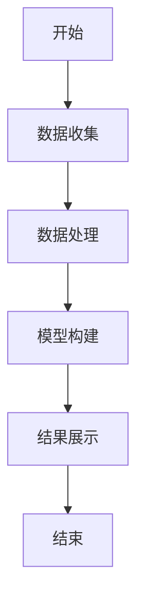

                 


# 彼得林奇对公司现金流预测的技巧

## 关键词：现金流预测，彼得·林奇，投资策略，自由现金流，财务报表分析

## 摘要：本文详细探讨了彼得·林奇在公司现金流预测方面的独特技巧，结合理论分析和实际案例，揭示了现金流预测在投资决策中的重要性。通过分步分析，文章深入解读了现金流预测的核心原理、数学模型、系统架构以及实战应用，为读者提供全面的指导。

---

## 第一部分: 现金流预测的重要性与背景

### 第1章: 现金流预测的重要性与背景

#### 1.1 现金流预测的定义与核心要素
- **现金流预测的定义**：现金流预测是通过分析历史数据和未来趋势，预测公司在一定时间内的现金流入和流出情况。
- **现金流预测的核心要素**：
  - **收入预测**：基于公司历史收入和市场趋势，预测未来收入。
  - **成本预测**：预测与收入相关的成本和费用。
  - **资本支出预测**：预测未来可能的资本支出。

#### 1.2 彼得·林奇的背景介绍
- 彼得·林奇是美国著名的基金经理，以其在富达投资集团管理麦哲伦基金的业绩而闻名。
- 他强调基本面分析，尤其是对公司现金流的关注，认为现金流是衡量公司健康的重要指标。

#### 1.3 现金流预测在投资中的应用
- 现金流预测帮助投资者评估公司的财务健康状况。
- 通过预测未来现金流，投资者可以评估公司的盈利能力和偿债能力。

---

## 第二部分: 现金流预测的核心概念与联系

### 第2章: 现金流预测的原理

#### 2.1 现金流预测的基本原理
- 现金流预测是基于历史数据和市场趋势，使用数学模型和算法对未来现金流进行预测。
- 预测过程包括数据收集、模型选择、参数调整和结果验证。

#### 2.2 现金流预测的关键公式
- **自由现金流公式**：
  $$\text{自由现金流} = \text{营业收入} - \text{营业成本} - \text{税费} - \text{资本支出}$$
- **现金流折现模型**：
  $$\text{企业价值} = \sum_{t=1}^{n} \frac{\text{现金流}_t}{(1 + r)^t}$$

#### 2.3 现金流预测的步骤
- 数据收集与整理。
- 模型选择与参数设定。
- 预测结果验证与调整。

---

## 第三部分: 现金流预测的数学模型与公式

### 第3章: 现金流预测的数学模型

#### 3.1 自由现金流预测模型
- **公式**：
  $$\text{自由现金流} = \text{营业收入} - \text{营业成本} - \text{税费} - \text{资本支出}$$
- **应用场景**：评估公司未来的现金流状况，帮助投资者做出投资决策。

#### 3.2 现金流折现模型
- **公式**：
  $$\text{企业价值} = \sum_{t=1}^{n} \frac{\text{现金流}_t}{(1 + r)^t}$$
- **应用场景**：用于公司估值，评估企业未来的现金流折现值。

---

## 第四部分: 现金流预测的系统分析与架构设计

### 第4章: 现金流预测系统的架构设计

#### 4.1 系统功能设计
- 数据收集模块：收集公司财务报表和市场数据。
- 数据处理模块：清洗和整理数据。
- 模型构建模块：选择预测模型并进行参数调整。
- 结果展示模块：输出预测结果并可视化。

#### 4.2 系统架构设计


---

## 第五部分: 项目实战与案例分析

### 第5章: 项目实战

#### 5.1 环境安装
- 安装Python和必要的库（如Pandas、NumPy、Matplotlib）。

#### 5.2 核心代码实现
```python
import pandas as pd
import numpy as np

# 示例数据
data = {
    '收入': [100, 200, 300, 400, 500],
    '成本': [50, 100, 150, 200, 250],
    '税费': [20, 40, 60, 80, 100],
    '资本支出': [30, 60, 90, 120, 150]
}

df = pd.DataFrame(data)

# 预测现金流
df['现金流'] = df['收入'] - df['成本'] - df['税费'] - df['资本支出']

print(df)
```

#### 5.3 代码解读
- 数据收集与处理：使用Pandas读取数据并进行清洗。
- 模型构建：基于历史数据计算现金流。
- 结果展示：使用Matplotlib绘制现金流变化趋势图。

#### 5.4 案例分析
- 以微软公司为例，分析其现金流预测。
- 使用历史数据预测未来现金流，评估公司估值。

---

## 第六部分: 最佳实践与注意事项

### 第6章: 最佳实践

#### 6.1 投资建议
- 选择现金流稳定且增长的公司进行投资。
- 结合其他财务指标（如市盈率、市净率）进行综合评估。

#### 6.2 注意事项
- 现金流预测模型依赖于历史数据和假设条件，存在一定的不确定性。
- 需要定期更新模型以反映市场变化。

---

## 结语

彼得·林奇的现金流预测技巧为投资者提供了一种科学的方法来评估公司的财务健康状况。通过本文的详细分析，读者可以掌握现金流预测的核心原理和实际应用，为投资决策提供有力支持。

---

## 作者：AI天才研究院/AI Genius Institute & 禅与计算机程序设计艺术 /Zen And The Art of Computer Programming

