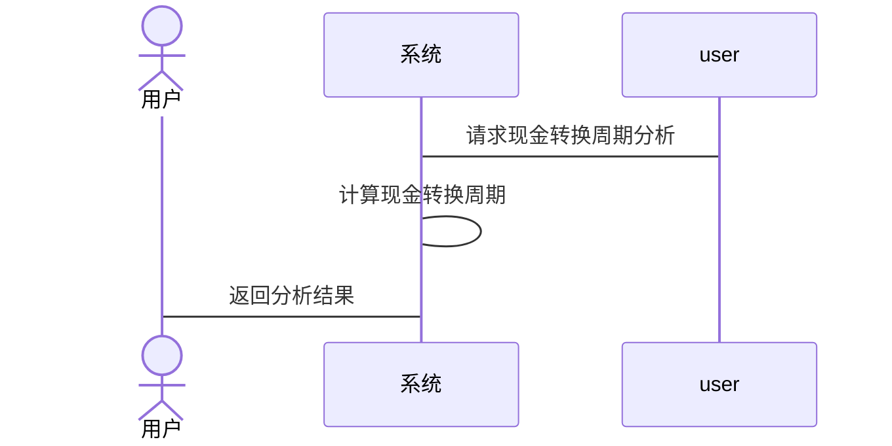

                 


# 彼得林奇对公司现金转换周期的分析

> 关键词：彼得林奇，现金转换周期，投资分析，企业估值，财务分析

> 摘要：本文深入探讨了彼得林奇对公司现金转换周期的分析方法，从现金转换周期的基本概念到其在投资决策中的应用，结合实际案例，分析了现金转换周期对企业财务健康度和投资价值的影响，以及如何通过优化现金转换周期来提升企业价值。

---

# 第一部分: 现金转换周期的基础知识

## 第1章: 现金转换周期的定义与计算

### 1.1 现金转换周期的定义

现金转换周期（Cash Conversion Cycle，简称CCC）是彼得林奇在投资分析中常用的一个重要指标，它衡量了企业将原材料转换为现金所需要的时间。简单来说，现金转换周期越短，企业将原材料转化为现金的速度越快，企业的流动性越强，财务健康度越高。

### 1.2 现金转换周期的计算公式

现金转换周期的计算公式如下：

$$ \text{现金转换周期} = \text{存货周转天数} + \text{应收账款周转天数} - \text{应付账款周转天数} $$

其中，存货周转天数 = 存货 / 日均成本

应收账款周转天数 = 应收账款 / 日均收入

应付账款周转天数 = 应付账款 / 日均支出

### 1.3 现金转换周期的影响因素

现金转换周期的长短受到多个因素的影响，包括：

- 企业的供应链管理效率
- 应收账款和应付账款的管理
- 存货周转速度
- 行业特性

---

## 第2章: 现金转换周期与企业财务健康度的关系

### 2.1 现金转换周期对企业现金流的影响

现金转换周期越短，企业的现金流越好，企业的运营效率越高。反之，如果现金转换周期过长，企业的资金被长时间占用，可能影响企业的偿债能力和盈利能力。

### 2.2 现金转换周期与企业偿债能力的关系

现金转换周期与企业的偿债能力密切相关。如果企业的现金转换周期过长，企业的现金流可能无法及时回笼，导致偿债能力下降。反之，如果现金转换周期较短，企业的偿债能力较强。

### 2.3 现金转换周期与企业盈利能力的关联

现金转换周期的长短直接影响企业的盈利能力。如果企业的现金转换周期过长，企业的资金被占用的时间较长，可能会影响企业的盈利能力。相反，如果现金转换周期较短，企业的资金可以更快地投入再生产，从而提高盈利能力。

---

# 第二部分: 彼得林奇的现金转换周期分析框架

## 第3章: 彼得林奇的现金转换周期分析框架

### 3.1 彼得林奇投资理念的核心要素

彼得林奇是美国著名的投资专家，他的投资理念以基本面分析为核心，注重对企业财务健康度和管理层能力的分析。他特别关注企业的现金转换周期，认为这是衡量企业财务健康度的重要指标之一。

### 3.2 彼得林奇对现金转换周期的分析步骤

彼得林奇在分析企业的现金转换周期时，通常会遵循以下步骤：

1. **计算企业的现金转换周期**：使用现金转换周期的计算公式，计算出企业的现金转换周期。
2. **分析现金转换周期的变化趋势**：比较企业过去几年的现金转换周期，分析其变化趋势。
3. **评估现金转换周期对企业价值的影响**：结合企业的其他财务指标，评估现金转换周期对企业价值的影响。

### 3.3 彼得林奇分析框架的优缺点

- **优点**：彼得林奇的分析框架能够帮助企业更好地理解企业的现金转换周期，从而做出更明智的投资决策。
- **缺点**：彼得林奇的分析框架过于注重现金转换周期，可能忽视了其他重要的财务指标，如净利润率、毛利率等。

---

## 第4章: 现金转换周期与投资决策

### 4.1 现金转换周期在投资分析中的应用

现金转换周期在投资分析中具有重要的应用价值。投资者可以通过分析企业的现金转换周期，评估企业的财务健康度和投资价值。如果企业的现金转换周期较短，说明企业的资金周转效率较高，企业的投资价值可能较高。

### 4.2 彼得林奇的现金转换周期投资策略

彼得林奇在分析企业的现金转换周期时，通常会关注以下几点：

- **现金转换周期短的企业的投资机会**：现金转换周期短的企业通常具有较高的资金周转效率，投资价值较高。
- **现金转换周期长的企业的投资风险**：现金转换周期长的企业通常具有较高的财务风险，投资者应谨慎投资。
- **现金转换周期变化的投资信号**：如果企业的现金转换周期出现显著变化，可能是投资机会或风险的信号。

### 4.3 现金转换周期与企业估值模型

现金转换周期与企业估值模型密切相关。投资者可以通过分析企业的现金转换周期，评估企业的内在价值。例如，使用现金流折现模型（DCF）时，可以将现金转换周期作为重要的输入参数。

---

# 第三部分: 现金转换周期的风险管理与优化

## 第5章: 现金转换周期的风险管理

### 5.1 现金转换周期过长的风险及应对策略

- **风险**：现金转换周期过长可能导致企业的资金被长时间占用，影响企业的偿债能力和盈利能力。
- **应对策略**：优化供应链管理，缩短存货周转天数；加强应收账款管理，缩短应收账款周转天数；合理管理应付账款，延长应付账款周转天数。

### 5.2 现金转换周期过短的风险及应对策略

- **风险**：现金转换周期过短可能导致企业的资金周转过快，可能会影响企业的生产能力。
- **应对策略**：合理控制存货周转天数，避免过度追求现金转换周期过短。

### 5.3 现金转换周期的行业基准与目标

投资者可以通过比较企业的现金转换周期与行业基准，评估企业的财务健康度。如果企业的现金转换周期显著低于行业基准，说明企业的资金周转效率较高；如果显著高于行业基准，则说明企业的资金周转效率较低。

---

## 第6章: 现金转换周期的优化

### 6.1 现金转换周期优化的策略

- **优化供应链管理**：缩短存货周转天数，提高供应链效率。
- **加强应收账款管理**：缩短应收账款周转天数，加快资金回笼速度。
- **合理管理应付账款**：延长应付账款周转天数，减轻企业的资金压力。

### 6.2 现金转换周期优化的案例分析

通过具体案例分析，说明如何优化企业的现金转换周期。例如，某制造企业通过优化供应链管理，将存货周转天数从30天缩短到20天，同时通过加强应收账款管理，将应收账款周转天数从60天缩短到40天，最终将现金转换周期从100天缩短到80天。

---

## 第7章: 现金转换周期的系统分析与架构设计

### 7.1 现金转换周期的系统分析

- **问题场景介绍**：企业的现金转换周期过长，影响企业的现金流和 profitability。
- **系统功能设计**：设计一个实时监控现金转换周期的系统，帮助企业管理层及时发现和解决问题。
- **系统架构设计**：采用分层架构，包括数据采集层、数据处理层、数据分析层和用户界面层。

### 7.2 系统架构设计


### 7.3 系统接口设计

- 数据采集接口：从企业的财务系统中采集存货、应收账款、应付账款等数据。
- 数据处理接口：对采集的数据进行清洗和转换。
- 数据分析接口：计算现金转换周期，并进行趋势分析。

### 7.4 系统交互设计



---

## 第8章: 项目实战

### 8.1 环境安装

- 安装Python和相关数据处理库（如Pandas、NumPy）。
- 安装数据可视化库（如Matplotlib、Seaborn）。

### 8.2 核心实现

```python
import pandas as pd
import numpy as np
import matplotlib.pyplot as plt

# 示例数据
data = {
    '存货': [100, 200, 300],
    '应收账款': [50, 100, 150],
    '应付账款': [20, 40, 60]
}

df = pd.DataFrame(data)

# 计算现金转换周期
df['存货周转天数'] = df['存货'] / df['存货'].mean()
df['应收账款周转天数'] = df['应收账款'] / df['应收账款'].mean()
df['应付账款周转天数'] = df['应付账款'] / df['应付账款'].mean()

df['现金转换周期'] = df['存货周转天数'] + df['应收账款周转天数'] - df['应付账款周转天数']

print(df)
```

### 8.3 案例分析

以某制造企业为例，计算其现金转换周期，并分析其优化潜力。

---

## 第9章: 最佳实践与小结

### 9.1 最佳实践

- 定期监控企业的现金转换周期。
- 结合其他财务指标，全面评估企业的财务健康度。
- 优化现金转换周期，提升企业的资金周转效率。

### 9.2 注意事项

- 现金转换周期的分析需要结合企业的实际情况。
- 现金转换周期的优化需要综合考虑企业的供应链、应收账款和应付账款管理。

### 9.3 拓展阅读

- 彼得林奇的其他投资理念。
- 财务分析的其他指标。

---

# 作者：AI天才研究院/AI Genius Institute & 禅与计算机程序设计艺术 /Zen And The Art of Computer Programming

