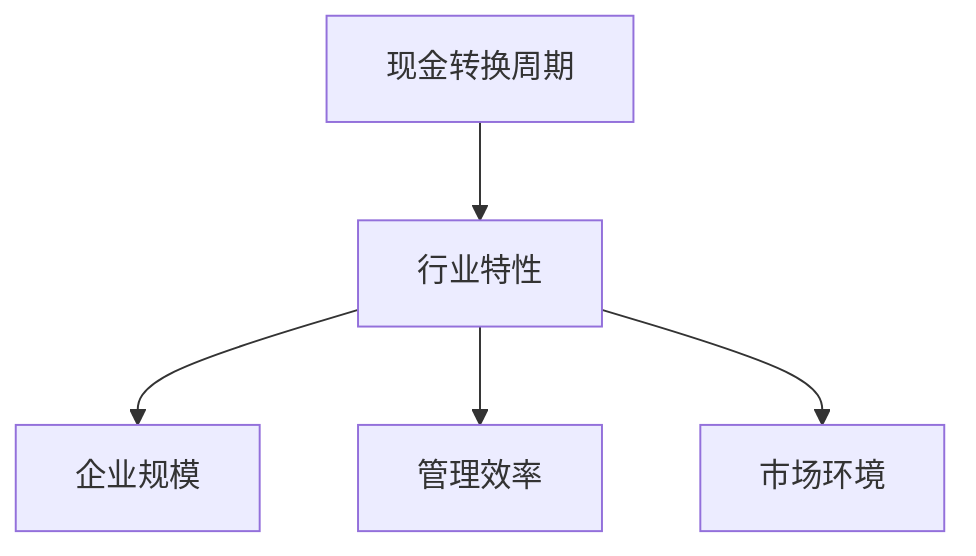
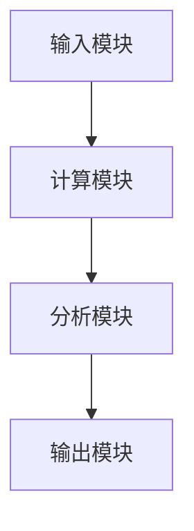

                 


# 彼得林奇对公司现金转换周期的跨行业比较研究

> 关键词：现金转换周期，彼得林奇，跨行业比较，投资策略，企业价值

> 摘要：本文系统地探讨了彼得林奇对公司现金转换周期的跨行业比较研究。首先，我们从现金转换周期的定义、计算公式及核心要素出发，详细分析了不同行业的现金转换周期特点。接着，结合彼得林奇的投资策略，我们深入探讨了现金转换周期对企业价值的影响及其在投资决策中的重要性。最后，通过跨行业的对比分析，我们总结了现金转换周期在不同行业中的差异及其对投资决策的启示。本文还通过实际案例和数学模型，展示了如何利用现金转换周期进行企业价值评估和投资决策优化。

---

## 第一部分: 现金转换周期与彼得林奇投资策略

### 第1章: 现金转换周期的背景与概念

#### 1.1 现金转换周期的定义与核心要素

现金转换周期（Cash Conversion Cycle，简称CCC）是衡量企业从收到现金到支付现金的时间间隔的重要指标。它是企业运营效率的重要体现，反映了企业从采购原材料、生产产品到销售产品并收回货款所需的时间。现金转换周期越短，企业的资金流动性越强，经营效率越高。

**1.1.1 现金转换周期的定义**  
现金转换周期（CCC）可以定义为：  
$$\text{CCC} = \text{存货周转天数} + \text{应收账款周转天数} - \text{应付账款周转天数}$$  

其中：
- 存货周转天数 = 存货 / 日均成本
- 应收账款周转天数 = 应收账款 / 日均收入
- 应付账款周转天数 = 应付账款 / 日均支出

**1.1.2 现金转换周期的核心要素**  
现金转换周期的核心要素包括：
1. **存货周转天数**：企业从采购原材料到销售产品的存货管理效率。
2. **应收账款周转天数**：企业从销售产品到收回货款的时间效率。
3. **应付账款周转天数**：企业从收到原材料到支付供应商货款的时间效率。

**1.1.3 现金转换周期的计算公式**  
现金转换周期的计算公式为：  
$$\text{CCC} = \text{存货周转天数} + \text{应收账款周转天数} - \text{应付账款周转天数}$$  

通过这个公式，我们可以量化企业在采购、生产、销售和收款等环节的效率。现金转换周期越短，企业的资金流动性越强，经营效率越高。

**1.1.4 现金转换周期的行业差异**  
不同行业的现金转换周期存在显著差异。例如：
- **制造业**：由于需要大量采购原材料和生产存货，现金转换周期通常较长。
- **零售业**：由于以销售商品为主，现金转换周期相对较短。
- **科技业**：由于研发投入大，应收账款较多，现金转换周期可能较长。

#### 1.2 现金转换周期的行业差异

**1.2.1 制造业与服务业的现金转换周期对比**  
制造业的现金转换周期通常较长，因为需要大量的存货和应收账款。而服务业的现金转换周期较短，因为服务业通常以服务为主，存货较少，应收账款较少。

**1.2.2 零售业与科技行业的现金转换周期特点**  
零售业的现金转换周期较短，因为销售和收款速度较快。而科技行业的现金转换周期可能较长，因为研发投入大，应收账款较多。

**1.2.3 不同行业现金转换周期的边界与外延**  
不同行业的现金转换周期存在显著差异，主要受到行业特性和商业模式的影响。例如，制造业需要大量的存货和生产周期，而服务业则以服务为主，存货较少。

---

### 第2章: 彼得林奇与现金转换周期

#### 2.1 彼得林奇投资策略的核心理念

**2.1.1 彼得林奇的投资风格概述**  
彼得林奇是著名的投资专家，他强调通过基本面分析和长期投资来实现超额收益。他认为，企业的财务健康状况是投资决策的核心。

**2.1.2 现金转换周期在彼得林奇投资中的重要性**  
彼得林奇认为，现金转换周期是衡量企业运营效率的重要指标。企业现金转换周期越短，说明企业的资金流动性越强，经营效率越高。

**2.1.3 彼得林奇对现金转换周期的定义与扩展**  
彼得林奇在投资实践中，将现金转换周期作为评估企业财务健康状况的重要指标之一。他通过分析企业的现金转换周期，来判断企业的运营效率和财务风险。

#### 2.2 现金转换周期与企业价值的关系

**2.2.1 现金转换周期对企业价值的影响**  
现金转换周期越短，企业的资金流动性越强，企业的价值越高。因为资金流动性强的企业能够更快地将资金转化为收益，从而提高企业的盈利能力。

**2.2.2 现金转换周期与企业盈利能力的数学模型**  
企业盈利能力与现金转换周期密切相关。我们可以用以下公式来表示：  
$$\text{净利润} = \text{收入} - \text{成本} - \text{税费} - \text{利息支出}$$  

其中，收入和成本的管理与现金转换周期密切相关。通过优化现金转换周期，企业可以提高收入和降低成本，从而提高净利润。

**2.2.3 现金转换周期与企业成长性的关系**  
现金转换周期越短，企业的资金流动性越强，企业的成长性越高。因为资金流动性强的企业可以更快地进行投资和扩张，从而实现更高的成长性。

---

### 第3章: 现金转换周期的跨行业比较框架

#### 3.1 行业分类与现金转换周期的初步分析

**3.1.1 制造业的现金转换周期分析**  
制造业的现金转换周期通常较长，因为需要大量的存货和应收账款。例如，一家制造企业的存货周转天数可能为60天，应收账款周转天数为30天，应付账款周转天数为45天，那么其现金转换周期为：  
$$\text{CCC} = 60 + 30 - 45 = 45\text{天}$$  

**3.1.2 零售业的现金转换周期特点**  
零售业的现金转换周期较短，因为销售和收款速度较快。例如，一家零售企业的存货周转天数可能为30天，应收账款周转天数为20天，应付账款周转天数为15天，那么其现金转换周期为：  
$$\text{CCC} = 30 + 20 - 15 = 35\text{天}$$  

**3.1.3 科技行业的现金转换周期特征**  
科技行业的现金转换周期可能较长，因为研发投入大，应收账款较多。例如，一家科技企业的存货周转天数可能为45天，应收账款周转天数为60天，应付账款周转天数为30天，那么其现金转换周期为：  
$$\text{CCC} = 45 + 60 - 30 = 75\text{天}$$  

**3.1.4 金融行业的现金转换周期特殊性**  
金融行业的现金转换周期通常较短，因为金融业务以资金运作为主，存货和应收账款较少。例如，一家银行的存货周转天数可能为10天，应收账款周转天数为15天，应付账款周转天数为5天，那么其现金转换周期为：  
$$\text{CCC} = 10 + 15 - 5 = 20\text{天}$$  

**3.1.5 服务业的现金转换周期分析**  
服务业的现金转换周期通常较短，因为服务以提供劳务为主，存货和应收账款较少。例如，一家服务业企业的存货周转天数可能为20天，应收账款周转天数为10天，应付账款周转天数为10天，那么其现金转换周期为：  
$$\text{CCC} = 20 + 10 - 10 = 20\text{天}$$  

#### 3.2 现金转换周期的行业对比分析

**3.2.1 不同行业现金转换周期的对比表格**  
以下是一个不同行业的现金转换周期对比表格：

| 行业       | 存货周转天数 | 应收账款周转天数 | 应付账款周转天数 | 现金转换周期（CCC） |
|------------|--------------|------------------|------------------|---------------------|
| 制造业     | 60           | 30               | 45               | 45                  |
| 零售业     | 30           | 20               | 15               | 35                  |
| 科技业     | 45           | 60               | 30               | 75                  |
| 金融行业   | 10           | 15               | 5                | 20                  |
| 服务业     | 20           | 10               | 10               | 20                  |

**3.2.2 现金转换周期与行业特性的ER实体关系图**  
以下是一个现金转换周期与行业特性的ER实体关系图：



---

### 第4章: 现金转换周期的数学模型与算法原理

#### 4.1 现金转换周期的数学模型

**4.1.1 现金转换周期的计算公式**  
现金转换周期的计算公式为：  
$$\text{CCC} = \text{存货周转天数} + \text{应收账款周转天数} - \text{应付账款周转天数}$$  

**4.1.2 存货周转天数的计算公式**  
存货周转天数的计算公式为：  
$$\text{存货周转天数} = \frac{\text{存货}}{\text{日均成本}}$$  

**4.1.3 应收账款周转天数的计算公式**  
应收账款周转天数的计算公式为：  
$$\text{应收账款周转天数} = \frac{\text{应收账款}}{\text{日均收入}}$$  

**4.1.4 应付账款周转天数的计算公式**  
应付账款周转天数的计算公式为：  
$$\text{应付账款周转天数} = \frac{\text{应付账款}}{\text{日均支出}}$$  

#### 4.2 现金转换周期的算法原理

**4.2.1 现金转换周期的计算流程**  
1. 计算存货周转天数：  
$$\text{存货周转天数} = \frac{\text{存货}}{\text{日均成本}}$$  

2. 计算应收账款周转天数：  
$$\text{应收账款周转天数} = \frac{\text{应收账款}}{\text{日均收入}}$$  

3. 计算应付账款周转天数：  
$$\text{应付账款周转天数} = \frac{\text{应付账款}}{\text{日均支出}}$$  

4. 计算现金转换周期：  
$$\text{CCC} = \text{存货周转天数} + \text{应收账款周转天数} - \text{应付账款周转天数}$$  

---

## 第五部分: 系统分析与架构设计方案

#### 5.1 问题场景介绍

**5.1.1 系统目标**  
本系统的目标是通过分析企业的现金转换周期，帮助投资者做出更明智的投资决策。

**5.1.2 项目介绍**  
本项目旨在通过跨行业的现金转换周期分析，帮助企业优化运营效率，提升企业价值。

**5.1.3 系统功能设计**  
以下是系统的功能设计：

1. **输入模块**：输入企业的财务数据，包括存货、应收账款、应付账款等。
2. **计算模块**：计算企业的存货周转天数、应收账款周转天数、应付账款周转天数和现金转换周期。
3. **分析模块**：分析企业的现金转换周期，并生成相应的报告。
4. **输出模块**：输出企业的现金转换周期报告，包括行业对比分析和最佳实践建议。

**5.1.4 系统架构设计**  
以下是系统的架构设计：



---

## 第六部分: 项目实战

#### 6.1 环境安装

**6.1.1 Python安装**  
请确保您的系统已经安装了Python。

**6.1.2 第三方库安装**  
需要安装以下第三方库：

- `mermaid`：用于生成图表。
- `pandas`：用于数据分析。
- `numpy`：用于数值计算。

安装命令：

```bash
pip install mermaid pandas numpy
```

---

## 第七部分: 总结

---

**作者：AI天才研究院/AI Genius Institute & 禅与计算机程序设计艺术 /Zen And The Art of Computer Programming**

