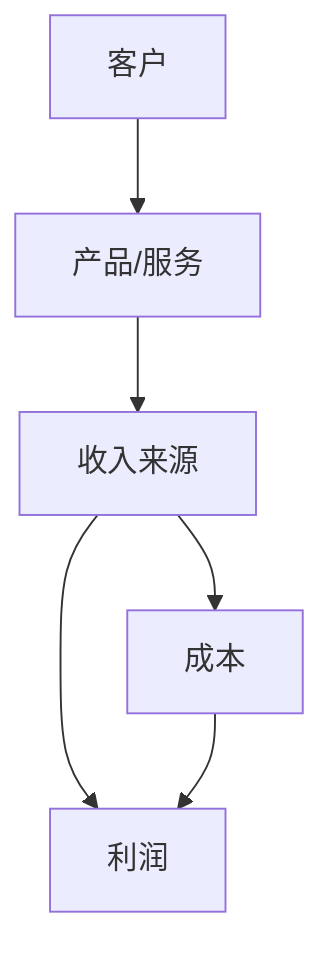
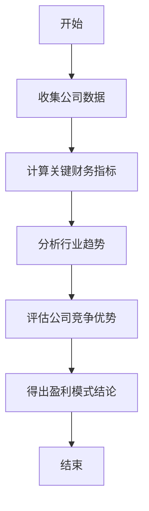
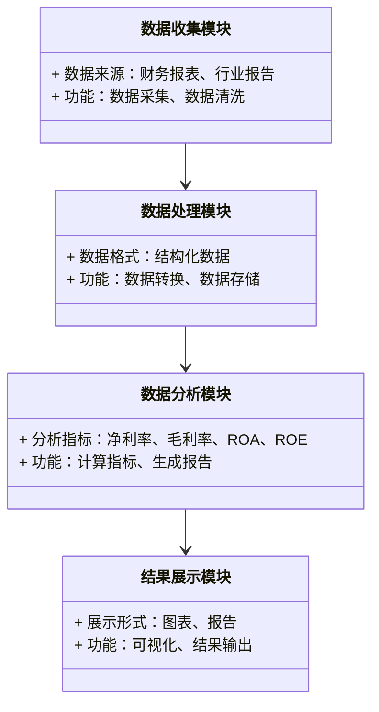
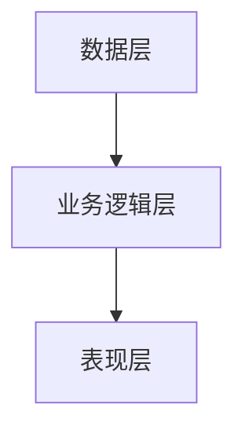
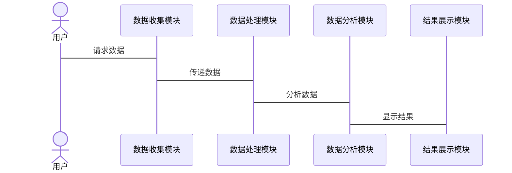

                 


# 彼得林奇对公司盈利模式的分析

**关键词：** 彼得·林奇，盈利模式，投资分析，财务指标，公司估值

**摘要：** 本文通过分析彼得·林奇对公司盈利模式的深入研究，揭示了他的投资理念、分析框架及具体方法。我们从盈利模式的基本概念出发，介绍林奇的核心分析框架，详细探讨其盈利模式分析的数学模型与算法原理，并通过实际案例展示如何运用这些方法进行系统分析。最后，我们将总结最佳实践，为读者提供实用的指导。

---

## 第1章: 盈利模式的基本概念与框架

### 1.1 盈利模式的定义与核心要素

#### 1.1.1 盈利模式的定义
盈利模式是企业通过提供产品或服务，从顾客那里获得收入的方式。它描述了企业如何创造价值并从中获利的过程。

#### 1.1.2 盈利模式的核心要素
盈利模式的核心要素包括：
1. **价值主张**：企业提供的产品或服务是否满足客户需求。
2. **资源与能力**：企业是否拥有实现盈利所需的资源和能力。
3. **收入来源**：企业通过何种方式获取收入，例如销售、订阅等。
4. **成本结构**：企业的主要成本来源，例如原材料、人工成本等。
5. **关键合作伙伴**：企业依赖哪些合作伙伴来实现盈利。

#### 1.1.3 盈利模式的分类与特征对比（表格）
以下是一个盈利模式分类的对比表格：

| 盈利模式类型 | 特点 | 适用行业 | 示例 |
|--------------|------|----------|------|
| 销售产品模式 | 通过销售产品获得收入 | 制造业、零售业 | 汽车销售 |
| 订阅模式     | 通过定期订阅服务获得收入 | 软件行业、媒体行业 | 软件即服务（SaaS） |
| 广告模式     | 通过广告收入获得盈利 | 媒体行业、互联网平台 | Google、Facebook |
| 服务模式     | 通过提供专业服务获得收入 | 专业服务行业、咨询行业 | 律师事务所、管理咨询公司 |

#### 1.1.4 盈利模式的实体关系图（Mermaid）
以下是一个盈利模式的实体关系图：



---

## 第2章: 彼得·林奇的投资理念与方法

### 2.1 林奇的投资哲学

#### 2.1.1 林奇的投资理念
彼得·林奇认为，投资成功的关键在于选择那些具有强大竞争优势的公司。他强调对公司基本面的深入研究，尤其是盈利能力、成长性和财务健康状况。

#### 2.1.2 林奇的选股标准
林奇选股的几个关键标准：
1. 公司具有强大的市场地位。
2. 公司具备持续的盈利能力。
3. 公司管理层具备优秀的能力。
4. 公司估值合理。

#### 2.1.3 林奇对市场的看法
林奇认为，市场短期波动是不可预测的，但长期来看，股票的价格是由公司的基本面决定的。

### 2.2 林奇的盈利模式分析方法

#### 2.2.1 林奇的行业分析方法
林奇通过分析行业趋势、竞争格局和市场容量来判断一个行业是否具有投资价值。

#### 2.2.2 林奇的财务分析方法
林奇特别关注以下几个财务指标：
1. 净利润率（Net Profit Margin）：净利润与营业收入的比率。
2. 毛利率（Gross Profit Margin）：毛利与营业收入的比率。
3. 资产回报率（ROA）：净利润与总资产的比率。
4. 股东权益回报率（ROE）：净利润与股东权益的比率。

#### 2.2.3 林奇的管理层评估方法
林奇认为，管理层的能力和决策对公司盈利模式的影响至关重要。他通过分析管理层的过往业绩、战略规划和管理风格来评估其能力。

---

## 第3章: 盈利模式的数学模型与算法原理

### 3.1 盈利能力分析的数学模型

#### 3.1.1 净利率计算公式
净利率的计算公式为：
$$ \text{净利率} = \frac{\text{净利润}}{\text{营业收入}} $$

#### 3.1.2 毛利率计算公式
毛利率的计算公式为：
$$ \text{毛利率} = \frac{\text{毛利}}{\text{营业收入}} $$

#### 3.1.3 资产回报率（ROA）计算公式
资产回报率的计算公式为：
$$ \text{ROA} = \frac{\text{净利润}}{\text{总资产}} $$

#### 3.1.4 股东权益回报率（ROE）计算公式
股东权益回报率的计算公式为：
$$ \text{ROE} = \frac{\text{净利润}}{\text{股东权益}} $$

### 3.2 盈利模式分析的算法流程

#### 3.2.1 盈利模式分析的流程图（Mermaid）
以下是一个盈利模式分析的流程图：



---

## 第4章: 盈利模式的系统分析与架构设计

### 4.1 系统分析框架

#### 4.1.1 盈利模式分析的系统目标
系统的目标是通过收集和分析公司的财务数据，评估其盈利模式的健康状况。

#### 4.1.2 盈利模式分析的系统范围
系统范围包括数据收集、数据处理、数据分析和结果展示四个模块。

#### 4.1.3 盈利模式分析的系统功能模块（Mermaid类图）
以下是一个系统功能模块的类图：



### 4.2 系统架构设计

#### 4.2.1 分层架构设计（Mermaid架构图）
以下是一个分层架构设计的Mermaid图：



#### 4.2.2 模块交互流程（Mermaid序列图）
以下是一个模块交互流程的Mermaid图：



---

## 第5章: 盈利模式分析的项目实战

### 5.1 项目背景与目标

#### 5.1.1 项目背景
我们选择一家零售公司作为案例，分析其盈利模式。

#### 5.1.2 项目目标
通过分析该公司的财务数据和行业趋势，评估其盈利模式的健康状况。

### 5.2 核心功能实现

#### 5.2.1 环境安装与配置
安装Python和相关库（Pandas、Matplotlib）。

#### 5.2.2 核心代码实现（Python）
```python
import pandas as pd
import matplotlib.pyplot as plt

# 假设我们有一个包含财务数据的DataFrame
data = {
    '营业收入': [100, 120, 150, 180],
    '净利润': [20, 25, 30, 35],
    '总资产': [50, 60, 70, 80],
    '股东权益': [30, 35, 40, 45]
}
df = pd.DataFrame(data)

# 计算净利率
df['净利率'] = df['净利润'] / df['营业收入']

# 计算资产回报率
df['ROA'] = df['净利润'] / df['总资产']

# 计算股东权益回报率
df['ROE'] = df['净利润'] / df['股东权益']

# 绘制净利率和ROE的折线图
plt.plot(df['营业收入'], df['净利率'], label='净利率')
plt.plot(df['营业收入'], df['ROE'], label='ROE')
plt.xlabel('营业收入')
plt.ylabel('比率')
plt.legend()
plt.show()
```

#### 5.2.3 代码解读与分析
上述代码首先创建了一个包含财务数据的DataFrame，然后计算了净利率、资产回报率和股东权益回报率，并通过折线图展示了这些指标的变化趋势。

---

## 第6章: 盈利模式分析的最佳实践与注意事项

### 6.1 最佳实践Tips

#### 6.1.1 数据收集与处理的注意事项
- 确保数据的准确性和完整性。
- 对异常数据进行清洗和处理。

#### 6.1.2 模型选择与优化的建议
- 根据具体需求选择合适的分析方法。
- 定期更新模型以适应市场变化。

#### 6.1.3 结果验证与反馈的步骤
- 对分析结果进行验证。
- 根据反馈优化分析流程。

### 6.2 小结与拓展阅读

#### 6.2.1 本章小结
通过本文的学习，我们掌握了彼得·林奇的盈利模式分析方法，了解了相关的数学模型和系统架构设计，并通过实际案例展示了如何应用这些方法进行分析。

#### 6.2.2 拓展阅读推荐
- 彼得·林奇的书籍《彼得·林奇的投资哲学》
- 关于财务分析的经典教材《财务报表分析》

---

## 第7章: 盈利模式分析的数学公式与案例分析

### 7.1 盈利模式分析的数学公式

#### 7.1.1 净利润计算公式
$$ \text{净利润} = \text{营业收入} - \text{营业成本} - \text{税金及附加} - \text{销售费用} - \text{管理费用} - \text{研发费用} $$

#### 7.1.2 毛利率计算公式
$$ \text{毛利率} = \frac{\text{营业收入} - \text{营业成本}}{\text{营业收入}} $$

#### 7.1.3 资产回报率（ROA）计算公式
$$ \text{ROA} = \frac{\text{净利润}}{\text{总资产}} $$

#### 7.1.4 股东权益回报率（ROE）计算公式
$$ \text{ROE} = \frac{\text{净利润}}{\text{股东权益}} $$

### 7.2 案例分析与详细解读

#### 7.2.1 案例背景介绍
我们以一家互联网公司为例，分析其盈利模式。

#### 7.2.2 案例分析过程
1. 收集公司的财务数据。
2. 计算关键财务指标。
3. 分析行业趋势。
4. 评估公司竞争优势。

#### 7.2.3 案例结果与启示
通过分析，我们发现该公司的毛利率逐年上升，但净利率却在下降。这可能是因为公司的成本控制能力不足或管理费用增加。

---

## 第8章: 盈利模式分析的系统交互与架构优化

### 8.1 系统交互流程优化

#### 8.1.1 用户需求分析
用户需要一个直观的界面来输入数据、运行分析并查看结果。

#### 8.1.2

---

作者：AI天才研究院/AI Genius Institute & 禅与计算机程序设计艺术 /Zen And The Art of Computer Programming

