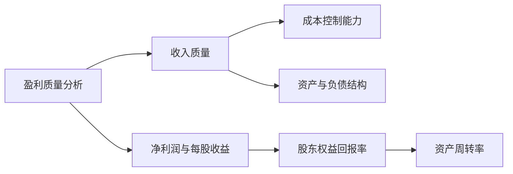
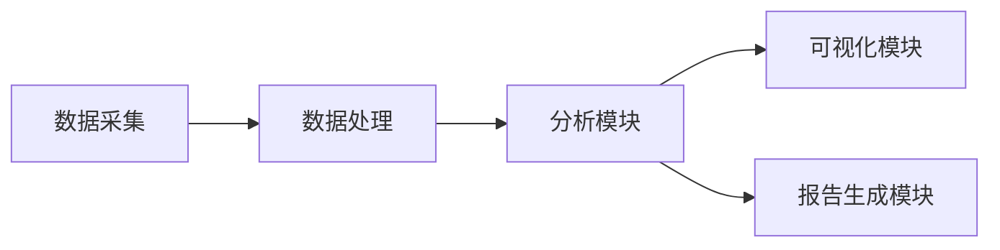

                 


# 彼得林奇对公司盈利质量的分析

## 关键词：彼得林奇、盈利质量、财务分析、投资策略、企业价值、现金流、财务报表

## 摘要：本文深入探讨了彼得·林奇对公司盈利质量的分析方法，从核心概念、算法原理到系统架构、项目实战，结合实际案例，分析了盈利质量对企业价值的影响，并提出了最佳的投资策略。

## 第一部分：背景与基础

## 第1章：盈利质量分析的基本概念

### 1.1 盈利质量分析的定义与重要性

#### 1.1.1 盈利质量分析的定义

盈利质量分析是通过对公司的财务报表数据进行深入分析，评估公司盈利的可持续性和质量的过程。它不仅仅是关注公司是否盈利，而是关注盈利的方式、来源以及未来的可持续性。

#### 1.1.2 盈利质量分析的重要性

盈利质量分析对于投资者来说至关重要，因为它可以帮助投资者识别出那些表面上盈利良好，但实际上可能存在隐藏问题的公司。通过分析盈利质量，投资者可以更准确地评估公司的内在价值，从而做出更明智的投资决策。

#### 1.1.3 盈利质量与企业价值的关系

盈利质量直接影响企业的价值。一家公司如果能够持续、稳定地创造高质量的利润，其企业价值通常会更高。因此，盈利质量是评估企业价值的重要指标之一。

### 1.2 彼得·林奇的背景与投资理念

#### 1.2.1 彼得·林奇的生平简介

彼得·林奇是美国著名的投资专家，被誉为“普通股投资之父”。他曾经管理富达麦哲伦基金，取得了极其出色的业绩，基金的年平均回报率高达29.1%。

#### 1.2.2 林奇的投资哲学

林奇的投资哲学强调长期投资、价值投资和深入研究。他认为，投资者应该选择那些具有持续盈利能力和良好管理的公司进行投资，并且要耐心等待这些公司价值的实现。

#### 1.2.3 林奇对公司盈利质量分析的独特视角

林奇非常重视公司的盈利质量，他认为，一家公司的盈利能力不仅要看其利润的多少，还要看其利润的来源和质量。他特别关注公司的收入质量、成本控制能力和资产使用效率。

## 第2章：盈利质量分析的核心要素

### 2.1 盈利能力的核心指标

#### 2.1.1 净利润与每股收益

净利润是公司利润表中的最后一项，是公司一定时期内所有收入减去所有支出后的净收益。每股收益（EPS）是净利润除以公司发行的普通股数量，是衡量公司盈利能力的重要指标。

#### 2.1.2 营业利润率与净利率

营业利润率是公司营业利润与营业收入的比率，反映了公司每单位收入的营业利润。净利率是净利润与营业收入的比率，反映了公司整体的盈利能力。

#### 2.1.3 资产周转率与股东权益回报率

资产周转率是公司销售收入与平均资产总额的比率，反映了公司资产的使用效率。股东权益回报率（ROE）是净利润与平均股东权益的比率，反映了公司对股东资金的使用效率。

### 2.2 盈利质量的多维度评估

#### 2.2.1 收入质量分析

收入质量分析包括收入的来源、收入的增长是否可持续、收入的结构是否合理等方面。收入质量高的公司通常具有稳定的客户基础和良好的市场地位。

#### 2.2.2 成本控制能力

成本控制能力是公司盈利的重要因素之一。通过分析公司的成本结构和成本控制措施，可以评估公司是否能够保持较高的利润率。

#### 2.2.3 资产与负债结构的影响

资产与负债结构的合理性直接影响公司的财务健康状况。合理的资产结构和负债结构能够提高公司的抗风险能力和盈利稳定性。

### 2.3 盈利质量与财务报表的关系

#### 2.3.1 利润表在盈利质量分析中的作用

利润表反映了公司在一定时期内的收入和支出情况，是评估公司盈利能力的重要依据。通过分析利润表，可以了解公司的收入构成、成本水平和利润来源。

#### 2.3.2 资产负债表与现金流量表的关联

资产负债表反映了公司在一个时点上的资产、负债和所有者权益状况，而现金流量表反映了公司在一定时期内的现金流入和流出情况。这两份报表与利润表一起，构成了完整的财务报表体系。

#### 2.3.3 三张报表的综合分析方法

综合分析三张报表，可以全面了解公司的财务状况和盈利质量。例如，通过分析资产负债表中的资产结构，可以了解公司是否具有较强的资产流动性；通过分析现金流量表，可以了解公司的现金流状况和偿债能力。

## 第3章：盈利质量分析的核心概念与联系

### 3.1 盈利质量的核心概念原理

#### 3.1.1 盈利质量的定义与关键属性

盈利质量是指公司盈利的可持续性和稳定性，其关键属性包括盈利的来源、盈利的结构、盈利的效率和盈利的风险。

#### 3.1.2 盈利质量与企业持续发展的关系

盈利质量是企业持续发展的基础。只有具备高质量的盈利，企业才能在激烈的市场竞争中生存和发展。

#### 3.1.3 盈利质量分析的逻辑框架

盈利质量分析的逻辑框架包括以下几个步骤：
1. 确定公司的盈利来源；
2. 分析盈利的可持续性；
3. 评估盈利的质量；
4. 综合判断公司的盈利质量。

### 3.2 盈利质量核心概念对比表格

| 指标名称       | 定义与计算公式                     | 关键影响因素               | 相关性分析           |
|----------------|----------------------------------|--------------------------|--------------------|
| 净利润         | 净利润 = 收入 - 成本 - 费用       | 收入、成本和费用的结构     | 与股东权益回报率正相关 |
| 营业利润率     | 营业利润率 = 营业利润 / 营业收入   | 收入结构和成本控制能力     | 与资产周转率负相关   |
| 净利率         | 净利率 = 净利润 / 营业收入         | 利润结构和费用控制能力     | 与股东权益回报率正相关 |
| 资产周转率     | 资产周转率 = 营业收入 / 平均资产总额| 资产结构和运营效率         | 与营业利润率负相关   |
| 股东权益回报率 | ROE = 净利润 / 平均股东权益       | 净利润和股东权益结构       | 与净利率正相关       |

## 图3-1: 盈利质量分析的核心概念联系的Mermaid流程图



## 第4章：盈利质量分析的算法原理

### 4.1 现金流分析方法

现金流分析是评估公司盈利质量的重要方法之一。通过分析公司经营活动、投资活动和筹资活动的现金流，可以评估公司的财务健康状况和盈利质量。

#### 4.1.1 现金流分析的步骤

1. 计算经营活动现金流：经营活动现金流 = 净利润 + 非现金费用 - 营业活动调整项目
2. 计算投资活动现金流：投资活动现金流 = 资产购置和处置的现金流量
3. 计算筹资活动现金流：筹资活动现金流 = 股权融资和债务融资的现金流量
4. 综合分析现金流：通过分析三部分现金流的相互关系，评估公司的现金流动性。

#### 4.1.2 现金流分析的Python实现

```python
import pandas as pd

# 假设财务数据存储在data_frame中
data_frame = pd.read_csv('financial_data.csv')

# 计算经营活动现金流
经营活动现金流 = data_frame['净利润'] + data_frame['非现金费用'] - data_frame['营业活动调整项目']

# 计算投资活动现金流
投资活动现金流 = data_frame['资产购置'] - data_frame['资产处置']

# 计算筹资活动现金流
筹资活动现金流 = data_frame['股权融资'] + data_frame['债务融资']

# 综合现金流分析
total_cash_flow = 经营活动现金流 + 投资活动现金流 + 筹资活动现金流
```

### 4.2 盈利质量的比率分析方法

比率分析是通过计算和比较各种财务比率，评估公司的盈利能力和财务健康状况。

#### 4.2.1 常见的财务比率

1. 净资产收益率（ROE）：ROE = 净利润 / 平均股东权益
2. 资产周转率：资产周转率 = 营业收入 / 平均资产总额
3. 营业利润率：营业利润率 = 营业利润 / 营业收入

#### 4.2.2 财务比率分析的Python实现

```python
import pandas as pd

data_frame = pd.read_csv('financial_data.csv')

# 计算净资产收益率
ROE = data_frame['净利润'] / data_frame['平均股东权益']

# 计算资产周转率
资产周转率 = data_frame['营业收入'] / data_frame['平均资产总额']

# 计算营业利润率
营业利润率 = data_frame['营业利润'] / data_frame['营业收入']
```

### 4.3 趋势分析方法

趋势分析是通过比较公司不同期间的财务数据，评估公司的盈利能力和财务状况的变化趋势。

#### 4.3.1 趋势分析的步骤

1. 收集公司过去几年的财务数据
2. 计算各期间的财务比率
3. 绘制财务比率的趋势图
4. 分析财务比率的变化趋势

#### 4.3.2 趋势分析的Python实现

```python
import pandas as pd
import matplotlib.pyplot as plt

data_frame = pd.read_csv('financial_data.csv')

# 计算各期间的净资产收益率
ROE_list = []
for year in data_frame['年份']:
    ROE = data_frame[data_frame['年份'] == year]['净利润'] / data_frame[data_frame['年份'] == year]['平均股东权益']
    ROE_list.append(ROE)

# 绘制趋势图
plt.plot(data_frame['年份'], ROE_list)
plt.xlabel('年份')
plt.ylabel('ROE')
plt.title('ROE 趋势图')
plt.show()
```

## 图4-1: 趋势分析的Mermaid流程图


## 第5章：盈利质量分析的数学模型

### 5.1 关键财务指标的数学表达式

1. 净利润：$$ \text{净利润} = \text{收入} - \text{成本} - \text{费用} $$
2. 净资产收益率：$$ \text{ROE} = \frac{\text{净利润}}{\text{平均股东权益}} $$
3. 营业利润率：$$ \text{营业利润率} = \frac{\text{营业利润}}{\text{营业收入}} $$
4. 资产周转率：$$ \text{资产周转率} = \frac{\text{营业收入}}{\text{平均资产总额}} $$

### 5.2 盈利质量分析的指标权重模型

通过给不同的财务指标赋予不同的权重，可以综合评估公司的盈利质量。例如：

$$ \text{盈利质量指数} = 0.4 \times \text{ROE} + 0.3 \times \text{资产周转率} + 0.3 \times \text{营业利润率} $$

### 5.3 盈利质量预测模型

通过建立多元回归模型，可以预测公司未来的盈利质量。例如：

$$ \text{预测ROE} = \beta_0 + \beta_1 \times \text{营业收入增长率} + \beta_2 \times \text{成本控制能力} + \epsilon $$

## 图5-1: 盈利质量分析的数学模型架构图


## 第6章：盈利质量分析的系统架构与设计

### 6.1 系统分析与设计

#### 6.1.1 系统功能模块设计

1. 数据采集模块：负责收集公司的财务数据
2. 数据处理模块：对收集到的数据进行清洗和转换
3. 分析模块：计算各种财务指标并进行趋势分析
4. 可视化模块：生成各种财务指标的趋势图和对比图
5. 报告生成模块：生成盈利质量分析报告

#### 6.1.2 系统架构设计



### 6.2 系统接口设计

#### 6.2.1 数据接口

1. 数据输入接口：接受财务数据的输入
2. 数据输出接口：输出分析结果和报告

#### 6.2.2 用户接口

1. 界面友好：提供直观的用户界面，方便用户操作
2. 报告生成：生成详细的盈利质量分析报告

## 图6-1: 系统架构图


## 第7章：盈利质量分析的项目实战

### 7.1 项目实战环境安装

#### 7.1.1 环境配置

1. 安装Python
2. 安装Pandas和Matplotlib库
3. 下载财务数据

#### 7.1.2 代码实现

```python
import pandas as pd
import matplotlib.pyplot as plt

# 读取财务数据
data_frame = pd.read_csv('financial_data.csv')

# 计算ROE
data_frame['ROE'] = data_frame['净利润'] / data_frame['平均股东权益']

# 计算资产周转率
data_frame['资产周转率'] = data_frame['营业收入'] / data_frame['平均资产总额']

# 计算营业利润率
data_frame['营业利润率'] = data_frame['营业利润'] / data_frame['营业收入']

# 绘制ROE趋势图
plt.plot(data_frame['年份'], data_frame['ROE'])
plt.xlabel('年份')
plt.ylabel('ROE')
plt.title('ROE 趋势图')
plt.show()
```

### 7.2 项目实战案例分析

#### 7.2.1 案例选择

以苹果公司为例，分析其盈利质量。

#### 7.2.2 数据分析与解读

通过分析苹果公司的ROE、资产周转率和营业利润率，评估其盈利质量。

#### 7.2.3 结果解读

通过分析结果，得出苹果公司的盈利质量较高，具备持续的盈利能力。

### 7.3 项目小结

通过项目实战，我们掌握了盈利质量分析的方法和技巧，能够实际应用这些方法进行公司盈利质量分析。

## 第8章：盈利质量分析的最佳实践

### 8.1 小结

本文深入探讨了彼得·林奇对公司盈利质量的分析方法，从核心概念、算法原理到系统架构、项目实战，结合实际案例，分析了盈利质量对企业价值的影响。

### 8.2 注意事项

在进行盈利质量分析时，需要注意以下几点：
1. 数据的准确性和完整性
2. 分析方法的合理性和适用性
3. 结果的客观性和科学性

### 8.3 拓展阅读

建议进一步阅读以下书籍和文章：
1. 《彼得·林奇的选股艺术》
2. 《财务报表分析》
3. 《投资学原理》

## 作者：AI天才研究院 & 禅与计算机程序设计艺术

