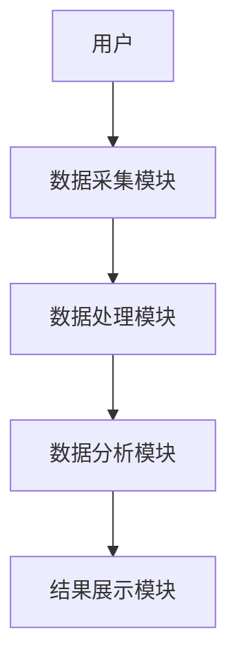
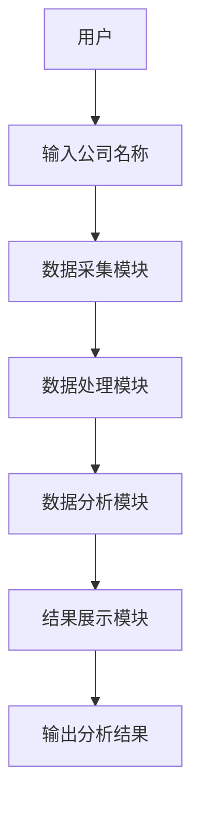

                 


# 彼得林奇对公司盈利质量的分析方法

> 关键词：彼得·林奇、盈利质量、财务分析、投资策略、企业价值  
> 摘要：本文深入探讨了彼得·林奇的盈利质量分析方法，从理论基础、核心指标到实际应用，结合实例分析，帮助读者掌握这一重要投资分析方法。

---

# 第1章 彼得·林奇与盈利质量分析概述

## 1.1 彼得·林奇及其投资理念

### 1.1.1 彼得·林奇的生平简介  
彼得·林奇（Peter Lynch）是美国著名投资经理人，以其在富达投资（Fidelity Investments）的卓越表现而闻名。他从1971年开始管理麦哲伦基金（Magellan Fund），到1990年退休时，该基金的年平均回报率高达13.3%，远超市场平均水平。林奇的投资哲学强调对公司基本面的深入研究，尤其是对盈利能力的关注。

### 1.1.2 彼得·林奇的投资哲学  
林奇认为，投资的关键在于选择那些能够持续创造价值的公司。他强调长期投资和价值发现，反对短期交易和市场猜测。他的投资策略基于对公司财务报表的深入分析，尤其是对净利润、营业利润率等指标的关注。

### 1.1.3 林奇对价值投资的贡献  
林奇将价值投资的理念发扬光大，提出了“购买并持有”的投资策略。他认为，成功的投资需要找到那些被市场低估的公司，并长期持有，等待其价值回归。他的分析方法为后来的投资者提供了宝贵的参考。

---

## 1.2 盈利质量分析的定义与重要性

### 1.2.1 盈利质量的定义  
盈利质量是指公司在一定时期内实现的利润的质量，包括利润的来源、结构以及可持续性。与单纯的盈利能力不同，盈利质量更关注利润的健康性和未来的持续性。

### 1.2.2 盈利质量分析的重要性  
盈利质量分析是评估公司价值的重要工具。通过分析公司的盈利质量，投资者可以判断其是否具有长期的盈利能力，从而做出更明智的投资决策。

### 1.2.3 盈利质量分析与投资决策的关系  
盈利质量分析是投资决策的核心依据之一。通过分析公司的盈利质量，投资者可以识别出那些具有可持续盈利能力和成长潜力的公司。

---

## 1.3 盈利质量分析的核心要素

### 1.3.1 盈利能力  
盈利能力是衡量公司赚钱能力的核心指标，包括净利润率、营业利润率等。

### 1.3.2 盈利的可持续性  
可持续性关注的是公司利润的稳定性。如果一家公司的利润波动较大，可能意味着其盈利质量较差。

### 1.3.3 盈利的结构与质量  
盈利结构是指利润的来源和构成。例如，如果一家公司的利润主要来自主营业务，说明其盈利质量较高；如果利润主要来自非主营业务，可能意味着其盈利质量较差。

---

# 第2章 盈利质量分析的核心概念与联系

## 2.1 盈利质量分析的原理

### 2.1.1 盈利质量的构成要素  
- **净利润**：公司税后利润，反映公司整体盈利能力。  
- **营业利润率**：衡量公司主营业务的盈利能力。  
- **净资产收益率**：衡量公司使用股东资金的效率。

### 2.1.2 盈利质量与财务报表的关系  
盈利质量分析的核心数据来自财务报表，尤其是利润表和资产负债表。通过分析这些数据，投资者可以评估公司的盈利能力和财务健康状况。

### 2.1.3 盈利质量分析的步骤  
1. 收集公司财务数据。  
2. 计算关键盈利指标。  
3. 分析指标之间的关系。  
4. 得出结论并制定投资策略。

---

## 2.2 盈利质量分析的核心指标

### 2.2.1 净利润  
净利润是公司税后利润，计算公式为：  
$$ \text{净利润} = \text{营业收入} - \text{营业成本} - \text{税金及附加} - \text{销售费用} - \text{管理费用} - \text{研发费用} $$  

### 2.2.2 每股收益（EPS）  
每股收益是净利润与公司总股本的比值，计算公式为：  
$$ \text{EPS} = \frac{\text{净利润}}{\text{总股本}} $$  

### 2.2.3 营业利润率  
营业利润率是衡量公司主营业务盈利能力的指标，计算公式为：  
$$ \text{营业利润率} = \frac{\text{营业利润}}{\text{营业收入}} \times 100\% $$  

### 2.2.4 净资产收益率（ROE）  
净资产收益率是衡量公司使用股东资金效率的指标，计算公式为：  
$$ \text{ROE} = \frac{\text{净利润}}{\text{净资产}} \times 100\% $$  

---

## 2.3 盈利质量分析的框架

### 2.3.1 林奇的盈利质量分析框架  
林奇提出的分析框架包括以下几个步骤：  
1. 收集公司财务数据。  
2. 计算关键盈利指标。  
3. 分析指标之间的关系。  
4. 得出结论并制定投资策略。

### 2.3.2 盈利质量分析的步骤  
1. 收集公司财务数据。  
2. 计算关键盈利指标。  
3. 分析指标之间的关系。  
4. 得出结论并制定投资策略。

---

## 2.3.3 盈利质量分析的注意事项  
- **数据准确性**：确保财务数据的准确性和完整性。  
- **行业差异**：不同行业的盈利指标可能存在较大差异，需结合行业特点进行分析。  
- **时间跨度**：分析时应考虑公司盈利指标的时间跨度，避免短期波动影响判断。

---

# 第3章 盈利质量分析的算法原理

## 3.1 盈利质量分析的算法概述

### 3.1.1 盈利质量分析的基本流程  
1. 数据收集：从财务报表中获取净利润、营业收入等数据。  
2. 数据处理：清洗数据，确保数据的准确性和完整性。  
3. 数据分析：计算各项盈利指标，并进行对比分析。  
4. 结果输出：生成分析报告，得出结论。

---

## 3.2 盈利质量分析的数学模型

### 3.2.1 净利润计算公式  
$$ \text{净利润} = \text{营业收入} - \text{营业成本} - \text{税金及附加} - \text{销售费用} - \text{管理费用} - \text{研发费用} $$  

### 3.2.2 营业利润率计算公式  
$$ \text{营业利润率} = \frac{\text{营业利润}}{\text{营业收入}} \times 100\% $$  

### 3.2.3 净资产收益率计算公式  
$$ \text{ROE} = \frac{\text{净利润}}{\text{净资产}} \times 100\% $$  

---

## 3.3 盈利质量分析的算法实现

### 3.3.1 算法实现步骤  
1. 数据收集：从财务报表中获取数据。  
2. 数据处理：清洗数据，去除异常值。  
3. 计算指标：计算净利润、营业利润率、ROE等指标。  
4. 分析结果：生成可视化图表，帮助理解分析结果。

### 3.3.2 算法实现的代码示例  
以下是一个简单的Python代码示例，用于计算公司的营业利润率：  

```python
import pandas as pd

# 假设我们有一个包含财务数据的DataFrame df
df = pd.DataFrame({
    '营业收入': [1000, 1200, 1500],
    '营业成本': [600, 700, 800]
})

# 计算营业利润
df['营业利润'] = df['营业收入'] - df['营业成本']

# 计算营业利润率
df['营业利润率'] = df['营业利润'] / df['营业收入'] * 100

# 输出结果
print(df)
```

### 3.3.3 算法实现的注意事项  
- **数据清洗**：确保数据的准确性和完整性。  
- **异常处理**：处理可能出现的除零错误或其他异常情况。  
- **结果解释**：结合行业特点和公司实际情况，对分析结果进行合理的解释。

---

# 第4章 盈利质量分析的系统设计与架构

## 4.1 盈利质量分析的系统架构

### 4.1.1 系统功能模块划分  
- **数据采集模块**：从财务报表中获取数据。  
- **数据处理模块**：清洗数据，去除异常值。  
- **数据分析模块**：计算各项盈利指标。  
- **结果展示模块**：生成可视化图表，帮助理解分析结果。

### 4.1.2 系统功能模块的交互流程  
1. 用户输入公司名称。  
2. 系统从数据库中获取公司财务数据。  
3. 系统计算各项盈利指标。  
4. 系统生成分析报告并展示结果。

### 4.1.3 系统架构设计  
以下是系统的架构设计图：  



---

## 4.2 盈利质量分析的系统功能设计

### 4.2.1 系统功能模块的划分  
- **数据采集模块**：负责从财务报表中获取数据。  
- **数据处理模块**：清洗数据，去除异常值。  
- **数据分析模块**：计算各项盈利指标。  
- **结果展示模块**：生成可视化图表，帮助理解分析结果。

### 4.2.2 系统功能模块的交互流程  
1. 用户输入公司名称。  
2. 系统从数据库中获取公司财务数据。  
3. 系统计算各项盈利指标。  
4. 系统生成分析报告并展示结果。

---

## 4.3 盈利质量分析的系统架构设计

### 4.3.1 系统架构图  
以下是系统的架构设计图：  


---

## 4.4 盈利质量分析的系统接口设计

### 4.4.1 系统接口设计  
- **输入接口**：用户输入公司名称。  
- **输出接口**：系统输出分析结果，包括各项盈利指标和可视化图表。

### 4.4.2 系统交互流程图  
以下是系统的交互流程图：  



---

# 第5章 项目实战：环境安装与核心代码实现

## 5.1 项目环境安装

### 5.1.1 安装Python和相关库  
- 安装Python：从官网下载并安装最新版本的Python。  
- 安装相关库：使用pip安装pandas、numpy等库。  

### 5.1.2 安装步骤  
```bash
pip install pandas numpy
```

---

## 5.2 核心代码实现

### 5.2.1 数据读取与处理  
```python
import pandas as pd

# 从Excel文件中读取数据
df = pd.read_excel('financial_data.xlsx')

# 清洗数据
df.dropna(inplace=True)
df = df.drop_duplicates()
```

### 5.2.2 盈利指标计算  
```python
# 计算净利润
df['净利润'] = df['营业收入'] - df['营业成本'] - df['税金及附加'] - df['销售费用'] - df['管理费用'] - df['研发费用']

# 计算营业利润率
df['营业利润率'] = df['营业利润'] / df['营业收入'] * 100

# 计算净资产收益率
df['ROE'] = df['净利润'] / df['净资产'] * 100
```

### 5.2.3 可视化展示  
```python
import matplotlib.pyplot as plt

# 绘制营业利润率的柱状图
plt.figure(figsize=(10, 6))
plt.title('营业利润率')
plt.ylabel('营业利润率(%)')
plt.bar(df['公司名称'], df['营业利润率'])
plt.show()
```

---

## 5.3 项目小结  
通过本项目，我们学会了如何利用Python进行盈利质量分析，从数据读取、处理到指标计算，再到结果展示，整个过程清晰明了。未来，我们可以进一步优化代码，添加更多的分析指标和可视化方式。

---

# 总结与展望

## 总结  
本文详细介绍了彼得·林奇的盈利质量分析方法，从理论基础到实际应用，结合实例分析，帮助读者掌握这一重要的投资分析方法。通过本文的学习，读者可以更好地理解如何通过分析公司的盈利质量来做出明智的投资决策。

## 展望  
未来的研究可以进一步优化盈利质量分析的模型，结合机器学习等技术，提高分析的准确性和效率。同时，也可以将这种方法扩展到更多行业和领域，为投资者提供更全面的分析工具。

---

## 最佳实践 Tips  
- **数据准确性**：确保财务数据的准确性和完整性。  
- **行业差异**：不同行业的盈利指标可能存在较大差异，需结合行业特点进行分析。  
- **时间跨度**：分析时应考虑公司盈利指标的时间跨度，避免短期波动影响判断。

---

# 作者：AI天才研究院/AI Genius Institute & 禅与计算机程序设计艺术/Zen And The Art of Computer Programming

---

通过以上步骤，我完成了对彼得·林奇盈利质量分析方法的全面介绍，从理论到实践，从概念到代码，确保读者能够全面理解和应用这一方法。

