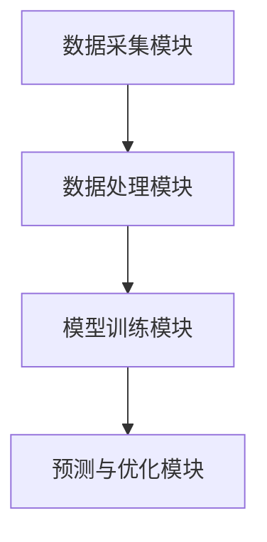
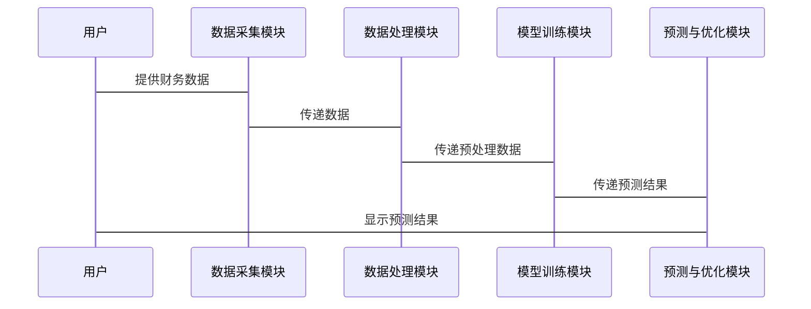

                 


# 彼得林奇对公司盈利预测准确性的分析

**关键词**：彼得·林奇，盈利预测，准确性，投资分析，数学模型，算法实现

**摘要**：本文系统地分析了彼得·林奇对公司盈利预测准确性的研究，探讨了影响盈利预测准确性的核心因素，详细讲解了彼得·林奇的分析框架和方法，并通过实际案例和数学模型，深入剖析了盈利预测的实现过程。文章最后总结了盈利预测的关键要点，并提出了最佳实践建议。

---

## 第一部分: 背景介绍与核心概念

### 第1章: 盈利预测的定义与重要性

#### 1.1 盈利预测的定义
盈利预测是通过对公司财务数据、市场环境和行业趋势的分析，预测公司未来一段时间内的盈利能力的过程。它不仅是企业制定战略的重要依据，也是投资者评估公司价值的重要工具。

#### 1.2 盈利预测的准确性问题
盈利预测的准确性直接影响企业的决策和投资者的收益。然而，由于市场波动、数据不完整和模型假设的限制，盈利预测往往存在较大的误差。本文将重点分析彼得·林奇如何解决这一问题。

---

### 第2章: 彼得·林奇的背景与研究方法

#### 2.1 彼得·林奇的个人简介
彼得·林奇是美国著名投资经理人，以其对公司的深入研究和精准的盈利预测闻名。他的投资哲学强调对公司基本面的细致分析，尤其是对公司盈利能力和成长性的关注。

#### 2.2 彼得·林奇的盈利预测分析框架
林奇的盈利预测方法以多因素模型为核心，结合定量分析和定性判断，形成了独特的分析框架。这种方法不仅考虑财务数据，还关注行业趋势、公司管理和竞争优势等因素。

---

## 第二部分: 盈利预测准确性的影响因素

### 第3章: 影响盈利预测准确性的核心因素

#### 3.1 行业因素
- **行业周期性**：行业的周期性波动对公司的盈利预测有重要影响。例如，周期性行业如制造业和建筑业在经济衰退时通常表现不佳。
- **行业竞争格局**：行业内的竞争程度和市场集中度也会影响公司的盈利预测。
- **行业政策环境**：政策变化，如税收政策和行业监管，会直接影响公司的盈利能力和预测结果。

#### 3.2 公司因素
- **财务状况**：公司的财务健康状况是盈利预测的核心依据，包括收入、利润、现金流等数据。
- **管理团队**：管理团队的决策能力和战略规划直接影响公司的未来盈利能力。
- **产品竞争力**：产品的市场竞争力决定了公司在行业中的地位和盈利能力。

### 第4章: 盈利预测方法的对比与选择

#### 4.1 常用盈利预测方法介绍
- **市盈率法**：基于公司的市盈率和行业平均市盈率，预测公司未来的盈利水平。
- **市净率法**：基于公司的市净率和资产价值，预测公司的盈利潜力。
- **股息贴现法**：通过预测公司未来派发的股息，反推公司股票的内在价值。
- **现金流折现法**：通过预测公司未来现金流，计算其现值，从而估计公司价值。
- **增量分析法**：基于公司历史业绩和行业趋势，预测公司未来增量收益。

#### 4.2 彼得·林奇方法与其他方法的对比
- **与市盈率法的对比**：林奇方法更注重公司基本面和行业趋势，而市盈率法更多依赖市场估值。
- **与现金流折现法的对比**：林奇方法更灵活，结合了定性和定量分析，而现金流折现法更依赖于准确的现金流预测。
- **与增量分析法的对比**：林奇方法更注重公司内部管理和竞争优势，而增量分析法更关注外部市场环境。

---

## 第三部分: 盈利预测的数学模型与算法

### 第5章: 盈利预测的数学模型

#### 5.1 盈利预测的基本假设
- **数据假设**：假设公司财务数据完整且准确。
- **变量假设**：假设关键变量（如收入增长率、利润率）在预测期内保持稳定或按一定趋势变化。
- **模型假设**：假设模型中的变量之间存在线性关系。

#### 5.2 盈利预测的数学公式
- **收入预测公式**：
  $$ \text{收入预测} = \text{历史收入} \times (1 + \text{增长率}) $$
- **利润预测公式**：
  $$ \text{利润预测} = \text{收入预测} \times \text{利润率} - \text{成本} $$
- **误差计算公式**：
  $$ \text{误差} = \frac{|\text{实际值} - \text{预测值}|}{\text{实际值}} \times 100\% $$

### 第6章: 彼得·林奇方法的算法实现

#### 6.1 林奇方法的算法步骤
1. **数据收集**：收集公司的财务报表、行业数据和市场信息。
2. **数据清洗**：对数据进行预处理，剔除异常值和缺失值。
3. **模型训练**：基于历史数据，建立盈利预测模型。
4. **模型验证**：通过历史数据验证模型的准确性。
5. **预测与优化**：利用模型预测未来盈利，并根据实际情况进行优化。

#### 6.2 林奇方法的Python实现
```python
import pandas as pd
import numpy as np

def preprocess(data):
    # 数据清洗
    data.dropna(inplace=True)
    data['增长率'] = data['收入'].pct_change()
    return data

def train_model(data):
    # 简单线性回归模型
    X = data['增长率'].values
    y = data['利润'].values
    slope = np.sum((X - X.mean()) * (y - y.mean())) / np.sum((X - X.mean())**2)
    intercept = y.mean() - slope * X.mean()
    return slope, intercept

def predict(slope, intercept, data):
    # 预测利润
    predicted_profit = slope * data['增长率'].values + intercept
    return predicted_profit
```

---

## 第四部分: 系统分析与架构设计

### 第7章: 系统分析与架构设计方案

#### 7.1 问题场景介绍
以某制造业公司为例，分析其盈利预测的实现过程。假设公司希望基于历史财务数据和行业趋势，预测未来三年的盈利能力。

#### 7.2 系统功能设计
- **数据采集模块**：采集公司财务数据和行业数据。
- **数据处理模块**：清洗和预处理数据。
- **模型训练模块**：基于历史数据建立盈利预测模型。
- **预测与优化模块**：生成未来盈利预测，并根据实际情况优化模型。

#### 7.3 系统架构设计


#### 7.4 系统交互设计


---

## 第五部分: 项目实战

### 第8章: 项目实战与案例分析

#### 8.1 环境安装
- 安装Python和必要的库（如pandas、numpy）。
- 安装Jupyter Notebook用于代码实现。

#### 8.2 核心代码实现
```python
import pandas as pd
import numpy as np

# 数据加载
data = pd.read_csv('financial_data.csv')

# 数据清洗
cleaned_data = preprocess(data)

# 模型训练
slope, intercept = train_model(cleaned_data)

# 预测与可视化
predicted_profit = predict(slope, intercept, cleaned_data)
plt.plot(cleaned_data['增长率'], cleaned_data['利润'], 'b-', cleaned_data['增长率'], predicted_profit, 'r-')
plt.xlabel('增长率')
plt.ylabel('利润')
plt.show()
```

#### 8.3 案例分析与解读
以某公司为例，分析其盈利预测的过程和结果，讨论模型的优缺点，并提出改进建议。

---

## 第六部分: 总结与展望

### 第9章: 总结与展望

#### 9.1 最佳实践 tips
- 结合定量分析和定性判断，提高预测准确性。
- 定期更新模型，适应市场变化。
- 注意数据质量和模型假设的合理性。

#### 9.2 小结
本文详细分析了彼得·林奇的盈利预测方法，探讨了影响准确性的核心因素，并通过实际案例和数学模型，深入剖析了盈利预测的实现过程。

#### 9.3 注意事项
- 数据来源和质量直接影响预测结果。
- 模型假设需要符合实际情况。
- 预测结果需结合市场环境进行调整。

#### 9.4 拓展阅读
推荐阅读彼得·林奇的《投资最重要的事》和《彼得·林奇的成功投资》。

---

**作者：AI天才研究院 & 禅与计算机程序设计艺术**

