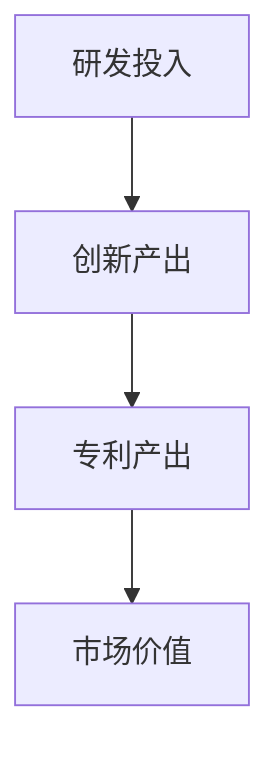
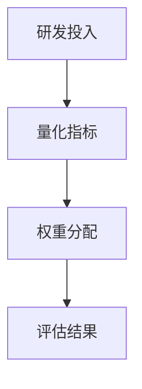
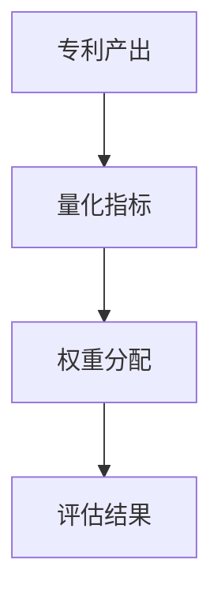
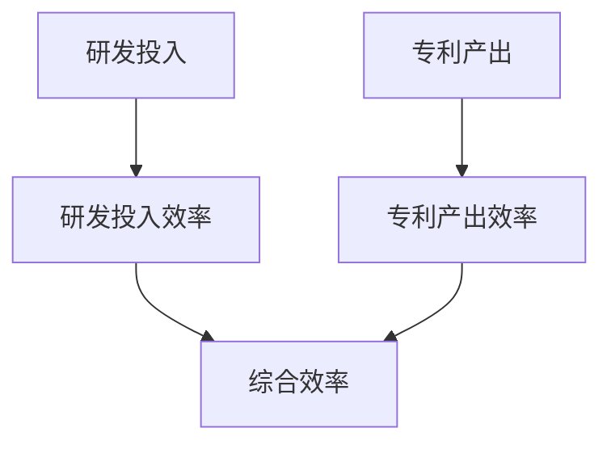
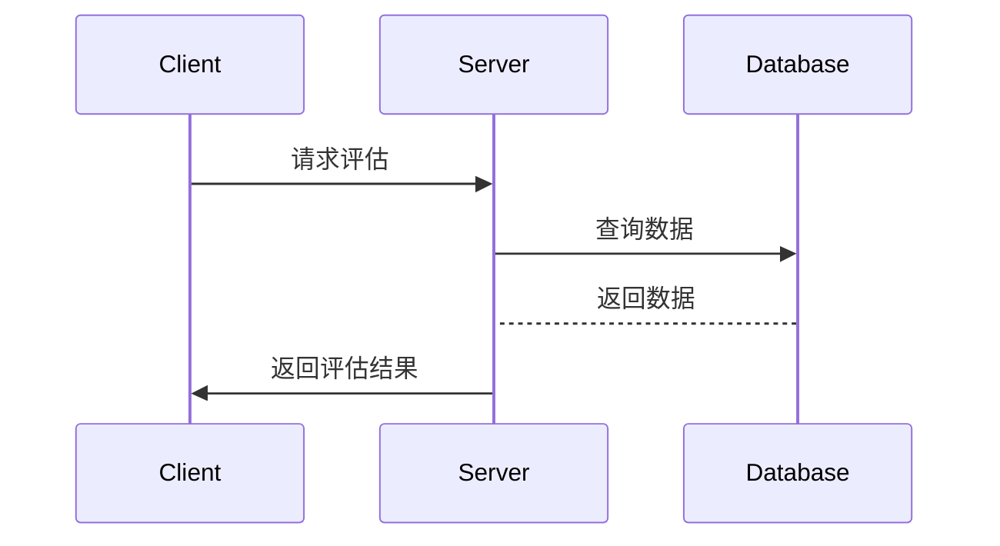

                 


# 彼得林奇对公司研发投入与专利产出效率的评估

> 关键词：研发投入，专利产出，效率评估，彼得林奇，投资评估

> 摘要：本文系统地探讨了如何基于彼得林奇的投资理念，对公司研发投入与专利产出效率进行科学评估。文章从研发投入和专利产出的基本理论出发，构建了综合评估模型，并通过系统分析与架构设计，提供了具体的实现方案。通过实际案例分析和项目实战，本文深入剖析了如何将研发投入与专利产出效率相结合，为企业投资决策提供科学依据。

---

# 第一部分：引言

## 第1章：研究背景与意义

### 1.1 研究背景
#### 1.1.1 投资与研发的双重驱动
#### 1.1.2 专利产出效率的现实意义
#### 1.1.3 研究问题的提出

### 1.2 研究目标与意义
#### 1.2.1 研究的核心目标
#### 1.2.2 本文的创新点
#### 1.2.3 研究的实际应用价值

---

# 第二部分：研发投入与专利产出效率的基本理论

## 第2章：研发投入的定义与特征

### 2.1 研发投入的分类
#### 2.1.1 人员投入
#### 2.1.2 财务投入
#### 2.1.3 时间投入

### 2.2 研发投入的属性特征对比
#### 2.2.1 投入与产出的关系
#### 2.2.2 投入的周期性
#### 2.2.3 投入的不确定性

### 2.3 研发投入的ER实体关系图
```mermaid
erDiagram
    研发投入 <<--- 投入主体 : 公司
    研发投入 --> 投入方式 : 人员/财务/时间
    研发投入 --> 投入目标 : 产品/技术
```

---

## 第3章：专利产出效率的定义与特征

### 3.1 专利产出的分类
#### 3.1.1 发明专利
#### 3.1.2 实用新型专利
#### 3.1.3 外观设计专利

### 3.2 专利产出效率的衡量维度
#### 3.2.1 专利数量
#### 3.2.2 专利质量
#### 3.2.3 专利的市场应用价值

### 3.3 专利产出的属性特征对比
#### 3.3.1 专利产出的周期性
#### 3.3.2 专利产出的创新性
#### 3.3.3 专利产出的法律保护

---

## 第4章：研发投入与专利产出效率的内在联系

### 4.1 投入与产出的匹配关系
#### 4.1.1 投入对产出的影响
#### 4.1.2 产出对投入的反馈

### 4.2 投入与产出的流程图


---

# 第三部分：评估模型的构建

## 第5章：研发投入与专利产出效率的评估模型

### 5.1 评估模型的构建框架
#### 5.1.1 模型构建的基本思路
#### 5.1.2 模型的输入与输出
#### 5.1.3 模型的评估标准

### 5.2 研发投入的评估方法
#### 5.2.1 投入的量化指标
#### 5.2.2 投入的权重分配
#### 5.2.3 投入的评估流程图


### 5.3 专利产出效率的评估方法
#### 5.3.1 产出的量化指标
#### 5.3.2 产出的权重分配
#### 5.3.3 产出的评估流程图


### 5.4 综合评估模型的构建
#### 5.4.1 综合评估模型的公式推导
#### 5.4.2 综合评估模型的数学模型
$$ E = \alpha \cdot R + (1-\alpha) \cdot P $$
其中，$E$ 是综合效率，$R$ 是研发投入效率，$P$ 是专利产出效率，$\alpha$ 是权重系数。

#### 5.4.3 综合评估模型的流程图


---

## 第6章：基于彼得林奇视角的评估模型

### 6.1 彼得林奇的核心投资理念
#### 6.1.1 价值投资的核心思想
#### 6.1.2 股东价值的实现路径
#### 6.1.3 投资决策的关键要素

### 6.2 彼得林奇视角下的研发投入评估
#### 6.2.1 研发投入对股东价值的影响
#### 6.2.2 研发投入的周期性与风险性
#### 6.2.3 研发投入的市场反馈机制

### 6.3 彼得林奇视角下的专利产出效率评估
#### 6.3.1 专利产出对市场竞争的影响
#### 6.3.2 专利产出的法律保护与经济价值
#### 6.3.3 专利产出的长期战略意义

---

# 第四部分：系统分析与架构设计

## 第7章：系统分析与架构设计

### 7.1 问题场景介绍
#### 7.1.1 研发投入与专利产出效率评估的难点
#### 7.1.2 系统设计的目标
#### 7.1.3 系统设计的边界

### 7.2 系统功能设计
#### 7.2.1 领域模型


### 7.3 系统架构设计
#### 7.3.1 系统架构图


### 7.4 系统接口设计
#### 7.4.1 API接口定义
#### 7.4.2 接口交互流程图


---

## 第8章：系统实现与案例分析

### 8.1 环境安装与配置
#### 8.1.1 开发环境要求
#### 8.1.2 依赖安装
#### 8.1.3 数据库配置

### 8.2 核心代码实现
#### 8.2.1 投入与产出的计算
```python
def calculate_research_investment(research_input):
    # 计算研发投入效率
    return research_efficiency
```

#### 8.2.2 专利产出的计算
```python
def calculate_patent_output(patent_input):
    # 计算专利产出效率
    return patent_efficiency
```

### 8.3 案例分析与解读
#### 8.3.1 案例背景
#### 8.3.2 数据输入与处理
#### 8.3.3 模型输出与解读
#### 8.3.4 案例总结

---

## 第9章：项目总结与展望

### 9.1 项目总结
#### 9.1.1 项目目标的实现
#### 9.1.2 项目成果的应用
#### 9.1.3 项目实施的经验与教训

### 9.2 未来展望
#### 9.2.1 研发投入与专利产出效率评估的拓展方向
#### 9.2.2 技术与方法的创新
#### 9.2.3 未来研究的建议

---

## 第10章：附录

### 10.1 参考文献
#### 10.1.1 主要参考文献
#### 10.1.2 其他参考资料

### 10.2 工具与资源
#### 10.2.1 开发工具
#### 10.2.2 数据来源
#### 10.2.3 其他资源

---

# 作者：AI天才研究院 & 禅与计算机程序设计艺术

---

通过以上目录大纲，我们可以看到本文从理论到实践，系统地探讨了如何基于彼得林奇的投资理念，对公司研发投入与专利产出效率进行科学评估。通过详细的理论分析、模型构建、系统设计和案例分析，本文为企业的投资决策提供了科学依据和实践指导。

